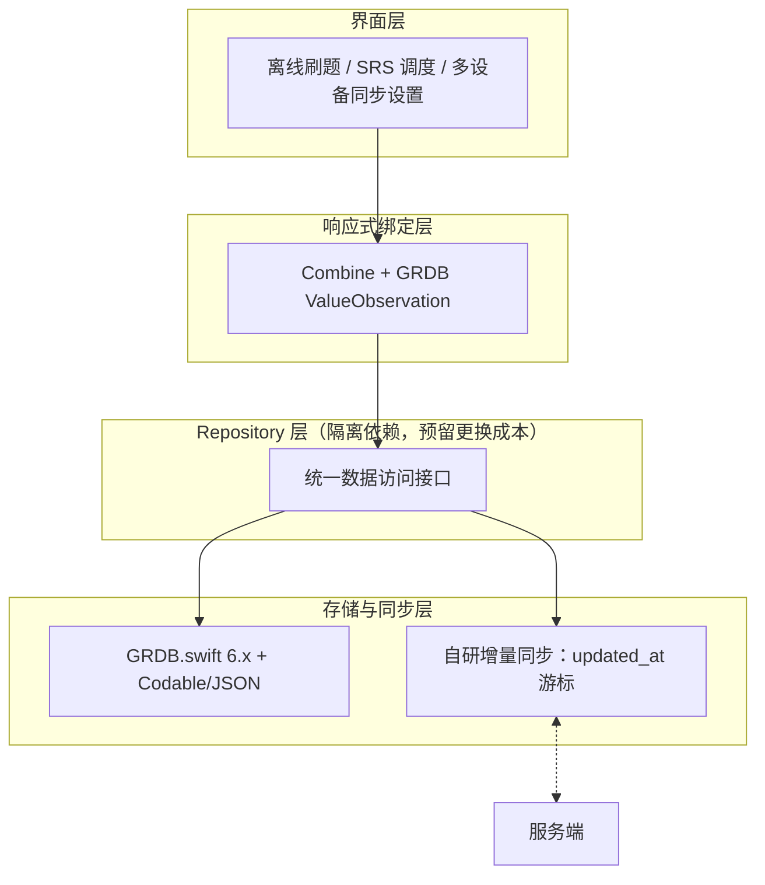

## 选型结论：四模块成套替换 {#s3}

存储、序列化、同步、绑定四个模块一起换——各自的最优解恰好拼成一套离线优先组合。

| 模块 | 选定 | 落选 | 一句话理由 |
|---|---|---|---|
| 本地存储 | GRDB.swift 6.x | SwiftData、Core Data（现状） | 真机实测五项指标全面占优 |
| 序列化 | Codable + JSON | Protobuf | -38% 包体收益买不回双端 schema 维护成本 |
| 数据同步 | 自研增量同步（`updated_at` 游标） | CloudKit、CRDT | 冲突策略可控，不堵死 Android 延伸 |
| 响应式绑定 | Combine + GRDB ValueObservation | 手写通知中心 | Swift 官方框架与 GRDB 原生集成 |

新数据层按四层组织：界面只面对响应式绑定，业务只面对 Repository 层——GRDB 与同步引擎被隔离在最底层，这是对「社区规模小于 Core Data」这条风险的架构级兜底。

存储与同步的可用性不靠推演：前者有真机同口径对比，后者有 POC 与压测——下一节起逐项过证据。
