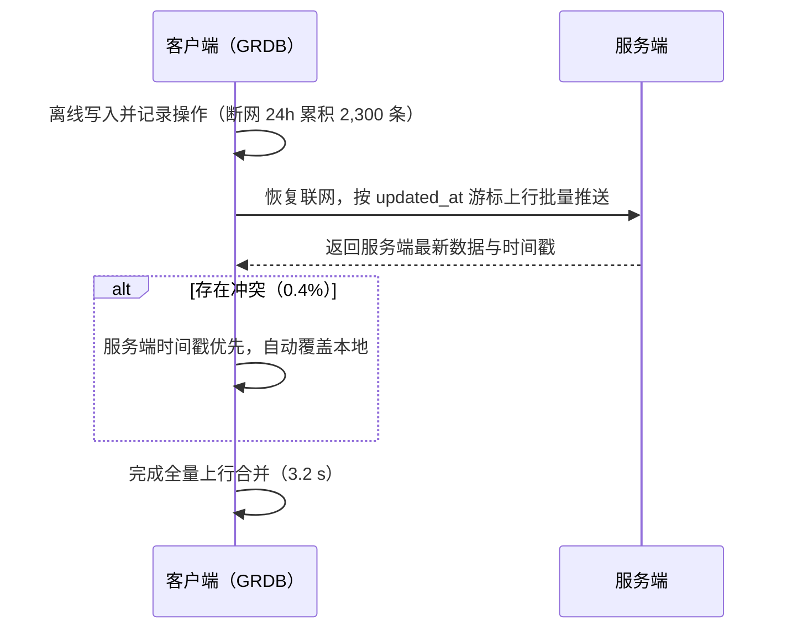

## 预研证据·同步引擎：POC 证明可用 {#s6}

断网 24 小时累积 2,300 条本地操作，恢复联网 3.2 秒完成全量上行合并；0.4% 冲突全部自动解决。

<KpiRow :items="[
  { num: '3.2', unit: 's', label: '恢复联网后全量上行合并（断网 24h）' },
  { num: '0.4', unit: '%', label: '冲突率 · 服务端时间戳优先自动解决' },
  { num: '480', unit: 'ms', label: '同步接口 P99（模拟 10 万 DAU 压测）' },
  { num: '0.02', unit: '%', label: '压测错误率' },
]" />

同步机制走 `updated_at` 游标的增量协议：本地离线写入时记录操作，联网后按游标批量上行，服务端返回最新数据与时间戳；出现冲突时按「服务端时间戳优先」自动覆盖，无需用户介入。

压测口径为服务端同步接口（模拟 10 万 DAU 场景），端侧恢复合并表现见上方 POC 指标。以上数字转述自预研报告，评审前已与原文核对。
