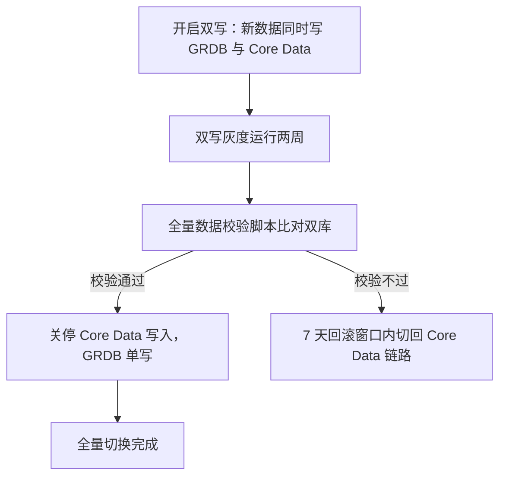

## 风险·迁移·排期：每条风险都有兜底 {#s7}

GRDB 社区小是真风险，靠 Repository 层隔离兜底；迁移走双写灰度加全量校验，7 天窗口随时可退。

<Callout type="risk">GRDB 社区规模小于 Core Data：一旦停维护或出现重大缺陷，更换成本被 Repository 层锁死在数据访问层之内，界面与业务层零感知——这是选型时已计入的代价。</Callout>

迁移不赌运气：新数据双写进两套存储，灰度运行两周后用全量数据校验脚本逐条比对，校验通过才关停旧链路；任何时点校验不过，都在 7 天回滚窗口内切回 Core Data。

灰度期内现有功能的回归风险由双写与校验兜底：刷题、SRS 调度走 Repository 层的新链路，数据一致性以脚本比对结果为准，不依赖抽样观察。

<Timeline :items="[
  { title: 'Repository 层封装', period: 'Q4 第 1–2 周', desc: '隔离 GRDB 依赖，为双写与校验脚本打地基' },
  { title: '灰度迁移', period: 'Q4 第 3–6 周', desc: '双写灰度两周 + 全量数据校验脚本，7 天回滚窗口', accent: true },
  { title: '全量切换', period: 'Q4 第 7 周', desc: '关停旧链路，GRDB 单写' },
]" />
