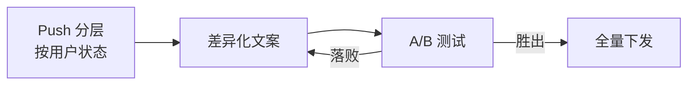

## 留存线：用户更活跃，且不是骚扰换来的 {#s3}

Push 分层改版让 DAU +33%、点击率 2.7×，卸载率 ≤0.4% 证明活跃不靠打扰。

主导 App 推送策略改版：按用户状态分层推送、文案 A/B 测试常态化——让每条推送发得更准，而不是更多。

<FigureChart
  :option="activeQuality"
  caption="活跃质量三指标齐升：DAU +33%、次月留存 +9pp、点击率 2.7×"
  source="来源：运营后台（brief 转述，待复核）· DAU 季度日均 / 留存次月整体口径 / 点击率全量 Push 均值"
  fallback="降级文本：DAU 4.2→5.6 万（+33%）；次月留存 32%→41%（+9pp）；推送点击率 3.2%→8.7%（2.7×）" />

<Callout>活跃不是骚扰换来的：改版后 Push 卸载率控制在 0.4% 以内。</Callout>
