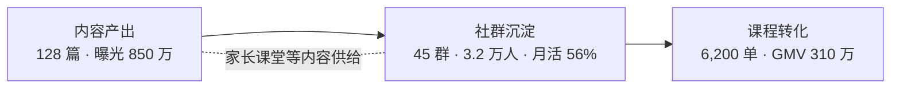

## 社群线：0→1 建成跨越淡季的第二增长引擎 {#s4}

45 群 / 3.2 万用户 / 56% 月活的社群内容体系，撬动 6,200 单、310 万 GMV——不依赖投放的资产型增长。

Q3 从 0 到 1 搭建社群体系：以打卡群建立学习习惯、答疑群承接课程咨询，两类共 45 个；配套内容生产线产出学习方法、家长课堂等 128 篇，全季曝光 850 万。社群不是流量池，是转化前置的信任场。

<KpiRow :cols="3" :items="[
  { num: '6,200', unit: '单', label: '带动课程转化', delta: '社群+内容归因', deltaType: 'up' },
  { num: '310', unit: '万', label: '贡献 GMV', delta: 'Q3 全季', deltaType: 'up' },
  { num: '≈500', unit: '元', label: '转化客单价', delta: '推算：310 万 ÷ 6,200', deltaType: 'flat' },
]" />

<Callout>56% 月活 = 不依赖付费推送的自有触达——淡季不断联，这是社群资产与买量流量的本质区别。</Callout>
