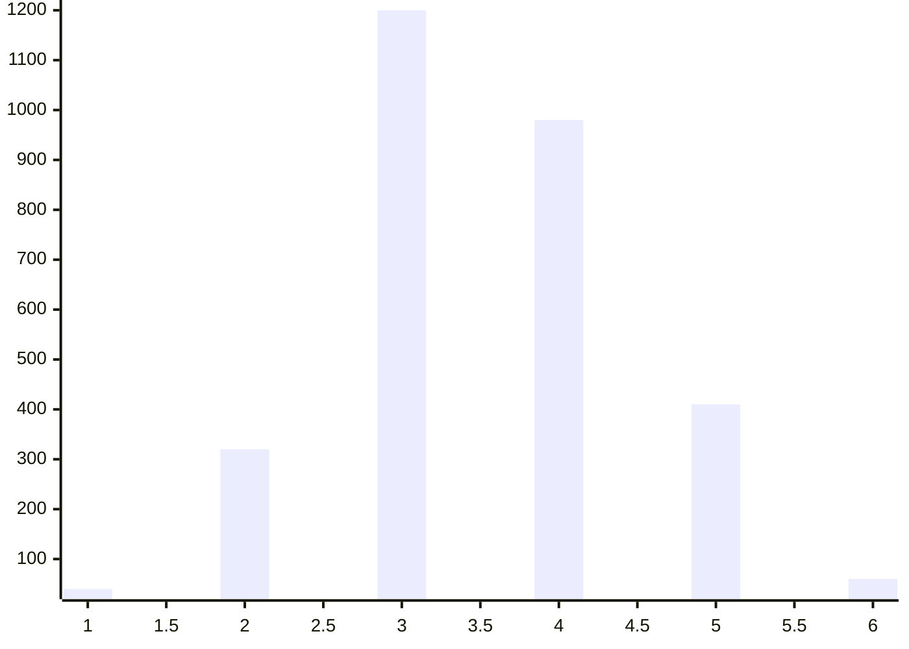

# 6/14 支付超时事故复盘

## 摘要
6/14 00:00 起，支付核心连接池被打满，导致支付请求大面积超时，持续 150 分钟，影响 1284 单订单。当前状态：🟢 已恢复。严重程度 P1。

<!-- doc:proj id=warning-1 kind=callout -->
> [!warning] 图例：状态颜色含义
> 🟢 已恢复 / 🟡 降级运行 / 🔴 故障中

## 影响
本次事故影响 1284 单支付订单，持续 150 分钟，估算资损 38 万元（口径见 datasets）。严重程度定级 P1。

<!-- doc:proj id=impact_by_minute kind=chart:bar -->

## 时间线

<!-- doc:proj id=tl kind=timeline -->
| 时间 | 事件 |
|------|------|
| 00:00 | 告警：支付超时率突增 |
| 00:08 | 值班介入，定位连接池打满（使用率上限 50 连接配置） |
| 01:30 | 扩容 + 限流，超时率回落 |
| 02:30 | 完全恢复 |

## 根因
直接原因：流量峰值并发达 3200 并发，连接池上限 50 连接被打满，请求排队 → 超时级联 → 用户支付失败（[连接池监控定义](confluence://OBS/pay-pool)）。
系统性根因：① 缺少自动限流，峰值流量直达下游；② 连接池容量未随流量弹性扩缩；③ 监控仅有"使用率"，无"即将打满"的提前告警。

## 改进项
<!-- doc:proj id=actions kind=table -->
| Action | Owner | DDL | 验收 |
|--------|-------|-----|------|
| 接入自适应限流 | 张三 | 6/28 | 峰值并发>阈值时限流生效，超时率<0.1% |
| 连接池弹性扩缩 | 李四 | 7/05 | 压测并发 2x 不打满 |
| 增加提前告警 | 王五 | 6/20 | 使用率>80% 提前 5 分钟告警 |

<!-- doc:proj id=decision-1 kind=callout -->
> [!decision] 限流算法选令牌桶
> 理由：需支持突发流量且可平滑限速。备选：漏桶（不支持突发，否）；计数器（粗粒度，否）。

## 经验沉淀
- 应急动作："限流 + 扩容"组合可在 30 分钟内止血，写入值班手册。
- 监控补齐方向：所有连接池类资源加"使用率>80% 提前告警"。
