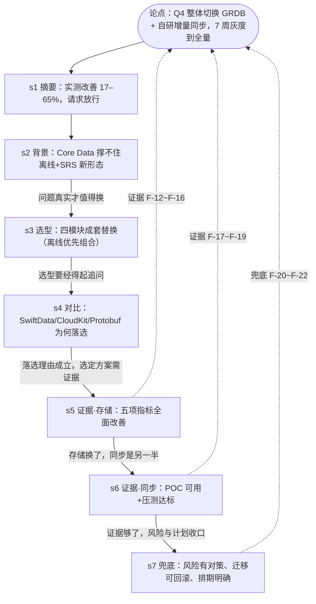

# 03-故事线

## 叙事模板与裁剪

文种=**技术方案**，模板：背景与痛点 → 目标与非目标 → 现状 → 方案空间与对比 → 推荐与理由 → 关键设计 → 风险与对策 → 里程碑。

裁剪与合并（记台账）：

| 模板段 | 处置 | 理由 |
|---|---|---|
| 背景与痛点 + 目标 + 现状 | 合并为「背景与目标」一节 | 痛点与现状同源（Core Data 时代债），2000 字装不下三节 |
| 非目标 | **砍** | 无素材（G-1 降级），空节比没节减分 |
| 方案空间与对比 + 推荐与理由 | 拆为「选型结论」「候选对比」两节 | 选型结论是硬约束要素单独成节；对比先发制人回答评委默认质疑 |
| 关键设计 | 不设独立节 | Repository 层作为风险对策出现在收尾节；`updated_at` 游标机制在同步证据节带出——本文档是选型评审不是设计详案 |
| 风险与对策 + 里程碑 | 合并为「风险·迁移·排期」收尾节 | 素材三条共享"兜底"主题；P3-1 备拆分预案 |

另加**开篇摘要节**（结论先行，管理层扫读锚点）——金字塔原理：上层断言先立住，下层证据节跟上。

## message 链

| # | 节名 | message（这节要传达的一句话，结论式） | 用哪些事实 | 回答哪条 D-x | 节奏标注 | 字数预算 |
|---|---|---|---|---|---|---|
| 1 | 摘要：Q4 整体切换 GRDB + 自研同步 | 真机实测五项核心指标改善 17–65%、同步冲突全自动解决，7 周完成灰度到全量，请求评审放行 | F-12~F-16, F-18, F-22 | D-6 | ★决策核心·投屏一屏 | 150 |
| 2 | 背景：iOS 14 时代的 Core Data 撑不住新形态 | 离线刷题、多设备同步、SRS 调度加入后出现写入卡顿与迁移困难；约束 iOS 16+/Swift/离线优先，需支撑未来 2 年演进 | F-1~F-4 | D-1(前提) | 短节铺垫 | 280 |
| 3 | 选型结论：四模块成套替换 | 存储 GRDB 6.x、序列化 Codable+JSON、同步自研 `updated_at` 游标、绑定 Combine+ValueObservation——一套离线优先组合拳 | F-5~F-8 | D-1, D-3 | 选型总表 | 260 |
| 4 | 候选对比：官方方案为何落选 | SwiftData 三硬伤（非 Sendable 限多线程写入、iCloud 同步黑盒、迁移失控）、CloudKit 冲突不可控且不支持 Android、Protobuf 的 38% 收益买不回双端 schema 成本 | F-9~F-11 | D-1 | 评委质疑焦点·先发制人 | 380 |
| 5 | 预研证据·存储性能：五项指标全面改善 | 真机同口径下加载/写入/查询提速 61–65%，内存峰值 -30%，库体积 -17%——不是某项赢，是全面赢 | F-12~F-16 | D-2 | ★决策核心·一图一结论 | 320 |
| 6 | 预研证据·同步引擎：POC 证明可用 | 断网 24h 累积 2,300 条操作 3.2 s 完成上行合并，0.4% 冲突全部按服务端时间戳优先自动解决；10 万 DAU 压测 P99 480 ms、错误率 0.02% | F-17~F-19 | D-3, D-7 | ★决策核心·一图一结论 | 320 |
| 7 | 风险·迁移·排期：每条风险都有兜底 | GRDB 社区小→Repository 层隔离可换；双写灰度两周+全量校验+7 天回滚窗口兜住回归；Q4 七周三段走完 | F-20~F-22 | D-4, D-5, D-6, D-7 | 收尾·时间线 | 380 |

合计 ≈ 2090 字（含标题余量，阶段 7 按 ±10% 执行，总纪律 ~2000）。

## 论证链图

## 节奏标注汇总

- ★决策核心：s1、s5、s6（阶段 7 先写先审）
- 投屏一屏一图：s5、s6、s7
- 评委质疑焦点：s4（对比节放证据链中段，先立选型再答质疑，避免开场陷入辩论）
- 可折叠/附录：无（2000 字文档不折叠；G-3 灰度细节评审会口头补充）

## 故事线教给我们的事

1. **对比节的位置是本故事线的支点**：放在选型结论之后（s4），让评委带着"选了什么"的上下文读"为什么不是官方方案"——若放开头，全文变成防守姿态。
2. **预研证据拆两节比一节强**：存储与同步是两个独立决策面（评委可能认存储否同步），拆开各自一图，任一被质疑不拖累另一个。
3. **2000 字倒逼模板裁剪**：砍掉的"非目标/关键设计"不是丢失——Repository 层与灰度细节在 s7 以对策身份存在，详案留给设计文档。

## 新问题 P3-x（带倾向，待拍板）

- **P3-1**：s7 三主题合一节密度偏高。倾向：保持合并（收尾节读感是"兜底清单"）；若阶段 7 超字数预算 10% 则拆为「风险与对策」「迁移与排期」两节。
- **P3-2**：摘要节尾是否加明确的评审请求句（"请求评审会放行 Q4 排期与灰度方案"）。倾向：加——成案放行型文档需要明确 ask。
