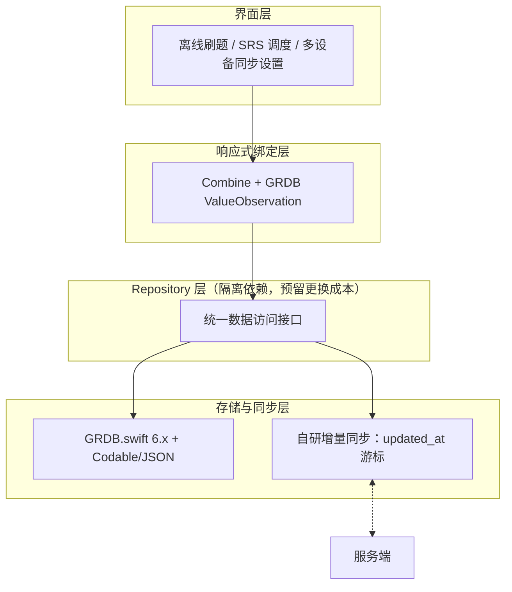
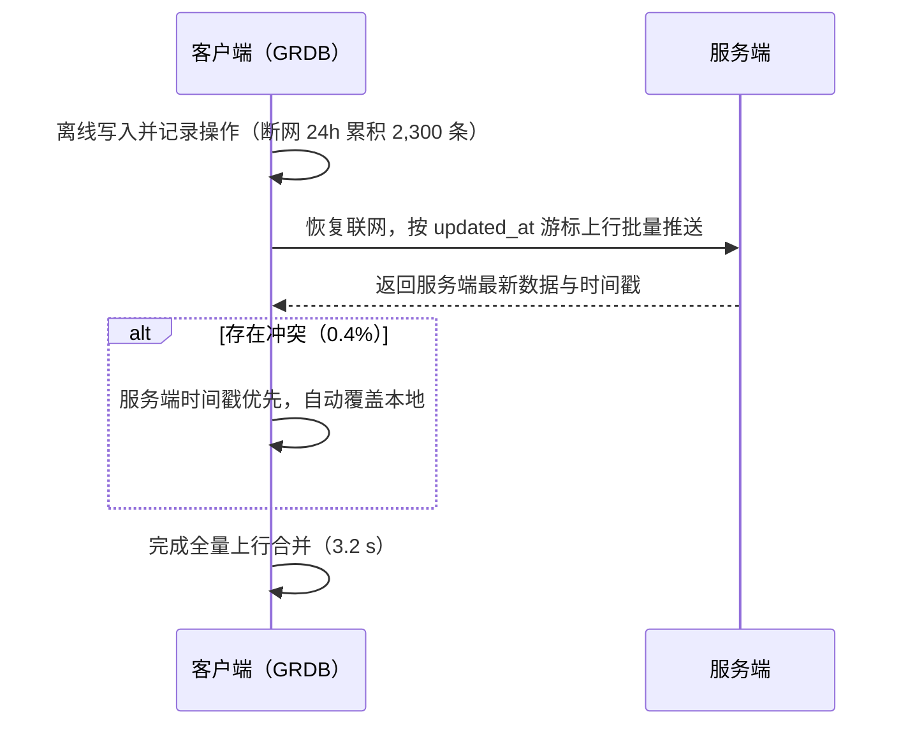
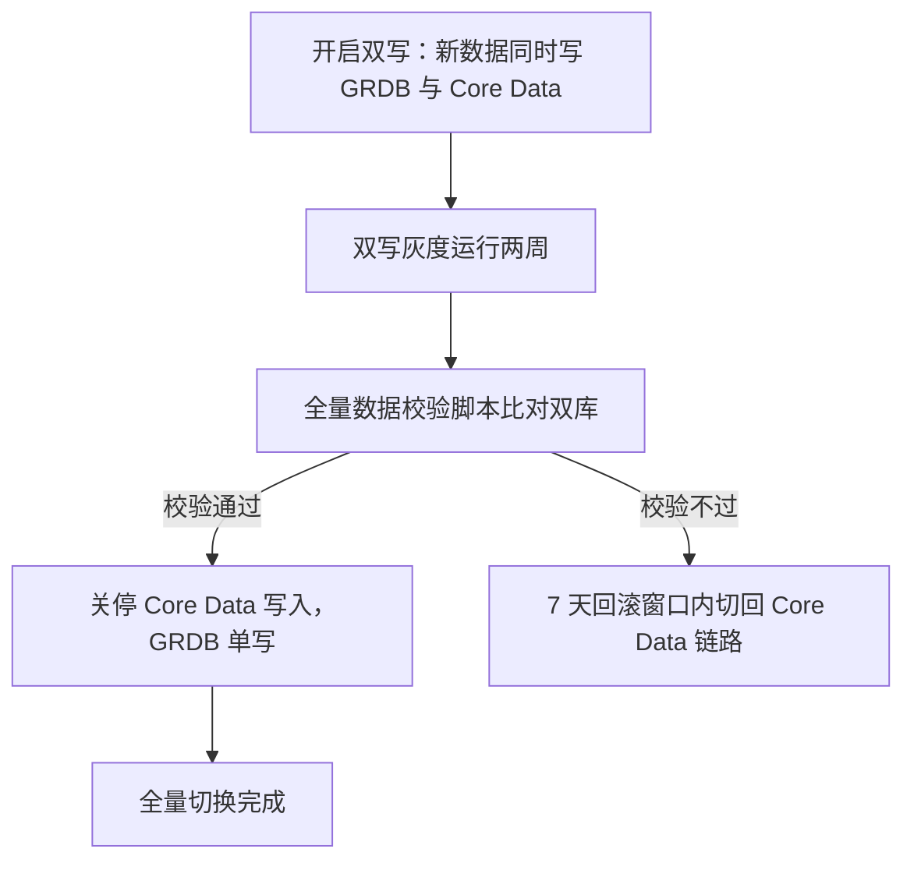

## T13 · KpiRow（s1 摘要成绩单样张）

<KpiRow :items="[
  { num: '17-65', unit: '%', label: '五项核心指标改善幅度（真机实测）' },
  { num: '0.4', unit: '%', label: '同步冲突率 · 全部自动解决' },
  { num: '7', unit: '周', label: 'Q4 排期：封装→灰度→全量' },
  { num: '7', unit: '天', label: '回滚窗口' },
]" />

## T6 · FigureChart + rankBars（s5 存储性能图样张）

<FigureChart
  :option="perfImprovement"
  caption="五项核心指标全面改善：查询 -65%、冷启动 -62%"
  source="iPhone 13 真机 · iOS 17.4 · Release · 5 万单词 + 120 万条学习记录 · 用户提供预研报告口径（评审前复核）"
  fallback="GRDB 相比 Core Data：查询 -65%、冷启动 -62%、写入 -61%、内存 -30%、体积 -17%"
  :height="280" />

## T11 · 紧凑表（s3 选型总表样张）

| 模块 | 选定 | 落选 | 一句话理由 |
|---|---|---|---|
| 本地存储 | GRDB.swift 6.x | SwiftData、Core Data（现状） | 真机实测五项指标全面占优 |
| 序列化 | Codable + JSON | Protobuf | -38% 包体收益买不回双端 schema 维护成本 |
| 数据同步 | 自研增量同步（updated_at 游标） | CloudKit、CRDT | 冲突策略可控，不堵死 Android 延伸 |
| 响应式绑定 | Combine + GRDB ValueObservation | 手写通知中心 | Swift 官方框架与 GRDB 原生集成 |

## T5 · CompareMatrix（s4 落选对比样张）

<CompareMatrix
  :columns="['候选', '关键短板', '可翻案条件']"
  :rows="[
    { cells: ['SwiftData', '@Model 非 Sendable 限制多线程写入；iCloud 同步行为黑盒；无法精细控制迁移', '苹果放开并发模型与迁移控制'] },
    { cells: ['CloudKit', '同步冲突策略不可控；无法支持 Android 端未来规划', '冲突策略可配置且跨端纳入规划'] },
    { cells: ['Protobuf', '包体积 -38%，但需维护双端 schema，学习成本高于收益', '双端团队扩容、schema 工具链成熟'] },
  ]" />

## T10 · Callout 三型（s2/s4/s5/s7 样张）

<Callout type="conclusion">官方方案的便利买不回控制权——落选不是印象分，是三条硬伤与一个成本不等式。</Callout>

<Callout type="risk">GRDB 社区规模小于 Core Data 是真实风险：依赖锁定靠 Repository 层隔离兜底，预留更换成本。</Callout>

<Callout type="data">口径：性能数据为 iPhone 13 真机 / iOS 17.4 / Release 构建 / 5 万单词 + 120 万条学习记录；压测 P99 为服务端同步接口口径（模拟 10 万 DAU）。转述自预研报告，评审前已复核。</Callout>

## T3 · Mermaid 分层组件图（s3 架构样张）

## T2 · Mermaid 时序图（s6 同步机制样张）

## T1 · Mermaid 流程图（s7 迁移流程样张）

## T12 · Timeline（s7 排期样张）

<Timeline :items="[
  { title: 'Repository 层封装', period: 'Q4 第 1–2 周', desc: '隔离 GRDB 依赖，为双写与校验脚本打地基' },
  { title: '灰度迁移', period: 'Q4 第 3–6 周', desc: '双写灰度两周 + 全量数据校验脚本，7 天回滚窗口', accent: true },
  { title: '全量切换', period: 'Q4 第 7 周', desc: '关停旧链路，GRDB 单写' },
]" />
