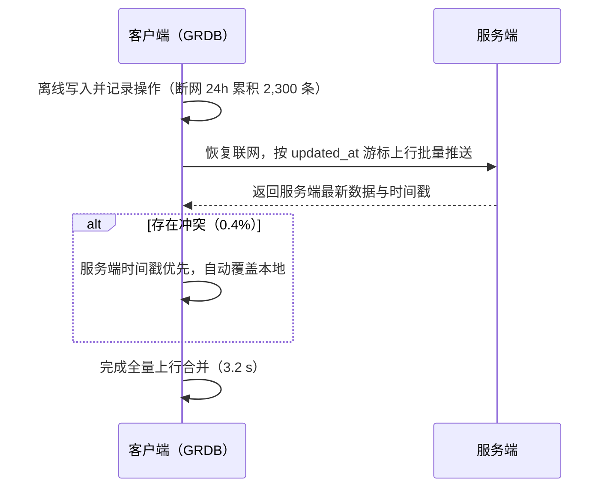

  评审会混合场合（会前细读 + 会上投屏），选哪个档位？点按钮切换，正文即整页换档——差异看气质：字阶 / 版心 / 衬线标题 / 密度 / 卡片感。
  <button :class="{ on: preset === 'brief' }" @click="apply('brief')">A · 简报档</button>
  <button :class="{ on: preset === 'editorial' }" @click="apply('editorial')">B · 编辑档</button>

## 预研证据·存储性能

真机同口径实测：五项核心指标全面改善，不是某项赢，是全面赢。

<KpiRow :items="[
  { num: '310', unit: 'ms', label: '冷启动首次加载', delta: '-62%', deltaType: 'down-good' },
  { num: '1.8', unit: 's', label: '批量写入 1 万条', delta: '-61%', deltaType: 'down-good' },
  { num: '34', unit: 'ms', label: '复杂查询（SRS 调度）', delta: '-65%', deltaType: 'down-good' },
  { num: '148', unit: 'MB', label: '内存峰值', delta: '-30%', deltaType: 'down-good' },
]" />

<FigureChart
  :option="perfImprovement"
  caption="五项核心指标全面改善：查询 -65%、冷启动 -62%"
  source="iPhone 13 真机 · iOS 17.4 · Release · 5 万单词 + 120 万条学习记录 · 用户提供预研报告口径（评审前复核）"
  fallback="GRDB 相比 Core Data：查询 -65%、冷启动 -62%、写入 -61%、内存 -30%、体积 -17%"
  :height="260" />

<CompareMatrix
  :columns="['候选', '关键短板', '可翻案条件']"
  :rows="[
    { cells: ['SwiftData', '@Model 非 Sendable 限制多线程写入；iCloud 同步行为黑盒；无法精细控制迁移', '苹果放开并发模型与迁移控制'] },
    { cells: ['CloudKit', '同步冲突策略不可控；无法支持 Android 端未来规划', '冲突策略可配置且跨端纳入规划'] },
    { cells: ['Protobuf', '包体积 -38%，但需维护双端 schema，学习成本高于收益', '双端团队扩容、schema 工具链成熟'] },
  ]" />

<Callout type="conclusion">官方方案的便利买不回控制权——落选不是印象分，是三条硬伤与一个成本不等式。</Callout>

