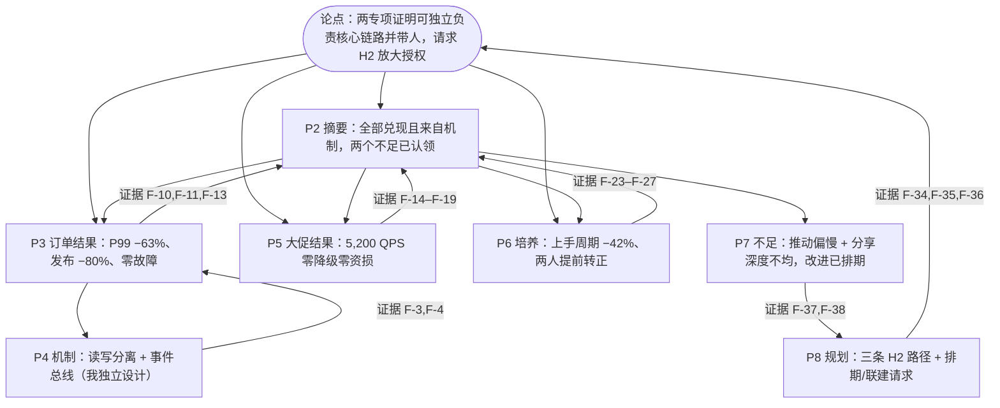

# 03-故事线（阶段 3 产物）

叙事模板：**汇报文档（SCQA + 结论先行）**——裁剪记录：无"决策请求资源"以外的模板段可裁；两专项各保留"结果页"，专项一另加机制页（D-2 需要），并入台账。

## 页字数预算（硬约束：notes 合计 ≈1500 字）

8 页 × 180–230 字 ≈ 1,520 字（页面文字不计入，B-3）。

## message 链（页序 = 演讲节奏，非文档节序）

| # | 节名 | message（这页要传达的一句话，结论式） | 用哪些事实 | 回答哪条 D-x | 节奏标注 |
|---|---|---|---|---|---|
| 1 | 封面 | 上半年双线交付：订单更快、大促更稳，零故障零资损 | F-1,F-2 | — | title 版式 |
| 2 | 管理层摘要 | 两专项一培养全部兑现且来自机制不是冲刺；两个不足已认领，下半年请求放大授权 | F-10,F-17,F-18,F-19,F-27,F-37,F-38 | D-1 | ★决策核心（先写先审） |
| 3 | 订单重构·结果 | 订单中心拆分落地：P99 −63%、发布耗时 −80%，迁移期线上零故障 | F-8,F-9,F-10,F-11,F-12,F-13 | D-1,D-3 | 一屏一图 |
| 4 | 订单重构·机制 | 我独立设计的两条线：读写分离+本地缓存扛读流量，履约事件总线解耦上下游 | F-3,F-4,F-8,F-9,F-10,F-11 | D-2 | 机制页（TL 追问承载） |
| 5 | 大促保障·结果 | 618 零降级零资损：弱依赖治理、三轮压测、自动对账三道防线的合力 | F-5,F-6,F-14,F-15,F-16,F-17,F-18,F-19,F-20,F-21,F-22 | D-1,D-3 | 一屏一图 |
| 6 | 团队与培养 | 带人出结果：新人上手周期砍掉近一半，两人提前转正独立承接 | F-23,F-24,F-25,F-26,F-27,F-28,F-29 | D-6 | 一屏一图 |
| 7 | 不足与改进 | 两个不足我都认：跨团队推动偏慢、分享深度不均，改进动作已排期 | F-37,F-38,F-28,F-29 | D-4 | risk-action |
| 8 | 规划与请求 | H2 三条规划把上半年沉淀复制到更大范围，请求排期授权与联建支持 | F-34,F-35,F-36,F-10,F-19,F-24,F-26,F-27 | D-5 | decision-ask |

## 论证链图

## 节奏与裁剪说明

- P2 是 ★决策核心：总监 30 秒扫读的第一落点，四 KPI + 两风险 + 一 ask 全预告；阶段 7P 先写先审此页。
- 页序按演讲节奏（标题→摘要→证据→不足→请求），非素材文档序（背景/内容一/二/三）——背景并入 P2 thesis 与各页 takeaways 的"背景"首句，不设独立背景页（裁剪理由：8 页预算内背景独立成页摊薄信息密度，记台账）。
- D-2 的"个人贡献边界"由 P3 takeaways 的"独立负责…"句式 + P4 机制页双署名（查询服务/事件总线均我设计）回答。

## 故事线教给我们的事

1. 素材三条工作线天然是"两个硬产出 + 一个软杠杆"结构——摘要页把培养线与专项线并列为 KPI（上手周期），软贡献才有分量。
2. 不足页放 P7 而非紧随成绩之后：先立完信任再自省，且改进动作直接勾连 P8 规划，反思不掉空。
3. 618 这个数字是大促代号不是数据——进 facts 作插值标识（F-7），避免 gate 裸数字误杀，也统一口径。

## 新问题 P3-x（带倾向，自动执行）

- P3-1：摘要页 KPI 选 4 个（P99/发布/QPS/上手周期）而非 6 个｜倾向：砍掉对账工单与文档数进 takeaways｜理由：总监 30 秒只记得住 4 个数字，对账收益在 P5 有整图｜已执行。
- P3-2：专项一占两页（结果+机制）、专项二一页｜倾向：接受不对称｜理由：D-2（个人技术判断力）主要由订单侧方案设计承载；支付侧机制以"三道防线"进 takeaways，不另占机制页｜已执行。

## 写作前提追加（阶段 3 决策）

- **阶段 3 决策（2026-08-23）**：故事线选结论先行（金字塔）｜候选 结论先行/问题铺垫式｜选定 结论先行｜理由：述职场合读者注意力前倾，总监需 30 秒拿到全部结论；无"先共情"需求｜置信度 高。
- **阶段 3 决策（2026-08-23）**：独立背景页裁掉，背景并入摘要与各页首句｜候选 独立成页/并入｜选定 并入｜理由：见节奏说明｜置信度 高。
- **阶段 3 决策（2026-08-23）**：P3-1/P3-2 按所附倾向执行｜记台账可推翻｜置信度 中。
