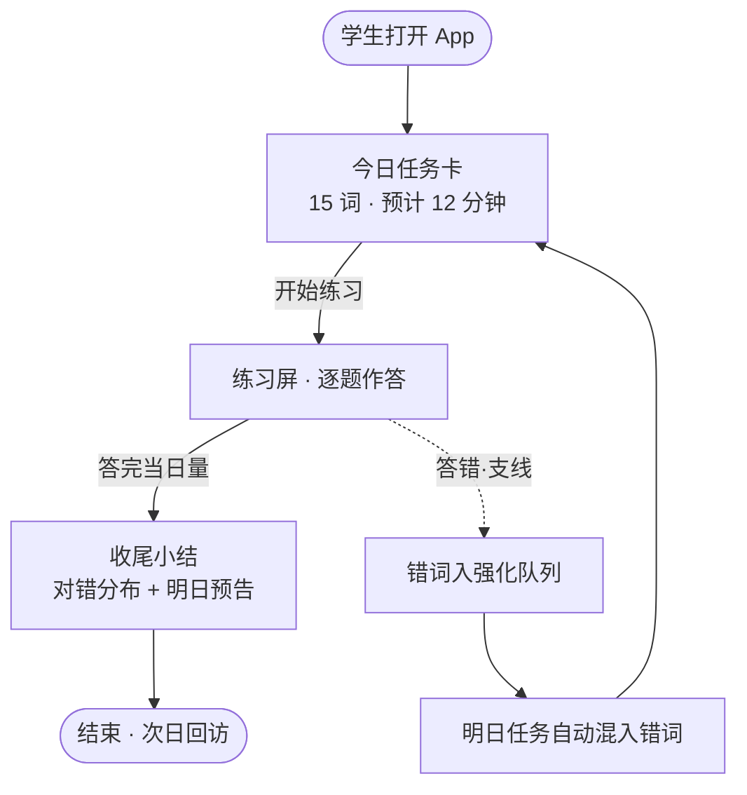
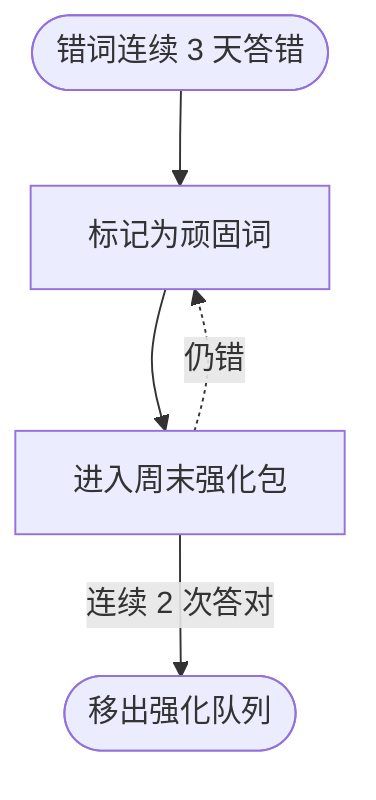

# 02 · 流程草图

> mock 产物（MockRunner 罐头）——真实产物由 ClaudeRunner 按阶段卡生成。

## F1 · 每日练习主线（产品脊柱）

## F2 · 错题强化回路

## 流程教给我们的事

1. "今日任务卡"是脊柱屏：三条流都回到它。
2. 错词回路完全后台化，学生不需要管理复习计划。

## P2-x 新问题（带倾向，待拍板）

- P2-1 收尾小结是否给分享卡片？倾向：v1 不做。
- P2-2 顽固词上限？倾向：同时 ≤20 词。
