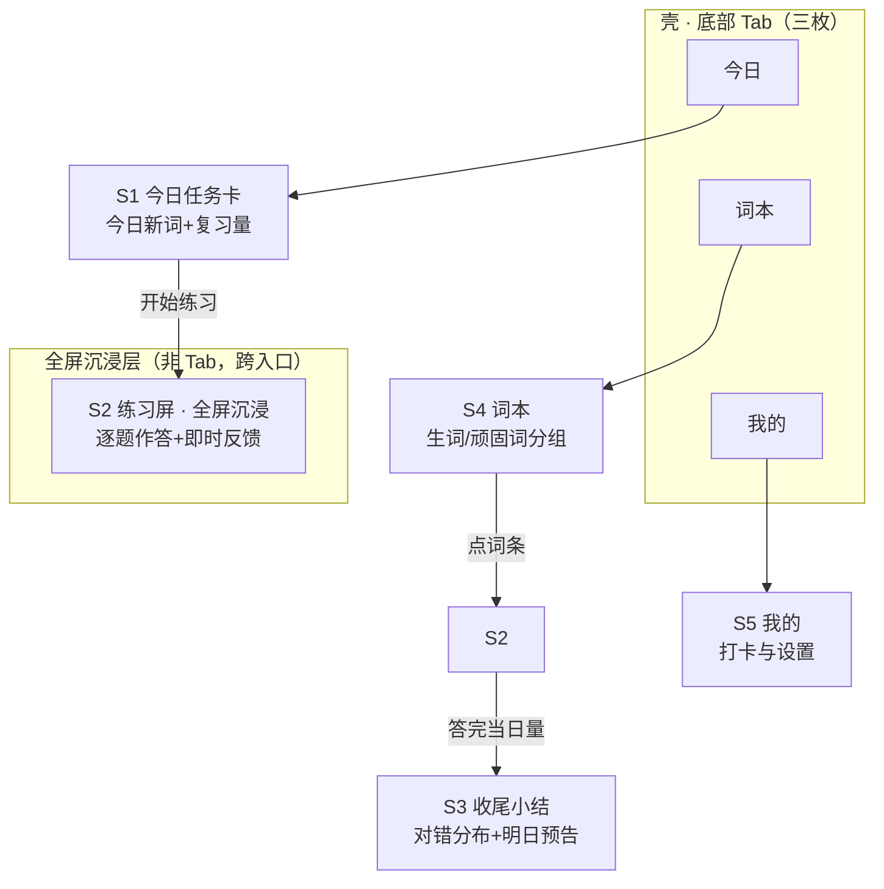

# 03 · 屏幕与IA

> mock 产物（MockRunner 罐头）——真实产物由 ClaudeRunner 按阶段卡生成。

## IA 图

## 屏幕盘点表

| ID | 屏幕 | 层级 | 信息内容 | 操作（**主**加粗） | 服务流程 | 模式倾向 |
|---|---|---|---|---|---|---|
| S1 | 今日任务卡 | Tab1 落点 | 今日新词 12·复习 3、连续打卡 6 天、预计 12 分钟 | **开始练习**、看词本 | F1 | 卡片+主键 |
| S2 | 练习屏 | 全屏沉浸层 | 当前题（词/音标/释义选项）、进度 7/15、即时反馈 | **提交答案**、跳过本题 | F1/F2 | 逐题卡流 |
| S3 | 收尾小结 | 二级页 | 对错分布、错词去向、明日预告 | **再练错词**、回首页 | F1 | 结果列表 |
| S4 | 词本 | Tab2 落点 | 生词/顽固词两组列表、词频标注 | **筛选分组**、点词条 | F2 | 主从列表 |
| S5 | 我的 | Tab3 落点 | 打卡日历、每日量设置、提醒 | **调整每日量** | F1 | 设置组 |

## 闭环检查表

| 流程 | 覆盖屏幕 | 结论 |
|---|---|---|
| F1 每日练习主线 | S1 → S2 → S3（→ 次日 S1） | ✅ |
| F2 错题强化回路 | S2 → S4（强化队列）→ 次日 S1 | ✅ |
| 孤儿屏检查 | S1–S5 均被 ≥1 流程触达 | ✅ |

## 关键屏提名（阶段 4 只做这些）

- **S2 练习屏**：状态机最复杂（进行/中断恢复/错误/空四态 × 两模式），产品脊柱的核心段；
- **S1 今日任务卡**：第一印象屏，回访入口，主键强度与信息密度取舍要拍板。

## 新问题 P3-x

- P3-1 提醒落地形态（本地通知 or 短信）——倾向本地通知，成本低且够用。
