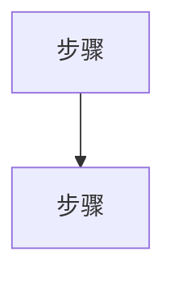
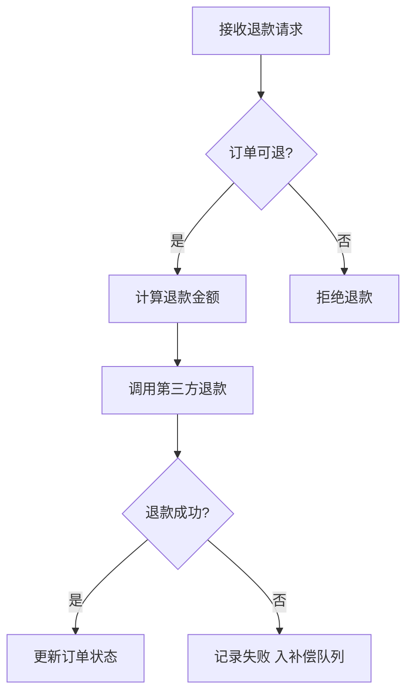
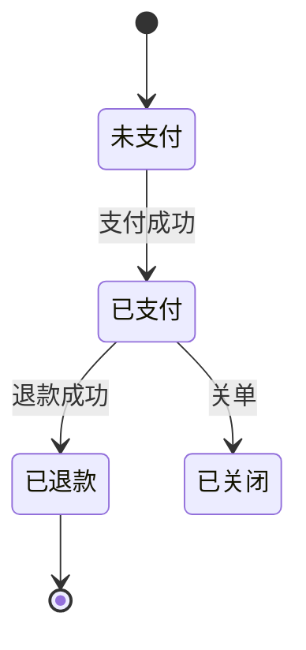

# 业务分析文档模板

> 本 skill 的产出物统一用此结构。**只描述"这项业务现在怎么实现的"，每条结论回链 `file:line`；不提重构方案、不写新产品需求。**
> 找不到代码依据的判断标 `⚠ 未确认`，并在末尾"已知缺口"登记。

---

## 一、模板

### frontmatter（轻量 YAML）

```yaml
---
business: refund              # 业务名，kebab-case 英文
title: 订单退款业务分析        # 中文标题
summary: 用户对已支付订单发起退款，系统校验后调第三方退款并更新订单状态   # 一句话概述
codebase: order-service        # 代码库 / 仓库或子路径
entry_type: http               # 触发类型：http / mq / scheduled / event / cli / manual
analyzed_at: 2026-06-16        # 分析日期
status: confirmed              # draft / confirmed
open_questions: 2              # 未确认项数量（对应正文 ⚠ 未确认 处数）
---
```

> 不放 datasets/figures。这份文档是给人和下游 skill 读的业务事实源；若要喂 `doc-blueprint` 做渲染投影，由 doc-blueprint 写正文时再声明其单一源。

### 正文章节（9 节 + 已知缺口）

> 每节给"写什么 / 回链要求"。标 ★ 的是核心章节。Mermaid 图**围栏外上一行**必须带 `<!-- evidence: ... -->` 注释，说明图的依据（HTML 注释在 markdown 层隐藏、不影响 mermaid 渲染，供校验脚本抓取）。

#### 1. 业务概述
<!-- 这项业务是什么、解决什么问题、在产品里的位置。2-4 句。 -->
- <一句话定义这项业务> —— <回链入口或核心服务 `路径:行号`>

#### 2. 触发与入口
<!-- 什么动作启动这项业务：HTTP / 事件 / 定时 / 手动。给入口标识 + file:line。 -->
- 触发方式：<...> —— `路径:行号`
- 入口：<函数 / 路由 / 处理器> —— `路径:行号`

#### 3. 核心领域概念
<!-- 术语表 + 核心实体。新人最大门槛是术语，逐条定义。 -->
- **<术语>**：<一句话定义> —— `路径:行号`（定义出处）

#### 4. 主流程 ★
<!-- happy path。必须：Mermaid 图（围栏外上一行带 evidence 注释）+ 图下逐步骤文字，每步回链。图里每条边都要在文字有对应。 -->

<!-- evidence: <图的依据：入口 → ...，含 file:line> -->


1. **<步骤>** —— <做了什么> …… `路径:行号`
2. ...

#### 5. 分支与异常
<!-- 决策分支、错误路径、边界条件。每条回链。 -->
- <分支 / 异常> —— <什么条件、走哪、后果> …… `路径:行号`

#### 6. 数据与存储
<!-- 读写的表 / 模型 / 缓存、关键字段、数据流转。有状态机就画 stateDiagram-v2。 -->
- 读：<从哪取> …… `路径:行号`
- 改：<改了什么、写哪> …… `路径:行号`

#### 7. 依赖与耦合
<!-- 上游调用者、下游依赖、外部服务、紧耦合 / 循环点。重构用途重点。 -->
- 上游：<谁触发本业务> …… `路径:行号`
- 下游 / 外部：<依赖谁、失败如何处理> …… `路径:行号`

#### 8. 风险与技术债
<!-- 脆弱点、已知坑、改动影响面、并发 / 时序隐患。每条给依据。 -->
- <风险> → <为什么会出问题 / 后果> …… `路径:行号`

#### 9. 代码地图
<!-- 关键文件清单 + 职责 + 行号锚点。表格形式。 -->
| 角色 | 文件 | 关键位置 | 职责 |
|------|------|----------|------|
| ... | ... | `路径:行号` | ... |

### 已知缺口
<!-- 每处 ⚠ 未确认 都要在这里有对应条目：问题 + 为何未确认 + 后续如何补。 -->
- <问题>：<为何未确认 / 后续如何证实>

---

## 二、端到端示例

> 示例：一个订单服务的"退款"业务分析（用于对照填写，**代码路径为虚构示例**）。

```yaml
---
business: order-refund
title: 订单退款业务分析
summary: 用户对已支付订单发起退款，系统校验可退条件后调用第三方支付退款，并更新订单状态为已退款
codebase: order-service
entry_type: http
analyzed_at: 2026-06-16
status: confirmed
open_questions: 2
---
```

### 1. 业务概述

订单退款是订单生命周期的终态之一：用户对一笔已支付订单发起退款，系统校验可退条件（状态、金额），调用第三方支付执行真实退款，再把订单置为"已退款"。 —— 入口 `src/api/refund.py:42`

### 2. 触发与入口

- 触发方式：HTTP 接口，用户在前端"订单详情 → 申请退款"点击触发 —— `src/api/refund.py:42`
- 入口：`POST /api/orders/{order_id}/refund` → `refund_handler()` —— `src/api/refund.py:42`

### 3. 核心领域概念

- **退款单（RefundRecord）**：一次退款申请的聚合根，记录退款金额、状态、关联订单 —— `src/model/refund_record.py:12`
- **订单状态（OrderStatus）**：枚举 `未支付(0)/已支付(1)/已退款(4)/已关闭(9)` —— `src/model/order.py:8`

### 4. 主流程 ★

<!-- evidence: refund_handler @ src/api/refund.py:42 → RefundService.refund @ src/service/refund_service.py:88 → PaymentClient.call_refund @ src/clients/payment_client.py:55 -->


1. **接收退款请求** —— 校验入参（order_id、金额）…… `src/api/refund.py:42`
2. **订单可退?** —— 查订单状态，仅"已支付(1)"可退 …… `src/service/refund_service.py:95`
3. **计算退款金额** —— 按退款规则算（全额 / 部分）…… `src/service/refund_service.py:110`
4. **调用第三方退款** —— 调 `PaymentClient.call_refund` …… `src/clients/payment_client.py:55`
5. **退款成功?** —— 据返回码判断 …… `src/service/refund_service.py:135`
6. **更新订单状态** —— 置为"已退款(4)" …… `src/repo/order_repo.py:120`

### 5. 分支与异常

- **订单不可退** —— 状态非"已支付"时抛 `OrderNotRefundableError`，返回 400 …… `src/service/refund_service.py:97`
- **第三方退款失败** —— 返回码非成功，捕获异常后置退款单为"失败"，进入补偿队列（不直接抛给用户）…… `src/service/refund_service.py:138`

### 6. 数据与存储

- 读：从 `orders` 表取订单（状态、金额）…… `src/repo/order_repo.py:60`
- 改：写 `refund_records` 表（退款单状态）、更新 `orders.status` —— `src/repo/order_repo.py:120`

<!-- evidence: OrderStatus 赋值点 @ src/service/refund_service.py:95 (校验) / :135 (退款后) / src/repo/order_repo.py:120 (落库) -->


### 7. 依赖与耦合

- 上游：前端退款页（`web/views/order/Refund.vue`）调本接口 —— 跨边界点 `src/api/refund.py:42`
- 下游 / 外部：依赖支付中心 `PaymentClient`，超时 3s、失败重试 2 次 —— `src/clients/payment_client.py:55`

### 8. 风险与技术债

- **重复退款（并发 / 幂等）** → 同一订单并发退款可能双退；当前用 `refund_lock`（Redis 分布式锁）串行化 + `refund_records` 的 order_id 唯一索引共同保证幂等，key=order_id —— `src/service/refund_service.py:160`
- **部分退款拆单规则** → 是否支持一笔订单分多次部分退，规则未在代码中明确 ⚠ 未确认 —— `src/service/refund_service.py:110`
- **外部依赖补偿** → 支付中心超时后仅入补偿队列，补偿逻辑未在本业务内，依赖外部 job ⚠ 未确认 —— `src/service/refund_service.py:138`

### 9. 代码地图

| 角色 | 文件 | 关键位置 | 职责 |
|------|------|----------|------|
| HTTP 入口 | src/api/refund.py | `:42` | 接收退款请求、参数校验 |
| 领域服务 | src/service/refund_service.py | `:88` | 退款决策、金额计算、并发控制 |
| 数据访问 | src/repo/order_repo.py | `:120` | 改订单状态 |
| 外部依赖 | src/clients/payment_client.py | `:55` | 调用第三方支付退款 |
| 模型 | src/model/refund_record.py | `:12` | 退款单聚合根 |

### 已知缺口

- **部分退款拆单规则**：`refund_service.py:110` 处的金额计算未体现是否支持拆单，需找产品 / 历史 PR 确认；当前按"单次全额或单次部分"理解。
- **补偿逻辑归属**：`refund_service.py:138` 失败后入补偿队列，但补偿 job 不在本业务代码内，未追踪其实现与重试上限。
