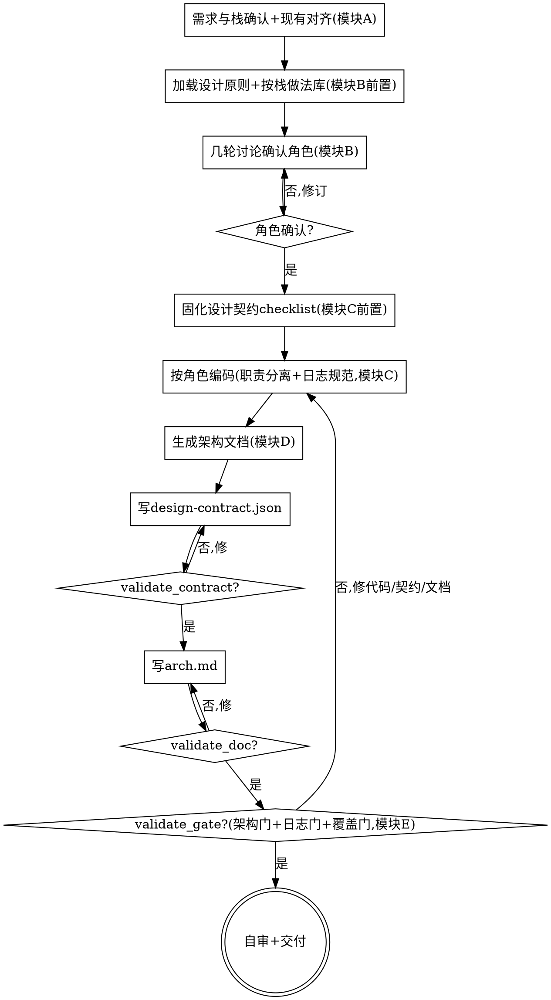

# 架构先行代码生成：先确认架构，再写代码（把「能跑」提升为「架构清晰」）

## 目的

针对**一个新需求/feature**，先**以代码设计原则（SOLID / DDD / 高内聚低耦合 / 依赖方向 / 关注点分离 / Tell-Don't-Ask）为推理依据**、按栈加载标准做法、和你几轮讨论确认架构角色（**分层角色 + 领域角色**）与职责，把确认结果固化为「设计契约」作为编码对照 checklist，再编码实现（职责分离 + 按栈日志规范），最后**统一生成含设计依据与业务流程的架构文档**，并做原则导向自检——把「能跑」的代码提升为「架构清晰、职责分离、可维护」的代码。

只回答一个问题：**这个新需求要拆成哪些角色、各担什么职责、按什么设计依据、怎么落到代码与架构文档**——不回答「需求该不该做」（那是 `clarify-requirements`）、不回答「已有模块烂不烂」（那是 `arch-quality-eval`）。

```
一个新需求 ──► [arch-first-code-gen] ──► 职责分离的代码 + 架构文档(原则复核 + 辅助证据)
                                   （生成侧，与评估侧 arch-quality-eval 互为镜像）
```

三个核心特征：

1. **架构先行、设计原则驱动** —— 编码前先确认架构（角色 / 职责 / 依赖），且**每一处拆分都说得出依据的设计原则 + 业界做法**，不是上来就堆代码。角色确认未过不编码（HARD-GATE）。
2. **角色库源自业界做法** —— 「分层角色 + 领域角色(DDD)」的定义**源自业界通行做法**（分层架构、DDD 战术模式），按栈内置标准做法库；skill 在确认角色时**标注依据**，避免凭空设计。
3. **设计契约软引导 + 原则复核为主** —— 编码时设计契约是 **checklist 软引导**（对照提醒，不逐角色硬卡打断节奏）；最后复核以**架构原则与代码设计原则是否被真实遵守**为核心，脚本校验只提供结构性证据（架构门 / 日志门 / 覆盖门），不替代设计判断。

<HARD-GATE>
在**架构角色确认**（角色清单：角色 / 类型(分层 or 领域) / 层 / 职责 / 依赖 / 业界做法依据 / 所依据的设计原则）被用户确认前，**不进入编码**。
交付前必须有**设计契约 `design-contract.json`**与**架构文档**，并完成原则复核：职责边界、依赖方向、领域建模、关注点分离、日志与流程覆盖都要能回链到明确设计原则。校验脚本应尽量运行；结构性错误要修，脚本近似检查无法覆盖的语义项要诚实登记，不把脚本结果当成唯一判断。本 skill 自己产出代码 + 架构文档，不调用任何其他 skill。
</HARD-GATE>

## 反模式：直接开始写代码 / 角色凭空设计

`OrderService` 不是一个默认就该存在的角色——它该不该存在、该不该拆、依赖谁，要由**设计原则 + 业界做法**推出，再经你确认。跳过「先确认架构」直接堆代码、或凭「感觉要个 Service」设计角色，是这类需求最常见的返工。每个角色都要回链「依据什么原则、参考什么业界做法」；推断式的拆分要在契约里说清依据。

## 边界（最重要）

**产出**（代码 + 架构文档）：
- 设计契约 `design-contract.json`（机器契约源：角色 / 职责 / 依赖 / 业界依据 / 设计原则 / 代码单元 / 业务流程 / 复核结论）
- 职责分离的代码（每个确认角色对应代码单元，单一职责，分层清晰，依赖方向正确，按栈日志规范）
- 架构文档（模块结构图 mermaid + 业务流程图 mermaid + 角色职责清单 + 设计依据 + 关键接口契约 P1）
- 原则导向自检结论（架构门 / 日志门 / 覆盖门辅助证据 + 设计原则复核）

**不产出**（超出范围，记入「未决问题 / 已知缺口」）：
- ❌ **需求澄清**：输入假设需求已明确（仅做必要范围确认），需求不清则提示先走 `clarify-requirements`（PRD §5）。
- ❌ **评估/重构已有模块**：那是 `arch-quality-eval`；本 skill 是新需求生成侧，不做诊断（PRD §5）。
- ❌ **自动测试生成**：归 web-test 系列（PRD §5）。
- ❌ **代码风格 / lint 检查**：可读性 ≠ 代码风格，与 `arch-quality-eval` 同口径，避免重复（PRD §5）。
- ❌ **CI / PR 门禁卡关**：本 skill 是开发时质量保障，非 CI 自动卡关（PRD §5）。
- ❌ **性能优化 / 算法选型 / DB 设计与迁移 / 全 repo 重构 / UI 视觉交互细节**（PRD §5）。
- ❌ **校验强度等同评估侧**：本 skill 自检是生成侧复核，**做不到** `arch-quality-eval` 那种 AST/静态分析强度，靠结构性规则 + 语义自检混合，诚实登记缺口（PRD §6）。

**越界拉回**：当对话滑向「帮我评估这个模块烂不烂」「跑个 lint」「全自动别问我直接出代码」「需求我还想再聊聊」时，明确说「这超出 arch-first-code-gen 范围」，记一笔到「未决问题」。

## 内置知识

本 skill 内置（`references/`）：
- **设计原则库**（`design-principles.md`）：SOLID / DDD / 高内聚低耦合 / 依赖方向 / 关注点分离 / Tell-Don't-Ask——每条「它逼你做什么拆分决策」。**架构确认的推理依据**。
- **按栈标准做法库**（`standard-practices/`）：JVM(Java/Kotlin) / C++ / FastAPI+Vue 三套，每套含**分层角色 + 领域角色(DDD)**，定义源自业界通行做法 + 标注依据原则 + 可扩展。**确认角色时按栈加载**。
- **角色确认法**（`role-confirmation.md`）：几轮讨论确认角色/职责/依赖、标注业界依据 + 设计原则、产出角色职责清单、收敛与回退机制。**模块 B 核心**。
- **业务流程梳理**（`business-process.md`）：主流程 + 异常分支标注，为文档流程图 + 覆盖门打底。**模块 B P1 / 模块 D / 模块 E**。
- **范围对齐**（`scope-and-alignment.md`）：确认栈 + 读懂现有仓库分层/命名/日志习惯、新代码沿用。**模块 A**。
- **设计契约 checklist**（`design-contract-checklist.md`）：把确认结果固化为编码对照 checklist（软引导）。**模块 C**。
- **按栈日志规范**（`logging-standards.md`）：级别 / 结构化 / 关键节点打点 / 错误上下文 / 按栈日志库。**模块 C + 日志门**。
- **架构文档模板**（`arch-doc-template.md`）：结构图 + 流程图 + 角色职责 + 设计依据 + 接口契约。**模块 D**。
- **原则导向自检**（`self-check-gates.md`）：架构门 / 日志门 / 覆盖门各提供什么结构证据、如何用设计原则做语义复核、如何诚实登记缺口。**模块 E**。
- **设计契约 schema**（`design-contract-schema.md`）：`design-contract.json` 字段表 + 示例。**模块 B/C/E 产出契约源**。

## Checklist

为以下每项创建一个 task，按序完成：

1. **需求与栈确认 + 现有代码库对齐（模块 A）** —— 接受新需求（一句话 / 需求文档 / 现有代码 + 新需求），**确认技术栈**（JVM / C++ / FastAPI+Vue 之一）；需求不清则提示先走 `clarify-requirements`，**不替用户澄清**。读懂仓库现有分层 / 命名 / 日志习惯，新代码沿用。用一句话重述「本次需求范围 + 栈 + 现有架构风格如何沿用」，请用户确认。加载 `references/scope-and-alignment.md`。
2. **加载设计原则 + 按栈标准做法库（模块 B 前置）** —— 加载 `references/design-principles.md`（推理依据）+ 按确认栈加载 `references/standard-practices/<stack>.md`（分层角色 + 领域角色，业界来源）。这两份是后续确认角色的**依据底座**，不照搬、对照具体需求适配。
3. **几轮讨论确认架构角色（模块 B 核心，HARD-GATE）** —— 按 `references/role-confirmation.md`，参考标准做法库，**几轮讨论**确认：有哪些**角色（分层 + 领域）** + 各自职责 + 依赖关系；每个角色**标注业界做法依据 + 所依据的设计原则**。产出「角色职责清单」（角色 / 类型 / 层 / 职责 / 依赖 / 业界依据 / 设计原则）。**不画图、不写接口**。加载 `references/business-process.md` 梳理主流程 + 异常分支（P1）。**需用户确认角色清单才进入编码**。
4. **固化设计契约 checklist（模块 C 前置）** —— 把确认结果（角色 / 职责 / 依赖）+ 必须满足的设计原则固化为「设计契约」，作为编码时对照的**软性 checklist**（对照提醒，**非逐角色硬门禁**）。加载 `references/design-contract-checklist.md`。
5. **按角色编码（模块 C）** —— 照确认的角色清单（含领域角色）逐个实现：每个角色单一职责、分层清晰、依赖方向正确、无跨层调用。编码时对照设计契约 checklist 提醒。加载 `references/logging-standards.md` 落按栈日志规范（级别正确 / 结构化 / 关键节点打点 / ERROR 带上下文 / 用对日志库）。
6. **生成架构文档（模块 D）** —— 编码后**统一生成**，按 `references/arch-doc-template.md`：① 模块结构图(mermaid) ② 业务流程图(mermaid) ③ 角色职责清单（含设计依据）④ 设计依据（每个角色/分层为什么这么划、依据什么原则）⑤ 关键接口契约(P1)。图与代码结构一致、流程覆盖主流程 + 关键异常分支。
7. **写设计契约 manifest + 轻量结构校验** —— 按 `references/design-contract-schema.md` 把角色/职责/依赖/业界依据/设计原则/代码单元/业务流程/复核结论写成 `design-contract.json`（**机器契约源**，稳定 `ROLE-[LD]<n>` id），写到产品仓库 `docs/architecture/<feature>-design-contract.json`。跑 `scripts/validate_contract.py` 作为 schema/一致性烟测；修真实结构错误，不把格式校验扩展成风格门禁。
8. **写架构文档 + 设计依据复核** —— 按 `references/arch-doc-template.md` 把契约渲染成人读架构文档 `<feature>-arch.md`（同目录）。跑 `scripts/validate_doc.py` 作为文档结构烟测；重点人工复核「每个角色为什么这么划、依据什么原则、与代码是否一致」。
9. **原则导向自检 + 辅助脚本证据** —— 按 `references/self-check-gates.md`，运行 `scripts/validate_gate.py <design-contract.json> <arch.md> --root <repo-root>` 获取结构性证据：角色↔代码文件、日志关键字近似覆盖、流程↔代码↔文档对账。脚本 no-go 先判断是否是真设计问题；真问题回 B/C/D 修，脚本近似能力不足则登记缺口。最终判断以架构原则/代码设计原则是否被遵守为准。
10. **自审 + 交付** —— 证据回链（角色↔代码文件存在）/ 设计依据可追溯（每角色点了原则）/ 职责与依赖合理（SRP/DIP/DDD/关注点分离）/ 流程覆盖（步骤↔代码↔文档对得上）/ 日志规范 / placeholder 扫描 逐条过（详见「自审检查项」）。发现原则性问题就地修；脚本发现的真实结构问题也修。通过原则复核即交付：职责分离的代码 + 架构文档 + 校验证据/已知缺口。

## 流程图



**终态是「自审 + 交付」：代码 + 架构文档 + design-contract.json 能说明角色、职责、依赖与设计原则，并有必要的校验证据/已知缺口。** 本 skill 不预设、不调用任何下游 skill。

## 自审检查项（Checklist 第 10 步展开）

交付前用新视角过一遍：

1. **角色 ↔ 代码回链** —— 每个确认角色都有对应代码单元（文件存在）？无「确认了角色却没代码」的悬空（`validate_gate.py` 可辅助发现）。
2. **设计依据可追溯** —— 每个角色/分层是否点了**具体设计原则**（SRP/DIP/聚合根…）+ 业界做法依据？不空泛（契约源 `design_principles` + `industry_basis` 非空；文档「设计依据」节齐全）。
3. **原则判断自洽** —— `gate.verdict`/复核结论要和实际架构判断一致：若脚本 no-go 是真实结构问题就修；若是脚本近似能力限制，就在 `gate.notes` 与文档缺口里说明。
4. **流程覆盖三者对得上** —— 业务流程每步：有代码（code_refs）+ 在文档体现（doc_ref）+ 角色有效（脚本覆盖门可辅助发现断点）。
5. **日志规范** —— 关键节点（入口/出口/异常/外部调用）有日志、ERROR 带上下文、用对按栈日志库（日志门覆盖检查）。
6. **职责单一 / 依赖方向** —— 每个角色单一职责、依赖方向与确认一致、无跨层（结构性能查的由辅助脚本查；语义性的诚实标为「辅助校验未覆盖」登记缺口，不假装查了）。
7. **角色二分显式** —— 角色清单里**分层角色 + 领域角色**两类都覆盖到了（若该栈/需求只用一类，明说理由，不静默漏）。
8. **placeholder 扫描** —— 契约/文档无「待定/TBD/适当处理」；真实未决写「问题 + 影响 + 后续阶段」。

发现原则性问题就地修；修完按需重跑 `validate_contract.py` + `validate_doc.py` + `validate_gate.py`，把脚本结果作为证据而非替代判断。

## 产出位置

存到产品仓库 `docs/architecture/`（或用户指定目录），共享 `<日期>-<feature>` 前缀（feature 用 kebab-case，日期用当天）：

- `YYYY-MM-DD-<feature>-design-contract.json` —— **机器契约源**（唯一事实源）：角色(分层+领域) / 职责 / 依赖 / 业界依据 / 设计原则 / 代码单元 / 业务流程 / 复核结论
- `YYYY-MM-DD-<feature>-arch.md` —— **人读架构文档**：契约的渲染 + mermaid 结构图/流程图 + 角色职责表 + 设计依据 + 接口契约

json 是给校验器读的契约源，md 是给人读的渲染，**两者必须一致**（`validate_gate.py` 可辅助做覆盖门 + 角色交叉对账）。交付前尽量跑校验脚本，修复真实结构问题；对脚本近似检查无法覆盖或误伤的语义项，在 `gate.notes` 与文档「已知缺口」说明。校验脚本在本 skill 的 `scripts/` 目录（与 SKILL.md 同级）——**不要假设当前目录是仓库根**：作为 corin 插件加载时路径为 `${CLAUDE_PLUGIN_ROOT}/skills/arch-first-code-gen/scripts/`，否则按本 SKILL.md 所在目录拼出同级 `scripts/` 的绝对路径再运行。文件存在性校验需要仓库根路径，默认用当前目录，也可显式传 `--root <repo-root>`。

```bash
V="${CLAUDE_PLUGIN_ROOT}/skills/arch-first-code-gen/scripts"   # 非插件：用本 SKILL.md 同级 scripts/ 的绝对路径
python3 "$V/validate_contract.py"  <design-contract.json>
python3 "$V/validate_doc.py"       <arch.md>
python3 "$V/validate_gate.py"      <design-contract.json> <arch.md> --root <repo-root>
```

## 关键原则

- **架构先行** —— 角色确认前不编码（HARD-GATE）；先想清楚角色/职责/依赖再动手，而非堆代码后补文档。
- **设计原则是推理依据** —— 每处拆分说得出依据的设计原则（SOLID/DDD/…）+ 业界做法，不凭感觉设角色。
- **角色库源自业界做法** —— 分层角色 + 领域角色(DDD) 定义源自业界通行做法，按栈内置；确认时标注依据。
- **分层角色 + 领域角色两类** —— 不只看「分层」，领域角色(聚合/实体/值对象/领域服务/领域事件)是职责拆分的核心依据之一。
- **设计契约软引导** —— 编码时 checklist 对照提醒，**不逐角色硬卡**（不打断节奏）；最终看设计原则是否真实落到代码。
- **校验诚实标注强度** —— 生成侧自检做不到评估侧 AST 强度；结构性能查的（角色↔文件、日志关键字、步骤↔代码↔文档）机器查，语义性的（职责是否真单一、依赖是否真合理）靠 LLM 语义自检并登记缺口，不假装查了。
- **覆盖服务于原则** —— 业务流程每步 ↔ 代码 ↔ 文档三者要对得上，但它是证明职责与流程落地的证据，不是为了机械凑通过率。
- **新代码沿用现有风格** —— 读懂现有仓库分层/命名/日志习惯，融入而非另起炉灶。
- **单 feature 粒度** —— 一次一个新需求/feature；大 feature 用聚焦策略（按角色分批、热点优先，未决）。
- **YAGNI** —— 砍掉可做可不做的角色；MVP 需求出 MVP 架构，不过度设计。
- **可回头** —— 任何时候回到任何一步修订，修完重校验。

## 反模式

| 反模式 | 正确做法 |
|--------|----------|
| 跳过架构确认直接编码 | 角色清单经用户确认（第 3 步）才编码（HARD-GATE） |
| 凭「感觉要个 Service」设角色 | 每角色标注业界做法依据 + 设计原则 |
| 只设计分层角色，漏领域角色 | 分层 + 领域(DDD) 两类角色都过一遍，不适用明说理由 |
| 角色清单画图/写接口（越界到模块 D） | 模块 B 只定角色/职责/依赖；图与接口留模块 D |
| 编码时逐角色硬卡门禁打断节奏 | 设计契约软引导；最终做原则复核 + 结构证据检查 |
| 把生成侧校验吹成 AST 强度 | 结构性规则机器查 + 语义性 LLM 自检，诚实登记缺口 |
| 角色确认了却没对应代码 | 每角色回链代码单元，文件存在（架构门辅助发现） |
| 业务流程没落到代码/文档 | 流程每步 ↔ 代码 ↔ 文档三者对得上（覆盖门辅助发现） |
| 关键节点不打日志 / ERROR 不带上下文 | 按栈日志规范，关键节点打点（日志门覆盖检查） |
| 替用户做需求澄清 | 需求不清提示走 `clarify-requirements`，不替澄清 |
| 评估/重构已有模块（越界到评估侧） | 那是 `arch-quality-eval`；本 skill 只做新需求生成 |
| 全自动无确认直接出代码 | 强制架构确认环节，需人参与 |
| 假设并调用某个下游 skill | 本 skill 独立，交付即终止 |

## 参考资源

**模块 A（范围对齐）**
- **`references/scope-and-alignment.md`** —— 需求与栈确认、读懂现有仓库分层/命名/日志习惯、新代码沿用。**第 1 步用**

**模块 B（架构确认）**
- **`references/design-principles.md`** —— 设计原则库（SOLID/DDD/高内聚低耦合/依赖方向/关注点分离/Tell-Don't-Ask），每条「逼你做什么拆分决策」。**第 2 步用（推理依据）**
- **`references/standard-practices/`** —— 按栈标准做法库（分层角色 + 领域角色，业界来源）：`README.md`(索引) / `jvm.md` / `cpp.md` / `fastapi-vue.md`。**第 2 步按栈加载**
- **`references/role-confirmation.md`** —— 几轮讨论确认角色/职责/依赖、标注依据、产出角色职责清单、收敛与回退。**第 3 步用**
- **`references/business-process.md`** —— 业务流程主流程 + 异常分支梳理。**第 3 步(P1)/模块 D/模块 E 用**

**模块 C（编码）**
- **`references/design-contract-checklist.md`** —— 把确认结果固化为设计契约 checklist（软引导条目）。**第 4 步用**
- **`references/logging-standards.md`** —— 按栈日志规范（级别/结构化/关键节点/错误上下文/日志库）。**第 5 步用**

**模块 D（架构文档）**
- **`references/arch-doc-template.md`** —— 架构文档模板（结构图+流程图+角色职责+设计依据+接口契约）。**第 6/8 步用**

**模块 E（原则导向自检）**
- **`references/self-check-gates.md`** —— 架构门/日志门/覆盖门各提供什么结构证据、结构性 vs 语义性、原则复核、诚实缺口。**第 9 步用**

**产出契约源**
- **`references/design-contract-schema.md`** —— `design-contract.json` 字段表 + 示例。**第 7 步用**

**校验脚本（stdlib-only）**
- `scripts/validate_contract.py` —— design-contract.json 契约源交付前必跑（schema/枚举/角色 id/依赖可解析/原则非空/计数自洽）
- `scripts/validate_doc.py` —— arch.md 渲染交付前必跑（frontmatter/mermaid 结构图+流程图/角色职责表覆盖/设计依据齐全/banned/已知缺口）
- `scripts/validate_gate.py` —— 模块 E 辅助证据（三道门：架构门 role↔文件存在 + 依赖可解析 / 日志门 按栈日志关键字覆盖 / 覆盖门 流程↔代码↔文档 + 契约↔文档角色一致）

**示例**
- `examples/2026-06-28-example-design-contract.json` / `examples/2026-06-28-example-arch.md` + `examples/fixtures/` —— 端到端示例（JVM 订单创建），照此对齐契约与文档格式；如运行辅助脚本发现示例 fixture 不完整，按缺口说明处理
