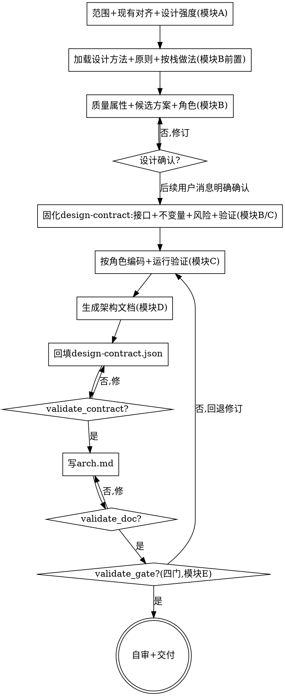

# 架构先行代码生成：先确认架构，再写代码（把「能跑」提升为「架构清晰」）

## 目的

针对**一个新需求/feature**，先选择与风险相称的设计强度，明确质量属性，比较候选分解，再以代码设计原则和按栈做法确认**分层角色 + 领域角色**。编码前固化角色的信息隐藏边界、关键接口、数据所有权、不变量、错误/事务/并发约定和验证策略；编码后运行可用测试与校验，统一生成架构文档。把「能跑」提升为「复杂度受控、边界可预测、证据可追溯」。

只回答一个问题：**这个新需求要拆成哪些角色、各担什么职责、按什么设计依据、怎么落到代码与架构文档**——不回答「需求该不该做」（那是 `clarify-requirements`）、不回答「已有模块烂不烂」（那是 `arch-quality-eval`）。

```
一个新需求 ──► [arch-first-code-gen] ──► 职责分离的代码 + 架构文档(原则复核 + 辅助证据)
                                   （生成侧，与评估侧 arch-quality-eval 互为镜像）
```

三个核心特征：

1. **架构先行、复杂度驱动** —— 编码前确认质量属性、候选方案、角色 / 职责 / 依赖 / 信息隐藏边界与关键接口。每一处拆分都说得出设计原则、业界做法和具体取舍。
2. **角色库源自业界做法** —— 「分层角色 + 领域角色(DDD)」的定义**源自业界通行做法**（分层架构、DDD 战术模式），按栈内置标准做法库；skill 在确认角色时**标注依据**，避免凭空设计。
3. **风险分级 + 可演化契约** —— `light/standard/high_risk` 控制设计成本；设计契约指导编码但允许基于实现反馈回退修订。最终以原则复核、验证证据和结构校验共同判断。

<HARD-GATE>
本 skill 有两个**必须暂停并等待用户回复**的交互门禁：

1. **等级选择门**：完成只读仓库勘察并给出推荐后，询问用户选择 `light / standard / high_risk`。只有用户在消息中明确指定或接受某个等级，才可继续架构设计。模型的推荐、默认值、任务规模推断都不算用户选择。
2. **方案确认门**：展示与所选等级匹配的完整编码前方案后，明确询问“是否按此方案进入编码”，并结束当前回合。只有展示方案之后的**后续用户消息**明确同意，才可写入或修改仓库中的生产代码、测试、配置或交付文档。

等级未选择或方案未确认时，只允许只读检查、在对话中分析和提问；**不得进行任何仓库写操作，不得调用编辑工具，不得把“我已确认/自动确认”当作用户确认**。初始请求里的“直接做”“尽快”“不要问”不能预先确认一个尚未展示的方案；本 skill 不提供自动确认模式。若用户在初始请求中已明确指定等级，等级选择门可视为完成，但方案确认门仍不可省略。

方案确认前必须展示：设计强度与质量属性、候选方案与选择理由、角色清单（职责 / 依赖 / 隐藏秘密 / 变化触发器 / 数据所有权）、关键接口契约（输入输出 / 前后置条件 / 不变量 / 错误 / 事务并发边界）、业务流程和验证策略。`standard/high_risk` 必须比较至少两个候选；`high_risk` 必须先说明风险 spike 计划，并在生产编码前补充 spike 结论。方案变更后，原确认失效，必须展示差异并重新确认。
凡涉及 UI，角色确认前还必须完成跨语言 UI 架构决策：识别现有模式与状态边界，判断 MVVM 适用性和迁移影响。适用且影响可控时优先 MVVM，但不得机械创建空 ViewModel。若目标是新引入 MVVM 且迁移影响为 `high`，必须在编码前取得用户明确确认；确认前 `migration_confirmation=pending` 并暂停。通用方案确认不能替代这项专项迁移确认。
交付前必须有 `design-contract.json`、架构文档、实际验证结果和原则复核。可运行的已有/新增测试必须运行；无法验证的项目进入 `unverified` 并降低置信度。结构性错误要修，脚本未覆盖的语义项要诚实登记。本 skill 自己产出代码 + 架构文档，不调用其他 skill。
</HARD-GATE>

## 双确认协议

严格按下面的回合边界执行：

1. **回合 A：等级选择**——只读识别范围、栈和现有风格；列出三个等级的成本/产物，给出一个推荐；询问用户选择后停止。用户已经明确写出等级时可直接进入回合 B。
2. **回合 B：方案确认**——按已选等级完成设计，展示方案、角色、接口、流程、风险与验证计划；询问是否进入编码后停止。此回合不得写仓库。
3. **回合 C：编码交付**——确认消息明确指向当前方案后，先在 `design-contract.json.interaction_confirmation` 记录两次确认，再写代码、测试和文档并运行校验。

有效等级确认示例：“用 standard”“接受你推荐的 light”。有效方案确认示例：“确认，按 ALT-1 编码”“方案没问题，开始实现”。“继续看看”“先分析”“你决定”不是方案确认。用户要求改方案时回到回合 B；用户改变等级时回到回合 A/B，并使旧方案确认失效。

## 反模式：直接开始写代码 / 角色凭空设计

`OrderService` 不是一个默认就该存在的角色——它该不该存在、该不该拆、依赖谁，要由**设计原则 + 业界做法**推出，再经你确认。跳过「先确认架构」直接堆代码、或凭「感觉要个 Service」设计角色，是这类需求最常见的返工。每个角色都要回链「依据什么原则、参考什么业界做法」；推断式的拆分要在契约里说清依据。

## 边界（最重要）

**产出**（代码 + 架构文档）：
- 设计契约 `design-contract.json`（机器契约源：设计强度 / 质量属性 / 候选方案 / 角色信息隐藏边界 / 关键接口 / 业务流程 / 验证证据 / 复核结论）
- 职责分离的代码（每个确认角色对应代码单元，单一职责，分层清晰，依赖方向正确，按栈日志规范）
- 架构文档（质量属性与方案取舍 + 模块/流程图 + 角色信息隐藏边界 + 关键接口契约 P0 + 验证证据）
- 原则导向自检结论（架构门 / 日志门 / 覆盖门 / 验证门辅助证据 + 设计原则复核）

**不产出**（超出范围，记入「未决问题 / 已知缺口」）：
- ❌ **需求澄清**：输入假设需求已明确（仅做必要范围确认），需求不清则提示先走 `clarify-requirements`（PRD §5）。
- ❌ **评估/重构已有模块**：那是 `arch-quality-eval`；本 skill 是新需求生成侧，不做诊断（PRD §5）。
- ❌ **通用测试框架搭建或跨 feature 测试工程**；但本 feature 所需测试与现有测试执行属于交付验证，不能跳过。
- ❌ **代码风格 / lint 检查**：可读性 ≠ 代码风格，与 `arch-quality-eval` 同口径，避免重复（PRD §5）。
- ❌ **CI / PR 门禁卡关**：本 skill 是开发时质量保障，非 CI 自动卡关（PRD §5）。
- ❌ **性能优化 / 算法选型 / DB 设计与迁移 / 全 repo 重构 / UI 视觉交互细节**（PRD §5）。
- ❌ **校验强度等同评估侧**：本 skill 自检是生成侧复核，**做不到** `arch-quality-eval` 那种 AST/静态分析强度，靠结构性规则 + 语义自检混合，诚实登记缺口（PRD §6）。

**越界拉回**：当对话滑向「帮我评估这个模块烂不烂」「跑个 lint」「需求我还想再聊聊」时，明确说「这超出 arch-first-code-gen 范围」，记一笔到「未决问题」。用户要求跳过确认时，说明本 skill 的双确认门禁不可省略，并停在当前确认点。

## 内置知识

本 skill 内置（`references/`）：
- **设计原则库**（`design-principles.md`）：SOLID / DDD / 高内聚低耦合 / 依赖方向 / 关注点分离 / Tell-Don't-Ask——每条「它逼你做什么拆分决策」。**架构确认的推理依据**。
- **构造期架构设计方法**（`architecture-design-method.md`）：设计强度、质量属性、候选方案、信息隐藏、编码前接口契约、风险 spike、验证与评审。**模块 B 主方法**。
- **跨语言 UI 架构策略**（`ui-architecture-policy.md`）：凡涉及 UI，先识别现状，再判断 MVVM 适用性与迁移影响；适合则优先，避免机械套用；高影响的新 MVVM 迁移必须取得用户明确确认。
- **按栈标准做法库**（`standard-practices/`）：JVM(Java/Kotlin) / C++ / FastAPI+Vue / Swift/iOS，每套含**分层角色 + 领域角色(DDD)**，定义源自业界通行做法 + 标注依据原则 + 可扩展；各语言的 UI 做法映射到同一 MVVM 决策策略。**确认角色时按栈加载**。
- **角色确认法**（`role-confirmation.md`）：几轮讨论确认角色/职责/依赖、标注业界依据 + 设计原则、产出角色职责清单、收敛与回退机制。**模块 B 核心**。
- **业务流程梳理**（`business-process.md`）：主流程 + 异常分支标注，为文档流程图 + 覆盖门打底。**模块 B P1 / 模块 D / 模块 E**。
- **范围对齐**（`scope-and-alignment.md`）：确认栈 + 读懂现有仓库分层/命名/日志习惯、新代码沿用。**模块 A**。
- **设计契约 checklist**（`design-contract-checklist.md`）：把确认结果固化为编码对照 checklist（软引导）。**模块 C**。
- **按栈日志规范**（`logging-standards.md`）：级别 / 结构化 / 关键节点打点 / 错误上下文 / 按栈日志库。**模块 C + 日志门**。
- **架构文档模板**（`arch-doc-template.md`）：结构图 + 流程图 + 角色职责 + 设计依据 + 接口契约。**模块 D**。
- **原则导向自检**（`self-check-gates.md`）：架构 / 日志 / 覆盖 / 验证四门提供结构证据，并与语义复核、已知缺口共同形成结论。**模块 E**。
- **设计契约 schema**（`design-contract-schema.md`）：`design-contract.json` 字段表 + 示例。**模块 B/C/E 产出契约源**。

**按阶段延迟加载**：开始时只读 `scope-and-alignment.md`、`architecture-design-method.md`、`design-principles.md` 和当前栈文件；UI 才读 UI policy。到流程、编码、文档、校验步骤时，再分别读取 `business-process.md`、`design-contract-checklist.md`/`logging-standards.md`、`arch-doc-template.md`/schema、`self-check-gates.md`。不要在任务开始时一次加载全部 references。

## Checklist

为以下每项创建一个 task，按序完成：

1. **需求、栈、现有代码库与设计强度确认（模块 A，HARD-GATE）** —— 加载 `scope-and-alignment.md`，以只读方式圈定单 feature，识别栈、架构/命名/日志/测试习惯；解释并推荐 `light/standard/high_risk`，然后等待用户明确选择。未选择时不得继续第 2 步。
2. **加载设计方法 + 原则 + 按栈做法（模块 B 前置）** —— 加载 `architecture-design-method.md`、`design-principles.md` 和对应栈文件；UI 额外加载 `ui-architecture-policy.md`。
3. **质量属性、候选方案与角色确认（模块 B 核心，HARD-GATE）** —— 写可判断的质量属性场景；`standard/high_risk` 比较至少两个候选，完成自顶向下 + 自底向上检查。展示角色 / 职责 / 依赖 / 隐藏秘密 / 变化触发器 / 数据所有权及业务流程；每个角色标注业界依据与原则。完整展示后询问是否进入编码，并停止当前回合等待用户明确确认。
4. **编码前接口、风险与验证契约（模块 B/C 交界，HARD-GATE）** —— 为关键跨角色调用写输入输出、前后置条件、不变量、错误、数据所有权、事务/幂等/并发/取消边界。高风险假设先做最小 spike。把质量属性、不变量与异常路径映射到验证方式和命令。
5. **固化设计契约 checklist（模块 C 前置）** —— 仅在后续用户消息确认当前方案后，把上述结论和两次确认凭据写入 `design-contract.json`，生成非空、可对照的 checklist；校验 `interaction_confirmation` 后才进入编码。
6. **按角色编码并验证（模块 C）** —— 按契约实现；发现边界错误就回模块 B。落实日志规范，运行受影响测试/静态检查并记录真实结果；必要的 feature 测试属于本次实现。
7. **生成架构文档（模块 D）** —— 渲染质量属性与方案取舍、结构/流程图、角色信息隐藏边界、编码前接口契约、验证证据和缺口；图与代码一致。
8. **契约与文档结构校验** —— 运行 `validate_contract.py` 和 `validate_doc.py`，修复 schema、计数、引用和渲染漂移。
9. **原则导向自检 + 辅助脚本证据** —— 运行 `validate_gate.py ... --strict`，检查角色↔文件、依赖环与明显跨层方向、方法/doc_ref 落点、日志近似覆盖、流程/接口/验证证据对账。no-go 必须修复或作为明确阻断，不能靠进程成功码忽略。
10. **自审 + 交付** —— 复核候选取舍、信息隐藏、接口不变量、依赖、验证、日志和缺口；发现问题回 B/C/D 修订并重跑四道门。

## 流程图


```dot
digraph archfirst {
  rankdir=TB;
  "范围+现有对齐+设计强度(模块A)" [shape=box];
  "加载设计方法+原则+按栈做法(模块B前置)" [shape=box];
  "质量属性+候选方案+角色(模块B)" [shape=box];
  "设计确认?" [shape=diamond];
  "固化design-contract:接口+不变量+风险+验证(模块B/C)" [shape=box];
  "按角色编码+运行验证(模块C)" [shape=box];
  "生成架构文档(模块D)" [shape=box];
  "回填design-contract.json" [shape=box];
  "validate_contract?" [shape=diamond];
  "写arch.md" [shape=box];
  "validate_doc?" [shape=diamond];
  "validate_gate?(四门,模块E)" [shape=diamond];
  "自审+交付" [shape=doublecircle];

  "范围+现有对齐+设计强度(模块A)" -> "加载设计方法+原则+按栈做法(模块B前置)";
  "加载设计方法+原则+按栈做法(模块B前置)" -> "质量属性+候选方案+角色(模块B)";
  "质量属性+候选方案+角色(模块B)" -> "设计确认?";
  "设计确认?" -> "质量属性+候选方案+角色(模块B)" [label="否,修订"];
  "设计确认?" -> "固化design-contract:接口+不变量+风险+验证(模块B/C)" [label="后续用户消息明确确认"];
  "固化design-contract:接口+不变量+风险+验证(模块B/C)" -> "按角色编码+运行验证(模块C)";
  "按角色编码+运行验证(模块C)" -> "生成架构文档(模块D)";
  "生成架构文档(模块D)" -> "回填design-contract.json";
  "回填design-contract.json" -> "validate_contract?";
  "validate_contract?" -> "回填design-contract.json" [label="否,修"];
  "validate_contract?" -> "写arch.md" [label="是"];
  "写arch.md" -> "validate_doc?";
  "validate_doc?" -> "写arch.md" [label="否,修"];
  "validate_doc?" -> "validate_gate?(四门,模块E)" [label="是"];
  "validate_gate?(四门,模块E)" -> "按角色编码+运行验证(模块C)" [label="否,回退修订"];
  "validate_gate?(四门,模块E)" -> "自审+交付" [label="是"];
}
```

**终态是「自审 + 交付」：代码 + 架构文档 + design-contract.json 能说明角色、职责、依赖与设计原则，并有必要的校验证据/已知缺口。** 本 skill 不预设、不调用任何下游 skill。

## 自审检查项（Checklist 第 10 步展开）

交付前用新视角过一遍：

1. **角色 ↔ 代码回链** —— 每个确认角色都有对应代码单元（文件存在）？无「确认了角色却没代码」的悬空（`validate_gate.py` 可辅助发现）。
2. **设计依据可追溯** —— 每个角色/分层是否点了**具体设计原则**（SRP/DIP/聚合根…）+ 业界做法依据？不空泛（契约源 `design_principles` + `industry_basis` 非空；文档「设计依据」节齐全）。
3. **原则判断自洽** —— `gate.verdict`/复核结论要和实际架构判断一致：若脚本 no-go 是真实结构问题就修；若是脚本近似能力限制，就在 `gate.notes` 与文档缺口里说明。
4. **流程覆盖三者对得上** —— 业务流程每步：有代码（code_refs）+ 在文档体现（doc_ref）+ 角色有效（脚本覆盖门可辅助发现断点）。
5. **信息隐藏 / 接口契约** —— 每角色隐藏秘密、变化触发器、数据所有权明确；关键接口的前后置条件、不变量、错误与事务/并发边界已落代码。
6. **验证证据** —— 可运行命令已运行且结果真实；关键质量属性、不变量和异常路径有证据；`unverified` 均说明影响并降低置信度。
7. **日志规范** —— 关键节点（入口/出口/异常/外部调用）有日志、ERROR 带上下文、用对按栈日志库。
8. **职责单一 / 依赖方向** —— 每个角色单一职责、依赖方向与确认一致、无环和明显跨层。
9. **角色二分显式** —— 角色清单里**分层角色 + 领域角色**两类都覆盖到了（若该栈/需求只用一类，明说理由，不静默漏）。
10. **placeholder 扫描** —— 契约/文档无「待定/TBD/适当处理」；真实未决写「问题 + 影响 + 后续阶段」。

发现原则性问题就地修；修完按需重跑 `validate_contract.py` + `validate_doc.py` + `validate_gate.py`，把脚本结果作为证据而非替代判断。

## 产出位置

存到产品仓库 `docs/architecture/`（或用户指定目录），共享 `<日期>-<feature>` 前缀（feature 用 kebab-case，日期用当天）：

- `YYYY-MM-DD-<feature>-design-contract.json` —— **机器契约源**：设计决策 / 角色 / 接口 / 流程 / 验证 / 四门结论
- `YYYY-MM-DD-<feature>-arch.md` —— **人读渲染**：方案取舍 + 图 + 信息隐藏边界 + 接口契约 + 验证证据

json 是给校验器读的契约源，md 是给人读的渲染，**两者必须一致**（`validate_gate.py` 可辅助做覆盖门 + 角色交叉对账）。交付前尽量跑校验脚本，修复真实结构问题；对脚本近似检查无法覆盖或误伤的语义项，在 `gate.notes` 与文档「已知缺口」说明。校验脚本在本 skill 的 `scripts/` 目录（与 SKILL.md 同级）——**不要假设当前目录是仓库根**：作为 corin 插件加载时路径为 `${CLAUDE_PLUGIN_ROOT}/skills/arch-first-code-gen/scripts/`，否则按本 SKILL.md 所在目录拼出同级 `scripts/` 的绝对路径再运行。文件存在性校验需要仓库根路径，默认用当前目录，也可显式传 `--root <repo-root>`。

```bash
V="${CLAUDE_PLUGIN_ROOT}/skills/arch-first-code-gen/scripts"   # 非插件：用本 SKILL.md 同级 scripts/ 的绝对路径
python3 "$V/validate_contract.py"  <design-contract.json>
python3 "$V/validate_doc.py"       <arch.md>
python3 "$V/validate_gate.py"      <design-contract.json> <arch.md> --root <repo-root> --strict
```

## 关键原则

- **架构先行但允许演化** —— 编码前先比较方案并冻结最小角色/接口/不变量/验证契约；实现发现问题时回退修订，不把第一版设计当真理。
- **复杂度优先** —— 角色必须降低理解成本并隐藏明确变化秘密；不能只因模式库里存在就创建。
- **设计强度与风险匹配** —— 小而低风险可推荐 `light`，高可靠性或高不确定性应推荐 `high_risk`；最终等级必须由用户明确选择或接受推荐。
- **设计原则是推理依据** —— 每处拆分说得出依据的设计原则（SOLID/DDD/…）+ 业界做法，不凭感觉设角色。
- **角色库源自业界做法** —— 分层角色 + 领域角色(DDD) 定义源自业界通行做法，按栈内置；确认时标注依据。
- **分层角色 + 领域角色两类** —— 不只看「分层」，领域角色(聚合/实体/值对象/领域服务/领域事件)是职责拆分的核心依据之一。
- **设计契约软引导** —— 编码时 checklist 对照提醒，**不逐角色硬卡**（不打断节奏）；最终看设计原则是否真实落到代码。
- **校验诚实标注强度** —— 生成侧自检做不到评估侧 AST 强度；结构性能查的（角色↔文件、日志关键字、步骤↔代码↔文档）机器查，语义性的（职责是否真单一、依赖是否真合理）靠 LLM 语义自检并登记缺口，不假装查了。
- **覆盖服务于原则** —— 业务流程每步 ↔ 代码 ↔ 文档三者要对得上，但它是证明职责与流程落地的证据，不是为了机械凑通过率。
- **新代码沿用现有风格** —— 读懂现有仓库分层/命名/日志习惯，融入而非另起炉灶。
- **单 feature 粒度** —— 一次一个新需求/feature；大 feature 用聚焦策略（按角色分批、热点优先，未决）。
- **YAGNI** —— 砍掉可做可不做的角色；MVP 需求出 MVP 架构，不过度设计。
- **可回头** —— 任何时候回到任何一步修订，修完重校验。

## 反模式

| 反模式 | 正确做法 |
|--------|----------|
| 跳过等级选择直接设计 | 推荐等级并等待用户明确选择；不得用默认值或模型推断代替用户选择 |
| 跳过架构确认直接编码 | 展示完整方案后结束回合；只有后续用户消息明确确认当前方案才编码 |
| 凭「感觉要个 Service」设角色 | 每角色标注业界做法依据 + 设计原则 |
| 只设计分层角色，漏领域角色 | 分层 + 领域(DDD) 两类角色都过一遍，不适用明说理由 |
| 角色未稳定就设计大量方法 | 先稳定角色，再只冻结关键跨角色接口；私有方法留构造期 |
| 编码时逐角色硬卡门禁打断节奏 | 设计契约软引导；最终做原则复核 + 结构证据检查 |
| 把生成侧校验吹成 AST 强度 | 结构性规则机器查 + 语义性 LLM 自检，诚实登记缺口 |
| 角色确认了却没对应代码 | 每角色回链代码单元，文件存在（架构门辅助发现） |
| 业务流程没落到代码/文档 | 流程每步 ↔ 代码 ↔ 文档三者对得上（覆盖门辅助发现） |
| 关键节点不打日志 / ERROR 不带上下文 | 按栈日志规范，关键节点打点（日志门覆盖检查） |
| 替用户做需求澄清 | 需求不清提示走 `clarify-requirements`，不替澄清 |
| 评估/重构已有模块（越界到评估侧） | 那是 `arch-quality-eval`；本 skill 只做新需求生成 |
| 用户说“直接做”就自动出代码 | 双确认门禁不支持自动确认；初始请求不能确认尚未展示的方案 |
| 假设并调用某个下游 skill | 本 skill 独立，交付即终止 |

## 参考资源

**模块 A（范围对齐）**
- **`references/scope-and-alignment.md`** —— 需求与栈确认、读懂现有仓库分层/命名/日志习惯、新代码沿用。**第 1 步用**

**模块 B（架构确认）**
- **`references/architecture-design-method.md`** —— 设计强度、质量属性、候选方案、信息隐藏、接口/风险/验证契约。**第 2–4 步用**
- **`references/design-principles.md`** —— 设计原则库（SOLID/DDD/高内聚低耦合/依赖方向/关注点分离/Tell-Don't-Ask），每条「逼你做什么拆分决策」。**第 2 步用（推理依据）**
- **`references/standard-practices/`** —— 按栈标准做法库（分层角色 + 领域角色，业界来源）：`README.md`(索引) / `jvm.md` / `cpp.md` / `fastapi-vue.md` / `swift-ios.md`。**第 2 步按栈加载**
- **`references/role-confirmation.md`** —— 几轮讨论确认角色/职责/依赖、标注依据、产出角色职责清单、收敛与回退。**第 3 步用**
- **`references/business-process.md`** —— 业务流程主流程 + 异常分支梳理。**第 3 步(P1)/模块 D/模块 E 用**

**模块 C（编码）**
- **`references/design-contract-checklist.md`** —— 把确认结果固化为设计契约 checklist（软引导条目）。**第 4 步用**
- **`references/logging-standards.md`** —— 按栈日志规范（级别/结构化/关键节点/错误上下文/日志库）。**第 5 步用**

**模块 D（架构文档）**
- **`references/arch-doc-template.md`** —— 架构文档模板（结构图+流程图+角色职责+设计依据+接口契约）。**第 6/8 步用**

**模块 E（原则导向自检）**
- **`references/self-check-gates.md`** —— 架构门/日志门/覆盖门各提供什么结构证据、结构性 vs 语义性、原则复核、诚实缺口。**第 9 步用**

**产出契约源**
- **`references/design-contract-schema.md`** —— `design-contract.json` 字段表 + 示例。**第 7 步用**

**校验脚本（stdlib-only）**
- `scripts/validate_contract.py` —— design-contract.json 契约源交付前必跑（schema/枚举/角色 id/依赖可解析/原则非空/计数自洽）
- `scripts/validate_doc.py` —— arch.md 渲染交付前必跑（frontmatter/mermaid 结构图+流程图/角色职责表覆盖/设计依据齐全/banned/已知缺口）
- `scripts/validate_gate.py` —— 模块 E 四门证据：架构文件/依赖环与方向、日志近似覆盖、流程/方法/doc/接口对账、实际验证结果

**示例**
- `examples/2026-06-28-example-design-contract.json` / `examples/2026-06-28-example-arch.md` + `examples/fixtures/` —— 可执行端到端示例（JVM 订单创建），必须通过三份校验器与 fixture 编译烟测
