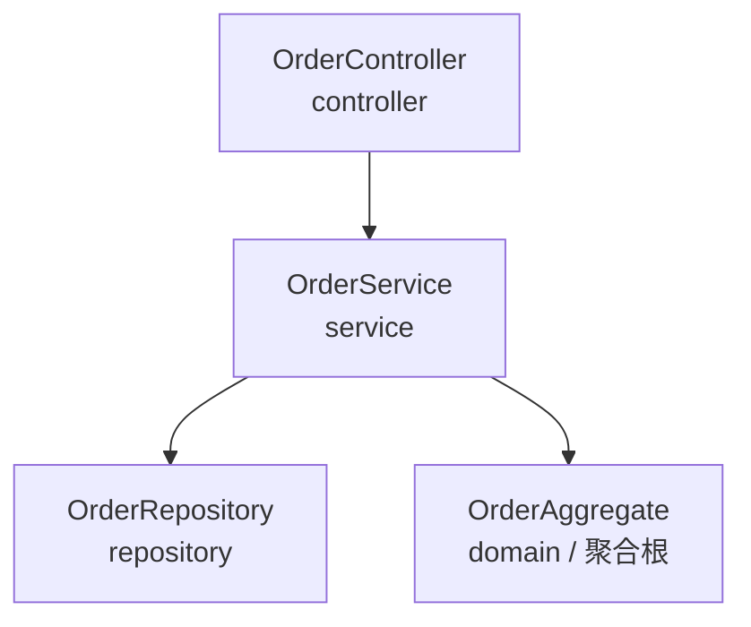
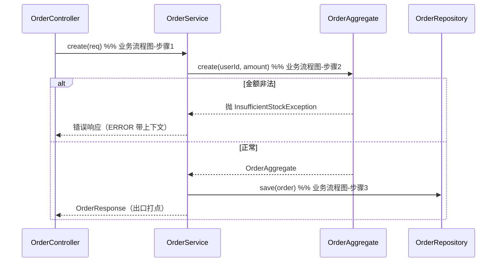

# 订单创建 — 架构文档

> 端到端示例（JVM 订单创建）。`design-contract.json` 的渲染，重点展示角色、职责、依赖与设计依据的写法。

## 一、模块结构图

分层与依赖方向（箭头指向被依赖方；依赖单向、指向稳定方）：

## 二、业务流程图

下单主流程 + 关键异常分支（步骤对齐契约 business_process）：

## 三、角色职责清单

| 角色 | 类型 | 层 | 领域角色 | 职责 | 依赖 | 业界做法依据 | 设计原则 |
|---|---|---|---|---|---|---|---|
| OrderController | 分层 | controller | — | 接收下单请求、校验入参、编排、组装响应 | OrderService | MVC Controller（@RestController） | SRP、DIP、separation_of_concerns |
| OrderService | 分层 | service | — | 用例编排：事务、协调聚合与仓库、异常处理 | OrderRepository、OrderAggregate | 应用服务（DDD）/ @Service | SRP、DIP、separation_of_concerns |
| OrderRepository | 分层 | repository | — | 持久化抽象：订单聚合存取（外部 DB） | — | Repository 模式（PoEAA）/ DDD | DIP、dependency_direction |
| OrderAggregate | 领域 | domain | 聚合根 | 封装下单不变量、对外唯一入口 | — | DDD 聚合根 | aggregate、high_cohesion_low_coupling、tell_dont_ask |

## 四、设计依据

每个角色/分层的划分理由 + 依据设计原则（可追溯）。

### OrderController
- 划分理由：HTTP 协议适配与用例编排分离，避免业务逻辑耦合协议层。
- 依据原则：**SRP**（单一职责：只做协议适配+编排）；**DIP**（构造注入 OrderService 抽象）；**separation_of_concerns**（协议/业务/持久化分离）。
- 业界来源：MVC Controller（Spring @RestController）。

### OrderService
- 划分理由：用例编排放应用服务层，划定事务边界、协调领域对象与仓库，跨流程异常统一处理。
- 依据原则：**SRP**（只做编排，不含协议/持久化细节）；**DIP**（依赖 OrderRepository 与 OrderAggregate，构造注入）。
- 业界来源：应用服务（DDD）/ Spring @Service 惯例。

### OrderRepository
- 划分理由：持久化抽象与业务隔离，接口属领域层、实现属基础设施层，便于替换与测试。
- 依据原则：**DIP**（上层依赖仓储抽象）；**dependency_direction**（依赖指向抽象/稳定方）。
- 业界来源：Repository 模式（PoEAA）/ DDD。

### OrderAggregate
- 划分理由：下单涉及金额一致性、合法性校验等强一致规则，应收进聚合根维护不变量、对外唯一入口，不贫血。
- 依据原则：**aggregate**（一致性边界）；**high_cohesion_low_coupling**（订单规则内聚）；**tell_dont_ask**（工厂方法封装校验，行为归对象）。
- 业界来源：DDD 聚合根。

## 五、关键接口契约（P1）

- `OrderController.createOrder(CreateOrderRequest) → OrderResponse`：HTTP 入口，委托 `OrderService.create`。
- `OrderService.create(CreateOrderRequest) → OrderResponse`：用例编排，调用 `OrderAggregate.create` 建聚合、`OrderRepository.save` 持久化。
- `OrderAggregate.create(userId, amount) → OrderAggregate`（静态工厂）：封装不变量校验，非法金额抛 `InsufficientStockException`。
- `OrderRepository.save(OrderAggregate)`：持久化聚合。

## 六、已知缺口

- 辅助校验为生成侧结构性自检 + LLM 语义自检混合，**做不到**评估侧（`arch-quality-eval`）AST/静态分析强度。「职责是否真单一」「ERROR 是否真带全上下文」属语义项，结构查不到，登记为缺口，不假装机器已验证。
- 本示例 fixture 仅含 4 个角色文件，未含 `CreateOrderRequest`/`OrderResponse`/`InsufficientStockException` 等支撑类型（示例聚焦角色架构，非可编译完整工程）。
