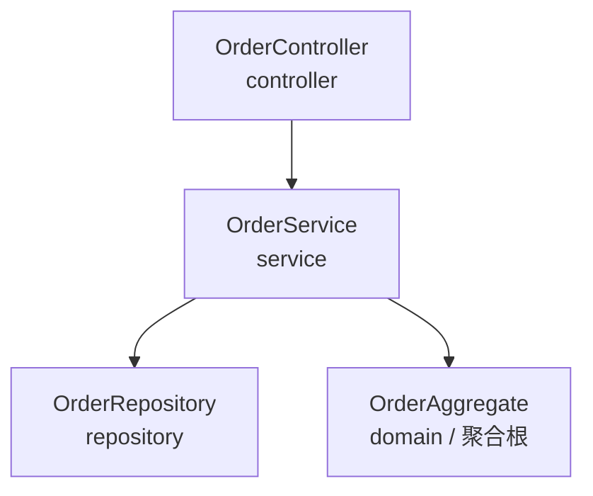
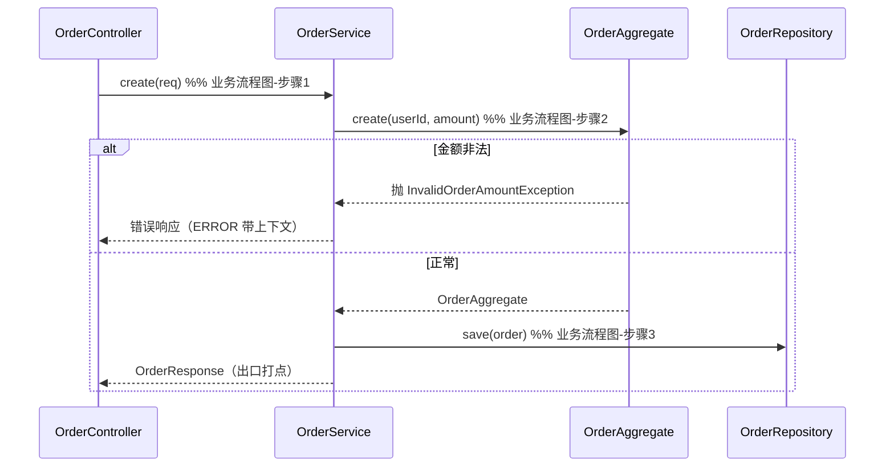

# 订单创建 — 架构文档

> 端到端示例（JVM 订单创建）。`design-contract.json` 的渲染，重点展示角色、职责、依赖与设计依据的写法。

## 零、用户确认记录

- 等级选择：用户明确选择 `standard`。
- 当前方案版本：`1`。
- 方案确认：完整方案展示后，用户在后续消息中确认 `ALT-1` 进入编码。

## 一、模块结构图

分层与依赖方向（箭头指向被依赖方；依赖单向、指向稳定方）：

```mermaid
flowchart TD
  C[OrderController<br/>controller] --> S[OrderService<br/>service]
  S --> R[OrderRepository<br/>repository]
  S --> A[OrderAggregate<br/>domain / 聚合根]
```

## 二、业务流程图

下单主流程 + 关键异常分支（步骤对齐契约 business_process）：

```mermaid
sequenceDiagram
  participant C as OrderController
  participant S as OrderService
  participant A as OrderAggregate
  participant R as OrderRepository
  C->>S: create(req) %% 业务流程图-步骤1
  S->>A: create(userId, amount) %% 业务流程图-步骤2
  alt 金额非法
    A-->>S: 抛 InvalidOrderAmountException
    S-->>C: 错误响应（ERROR 带上下文）
  else 正常
    A-->>S: OrderAggregate
    S->>R: save(order) %% 业务流程图-步骤3
    S-->>C: OrderResponse（出口打点）
  end
```

## 三、角色职责清单

| 角色 | 类型 | 层 | 职责 | 隐藏秘密 | 数据所有权 | 依赖 | 设计原则 |
|---|---|---|---|---|---|---|---|
| OrderController | 分层 | controller | 接收请求、校验并组装响应 | HTTP 校验、状态码与响应映射 | 无持久状态 | OrderService | SRP、DIP、information_hiding |
| OrderService | 分层 | service | 编排事务、聚合与仓储 | 下单顺序、事务与错误转换 | 单次调用临时状态 | OrderRepository、OrderAggregate | SRP、DIP、separation_of_concerns |
| OrderRepository | 分层 | repository | 抽象订单聚合存取 | 存储技术和映射细节 | 订单持久化记录 | — | DIP、dependency_direction、information_hiding |
| OrderAggregate | 领域 | domain | 封装不变量和合法状态转换 | 订单一致性规则 | 订单领域状态 | — | aggregate、high_cohesion_low_coupling、tell_dont_ask |

## 四、质量属性与方案取舍

设计强度：`standard`。

- 高优先级 maintainability：金额规则或持久化变化不应波及协议层；验收为规则只影响聚合、存储变化只影响仓储实现。
- 高优先级 testability：不启动 Web/DB 即可验证金额不变量；验收为聚合规则可纯单元验证。

候选方案：

- `ALT-1`：Controller + Application Service + Repository + Order Aggregate。优势是规则集中、边界可替换；代价是增加一个领域边界；风险是 Service 与 Aggregate 职责重叠。
- `ALT-2`：Controller + CRUD Service + Repository，金额规则放 Service。优势是初始文件少；缺点是规则和编排混合；风险是贫血模型和大型 Service。

选择 `ALT-1`：它满足高优先级维护性和可测试性，同时沿用现有三层结构。自顶向下检查识别出协议、编排、一致性和持久化四类变化；自底向上检查确认现有构造注入和包结构可直接承载。独立复核结论为 accepted，无阻断。

## 五、设计依据

每个角色/分层的划分理由 + 依据设计原则（可追溯）。

### OrderController
- 划分理由：HTTP 协议适配与用例编排分离，避免业务逻辑耦合协议层。
- 隐藏秘密：HTTP 请求校验、状态码和响应映射；这些变化应局限于 Controller。
- 依据原则：**SRP**、**DIP**、**information_hiding**。
- 业界来源：MVC Controller（Spring @RestController）。

### OrderService
- 划分理由：用例编排放应用服务层，划定事务边界、协调领域对象与仓库，跨流程异常统一处理。
- 依据原则：**SRP**（只做编排，不含协议/持久化细节）；**DIP**（依赖 OrderRepository 与 OrderAggregate，构造注入）。
- 业界来源：应用服务（DDD）/ Spring @Service 惯例。
- 隐藏秘密：下单步骤、事务边界和错误转换。

### OrderRepository
- 划分理由：持久化抽象与业务隔离，接口属领域层、实现属基础设施层，便于替换与测试。
- 依据原则：**DIP**（上层依赖仓储抽象）；**dependency_direction**（依赖指向抽象/稳定方）。
- 业界来源：Repository 模式（PoEAA）/ DDD。
- 隐藏秘密：数据库、ORM 与领域对象映射。

### OrderAggregate
- 划分理由：下单涉及金额一致性、合法性校验等强一致规则，应收进聚合根维护不变量、对外唯一入口，不贫血。
- 依据原则：**aggregate**（一致性边界）；**high_cohesion_low_coupling**（订单规则内聚）；**tell_dont_ask**（工厂方法封装校验，行为归对象）。
- 业界来源：DDD 聚合根。
- 隐藏秘密：订单一致性规则和合法状态转换。

## 六、关键接口契约（P0）

- `OrderService.create`
  - 输入：已完成结构校验的 `CreateOrderRequest`；输出：已持久化订单的 `OrderResponse`。
  - 前置条件：请求结构合法；后置条件：成功时订单已保存，失败时返回稳定错误。
  - 不变量：金额大于零、单次调用只创建一个聚合。
  - 错误：`InvalidOrderAmountException` 转 400；仓储错误转 503 并保留原因。
  - 数据所有权：聚合拥有领域状态；事务：保存处于调用方事务；并发：Service 无共享可变状态。
- `OrderAggregate.create`
  - 输入：`userId` 与 `amount`；输出：有效 `OrderAggregate`。
  - 前置条件：userId 非空；后置条件：返回聚合金额大于零；不变量：金额始终大于零。
  - 错误：非法金额抛 `InvalidOrderAmountException`，不创建聚合。
  - 数据所有权：聚合拥有订单值；事务：不适用；并发：创建过程无共享状态。
- `OrderRepository.save`
  - 输入：有效聚合；输出：成功即已持久化。
  - 前置条件：聚合满足不变量；后置条件：可按 id 读取同一状态；不变量：存储不改变领域值。
  - 错误：存储失败抛 `RepositoryException`；数据所有权：仓储管理记录；事务：参与调用方事务；并发：同 id 策略由实现保证。

## 七、验证证据

- `passed`：`validate_gate.py ... --root . --strict`，结果为四道门 go；证据为命令 stdout。
- `passed`：fixture 通过 `javac` 编译并运行 `OrderAggregateTest`。
- `passed`：金额大于零不变量，`new_test`，证据 `OrderAggregateTest.java`。
- `passed`：流程、接口和文档引用一致，`static_check`，证据 `validate_gate --strict`。
- 未验证项：无。

## 八、已知缺口

- 辅助校验为生成侧结构性自检 + LLM 语义自检混合，**做不到**评估侧（`arch-quality-eval`）AST/静态分析强度。「职责是否真单一」「ERROR 是否真带全上下文」属语义项，结构查不到，登记为缺口，不假装机器已验证。
- 本示例 fixture 聚焦架构校验和领域不变量，不模拟 Spring 容器或真实数据库；影响是不能证明框架装配，后续阶段由产品仓库集成测试覆盖。
