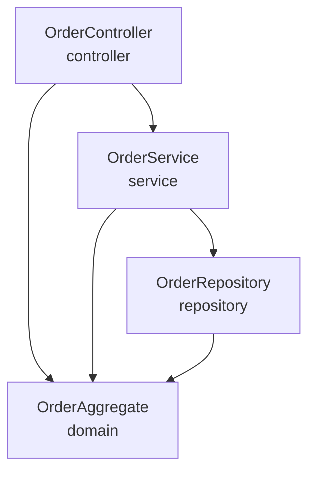
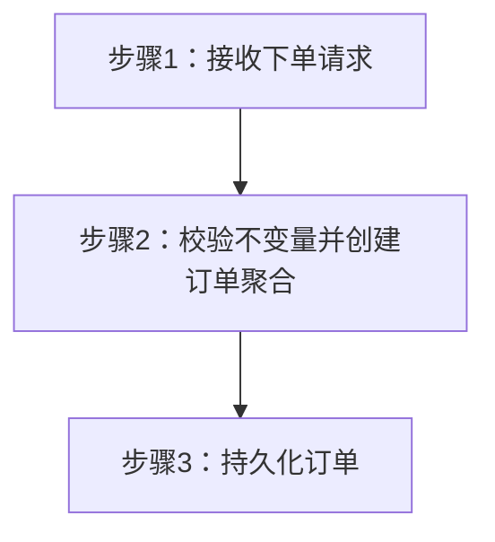

# 订单创建 架构文档

## 零、用户确认记录

- 等级：用户选择 `standard`；证据：用户明确回复：使用 standard 等级。
- 方案版本：`1`。
- 确认：用户在方案展示后的后续消息中确认 `ALT-1`；证据：完整方案展示后的用户回复：确认，按 ALT-1 进入编码。
- 主指导：Code Complete, Second Edition；执行优先级：functional_correctness、context_savings、speed、token_savings。

## 一、模块结构图

```mermaid
flowchart TD
  ROLE_L01["OrderController<br/>controller"]
  ROLE_L02["OrderService<br/>service"]
  ROLE_L03["OrderRepository<br/>repository"]
  ROLE_D01["OrderAggregate<br/>domain"]
  ROLE_L01 --> ROLE_L02
  ROLE_L01 --> ROLE_D01
  ROLE_L02 --> ROLE_L03
  ROLE_L02 --> ROLE_D01
  ROLE_L03 --> ROLE_D01
```

## 二、业务流程图

```mermaid
flowchart TD
  P1["步骤1：接收下单请求"]
  P2["步骤2：校验不变量并创建订单聚合"]
  P3["步骤3：持久化订单"]
  P1 --> P2
  P2 --> P3
```

- 业务流程图-步骤1：接收下单请求；异常分支：无。
- 业务流程图-步骤2：校验不变量并创建订单聚合；异常分支：金额非法 → 抛 InvalidOrderAmountException。
- 业务流程图-步骤3：持久化订单；异常分支：无。

## 三、角色职责清单

| 角色 | 类型 | 层 | 职责 | 隐藏秘密 | 数据所有权 | 依赖 | 设计原则 |
|---|---|---|---|---|---|---|---|
| OrderController | layer | controller | 接收创建订单 HTTP 请求、校验入参、编排下单流程、组装响应 | HTTP 请求校验、状态码和响应映射 | 无持久状态 | OrderService、OrderAggregate | cc_information_hiding、cc_loose_coupling、SRP、DIP |
| OrderService | layer | service | 用例编排：事务边界、协调订单聚合与仓库、跨流程异常处理 | 下单用例顺序、事务和错误转换 | 仅持有一次调用的临时流程状态 | OrderRepository、OrderAggregate | cc_manage_complexity、cc_strong_cohesion、SRP、DIP |
| OrderRepository | layer | repository | 持久化抽象：订单聚合的存取（外部 DB 调用） | 订单存储技术和映射细节 | 订单持久化记录 | OrderAggregate | cc_information_hiding、cc_loose_coupling、DIP、dependency_direction |
| OrderAggregate | domain | domain | 封装订单聚合根，维护下单不变量（金额一致性、合法性校验），对外唯一入口 | 订单一致性规则和合法状态转换 | 订单标识、用户标识、金额和领域状态 | — | cc_class_contract、cc_strong_cohesion、aggregate、tell_dont_ask |

## 四、质量属性与方案取舍

- **maintainability (high)**：场景：金额规则或持久化方式变化时，协议层不需要同步修改；验收：金额规则只影响聚合；持久化变化只影响仓储实现。
- **testability (high)**：场景：不启动 Web/DB 即可验证订单金额不变量；验收：聚合规则可通过纯单元测试验证。

- 候选 `ALT-1`：Controller + Application Service + Repository + Order Aggregate。优点：领域不变量集中；协议与持久化可替换；角色可独立验证；代价：比直接 CRUD 多一个领域边界；风险：应用服务与聚合职责可能重叠。
- 候选 `ALT-2`：Controller + CRUD Service + Repository，金额规则放 Service。优点：文件数量少；初始实现直接；代价：金额规则与用例编排混合；规则变化会扩大 Service；风险：形成贫血模型和大型 Service。

- 选择 `ALT-1`：ALT-1 更符合高优先级可维护性和可测试性场景，并沿用仓库现有三层结构；增加聚合的成本由明确不变量抵消。
- 自顶向下检查：下单流程需要协议适配、用例编排、一致性规则和持久化四类变化边界。
- 自底向上检查：现有 Spring 构造注入、包结构和 Repository 约定可以直接承载 ALT-1。

## 五、设计依据

### OrderController

- 划分理由：接收创建订单 HTTP 请求、校验入参、编排下单流程、组装响应；隐藏 HTTP 请求校验、状态码和响应映射。
- 依据原则：cc_information_hiding、cc_loose_coupling、SRP、DIP。
- 业界来源：MVC Controller（Spring @RestController，只做协议适配与编排）。
- 变化触发器：HTTP 协议或响应格式变化。

### OrderService

- 划分理由：用例编排：事务边界、协调订单聚合与仓库、跨流程异常处理；隐藏 下单用例顺序、事务和错误转换。
- 依据原则：cc_manage_complexity、cc_strong_cohesion、SRP、DIP。
- 业界来源：应用服务（DDD）/ Spring @Service 惯例。
- 变化触发器：下单流程、事务或错误映射变化。

### OrderRepository

- 划分理由：持久化抽象：订单聚合的存取（外部 DB 调用）；隐藏 订单存储技术和映射细节。
- 依据原则：cc_information_hiding、cc_loose_coupling、DIP、dependency_direction。
- 业界来源：Repository 模式（PoEAA）/ DDD，接口属领域层、实现属基础设施层。
- 变化触发器：数据库、ORM 或持久化映射变化。

### OrderAggregate

- 划分理由：封装订单聚合根，维护下单不变量（金额一致性、合法性校验），对外唯一入口；隐藏 订单一致性规则和合法状态转换。
- 依据原则：cc_class_contract、cc_strong_cohesion、aggregate、tell_dont_ask。
- 业界来源：DDD 聚合根，一致性边界内封装业务规则、不贫血。
- 变化触发器：订单金额规则或状态不变量变化。

## 六、关键接口契约

### OrderService.create

- Provider：`ROLE-L02`；Consumers：ROLE-L01。
- 输入：CreateOrderRequest：用户标识与正金额。
- 输出：OrderResponse：已持久化订单标识与金额。
- 前置条件：请求已完成协议层结构校验。
- 后置条件：成功时订单已持久化；失败时返回稳定业务错误。
- 不变量：金额必须大于零；同一次调用只创建一个聚合。
- 错误：InvalidOrderAmountException 转换为 400；RepositoryException 转换为 503 并保留原因。
- 数据所有权：Service 仅传递请求数据；OrderAggregate 拥有领域状态。
- 事务：save 在单个应用事务内；示例不含外部副作用；并发/取消：Service 无共享可变状态；重复请求策略不在本示例范围。

### OrderAggregate.create

- Provider：`ROLE-D01`；Consumers：ROLE-L02。
- 输入：userId 与 amount。
- 输出：满足不变量的新 OrderAggregate。
- 前置条件：userId 非空。
- 后置条件：返回聚合金额大于零。
- 不变量：金额始终大于零。
- 错误：金额非法时抛 InvalidOrderAmountException，聚合不创建。
- 数据所有权：聚合拥有订单标识、用户标识和金额。
- 事务：not_applicable；并发/取消：聚合创建过程无共享可变状态。

### OrderRepository.save

- Provider：`ROLE-L03`；Consumers：ROLE-L02。
- 输入：有效 OrderAggregate。
- 输出：void；成功即已持久化。
- 前置条件：聚合满足领域不变量。
- 后置条件：后续按 id 可读取同一订单状态。
- 不变量：持久化不得改变领域值。
- 错误：存储失败抛 RepositoryException 并保留原因。
- 数据所有权：仓储管理持久化记录；聚合仍拥有领域语义。
- 事务：参与 OrderService.create 的调用方事务；并发/取消：同 id 更新策略由仓储实现保证。

## 七、验证证据

- 命令 `VCMD-1` / `python3 skills/arch-first-code-gen/scripts/test_validate_gate_core.py ExampleFixtureTests.test_example_fixture_compiles`：`passed`；exit=0；耗时=495ms；执行时间=2026-08-21T01:19:48.014692Z。输入=skills/arch-first-code-gen/examples/fixtures/order-create/src、skills/arch-first-code-gen/scripts/test_validate_gate_core.py；inputs_sha256=0c42955bcfd8ba0551eaae2a5f65139e08854c0ba2851e304167e86d5f656aaf。
- 检查 金额大于零不变量：`passed`；方法：new_test；证据：machine-executed: VCMD-1；测试引用：skills/arch-first-code-gen/examples/fixtures/order-create/src/test/java/com/x/order/OrderAggregateTest.java:main。

### 验收追踪

- `TRACE-1`：金额规则只影响聚合；持久化变化只影响仓储实现；角色=ROLE-L03、ROLE-D01；接口=IFC-2、IFC-3；测试=skills/arch-first-code-gen/examples/fixtures/order-create/src/test/java/com/x/order/OrderAggregateTest.java:main；命令=VCMD-1。
- `TRACE-2`：聚合规则可通过纯单元测试验证；角色=ROLE-D01；接口=IFC-2；测试=skills/arch-first-code-gen/examples/fixtures/order-create/src/test/java/com/x/order/OrderAggregateTest.java:main；命令=VCMD-1。

## 八、原则复核

- 生成侧结构性自检（角色↔文件存在、按栈日志关键字覆盖、流程↔代码↔文档对账 + 契约↔文档角色一致）+ LLM 语义自检混合。语义项（职责是否真单一、ERROR 是否真带全上下文）结构查不到，登记为已知缺口，不假装机器已验证。
- `cc_class_contract`：`passed`；证据/理由：OrderAggregate.create 保证正金额，构造后对象合法。
- `cc_routine_quality`：`passed`；证据/理由：create/createOrder/save 各自只有一个目的。
- `cc_defensive_programming`：`passed`；证据/理由：协议层与聚合边界分别校验结构和领域不变量。
- `cc_pseudocode_programming_process`：`not_applicable`；证据/理由：示例例程均为短直线流程，无复杂例程。
- `cc_minimize_variable_scope`：`passed`；证据/理由：临时值均在首次使用附近声明。
- `cc_one_variable_one_purpose`：`passed`；证据/理由：请求、聚合与持久化变量未复用含义。
- `cc_simple_control_flow`：`passed`；证据/理由：正常路径为校验、创建、保存，无深层嵌套。
- `cc_design_for_test`：`passed`；证据/理由：聚合不依赖 Web 或 DB，可直接执行测试。
- `cc_refactor_safely`：`passed`；证据/理由：VCMD-1 重新编译 fixture 并运行相关测试。
