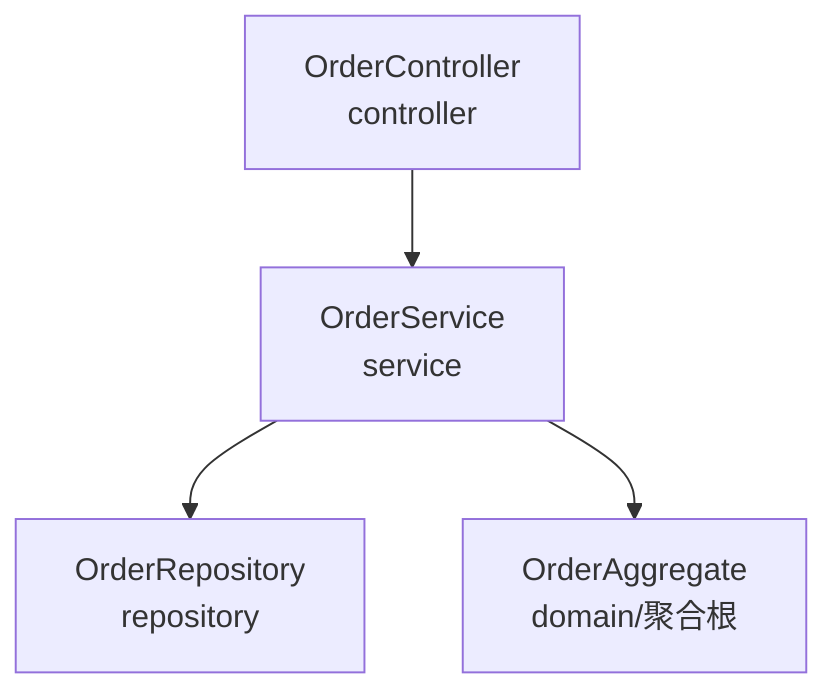
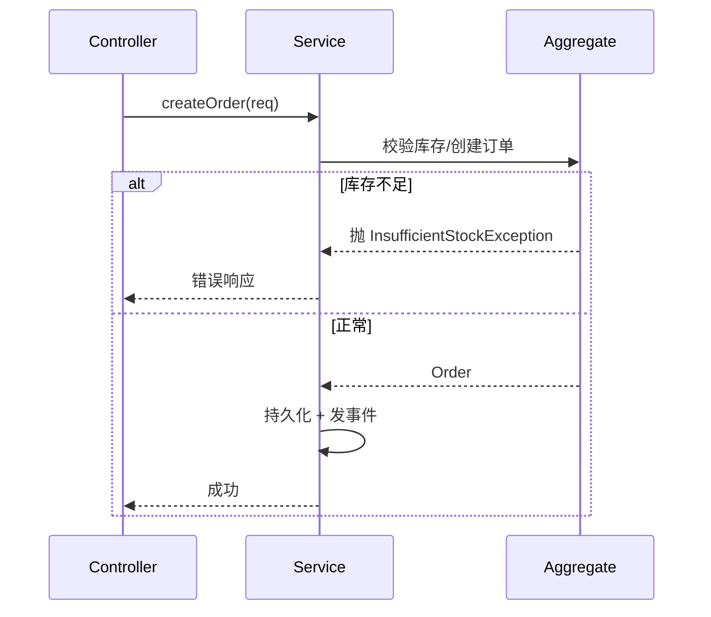

# 架构文档模板（模块 D）

> 配合 `arch-first-code-gen` 的 Checklist 第 6/8 步。编码后**统一生成**架构文档 `<feature>-arch.md`，是 `design-contract.json` 的人读渲染 + mermaid 图。`validate_doc.py` 可辅助校验格式与覆盖；文档核心仍是把角色划分、职责边界与设计原则讲清楚。
>
> 顺序：先写 `design-contract.json`（契约源）→ 再渲染本文档（渲染）→ 两者必须一致（`validate_gate.py` 可辅助对账）。

## 一、文档结构（必含章节）

```markdown
---
feature: order-create
title: 订单创建 — 架构文档
stack: JVM
analyzed_at: 2026-06-28
roles_count: 4
process_steps: 2
verdict: go
open_questions: 0
---

# <title> 架构文档

## 一、模块结构图
（mermaid 图：分层/模块结构与依赖方向）

## 二、业务流程图
（mermaid 图：sequence 或 flowchart，覆盖主流程 + 关键异常分支）

## 三、角色职责清单
（表格：角色 / 类型 / 层 / 领域角色 / 职责 / 依赖 / 业界做法依据 / 设计原则）

## 四、设计依据
（每个角色/分层：为什么这么划、依据什么设计原则 —— 可追溯）

## 五、关键接口契约（P1）
（角色间关键调用点 / 接口约定 —— 按需求取舍）

## 六、已知缺口 / 未决
（辅助校验未覆盖的语义项、C++ 能力受限、待定问题 + 影响 + 后续阶段）
```

## 二、frontmatter 必填（`validate_doc.py` R-F 校验）

| 字段 | 说明 |
|---|---|
| `feature` | kebab-case feature 名 |
| `title` | 人读标题 |
| `stack` | JVM / C++ / FastAPI+Vue |
| `analyzed_at` | YYYY-MM-DD |
| `roles_count` | = 契约 roles.length |
| `process_steps` | = 契约 business_process.length |
| `verdict` | go / no-go（= 契约 gate.verdict） |
| `open_questions` | 已知缺口条数（正文 ⚠ / 未决数量） |

## 三、模块结构图（mermaid — R-S 校验「结构图」）

用 `flowchart` 画分层与依赖方向，节点是角色/模块，箭头是依赖（指向被依赖方）。**图与代码结构一致**。



> 结构性检查：依赖方向单向（与契约 depends_on 一致）；若有反向/循环，辅助校验可告警，但最终要按 DIP/dependency_direction 判断。

## 四、业务流程图（mermaid — R-F 校验「流程图」）

用 `sequenceDiagram`（跨角色时序）或 `flowchart`（含分支）。**覆盖主流程 + 关键异常分支**。每个步骤对应契约 `business_process[]` 的一步（doc_ref 对齐）。



## 五、角色职责清单（表格 — R-R 校验覆盖）

每个角色一行，与契约 `roles[]` 一致：

| 角色 | 类型 | 层 | 领域角色 | 职责 | 依赖 | 业界做法依据 | 设计原则 |
|---|---|---|---|---|---|---|---|
| OrderController | 分层 | controller | — | 接收下单请求、校验入参、编排 | OrderService | MVC Controller（@RestController） | SRP、DIP |
| OrderAggregate | 领域 | domain | 聚合根 | 封装订单不变量 | — | DDD 聚合根 | aggregate、high_cohesion_low_coupling |

> **覆盖辅助校验**：文档角色表的角色集合 == 契约 roles 的 name 集合（脚本对账）。

## 六、设计依据（R-D 校验每角色有点）

每个角色/分层写「**为什么这么划分职责、依据什么设计原则**」——这是 PRD 模块 D P0「设计依据」的核心，让设计可追溯。

```markdown
### OrderController
- 划分理由：HTTP 协议适配与用例编排分离，避免业务逻辑耦合协议层。
- 依据原则：SRP（单一职责：只做协议适配+编排）；DIP（依赖 OrderService 抽象而非具体实现）。
- 业界来源：MVC Controller（Spring @RestController）。

### OrderAggregate
- 划分理由：下单涉及库存校验、金额一致性等强一致规则，应收进聚合根维护不变量。
- 依据原则：aggregate（一致性边界）；high_cohesion_low_coupling（订单规则内聚）。
- 业界来源：DDD 聚合根。
```

> **反模式**：写「符合 SOLID」「设计良好」。要具体到「SRP：只做 X」「依据 aggregate 原则」。

## 七、关键接口契约（P1 — 按需求取舍）

列角色间关键调用点（方法签名/请求响应约定）。简单 CRUD 可省略或简化；复杂交互必含。

## 八、已知缺口 / 未决（R-U 校验）

诚实登记：辅助校验未覆盖的语义项（职责是否真单一）、C++ 能力受限、待定问题（问题 + 影响 + 后续阶段）。frontmatter `open_questions` 与正文 ⚠ / 未决数量一致。

## 九、banned 词（R-B 校验，0 命中）

正文不得含：`体验好`/`功能完善`/`功能强大`/`适当处理`/`待定`/`待补`/`后续再说`/`良好体验`/`非常重要`/`很关键`/`等等`/`TBD`/`TODO`。真实未决写「问题 + 影响 + 后续阶段」。
