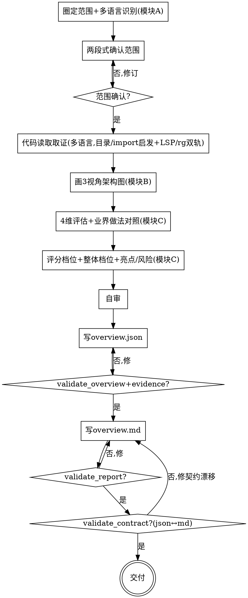

# 架构总览：看懂架构 + 判断整体设计（画图 + 正向总评）

## 目的

针对**一个模块或一个 app**（每次由用户指定范围档位），先**画出其架构**（分层/模块依赖、C4 Container/Component、运行时/数据流三个视角的 Mermaid 图），再从**正向设计视角**用 4 维 rubric 评估其**整体优秀度**（每个维度对照业界成熟做法），产出一份「**看懂这个架构 + 判断其整体设计如何**」的架构总览报告，帮接手者/评审者快速建立架构认知与设计判断。

只回答两个问题：**这个模块/app 架构长什么样**（图）+ **它的整体设计好不好**（正向总评，带业界对照）。**不回答**「坏味道逐条在哪」「要不要重构」「该重构成什么样」——那是 `arch-quality-eval` 的定位。

```
一个模块或 app 的代码路径 ──► [arch-overview] ──► 架构总览报告（overview.json + overview.md，过四道门）
                                  │
                                  ├─ 3 视角 Mermaid 架构图（带证据回链）
                                  └─ 4 维正向总评（现状 + 业界做法对照 + 分维度档位 + 整体档位 + 亮点/风险）
```

三个核心特征：

1. **理解呈现先行** —— 先画图把架构呈现出来（3 视角），再看懂、再评判；图节点/边都回链代码证据，**禁止编造节点**。
2. **正向总评 + 业界对照** —— 4 个维度做正向评估（优/良/中/差），每维对照**业界成熟做法**作为标杆；业界做法为 LLM 内置经验，标「未核对」+ 附延伸阅读方向，**不联网**。
3. **范围由用户指定** —— 模块级或 app/服务级，每次用户选；多语言通用，精度按语言诚实标注。

<HARD-GATE>
在范围（**范围档位 module/app + 根路径 + 覆盖文件集合 + 识别到的多语言技术栈 + 各语言精度 + 一句话架构职责**）被用户确认前，不进入任何画图或评估动作（不读依赖图、不画图、不定档、不写报告）。
`overview.json` 与 `overview.md` **过四道门**（`validate_overview.py` / `validate_evidence.py` / `validate_report.py` / `validate_contract.py`）之前，**不交付**。本 skill 自己产出报告，不调用任何其他 skill。
</HARD-GATE>

## 反模式：照念类名/注释当结论，或把现状当「应有架构」

`OrderService` 不一定是设计良好（也许职责混杂）；注释写「这是分层架构」不代表层没穿透。照念符号/注释当结论、或从代码现状反推「应该这样架构」当标准，是这类总览最常见的失真。每个图节点/边、每条评估结论都要追到真实依赖边/结构事实并回链 `file:line`；推断标 `⚠ 未确认`。

## 边界（最重要）

**产出**（总览报告，模块 B/C/D）：
- 评估范围（覆盖文件集合、范围档位、多语言技术栈 + 各语言精度、一句话架构职责）
- 3 视角架构图（分层/模块依赖、C4 Container/Component、运行时/数据流，Mermaid，节点/边回链证据）
- 4 维正向总评（分层&依赖方向 / 职责内聚&边界 / 可扩展性&可变性 / 可读性&命名表意）
- 业界成熟做法对照（每维度：做法是什么 / 适用前提 / 现状与标杆差距 / provenance + 未核对 / 延伸阅读方向）
- 分维度档位（优/良/中/差）+ 整体档位 + 亮点 + 风险点
- 评估方法与已知缺口（含多语言精度受限、视角不适用声明）

**不产出**（超出范围，记入「已知缺口」即可）：
- ❌ **架构坏味道逐条诊断/分级**：不输出 critical/major/minor 坏味道清单、不下 go/no-go（那是 `arch-quality-eval`）。本 skill 的「风险点」是**总览级、前瞻性、描述性**的，不分级、不下重构决策。
- ❌ **完整重构方案/迁移步骤/目标架构**：只指亮点与风险方向，不画目标架构、不写迁移（那是重构阶段的事）。
- ❌ **部署/运维拓扑视图**：不画部署图、基础设施/云资源拓扑。
- ❌ **联网核实业界做法**：业界做法为 LLM 内置经验 + 延伸阅读方向，声明未核对，不主动联网。
- ❌ **模块化度量**：LCOM/扇出/不稳定性等纯数值不当判定依据，只当线索。
- ❌ **独立 SOLID 逐条合规**：设计原理通过维度评价 + 业界对照间接体现。
- ❌ **全 repo 批量巡检**：单次分析一个用户指定范围。
- ❌ **CI PR 自动卡关 / 主动改代码**。

**越界拉回**：当对话滑向「帮我找坏味道」「这个该不该重构」「画部署图」「联网查业界最佳实践权威出处」时，明确说「这超出架构总览范围，只给 3 视角图 + 4 维正向总评 + 业界对照」，坏味道深挖指向 `arch-quality-eval`，记一笔到「已知缺口」。

## Checklist

为以下每项创建一个 task，按序完成：

1. **圈定范围 + 多语言识别（模块 A）** —— 接受用户指定的根路径 + **范围档位（module / app）**，枚举覆盖文件集合（`rg --files`/`find`，剔除 build/test 产物除非用户明确含），识别多语言技术栈（按后缀 + 内容判定），标注各语言结构/依赖分析精度。加载 `references/scope-and-boundary.md`。
2. **两段式确认（HARD-GATE）** —— 把 范围档位 + 根路径 + 覆盖文件集合 + 识别到的技术栈 + 各语言精度 + 一句话架构职责 呈现给用户确认。**未确认不进下一步**。最大风险是「圈错范围 / 拉入无关代码或漏关键模块」，这一步专门拦它。
3. **代码读取取证（图与评估的证据来源）** —— 在确认后的边界内，按 `references/analysis-protocol.md` 取证：多语言目录/import 启发 + LSP/rg 双轨（先检测→可用则用足→不可用默认 rg 降级并报告标注），热点优先聚焦大范围，五类事实（模块/层结构、依赖边、职责规模、可见性、运行时入口），精度按语言标注，防臆造。加载 `references/analysis-protocol.md`。
4. **定义 3 视角结构化图（模块 B）** —— 按 `references/architecture-diagrams.md` 定义 ① 分层/模块依赖的 groups/nodes/edges ② C4 的 nodes/edges ③ 运行时的 participants/flows，每项回链证据；**禁止手写或在 JSON 保存 Mermaid**。某视角不适用时显式声明原因。加载 `references/architecture-diagrams.md`。
5. **4 维正向评估 + 业界做法对照（模块 C）** —— 按 `references/evaluation-rubric.md` 逐维评估现状（分层&依赖方向 / 职责内聚&边界 / 可扩展性&可变性 / 可读性&命名表意），每维对照**业界成熟做法**（内置经验：做法是什么 / 适用前提 / 与现状差距 / provenance + 未核对 / 延伸阅读方向）。加载 `references/evaluation-rubric.md`。
6. **评分档位 + 整体档位 + 亮点/风险（模块 C）** —— 按 `references/scoring-and-grading.md` 给每维 优/良/中/差（客观依据）+ 汇总整体档位（可解释，非简单平均）+ 亮点（设计得当）/ 风险点（总览级前瞻性，不分级、不下 go/no-go）。加载 `references/scoring-and-grading.md`。
7. **自审** —— 证据回链 / 档位可解释 / 业界对照 provenance + 未核对 / 3 视角适用性显式 / 未确认隔离 逐项过（详见 `references/scoring-and-grading.md §四`）。发现问题就地修。
8. **写 `overview.json` → 跑 `validate_overview.py` + `validate_evidence.py`** —— 按 schema 写图的结构化定义 + 评估契约；图中不得出现 `mermaid` 字段。运行两个校验器，通过才进下一步。
9. **生成 Mermaid 并写 `overview.md` → 跑 `validate_report.py`** —— 运行 `scripts/render_mermaid.py <overview.json> --format markdown`，把各适用视角的生成块原样放入对应章节，不得手改；再写其余人读内容并运行报告校验。
10. **契约对账 + 交付** —— 跑 `scripts/validate_contract.py <overview.json> <overview.md>`（机器校验 json↔md 一致：整体档位、维度档位、covered_files、languages、scope_level、highlights/risks id 无悬空）。通过即交付；提示用户报告是架构总览，坏味道深挖/重构方案留 `arch-quality-eval` 或后续。

## 流程图



**终态是「交付」：overview.json + overview.md 四道门全过、契约一致即完成。** 本 skill 不预设、不调用任何后续 skill。

## 自审检查项（Checklist 第 7 步展开）

档位写完后用新视角过一遍：

1. **回链完整性** —— 每个图节点/边、每条维度结论、每个亮点/风险是否挂 `file:line` / 包 / 模块 / 依赖边？找不到的标 `⚠ 未确认` 并登记「已知缺口」，不混进正文当事实。
2. **档位可解释** —— 每个维度档位（优/良/中/差）能用客观依据说清（现状事实 + 与业界做法的差距），不是「感觉像优」。整体档位与各维度可解释地一致。
3. **业界对照 provenance** —— 每条业界做法是否声明 provenance（LLM 内置经验）+ 核对状态（未核对）+ 至少一个延伸阅读方向？没有假装是「权威结论」。
4. **3 视角适用性显式** —— 每个视角要么有图，要么显式声明「不适用/信息不足」+ 原因，不静默省略。
5. **风险点不越界** —— 风险点是总览级、前瞻性、描述性的，**未分级 critical/major/minor、未下 go/no-go、未给重构方案**（否则越界成 `arch-quality-eval`）。
6. **多语言精度诚实** —— 各语言精度差异是否标注？低精度语言的结论是否保守并登记缺口？
7. **没混 lint/没编造** —— 评估只评架构层（结构/职责/依赖/分层），无缩进/命名格式/import 顺序类评判；无编造证据。

发现问题就地修，修完重跑四道门。

## 产出位置

存到 `docs/arch-overview/`，共享 `<日期>-<目标名>` 前缀（目标名用 kebab-case，日期用当天）：

- `YYYY-MM-DD-<目标名>-overview.json` —— **机器契约源**（唯一事实源）：3 视角图结构化定义 + 4 维评估 + 业界对照 + 亮点/风险 + provenance
- `YYYY-MM-DD-<目标名>-overview.md` —— **人读总览报告**：overview.json 的渲染，frontmatter + 3 视角 Mermaid 图 + 4 维总评 + 业界对照 + 整体档位 + 亮点/风险 + 缺口

json 是给校验器读的契约源，md 是给人读的渲染，**两者必须一致**（`validate_contract.py` 对账）。交付前各自跑校验脚本且合格。校验脚本在本 skill 的 `scripts/` 目录（与 SKILL.md 同级）——**不要假设当前目录是仓库根**：作为 corin 插件加载时路径为 `${CLAUDE_PLUGIN_ROOT}/skills/arch-overview/scripts/`，否则按本 SKILL.md 所在目录拼出同级 `scripts/` 的绝对路径再运行。证据校验需要仓库根路径，默认用当前目录，也可显式传 `--root <repo-root>`。

```bash
V="${CLAUDE_PLUGIN_ROOT}/skills/arch-overview/scripts"   # 非插件：用本 SKILL.md 同级 scripts/ 的绝对路径
python3 "$V/validate_overview.py"  <overview.json>
python3 "$V/validate_evidence.py"  <overview.json> --root <repo-root>
python3 "$V/render_mermaid.py"     <overview.json> --format markdown
python3 "$V/validate_report.py"    <overview.md>
python3 "$V/validate_contract.py"  <overview.json> <overview.md>
```

## 关键原则

- **范围先定** —— 动手前确认范围（档位/路径/覆盖集合/技术栈/精度/职责）；范围未确认不画图不评估。
- **理解呈现先行** —— 先画图看懂架构，再正向总评；图是认知工具，不是装饰。
- **证据驱动，禁止编造** —— 每个图节点/边、每条评估结论回链 `file:line`；找不到的标 `⚠ 未确认` + 登记缺口，绝不混进正文当事实。
- **结构化图是唯一图源** —— JSON 只保存 groups/nodes/edges/participants/flows；Mermaid 一律由脚本生成，契约门逐块对账。
- **正向总评 + 业界对照** —— 4 维做正向评估；每维对照业界成熟做法立标杆，让「优秀与否」有参照。
- **业界做法诚实标注** —— 内置经验 + 未核对 + 延伸阅读方向，**不联网、不假装权威**。
- **档位可解释** —— 优/良/中/差 每档带客观依据（现状事实 + 与业界差距），整体档位可解释地汇总，非主观打分。
- **风险点不越界** —— 总览级前瞻性描述，不分级、不下 go/no-go、不给重构方案（那是 `arch-quality-eval`）。
- **多语言精度诚实** —— 精度因语言而异，结论按语言保守，登记缺口；不照搬单语言精度下结论。
- **3 视角适用性显式** —— 默认全画；确不适用则显式声明原因，不静默省略。
- **可回头** —— 任何时候回到任何一步修订，修完重校验。

## 反模式

| 反模式 | 正确做法 |
|--------|----------|
| 照念类名/注释/路由名当结论 | 追真实依赖边/结构事实，回链 `file:line` |
| 跳过两段式确认直接画图评估 | 范围确认前禁止画图与产出 |
| 把现状当「应有架构」反推标准 | 只判现状 + 对照业界成熟做法 |
| 风险点分级成 critical/major/minor 或下 go/no-go | 风险点总览级前瞻性描述，不分级（那是 arch-quality-eval） |
| 业界做法假装权威/不标未核对 | 声明 provenance（内置经验）+ 未核对 + 延伸阅读方向 |
| 联网查业界做法权威出处 | 不联网；内置经验 + 延伸阅读方向供用户自行核实 |
| 混入 lint/代码风格（缩进/命名格式/import 顺序） | 评估只评架构层（结构/职责/依赖/分层） |
| 某视角不画也不说（静默省略） | 显式声明「不适用/信息不足」+ 原因 |
| 低精度语言照搬高精度下结论 | 按语言精度保守，登记缺口 |
| 给完整重构方案/迁移步骤 | 只指亮点与风险方向，方案留重构阶段 |
| 无证据定档 / 编造 file:line | 找不到依据标 `⚠ 未确认` + 缺口，禁止编造 |
| 假设并调用某个下游 skill | 本 skill 独立，结束即终止 |

## 参考资源

**模块 A（范围）**
- **`references/scope-and-boundary.md`** —— 范围档位指定（module/app）、多语言技术栈识别 + 精度标注、覆盖枚举、两段式确认。**Checklist 第 1/2 步用**

**代码读取**
- **`references/analysis-protocol.md`** —— 多语言代码读取取证协议：五类事实、目录/import 启发 + LSP/rg 双轨、热点优先、各语言精度差异、防臆造。**第 3 步用**

**模块 B（画图）**
- **`references/architecture-diagrams.md`** —— 3 视角（分层/模块依赖、C4 Container/Component、运行时/数据流）的 Mermaid 写法 + 节点/边证据回链 + 视角适用性声明。**第 4 步用**

**模块 C（评估）**
- **`references/evaluation-rubric.md`** —— 4 维正向评估方法 + 业界成熟做法对照库（每维：现状怎么评 + 业界标杆 + 差距判定）+ provenance/延伸阅读纪律。**第 5 步用**
- **`references/scoring-and-grading.md`** —— 优/良/中/差 客观档位 + 整体档位汇总规则 + 亮点/风险写法（总览级前瞻性）+ 自审清单。**第 6/7 步用**

**产出**
- **`references/overview-json-schema.md`** —— overview.json 完整 schema 字段表 + 示例。**第 8 步用**
- **`references/report-template.md`** —— overview.md 完整模板（frontmatter + 章节结构）+ 写作纪律。**第 9 步用**

**校验脚本**
- `scripts/validate_overview.py` —— overview.json 契约源交付前必跑（schema/枚举/4 维齐全/档位/3 视角/provenance）
- `scripts/validate_evidence.py` —— overview.json 证据位置交付前必跑（文件存在、行号范围、note 关键字命中）
- `scripts/render_mermaid.py` —— 从结构化图确定性生成 Mermaid；生成块不得手改
- `scripts/validate_report.py` —— overview.md 渲染交付前必跑（frontmatter/3 视角图/4 维/业界对照 provenance/档位/banned/未确认）
- `scripts/validate_contract.py` —— json↔md 交叉对账，并逐块校验 Mermaid 与结构化图完全一致

**示例**
- `examples/2026-07-10-example-overview.json` / `examples/2026-07-10-example-overview.md` —— 端到端示例（多语言 app，3 视角图 + 4 维总评 + 业界对照），四道门全过，照此对齐格式
