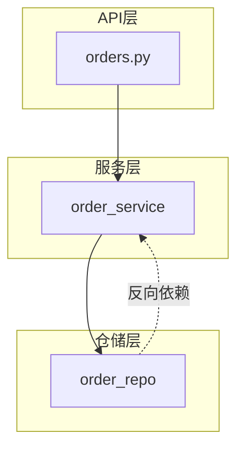
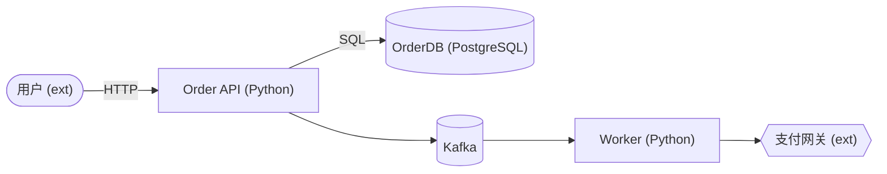
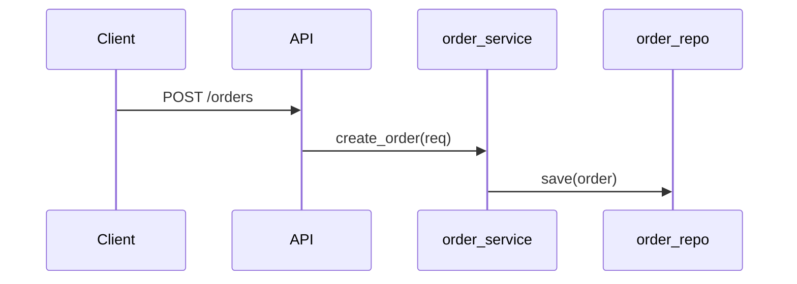

# 订单服务（order-api）架构总览

## 一、评估范围

- **范围档位**：app（整个订单服务，含后端 Python + 前端 TS 客户端 + 外部依赖）。
- **根路径**：`backend/app/` + `frontend/src/api/`，覆盖 6 个核心文件。
- **多语言技术栈**：Python（后端，FastAPI）、TypeScript（前端 API 客户端）。
- **各语言精度**：Python = medium（import 规范，但动态 import/反射的隐式依赖标未确认）；TypeScript = high（显式 import/export，依赖边可靠）。
- **一句话架构职责**：处理订单的创建、查询、状态流转与异步履约；前端 TS 调用后端 Python API。

## 二、整体档位

**整体档位：🔵 良**

- **汇总依据**：4 维中无「差」；地基维度 layering（良）、cohesion（良）均健康；readability（良）良好；extensibility（中）因状态机硬编码拉低，但不构成系统性问题、不阻塞演进。按汇总规则（无差 + 1 维中），整体取「良」。
- **一句话总评**：这是一个分层清晰、职责边界基本合理、可读性良好的服务；最值得肯定的是支付方式的策略式扩展，最需留意的是订单状态机的硬编码倾向。

## 三、3 视角架构图

### 视角① 分层 / 模块依赖

- 依赖基本单向：API → service → repository（`backend/app/api/orders.py:16` → `backend/app/services/order_service.py:30`）。
- 异常方向：repository 反向引用 service 工具（`backend/app/repository/order_repo.py:24`），分层局部不纯净。

### 视角② C4 Container

- level = container。shape 图例：`[]` 服务/容器、`[()]` 存储、`{{}}` 外部系统、`([])` 外部参与者。
- 服务入口 `backend/app/main.py:1`；DB 访问 `backend/app/repository/order_repo.py:1`；异步 Kafka/Worker 在 `backend/app/main.py:20` / `backend/app/main.py:25`。

### 视角③ 运行时 / 数据流

- 典型链路：Client → API（`backend/app/api/orders.py:16`）→ order_service（`backend/app/services/order_service.py:30`）→ order_repo（`backend/app/repository/order_repo.py:30`）。

## 四、4 维正向总评

#### 分层 & 依赖方向 · 档位 良
- **现状**：api/services/repository 三层清晰、依赖基本单向（`backend/app/api/orders.py:16`）；但仓储层个别处反向引用服务层工具（`backend/app/repository/order_repo.py:24`），分层不纯净。
- **业界成熟做法（对照）**：分层架构要求上层依赖下层、不跨层不反向。适用前提：职责可清晰分层的企业应用。现状差距：存在 repository→service 反向引用。provenance：LLM内置经验 · 未核对 · 延伸阅读：Layered Architecture、《领域驱动设计》分层。
- **档位依据**：分层主体健康、仅个别反向、不影响整体 → 良。

#### 职责内聚 & 边界 · 档位 良
- **现状**：订单领域服务聚合在 OrderService（`backend/app/services/order_service.py:10`），支付独立成 strategy 模块，内聚度较好。
- **业界成熟做法（对照）**：单一职责 + 高内聚低耦合，一个模块一个变化理由。适用前提：职责可分离的系统。现状差距：状态流转逻辑混在服务中，未来职责有蔓延风险。provenance：LLM内置经验 · 未核对 · 延伸阅读：SOLID·SRP、信息隐藏（Parnas）。
- **档位依据**：边界清晰、内聚良好，仅状态逻辑位置可优化 → 良。

#### 可扩展性 & 可变性 · 档位 中
- **现状**：支付方式用策略接口扩展（`backend/app/services/payment/strategy.py:12`，新增支付不改既有）；但订单状态流转以 if/elif 硬编码（`backend/app/services/order_service.py:88`），新增状态需改既有代码。
- **业界成熟做法（对照）**：开闭原则 OCP，对扩展开放、对修改关闭。适用前提：变化方向明确可枚举。现状差距：状态硬编码违反 OCP。provenance：LLM内置经验 · 未核对 · 延伸阅读：SOLID·OCP、GoF·State/Strategy 模式。
- **档位依据**：扩展性参差（支付好、状态差），有明显差距、演进有阻力 → 中。

#### 可读性 & 命名表意 · 档位 良
- **现状**：分层与命名整体表意清晰（`backend/app/api/orders.py:1`），看结构能较快建立心智模型。
- **业界成熟做法（对照）**：语义命名 + 关注点分离，名字反映职责、结构自解释。适用前提：需长期维护的系统。现状差距：整体良好，仅个别工具命名偏实现。provenance：LLM内置经验 · 未核对 · 延伸阅读：《代码整洁之道》命名、Ubiquitous Language（DDD）。
- **档位依据**：可读性良好、无系统性表意问题 → 良。

## 五、亮点

- **HL-01 · 支付方式用策略接口扩展，新增支付方式不改既有代码**（维度：可扩展性）。证据：`backend/app/services/payment/strategy.py:12`（PaymentStrategy 接口 + 多实现注册）。这是值得保持的设计资产。

## 六、风险点

> 风险点为总览级、前瞻性提示，不分级、不下 go/no-go、不给重构方案。若需深挖「多严重、要不要重构」，请转 `arch-quality-eval` 做坏味道诊断。

- **RISK-01 · 订单状态机硬编码在服务中，状态增多后改动易散落**（维度：可扩展性）。前瞻：未来若状态/规则增多，集中的 if/elif 可能演变为霰弹式修改；可前瞻性考虑状态机/规则引擎（本总览只指方向）。证据：`backend/app/services/order_service.py:88`。
- **RISK-02 · 仓储层反向依赖服务层工具，边界方向存隐患**（维度：分层）。前瞻：当前仅一处、影响有限；但若仓储持续依赖服务层，边界方向会逐渐模糊。证据：`backend/app/repository/order_repo.py:24`。

## 七、评估方法与已知缺口

- **评估方法**：多语言以目录/import 启发为主轨（Python medium / TS high），LSP 未启用，引用覆盖为文本级；app 级采用「先聚合后精读 + 热点优先」聚焦，非热点文件抽样确认。
- **多语言精度**：Python 动态 import/反射的隐式依赖未实锤，结论偏保守；TS 仅覆盖 API 客户端层。
- **已知缺口**：
  - Python 动态 import / 反射的隐式依赖未完全实锤，部分边按文本级 import 推断。
  - 前端 TypeScript 仅覆盖 API 客户端层，组件/状态管理结构未深入总览。
- **业界做法可信度声明**：以上各维业界做法均为模型内置经验、未核对原文，并附延伸阅读方向供自行核实（本 skill 不联网）。
- **越界说明**：本报告只做架构总览（3 视角图 + 4 维正向总评 + 业界对照 + 亮点/前瞻风险），不做坏味道逐条诊断、不下 go/no-go、不给重构方案、不画部署图（见 PRD §5）。
