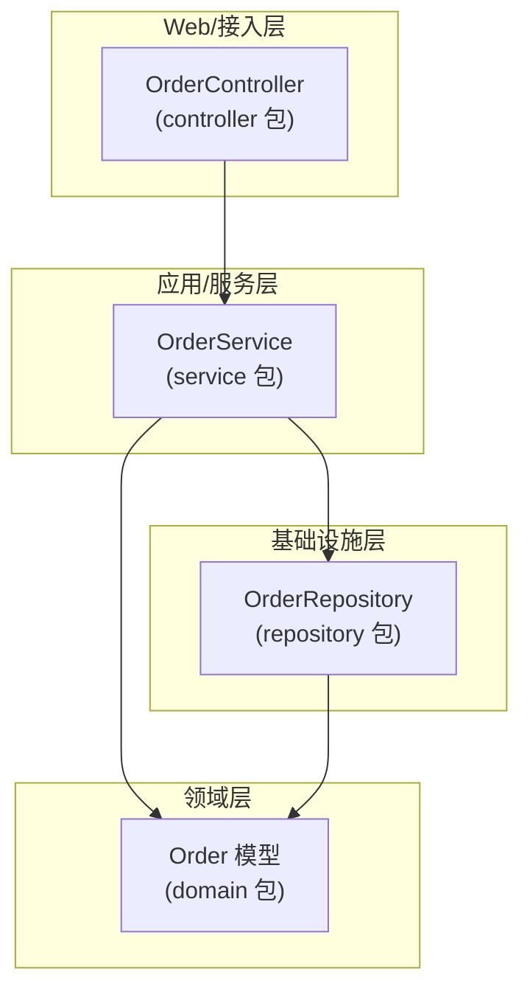
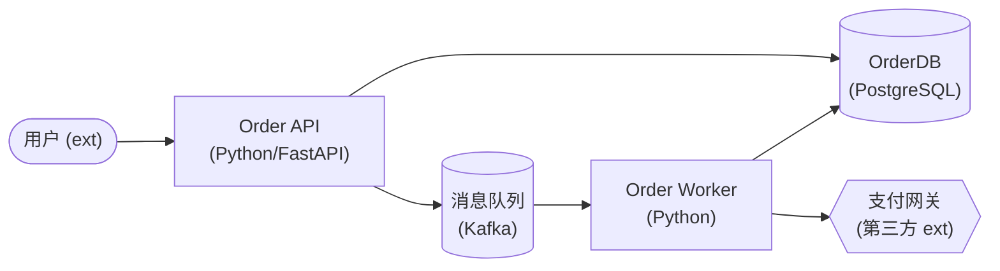
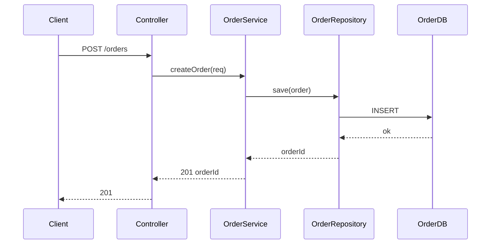
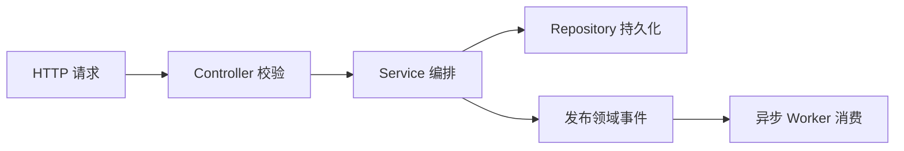

# 架构图绘制：3 视角 Mermaid（模块 B）

> 配合 `arch-overview` 的 Checklist 第 4 步使用。这一步把架构**呈现出来**——画 3 个视角的 Mermaid 图，让人一眼看懂「结构长什么样、组成是什么、请求怎么流动」。每个节点/边/流转步都回链代码证据，**禁止编造节点**。

## 一、3 视角各回答什么问题

| 视角 | 回答的问题 | Mermaid 图类型 | 适用前提 |
|------|-----------|---------------|----------|
| **① 分层 / 模块依赖** | 代码怎么分层？谁依赖谁？依赖方向合理吗？ | `flowchart TD`（subgraph 分层 + 有向边） | 有可识别的模块/包/层结构（几乎都适用） |
| **② C4 Container / Component** | 系统由什么组成？服务/存储/外部依赖/内部组件怎么连？ | `flowchart LR`（shape 区分类型，模拟 C4） | app 档位 / 有多组件或外部依赖；单模块可降级为 Component |
| **③ 运行时 / 数据流** | 一次典型请求怎么在架构里流动？数据流向？ | `sequenceDiagram`（调用时序）或 `flowchart`（数据流） | 有运行时入口（Web 路由/消息/任务/CLI）；纯库模块可能不适用 |

> **视角适用性铁律**：默认 3 视角全画。某视角确不适用/信息不足时，**不得静默省略**——必须显式声明「本视角不适用/信息不足」+ 原因（写入 `overview.json` 该视角的 `applicable: false` + `reason`，并在 md 留一节占位说明）。

> **唯一图源铁律**：只在 `overview.json` 定义结构化图，禁止保存或手写 `mermaid` 字段。完成 JSON 后运行 `scripts/render_mermaid.py <overview.json> --format markdown`，把生成块原样放进报告；`validate_contract.py` 会逐块对账。

## 二、通用纪律（所有视角）

1. **证据回链** —— 图里每个节点/边/流转步都要能追溯到代码。节点挂证据（包/目录/文件/类）；找不到定位的标 `⚠ 未确认`，**禁止编造节点或边**。
2. **节点是结构单元，不是文件** —— 节点 = 模块/包/层/服务/容器/组件/外部系统，不是单个文件（除非文件即组件）。先聚合后画，避免画成「文件树」。
3. **方向有意义** —— 箭头方向 = 依赖/调用/数据流向；层依赖方向要在图里可辨（上层→下层）。
4. **不画部署** —— 不画云资源/节点/集群/网络拓扑（PRD §5 out-of-scope）。
5. **多语言混合** —— 跨语言边界（如前端 TS → 后端 Python）用边显式标跨语言/跨服务，不假装是单一代码库内部调用。

## 三、视角 ①：分层 / 模块依赖图

**目的**：呈现代码的分层与模块依赖，让分层清晰度、依赖方向一眼可辨（直接喂给「分层 & 依赖方向」维度）。

**Mermaid 模板**（`flowchart TD`，subgraph 表示层）：

**画法要点**：
- `subgraph` = 层（按社区惯例命名：web/controller、service/usecase、domain、repository/dao/infra）；模块级可只画包依赖不强调层。
- 节点 = 模块/包/关键类（标注其所在包/目录）；边 = 依赖（A→B 表示 A 依赖 B）。
- **依赖方向异常要标出**：反向/跨层/循环依赖用不同样式（如 `-.->` 虚线 + 注释）显式呈现，是「分层 & 依赖方向」维度的关键证据。
- `app` 档位：层可换成「服务/模块」subgraph，突出服务边界与跨服务依赖。

**结构化字段**：`groups[]` 为 `{id,label}`；`nodes[]` 为 `{id,label,group,evidence}`；`edges[]` 为 `{from,to,label?,style?,evidence}`，`style` 可为 `normal/dashed/strong`。边端点必须引用真实 node id。

## 四、视角 ②：C4 Container / Component

**目的**：呈现系统组成——服务、存储、外部依赖、内部组件怎么连（直接喂给「职责内聚 & 边界」维度，也是 app 级总览的核心价值）。

> Mermaid 原生 C4 图（`C4Context`/`C4Container`）渲染兼容性参差、CI 不一定支持。**本 skill 用 `flowchart` + shape 约定模拟 C4**，保证可渲染可 diff。shape 约定：

| C4 元素 | Mermaid shape | 示例 |
|---------|--------------|------|
| 容器/服务（Container） | 圆角矩形 `[("API Service")]` 或 `[Svc]` | Web API、Worker、前端 App |
| 组件（Component） | 矩形 `[Component]` | 模块级下钻用 |
| 数据库/存储 | 圆柱 `[("DB")]` 或 `[(MySQL)]` | DB、Cache、MQ、对象存储 |
| 外部系统/人 | 斜角/双线 `{{外部系统}}` 或注明 `(ext)` | 第三方 API、其他服务、用户 |

**Mermaid 模板**（`flowchart LR`，模拟 C4 Container）：

**画法要点**：
- **档位决定层级**：`app` 档位画 **Container**（服务/存储/外部依赖级）；`module` 档位画 **Component**（模块内部组件级，可能无外部依赖）。
- 每个容器/组件标注：名称 + 技术栈/类型（括号注明）+ 职责一句话。
- 外部依赖（DB/MQ/第三方/其他服务）用对应 shape 显式画出——这是 app 级区别于模块级的关键。
- 边标注协议/数据流（HTTP/gRPC/SQL/pub-sub）。

**结构化字段**：`nodes[]` 为 `{id,label,kind,evidence}`，`kind` 为 `service/component/store/external/actor`；`edges[]` 为 `{from,to,label?,style?,evidence}`。外部依赖挂配置或客户端初始化证据。

## 五、视角 ③：运行时 / 数据流

**目的**：呈现一次典型请求/操作在架构里的流转路径与数据流向（喂给「可扩展性 & 可变性」「职责内聚 & 边界」维度的运行时视角）。

**Mermaid 模板 A：调用时序（`sequenceDiagram`，主推）**：

**Mermaid 模板 B：数据流（`flowchart`，适合多分支/异步流）**：

**画法要点**：
- **选一条典型主链路**（最常见/最重要的请求或操作），不画全部路径（防噪音）。
- 时序图参与者 = 架构中的关键组件（对齐视角①②的节点），步 = 调用/数据流向，每步回链调用点 file:line。
- 标数据流向（请求/响应/读写/发布消费），异步用注释或虚线。
- **入口缺失 → 不适用**：纯库/无运行时入口的模块，运行时视角标 `applicable: false` + reason「纯库模块无运行时入口」，不硬编一条假链路。

**结构化字段**：`type=sequence|flowchart`；`participants[]` 为 `{id,label,evidence}`；`flows[]` 为 `{step,from,to,action,kind?,evidence}`。sequence 的 `kind` 可为 `sync/response/async/dashed`。证据必须挂真实调用点。

## 六、视角适用性判定（防静默省略）

逐视角判断，**默认全画**，仅在确不适用时显式声明：

| 视角 | 不适用情形 | 处理 |
|------|-----------|------|
| ① 分层/模块依赖 | 几乎都适用（除非单文件无结构） | 极少不适用；不适用则标「范围过小无模块结构」 |
| ② C4 Container/Component | 单一组件无外部依赖、无多组件 | module 档位无外部依赖时可只画 Component 或声明「单组件无外部依赖」 |
| ③ 运行时/数据流 | 纯库/SDK/无入口模块、纯配置 | 标「无运行时入口/信息不足」+ 原因 |

> 每个视角在 `overview.json` 必须有 `applicable` 字段：`true` 时须有完整结构化字段（layering/C4 的节点与边，runtime 的参与者与流转）；`false` 时须有 `reason`。JSON 中出现 `mermaid` 即失败。

## 七、画图与评估的衔接

3 视角图不是孤立的装饰——它们直接喂给 4 维评估的**证据**：

- 视角①（分层/依赖）→ 喂「分层 & 依赖方向」维度（层是否清晰、有无反向/循环）。
- 视角②（C4 组成）→ 喂「职责内聚 & 边界」维度（组件职责是否单一、边界是否清晰）。
- 视角③（运行时流转）→ 喂「可扩展性 & 可变性」「职责内聚 & 边界」（链路是否清晰、变更是否散落）。
- 三视角共同喂「可读性 & 命名表意」（结构是否一眼看懂）。

> 图里标出的「异常边」（反向/循环/跨层/隐式依赖）不要在图里就下「坏味道」结论——那是 `arch-quality-eval` 的事。这里只**呈现**事实，结论留给维度评估 + 业界对照。

## 八、自检

1. **3 视角齐全** —— 每个视角要么有图，要么显式声明不适用 + 原因；无静默省略。
2. **节点是结构单元** —— 节点是模块/层/服务/组件，不是文件树；先聚合后画。
3. **证据回链** —— 每个节点/边/流转步能追溯到代码；无证据的标 `⚠ 未确认`，无编造。
4. **方向有意义** —— 箭头 = 依赖/调用/数据流向；异常方向显式标出。
5. **没画部署** —— 无云资源/节点/集群拓扑。
6. **多语言边界清晰** —— 跨语言/跨服务边显式标注，不假装单一代码库内部调用。
