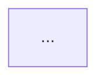

# overview.md 模板（模块 D）

> 配合 `arch-overview` 的 Checklist 第 9 步使用。`overview.md` 是 `overview.json` 的人读渲染，二者必须一致（`validate_contract.py` 对账）。frontmatter 字段对齐 `validate_report.py` 的规则。

## Frontmatter（必填）

```yaml
---
target: order-api                       # 目标名（与 overview.json 一致）
title: 订单服务 架构总览
scope_level: app                        # module | app
languages: [Python, TypeScript]         # 多语言全列（与 overview.json 一致）
analyzed_at: 2026-07-10
covered_files:                          # 覆盖文件集合（非空，与 json 一致）
  - backend/app/api/orders.py
  - backend/app/services/order_service.py
overall_grade: 良                       # 整体档位 优|良|中|差（与 json 一致）
grade_layering: 良                      # 4 维档位（与 json dimensions 一致）
grade_cohesion: 良
grade_extensibility: 中
grade_readability: 良
open_questions: 0                       # ⚠ 未确认 数量
status: draft
---
```

> frontmatter 的 `covered_files` 用 YAML 列表；正文「评估范围」节再用人话概述。

## 正文章节结构（标题用这些关键词，脚本按关键词定位节）

### 一、评估范围（覆盖 module A）
- 范围档位（module / app）+ 根路径。
- 覆盖文件集合概述（N 个文件 / 涉及哪些目录或服务；app 档位列出服务/模块边界 + 外部依赖）。
- 多语言技术栈 + **各语言精度**（哪些 high/medium/low）。
- 一句话架构职责（它声称做什么，非「应有架构」）。

### 二、整体档位（放最前，先给总评结论）
- 显式整体档位：`🟢 优` / `🔵 良` / `🟡 中` / `🔴 差`。
- **汇总依据**：哪几维什么档、为什么汇成这个整体（地基维度 layering/cohesion 的影响、短板效应），读者能复现（对齐 `scoring-and-grading.md §二`）。
- 一句话总评：这个架构整体设计如何、最值得肯定的一点、最需留意的一点。

### 三、3 视角架构图（覆盖 module B；每视角 mermaid + 适用性 + 节点证据）

**视角① 分层 / 模块依赖**（applicable 时）：



- 节点/边证据表（关键节点挂 file:line；异常方向如反向/跨层/循环显式标出）。
- 若 `applicable: false` → 写「本视角不适用/信息不足：<reason>」占位，不省略整节。

**视角② C4 Container/Component**（applicable 时）：


- 标注 level（container/component）+ shape 图例（服务/存储/外部）+ 关键组件证据。

**视角③ 运行时 / 数据流**（applicable 时）：

```mermaid
sequenceDiagram
  ...
```

- 流转步证据（每步挂调用点 file:line）。
- 若纯库无入口 → 「本视角不适用：纯库模块无运行时入口」。

> 3 视角图均回链代码证据；找不到的节点标 `⚠ 未确认`，**禁止编造节点**。

### 四、4 维正向总评（覆盖 module C；R-DIM 卡 4 维齐全 + R-IND 业界对照 + R-GRADE 档位）

**逐维度**（4 维全写：layering → cohesion → extensibility → readability），每维含：

```
#### 维度：分层 & 依赖方向 · 档位 良
- 现状：<具体评价，挂证据 file:line / 图节点>
- 业界成熟做法（对照）：<what>；适用前提：<when>；现状与标杆差距：<gap>。
  · provenance：LLM内置经验 · 未核对 · 延伸阅读：<further_reading>
- 档位依据：<现状 vs 业界差距 + 影响面 + 可演进性 + 证据强度>
```

> 业界做法措辞用「业界常见做法是…」「经典模式如…」经验性表述；**禁止**「最佳实践证明…」「权威表明…」。每维须有 provenance + 未核对 + 延伸阅读声明（`validate_report.py` R-IND 卡）。

### 五、亮点（Highlights）
- 逐条：`HL-NN` + 标题 + 指向维度 + 一句为什么是亮点 + 证据 file:line。
- 无亮点时可写「本次总览未识别到显著设计亮点」，但通常真实系统有值得保持之处。

### 六、风险点（Risks）—— 总览级、前瞻性
- 逐条：`RISK-NN` + 标题 + 指向维度 + 前瞻性描述（未来什么场景下可能怎样）+ 证据 file:line。
- **纪律**：风险点**不分级、不下 go/no-go、不给重构方案/优先级**（越界成 `arch-quality-eval`）。只做方向性前瞻提示。
- 无风险点时可写「本次总览未识别到显著前瞻性风险」。

> 若读者想对某风险点深挖「到底多严重、要不要重构」——明确指向 `arch-quality-eval` 做坏味道诊断（本 skill 越界拉回）。

### 七、评估方法与已知缺口
- 评估方法：用了 LSP 还是 rg 降级；聚焦策略（聚合/热点优先/分层扫描）+ 舍弃了什么（防「看似全覆盖实则抽样」）。
- 多语言精度：各语言精度差异说明（low/medium 的结论更保守）。
- 已知缺口：逐条列 `⚠ 未确认` 的项 + 无法定位的结论（与 `open_questions` 计数对账，R-U）。
- 业界做法可信度声明：业界做法均为 LLM 内置经验、未核对原文，附延伸阅读方向供自行核实（不联网）。
- 越界说明：本报告只做架构总览（图 + 正向总评 + 业界对照），不做坏味道逐条诊断/go-no-go/重构方案/部署图（指向 PRD §5）。

## 端到端示例

见 `examples/2026-07-10-example-overview.md`（多语言 order-api app：3 视角图 + 4 维总评 + 业界对照 + 亮点/风险）。该示例必须四道门全过。

## 写作纪律（与 `scoring-and-grading.md §五` 一致）

- 每条结论回链 `file:line` / 图节点，找不到的标 `⚠ 未确认` + 登记缺口。
- 档位用客观依据（与业界差距 + 影响面 + 可演进性 + 证据强度），禁「感觉像优」。
- 整体档位给汇总依据，可复现。
- 业界做法声明 provenance（LLM内置经验）+ 未核对 + 延伸阅读；用经验性措辞，不假装权威。
- 风险点总览级前瞻性，不分级、不下 go/no-go、不给重构方案。
- 不混入 lint（缩进/命名格式/import 顺序）；不编造证据/节点。
