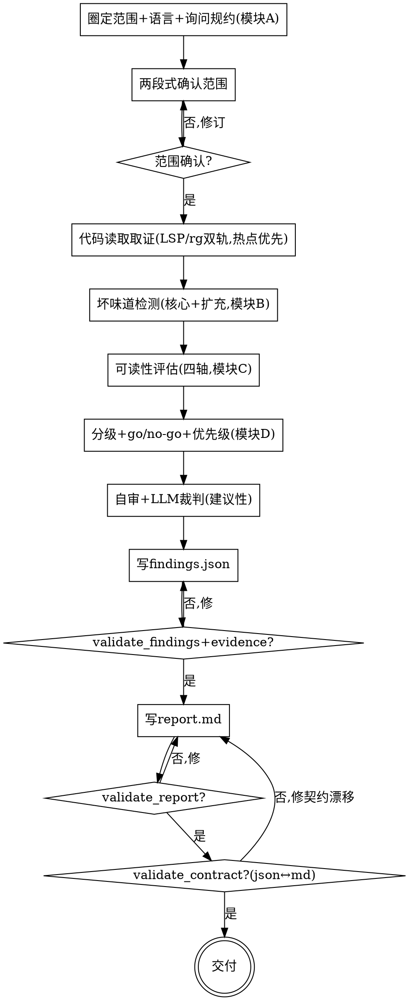

# 架构质量评估：重构前诊断（要不要重构、先改哪里）

## 目的

针对**一个代码 feature/子系统模块**，从**架构设计视角**评估其质量（聚焦「架构坏味道」+「架构可读性」两条轴），产出**带证据、带优先级、带 go/no-go 门禁**的「重构前诊断报告」，帮开发者决定**要不要重构、先改哪里**。

只回答一个问题：**这个模块现在架构烂到什么程度、值不值得重构、先改哪里**——不回答「该不该这么设计」「要重构成什么样」。改进方向只指方向，**不写完整重构方案**。

```
一个模块的代码路径 ──► [arch-quality-eval] ──► 重构前诊断报告（report.md + findings.json，过四道门）
```

三个核心特征：

1. **证据驱动** —— 不照念类名/注释当结论；每条问题挂 `file:line` / 类 / 函数 / 依赖边，找不到依据的标 `⚠ 未确认`，**禁止编造证据**。
2. **单模块聚焦** —— 只评估用户确认的那一个 feature/子系统，不蔓延成全 repo 巡检；范围未确认前不产出。
3. **双轴分级 + go/no-go 门禁** —— 坏味道 + 可读性两条轴，每条结论分级 critical/major/minor（带客观依据）+ 改进方向 + 重构优先级，并给 go/no-go 决策信号。

<HARD-GATE>
在模块范围（**路径 + 语言 + 覆盖文件集合 + 是否喂入规约** + 一句话模块职责）被用户确认前，不进入任何深挖或产出动作（不读依赖图、不定级、不写报告）。
`findings.json` 与 `report.md` **过四道门**（`validate_findings.py` / `validate_evidence.py` / `validate_report.py` / `validate_contract.py`）之前，**不交付**。本 skill 自己产出报告，不调用任何其他 skill。
</HARD-GATE>

## 反模式：照念类名/注释当结论，或把现状当「应有架构」

`OrderService` 不一定是 God Class（也许职责清晰）；注释写「这是领域层」不代表它没穿透。照念符号/注释当结论、或从代码现状反推「应该这样架构」当标准，是这类评估最常见的失真。每条判断都要追到真实依赖边 / 结构事实并回链 `file:line`；推断标 `⚠ 未确认`。

## 边界（最重要）

**产出**（诊断报告，模块 D）：
- 评估范围（覆盖文件集合、语言与结构识别、是否喂入规约、模块职责基线）
- go/no-go 门禁结论（verdict + 列出 critical 项）
- 架构坏味道清单（核心 + 扩充，每条分级 + 证据 + 违反的通用设计原理 + 改进方向 + 优先级）
- 项目规约违规（仅当喂入规约）
- 架构可读性（四轴：职责清晰度 / 依赖可理解性 / 命名表意度 / 分层清晰度，**不含 lint 能查的代码风格**）
- 重构优先级总览（先改哪个收益最大 + 排序依据 + 先决关系）
- 评估方法与已知缺口

**不产出**（超出范围，记入「已知缺口」即可）：
- ❌ **完整重构方案/新设计**：只给改进方向与优先级，不画目标架构、不写迁移步骤（那是重构阶段的事）
- ❌ **代码风格 / lint 检查**：可读性 ≠ 代码风格；缩进、命名格式、import 顺序等不纳入（PRD §5）
- ❌ **模块化度量**：LCOM/扇出/不稳定性/距主序列等纯数值不当判定依据，只当线索（PRD §5）
- ❌ **独立 SOLID 逐条合规**：原理通过「坏味道违反了哪条原理」间接体现，不单独逐条对照 SRP/OCP/LSP/ISP/DIP（PRD §5）
- ❌ **自动解析项目架构文档 / 复用代码内规约**（ArchUnit 等）：规约只接受用户手工喂入（PRD §5）
- ❌ **全 repo 扫描 / 架构巡检全景图**：定位单模块深挖（PRD §5）
- ❌ **CI PR 自动卡关 / Code Review 场景**：定位重构前诊断（PRD §5）
- ❌ **评估结果历史对比/趋势**：单次诊断即可（PRD §5）

**越界拉回**：当对话滑向「帮我重构成 XX 架构」「跑个 lint」「全 repo 扫一遍出全景图」「卡住这个 PR」时，明确说「这超出重构前诊断范围，只给问题清单 + 优先级 + go/no-go」，记一笔到「已知缺口」。

## Checklist

为以下每项创建一个 task，按序完成：

1. **圈定范围 + 语言识别 + 询问规约（模块 A）** —— 接受用户指定的 feature/子系统根路径（可跨多目录），枚举覆盖文件集合（`rg --files`/`find`），识别语言（JVM Java/Kotlin / C++）与包/目录/命名空间结构（C++ 标注能力受限）；**主动问一句是否要喂入项目架构规约**（分层/边界/禁止依赖方向，手工输入文本即可）。加载 `references/scope-and-boundary.md`。
2. **两段式确认（HARD-GATE）** —— 把 路径 + 覆盖文件集合 + 语言 + 结构识别 + 是否喂入规约（喂入则附规约清单）+ 一句话模块职责 呈现给用户确认。**未确认不进下一步**。最大风险是「圈错模块 / 拉入无关代码或漏关键包」，这一步专门拦它。
3. **代码读取取证（坏味道/可读性的证据来源）** —— 在确认后的边界内，按 `references/analysis-protocol.md` 取证：LSP/rg 双轨（先检测→可用则用足→不可用默认 rg 降级并在报告标注；只有用户明确要求高精度 LSP 时才等待用户处理），热点优先聚焦大模块，四类事实（包/层结构、依赖边、类/包规模职责、可见性）。加载 `references/analysis-protocol.md`。
4. **坏味道检测（模块 B）** —— 按 `references/arch-smells.md` 逐条对照核心坏味道（循环依赖 / God Class·God Package / 跨层 / 霰弹式修改 / 不恰当暴露）+ 扩充坏味道，**核心类二分显式**（已检出 / 未检出），每条已检出挂证据 + 点名违反的通用设计原理。喂了规约则加载 `references/convention-checking.md` 做项目规约违规检测。
5. **可读性评估（模块 C）** —— 按 `references/readability-assessment.md` 评四轴（职责清晰度 / 依赖可理解性 / 命名表意度 / 分层清晰度），**只评架构层、不含 lint**，结论挂证据。加载 `references/readability-assessment.md`。
6. **分级 + go/no-go + 优先级（模块 D）** —— 按 `references/severity-and-priority.md` 给每条 finding 定级 critical/major/minor（客观依据）+ go/no-go（critical ≥ 阈值默认 1 → no-go）+ 重构优先级 P1/P2/P3（影响面 × 阻塞 × 成本 + 先决关系）。加载 `references/severity-and-priority.md`。
7. **自审 + LLM 裁判建议性复核** —— 证据回链 / 分级依据 / 原理点名 / 未确认隔离逐条过（详见 `references/severity-and-priority.md §四`）；再用 §五 的 LLM 裁判提示做**建议性**复核（不阻断，只 catch 分级失真/优先级乱序）。发现问题就地修。
8. **写 `findings.json` → 跑 `validate_findings.py` + `validate_evidence.py`** —— 按 `references/findings-json-schema.md` 把发现结构化为**契约源**（稳定 `FINDING-[SRC]<n>` id、轴/级/证据/原理/改进/优先级；若无达到 finding 级别的问题，允许 `findings: []` 且 summary 全 0 / verdict=go），写到 `docs/arch-diagnosis/YYYY-MM-DD-<模块>-findings.json`，跑本 skill 的 `scripts/validate_findings.py` 和 `scripts/validate_evidence.py --root <repo-root>`，通过才进下一步。
9. **写 `report.md` → 跑 `validate_report.py`** —— 按 `references/report-template.md` 把 findings.json 渲染成人读报告（frontmatter + go/no-go + 坏味道清单 + 可读性 + 优先级 + 缺口），写到 `docs/arch-diagnosis/YYYY-MM-DD-<模块>-report.md`，跑 `scripts/validate_report.py`。
10. **契约交叉对账 + 交付** —— 跑 `scripts/validate_contract.py <findings.json> <report.md>`（机器校验 json↔md 一致：每个 id 出现、计数/verdict/covered_files 对齐、无悬空；无 finding 时要求正文没有悬空 finding id）。通过即交付；提示用户报告是重构前诊断，重构方案留后续。

## 流程图



**终态是「交付」：findings.json + report.md 四道门全过、契约一致即完成。** 本 skill 不预设、不调用任何后续 skill。

## 自审检查项（Checklist 第 7 步展开）

定级写完后用新视角过一遍：

1. **回链完整性** —— 每条 finding 是否挂 `file:line` / 类 / 函数 / 依赖边？找不到的标 `⚠ 未确认` 并登记「已知缺口」，不混进正文当事实。
2. **分级可解释** —— 每条 severity 能用客观依据说清（爆炸半径 / 是否阻塞 / 能否增量 / 证据强度），不是「感觉像 critical」。critical 要克制。
3. **原理点名** —— smell finding 是否点了具体通用设计原理？convention finding 是否点了规约 id？不空泛。
4. **门禁自洽** —— go/no-go verdict 与 critical 计数/阈值一致；critical 项全列出（脚本硬卡）。
5. **优先级有依据** —— P1 是不是真「先改收益最大」？先决关系（谁必须先解）写进排序依据没？
6. **可读性没混 lint** —— 可读性四轴只评架构层，无缩进/命名格式/import 顺序类评判。
7. **覆盖二分显式** —— 5 个核心坏味道逐条「已检出 / 未检出」，没漏检（脚本 R-C1 硬卡）。
8. **规约一致** —— conventions_fed=false 时无规约违规结论；true 时有规约节（脚本 R-V 硬卡）。

发现问题就地修，修完重跑四道门。

## 产出位置

存到 `docs/arch-diagnosis/`，共享 `<日期>-<模块名>` 前缀（模块名用 kebab-case，日期用当天）：

- `YYYY-MM-DD-<模块名>-findings.json` —— **机器契约源**（唯一事实源）：每条 finding 带 `FINDING-[SRC]<n>` id + 轴/级/证据/原理/改进/优先级
- `YYYY-MM-DD-<模块名>-report.md` —— **人读诊断报告**：findings.json 的渲染，frontmatter + go/no-go + 坏味道清单 + 可读性 + 优先级 + 缺口

json 是给校验器读的契约源，md 是给人读的渲染，**两者必须一致**（`validate_contract.py` 对账）。交付前各自跑校验脚本且合格。校验脚本在本 skill 的 `scripts/` 目录（与 SKILL.md 同级）——**不要假设当前目录是仓库根**：作为 corin 插件加载时路径为 `${CLAUDE_PLUGIN_ROOT}/skills/arch-quality-eval/scripts/`，否则按本 SKILL.md 所在目录拼出同级 `scripts/` 的绝对路径再运行。证据校验需要仓库根路径，默认用当前目录，也可显式传 `--root <repo-root>`。

```bash
V="${CLAUDE_PLUGIN_ROOT}/skills/arch-quality-eval/scripts"   # 非插件：用本 SKILL.md 同级 scripts/ 的绝对路径
python3 "$V/validate_findings.py"  <findings.json>
python3 "$V/validate_evidence.py"  <findings.json> --root <repo-root>
python3 "$V/validate_report.py"    <report.md>
python3 "$V/validate_contract.py"  <findings.json> <report.md>
```

## 关键原则

- **范围先定** —— 动手前确认模块边界（路径/语言/覆盖文件集合/是否喂入规约/职责基线）；范围未确认不深挖。
- **证据驱动，禁止编造** —— 每条结论回链 `file:line`；找不到的标 `⚠ 未确认` + 登记缺口，绝不混进正文当事实。
- **双轴聚焦** —— 只评架构坏味道 + 架构可读性两条轴；架构视角，不掺 lint。
- **核心坏味道二分显式** —— 5 个核心类逐条「已检出/未检出」，证明逐条过过，防漏检（脚本 R-C1 硬卡）。
- **原理间接体现，不逐条 SOLID** —— 每条 finding 点名违反的通用设计原理；不单独跑 SRP/OCP/LSP/ISP/DIP 检查表。
- **规约纯手工喂入** —— 不自动解析架构文档、不读代码内规约；未喂入则规约检测整节不触发。
- **C++ 显式标注受限** —— C++ 无 package、依赖靠 `#include`/命名空间，分析能力弱于 JVM；结论更保守、登记缺口。
- **聚焦策略对抗噪音** —— feature/子系统级范围大，热点优先 + 分层扫描，只报真实架构问题不淹没关键点。
- **门禁可解释** —— go/no-go 基于 critical 阈值且可复现（critical 清单 + 分级依据）；是重构前诊断信号，不是 CI 自动卡关。
- **优先级 ≠ 严重级** —— 先改哪个由 影响面 × 阻塞 × 成本 + 先决关系 决定，给「先改收益最大」的理由。
- **改进只指方向** —— 不写完整重构方案（越界拉回）；YAGNI，MVP 诊断出 MVP 报告。
- **可回头** —— 任何时候回到任何一步修订，修完重校验。

## 反模式

| 反模式 | 正确做法 |
|--------|----------|
| 照念类名/注释/路由名当结论 | 追真实依赖边/结构事实，回链 `file:line` |
| 跳过两段式确认直接产出 | 模块范围确认前禁止深挖与产出 |
| 把现状当「应有架构」反推标准 | 只判现状是否违反通用原理/用户规约 |
| 混入 lint/代码风格（缩进/命名格式/import 顺序） | 可读性只评架构层（职责/依赖/表意/分层） |
| 靠纯数值（LCOM/扇出）判定坏味道 | 数值只当线索，看职责/依赖事实 |
| 逐条对照 SOLID 合规 | 原理通过 finding 的 `principle_violated` 间接体现 |
| 自动解析 ARCHITECTURE.md / 复用 ArchUnit | 规约只接受用户手工喂入 |
| core 坏味道漏检（不写「未检出」） | 5 个核心类逐条二分显式（脚本 R-C1 硬卡） |
| severity 靠感觉打分 | 用客观依据（爆炸半径/阻塞/可增量/证据强度） |
| verdict 与 critical 计数对不上 | go/no-go ⇔ critical ≥ 阈值（脚本硬卡） |
| 改进写成完整重构方案/迁移步骤 | 只指方向，完整方案留重构阶段 |
| 未喂入规约却报规约违规 | conventions_fed=false 不得有 convention finding（脚本 R-V 硬卡） |
| C++ 模块照搬 JVM 精度下结论 | C++ 标注能力受限、结论更保守、登记缺口 |
| 无证据定级 / 编造 file:line | 找不到依据标 `⚠ 未确认` + 缺口，禁止编造 |
| 假设并调用某个下游 skill | 本 skill 独立，结束即终止 |

## 参考资源

**模块 A（范围）**
- **`references/scope-and-boundary.md`** —— 模块范围界定、语言/结构识别、项目规约喂入格式、两段式确认。**Checklist 第 1/2 步用**

**模块 B（坏味道）**
- **`references/arch-smells.md`** —— 架构坏味道目录（核心 5 + 扩充 6），每条含定义/客观判定信号/违反原理/典型严重级 + 通用原理速查 + 与 lint 的划界 + C++ 特别说明。**第 4 步用**
- **`references/convention-checking.md`** —— 项目规约违规检测（仅当喂入规约）：规约喂入格式、违规取证、convention finding、一致性强约束。**喂入规约时第 4 步用**

**模块 C（可读性）**
- **`references/readability-assessment.md`** —— 架构可读性四轴评估 + 与代码风格的划界（可读性 ≠ lint）。**第 5 步用**

**代码读取**
- **`references/analysis-protocol.md`** —— JVM/C++ 代码读取取证协议：四类事实、LSP/rg 双轨（先检测→用足→不可用对话建议安装等回复→rg 降级）、热点优先聚焦、C++ 能力受限、防臆造。**第 3 步用**

**模块 D（分级/门禁/优先级）**
- **`references/severity-and-priority.md`** —— critical/major/minor 客观阈值、go/no-go 门禁规则、重构优先级排序 + 自审清单 + 建议性 LLM 裁判提示（不阻断）。**第 6/7 步用**

**产出**
- **`references/findings-json-schema.md`** —— findings.json 完整 schema 字段表 + 示例。**第 8 步用**
- **`references/report-template.md`** —— report.md 完整模板（frontmatter + 章节结构）+ 写作纪律。**第 9 步用**

**校验脚本**
- `scripts/validate_findings.py` —— findings.json 契约源交付前必跑（schema/枚举/计数/verdict/原理；允许无 finding 的 go 报告）
- `scripts/validate_evidence.py` —— findings.json 证据位置交付前必跑（文件存在、行号范围、note 关键字轻量命中）
- `scripts/validate_report.py` —— report.md 渲染交付前必跑（frontmatter/回链/分级/原理/双轴覆盖/规约一致/banned/未确认）
- `scripts/validate_contract.py` —— json↔md 交叉对账（id/计数/verdict/covered_files 一致、无悬空）

**示例**
- `examples/2026-06-20-example-findings.json` / `examples/2026-06-20-example-report.md` —— 端到端示例（JVM order-service，no-go），四道门全过，照此对齐格式
