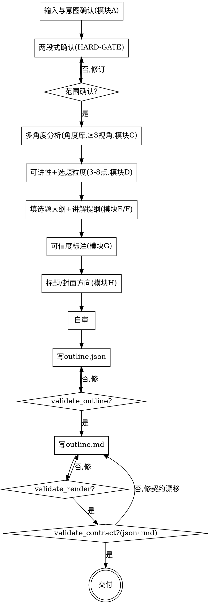

# 抖音讲书选题/提纲：一本书讲什么、怎么讲（只到提纲，不写成稿）

## 目的

针对**一本「有故事的书」**，用内置的「多角度看书」能力找出**值得讲的人和事**，并从人物/时代/经济/权力/心理/反常识等多角度给出**深层切入角度**，产出**可交接给下游 skill 的选题提纲**——下游再生成口播逐字稿。

只回答一个问题：**这本书值得讲什么、每个点用什么角度讲、怎么钩人**——不回答「把稿子写出来」（那是下游逐字稿 skill 的事）。

```
一本书（书名/摘要/全书） ──► [book-talk-planner] ──► 选题提纲（outline.json + outline.md，过三道门）
```

三个核心特征：

1. **角度库驱动** —— 不靠空想选题；先加载可扩展的 `angle-library.md`（10 视角，围绕人物×时代×利益×动机），逐条对照这本书判「适用/调整/不用」，覆盖 ≥3 视角。
2. **只产提纲，不写成稿** —— 每个选题点给：角度 + 钩子方向 + 核心要点 + 金句方向 + 形态 + 为什么值得讲 + 标题/封面方向。**不写完整口播逐字稿**（留给下游）。
3. **可信度标注** —— 讲书涉历史/经济，LLM 易编；凡史实/数据/因果论断逐条标 `credible/uncertain/unverified`，`title_only`（凭记忆）输入更保守——降「讲错翻车」风险。

<HARD-GATE>
在 **书名 + 输入类型（书名/书名+摘要/全书）+ 用户是否有想讲的角度/思路 + 目标调性** 被用户确认前，不进入任何分析或产出动作（不加载角度库做分析、不写提纲）。
`outline.json` 与 `outline.md` **过三道门**（`validate_outline.py` / `validate_render.py` / `validate_contract.py`）之前，**不交付**。本 skill 自己产出提纲，不调用任何其他 skill（下游逐字稿 skill 由用户另行触发）。
</HARD-GATE>

## 反模式：复述目录当选题，或凭记忆讲史实不标注

把"第一章讲 X、第二章讲 Y"当选题大纲 = 复述目录，没人听；选题应是"一个值得单独讲、有钩子、有角度的主题"。凭 LLM 记忆讲历史年代/经济数据却不标可信度 = 讲错翻车。每条选题要落到**具体的人和事**；每条史实/数据论断要标**可信度**。

## 边界（最重要）

**产出**（选题提纲）：
- 可讲性判断（值不值得讲 / 可讲点数量级 / 适合系列还是单条 / 爆款潜力 + 理由）
- 选题大纲（3-8 个选题点，每个：主题 + 视角 + 钩子方向 + 为什么值得讲）
- 每点讲解提纲（角度 + 钩子方向 1-2 + 核心要点 3-5 + 金句方向 + 形态 + 可信度标注 + 标题/封面方向）
- 事实可信度标注（涉史实/经济/数据论断逐条标 level + reason）

**不产出**（超出范围）：
- ❌ **完整口播逐字稿 / 配音稿 / TTS**：本 skill 只到"提纲"，成稿是下游 skill 的事（PRD §5）
- ❌ **主动联网事实核查**：只做"可信度标注"，主动查证留后续（PRD §5）
- ❌ **视频画面 / B-roll / 剪辑建议 / 封面出图**：视觉与制作层，超出内容策划范围（PRD §5）
- ❌ **平台发布 / 数据分析 / 运营**（PRD §5）
- ❌ **非「有故事的书」专门适配**（经管/自助/科普等纯方法论）：角度库面向有故事的书，不保证效果（PRD §5）

**越界拉回**：当对话滑向"把这条写成完整讲稿""帮我配个音""做封面图""全网发一遍"时，明确说「这超出选题提纲范围，只到提纲；成稿/配音/制作留给下游」，记一笔到「说明」段。

## Checklist

为以下每项创建一个 task，按序完成：

1. **输入与意图确认（模块 A）** —— 接受三种输入：①仅书名 ②书名+用户补充摘要/关键人物事件 ③导入全书文本。**先问用户是否已有想讲的角度/思路**：有则记录并优先按其思路；无则进入 skill 自主出思路。仅书名时主动提示"凭记忆、需重点核实"。
2. **（HARD-GATE）两段式确认** —— 把 书名 + 输入类型 + 用户思路(有/无+内容) + 目标调性(默认深度+通俗平衡) 呈现给用户确认。**未确认不进下一步**。最大风险是「讲错书 / 角度方向跑偏」。
3. **多角度分析（模块 C）** —— 加载 `references/angle-library.md`，逐条对照这本书判「适用/调整/不用」，覆盖 ≥3 视角，每个候选点落到**具体的人和事**。加载 `references/analysis-protocol.md`。
4. **可讲性 + 选题粒度（模块 D）** —— 判断 verdict(worth_telling/marginal/thin) + form(series/single) + 爆款潜力 + 理由；收敛到 **3-8 个**选题点，确保是"选题"而非"目录复述"。加载 `references/selectability.md`。
5. **选题大纲 + 讲解提纲（模块 E/F）** —— 按 `references/outline-schema.md` 填每个 topic：title/angle/angle_name/hook_directions(1-2)/key_points(3-5)/golden_line_direction/video_form/why_worth_telling/title_directions(2-3)/cover_direction。
6. **可信度标注（模块 G）** —— 加载 `references/credibility-and-hooks.md`，对涉史实/数据/因果论断逐条标 credible/uncertain/unverified + reason；`title_only` 输入更保守。
7. **标题 / 封面方向（模块 H, P1）** —— 同上参考：每点 2-3 钩子型标题方向 + 1 封面方向。
8. **自审** —— 覆盖 ≥3 视角 / 每 topic 字段齐 / angle 来自库 / 不复述目录 / 可信度覆盖史实 / 无 banned-placeholder。发现问题就地修（详见「自审检查项」）。
9. **写 `outline.json` → 跑 `validate_outline.py`** —— 按 `references/outline-schema.md` 把提纲结构化为**机器契约源**（交接物），写到 `book_talk/YYYY-MM-DD-<书名-slug>-outline.json`。**meta 须含 `knowledge_source`**：按 input_mode 写明内容来源与核对状态（`title_only` 须注明"未核对原文"）。跑 `scripts/validate_outline.py`，通过才进下一步。
10. **写 `outline.md` → 跑 `validate_render.py`** —— 按 `references/outline-template.md` 渲染成人读提纲，写到同名 `-outline.md`，跑 `scripts/validate_render.py`。
11. **契约对账 + 交付** —— 跑 `scripts/validate_contract.py <outline.json> <outline.md>`（json↔md 一致：id 双向、计数、book/input_mode/form/verdict 一致）。通过即交付；提示用户提纲到此为止，成稿用下游 skill。

## 流程图



**终态是「交付」：outline.json + outline.md 三道门全过、契约一致即完成。** 本 skill 不调用任何下游 skill；成稿由用户另行触发逐字稿 skill。

## 自审检查项（Checklist 第 8 步展开）

填完提纲用新视角过一遍：

1. **覆盖多视角** —— distinct angle ≥ 3？没全挤在"人物命运"一个维度（门 O-COVERAGE 硬卡）。
2. **字段齐全** —— 每个 topic 的 hook_directions(1-2)/key_points(3-5)/title_directions(2-3)/cover_direction 都在且非空（门 O-FIELDS 硬卡）。
3. **角度来自库** —— 每个 topic.angle 在 angle-library.md 里（门 O-ANGLE 硬卡），不臆造视角。
4. **选题非目录** —— 每个 topic 当成一条独立视频标题问"有人想点开吗"；不是"第 N 章"复述。
5. **粒度受控** —— topics 数 ∈ [3,8]（门 O-COUNT 硬卡）。
6. **可信度覆盖** —— 涉史实/数据/因果的 key_point/hook 是否都进了 credibility？title_only 输入下 unverified/uncertain 占比够高没（门 O-CRED）？
7. **无 banned/placeholder** —— 值里无 TBD/待定/占位/适当处理（门 O-BANNED 硬卡）；未决项写成 credibility 的 unverified+reason。
8. **知识来源已声明** —— `meta.knowledge_source.declaration` 非空（门 `O-SOURCE` 硬卡）；`title_only` 须注明"未核对原文"，让下游/读者知道内容能信几分。

发现问题就地修，修完重跑三道门。

## 产出位置

存到仓库根 `book_talk/`，共享 `<日期>-<书名-slug>` 前缀（书名用 kebab，日期用当天）：

- `YYYY-MM-DD-<书名-slug>-outline.json` —— **机器契约源 / 下游交接物**：meta + topics[]
- `YYYY-MM-DD-<书名-slug>-outline.md` —— **人读提纲**：json 的渲染

json 给校验器和下游 skill 读，md 给人读，**两者必须一致**（`validate_contract.py` 对账）。交付前各自跑校验且合格。校验脚本在本 skill 的 `scripts/`（与 SKILL.md 同级）——**不要假设当前目录是仓库根**：作为 corin 插件加载时路径为 `${CLAUDE_PLUGIN_ROOT}/skills/book-talk-planner/scripts/`，否则按本 SKILL.md 所在目录拼同级 `scripts/` 的绝对路径再运行。

```bash
V="${CLAUDE_PLUGIN_ROOT}/skills/book-talk-planner/scripts"   # 非插件：用本 SKILL.md 同级 scripts/ 的绝对路径
python3 "$V/validate_outline.py"   <outline.json>
python3 "$V/validate_render.py"    <outline.md>
python3 "$V/validate_contract.py"  <outline.json> <outline.md>
# 扩展角度库时跑（非每次产出必跑）：
python3 "$V/lint_angles.py"
```

## 关键原则

- **范围先定** —— 书名+输入类型+用户思路+调性 确认前不产出；拦"讲错书/方向跑偏"。
- **角度库驱动** —— 选题来自对照 angle-library 的逐条适配，不靠空想；覆盖 ≥3 视角。
- **只指方向，不写成稿** —— 钩子/金句给方向不给成品句；成稿归下游。
- **选题 ≠ 目录** —— 选题是"值得单独讲的主题"，不是章节复述；3-8 个。
- **可信度优先于流畅** —— 宁可多标 unverified，也不让可疑史实混进提纲当定论；title_only 更保守。
- **钩子优先级** —— 优先纳入 counter-intuitive/then-now/interest-game（钩子倾向高/最高，爆款潜力大）。
- **连回具体内容** —— 每个选题落到具体的人和事，不空讲道理。
- **可回头** —— 任何时候回到任何一步修订，修完重跑门。

## 反模式

| 反模式 | 正确做法 |
|--------|----------|
| 复述全书目录当选题大纲 | 选题是"值得单独讲+有钩子+有角度"的主题，3-8 个 |
| 全挤在一个视角（如只讲人物命运） | 覆盖 ≥3 不同视角（门 O-COVERAGE 硬卡） |
| 臆造 angle-library 里没有的视角 | angle 必须来自库（门 O-ANGLE 硬卡）；要新视角先扩库 |
| 凭记忆讲史实/数据不标可信度 | 逐条标 credible/uncertain/unverified（门 O-CRED） |
| title_only 输入却把记忆当定论 | title_only 下 unverified/uncertain 占比应更高 |
| 钩子写成成品逐字句 | 只给钩子方向（套路+钩什么），成品归下游 |
| 提纲里出现 TBD/待定/占位 | 写成 credibility 的 unverified+reason |
| 写完整口播稿/配音/TTS | 越界——只到提纲，成稿用下游 skill |
| 选题点 <3 或 >8 | 收敛到 [3,8]（门 O-COUNT 硬卡） |
| 跳过两段式确认直接产出 | 书+输入+思路+调性 确认前禁止产出 |
| 假设并调用下游 skill | 本 skill 独立，交付即终止；下游由用户另行触发 |

## 参考资源

**核心资产**
- **`references/angle-library.md`** —— 多角度看书的视角库（10 视角，可扩展）。**第 3 步加载**；扩展时跑 `lint_angles.py`。

**方法学**
- **`references/analysis-protocol.md`** —— 多角度分析协议（逐条适配、连回具体内容、覆盖≥3、用户思路优先）。**第 3 步用**
- **`references/selectability.md`** —— 可讲性判断 + 选题粒度（verdict/form/爆款潜力、3-8 个、选题≠目录）。**第 4 步用**
- **`references/credibility-and-hooks.md`** —— 可信度标注规则 + 钩子/标题/封面方向写法。**第 6/7 步用**

**产出契约**
- **`references/outline-schema.md`** —— outline.json 字段表 + 交接契约 + 示例。**第 5/9 步用**
- **`references/outline-template.md`** —— outline.md 渲染模板 + 渲染纪律。**第 10 步用**

**校验脚本**
- `scripts/validate_outline.py` —— outline.json 完整性/覆盖门（交付前必跑）
- `scripts/validate_render.py` —— outline.md 渲染门（交付前必跑）
- `scripts/validate_contract.py` —— json↔md 对账门（交付前必跑）
- `scripts/lint_angles.py` —— 角度库结构门（扩展角度库时跑）

**示例**
- `examples/2026-06-24-wanli-outline.json` / `examples/2026-06-24-wanli-outline.md` —— 《万历十五年》端到端示例，三门全过，照此对齐格式
