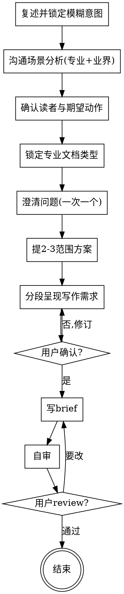

# 明确写作意图：把"要写个文档"变成清晰的写作需求

## 目的

把一句模糊的"帮我写个文档/总结/方案"，变成一份清晰的**写作需求（writing brief）**。只回答一个问题：**这篇文档到底要达成什么**——给谁看、读完要让他做什么、选哪种专业文档类型、必须传达哪些信息点。不回答"正文怎么写"（措辞/章节结构，一律不涉及）、"怎么排版渲染"（Markdown/Confluence，一律不涉及）。

两个核心特征：

1. **独立** —— 只回答"要达成什么写作意图"，不涉及"正文怎么写"（章节结构、措辞、语气细节）和"怎么渲染"（格式/平台）。产出写作需求即完成。
2. **诊断驱动** —— 不是单纯问用户"你想写什么"，而是**先从沟通场景与专业文档类型的通行做法出发分析**：这种场景该写哪类文档、专业版必须传达什么、用户原始表述漏了什么(盲区)、偏在哪(风险)，再带着判断去澄清。

```
模糊题目 ──► [clarify-doc] ──► 清晰写作需求 brief（独立产出）
```

<HARD-GATE>
在写作需求 brief 被用户确认前，不进入任何写作、结构设计或渲染动作（不写正文、不定章节、不出渲染稿）。本 skill 是独立的写作意图澄清环节，不调用任何其他 skill。
</HARD-GATE>

## 反模式：随便写写就行，不用先理清楚

每篇文档都走这个流程。一封周报、一段变更说明、一份会议纪要——都要。"随便写写"恰恰是写完才发现"写错了对象/漏了关键信息/选错了文体"造成最多返工的地方。brief 可以很短（真正简单的文档几句话即可），但必须呈现并获得确认。

## 边界（最重要）

**产出**（意图层）：
- 一句话写作意图（这篇文档解决【谁】的【什么问题】）
- 目标读者（主要 / 次要 / 非目标读者）
- 沟通场景与期望动作（读者读完要做什么决策/动作——这是文档的"验收标准"）
- 专业文档类型（RFC / PRD / ADR / 复盘 / Runbook / 设计文档 / 周报 / 通知…）
- 关键信息点（分组 + 优先级 P0/P1/P2 + 每点简述）
- 篇幅 / 深度、语气（正式 / 内部口语 / 对外公关…）
- 明确不写（Out of scope）
- 渠道 / 格式约束（仅记录用户主动提及的，如"发 Confluence""要能贴企微"）

**不产出**（超出本 skill 范围，记入"未决问题"即可）：
- ❌ 正文措辞：怎么遣词造句、怎么开头结尾、怎么把一句写漂亮
- ❌ 章节结构：分几节、每节标题、信息怎么排序（属 `doc-blueprint`）
- ❌ 表现力选型：这里放图还是表、用什么图表（属 `doc-blueprint`）
- ❌ 渲染格式：Markdown 还是 Confluence、用什么宏/组件（属 `doc-render`）

**越界拉回**：当对话滑向"这一段怎么写""开头怎么起""用表格还是图""发到 Confluence 要什么格式"时，明确说"这超出写作意图澄清的范围，先定清楚写给谁、要达成什么"，记一笔到"未决问题"，不在本阶段展开。完整话术见 `references/clarifying-questions.md`。

## Checklist

为以下每项创建一个 task，按序完成：

1. **复述并锁定模糊意图** —— 用一句话重述用户想写什么、给谁、要达成什么，请用户确认或修正。
2. **沟通场景分析（专业 + 业界做法）** —— 基于专业文档类型的通行做法，分析这种沟通场景的本质、该写哪类文档、专业版必须传达什么、典型读者动作、常见陷阱。识别用户原始表述中的**盲区**（漏掉的关键信息点）与**风险**（选错文体/对象/动作）。把分析发现**呈现给用户**，作为后续澄清的基础。详见 `references/writing-situation-analysis.md`。
3. **确认目标读者与期望动作** —— 谁读、读完要做什么（决策 / 执行 / 知晓 / 说服）。一次一问。**这是文档的验收标准**，先于内容锁定。
4. **锁定专业文档类型** —— 结合场景分析，确认选哪种文档类型（或哪两种混合）。一次一问，多选优先。
5. **澄清问题（一次一个）** —— 带着场景分析的发现，补盲区、纠偏差。多选优先。聚焦：核心信息点、范围边界、篇幅/语气、渠道。详见 `references/clarifying-questions.md`。
6. **提出 2-3 个范围方案** —— 如精简版 / 标准版 / 详尽版，带权衡与推荐，先说推荐项及理由。
7. **呈现清晰写作需求（分段确认）** —— 按"读者与动作 → 文档类型 → 关键信息点 → 篇幅/语气 → out-of-scope"分段，每段问"这部分对吗"。
8. **写写作需求 brief** —— 存到 `docs/`（或用户指定目录），文件名 `YYYY-MM-DD-<主题>-brief.md`，用 `references/brief-template.md` 模板。
9. **自审** —— 消歧、placeholder 扫描、意图可验收（读者动作是否明确可判定）、文体匹配、关键信息点盲区是否都已取舍。发现问题就地修。
10. **用户确认** —— 请用户 review brief，要改则改后重跑自审。
11. **结束** —— brief 确认即完成。本 skill 不调用任何下游 skill；后续如何用这份 brief 由用户决定（可喂给 `doc-blueprint` 写正文）。

## 流程图



**终态是"结束"：写作需求 brief 确认即完成。**

## 自审检查项（Checklist 第 9 步展开）

写完 brief 后用新视角过一遍：

1. **Placeholder 扫描** —— 关键信息点不能含 placeholder（"TBD/待定/之后再说/适当展开"）；真实未决问题必须写成"问题 + 影响 + 后续决策阶段"。
2. **消歧** —— 任何信息点能否被理解成两种意思？能就选一种写明。
3. **意图可验收** —— "读者读完要做什么"是否明确且可判定？（"让领导了解"不可验收；"让领导本周五前批准 50 万预算"可验收。）
4. **文体匹配** —— 选定的文档类型与沟通场景是否匹配？（说服审批 → 立项书/商业论证；事故总结 → 复盘报告；操作指引 → Runbook；日常同步 → 周报。）
5. **关键信息点盲区复查** —— 场景分析指出的专业版必备信息点，是否都已明确"写"或"不写"？
6. **Scope 聚焦** —— 是否聚焦到单一文档意图？多个独立文档（如"又要总结又要培训稿"）需拆分成多份 brief。

发现问题就地修，不必重审。

## 产出文档

存到 `docs/`（或用户指定目录），文件名 `YYYY-MM-DD-<主题>-brief.md`，使用 `references/brief-template.md` 的结构。日期用当天。

## 关键原则

- **诊断驱动** —— 先用沟通场景与专业文体知识审视意图，补盲区、纠偏差，再澄清；不盲目接受用户的初始表述。
- **读者动作即验收** —— 文档的成功标准 = 读者读完做了期望的动作；先锁定动作，再倒推内容。
- **一次一个问题** —— 不堆叠；一个话题要多探，拆成多问。
- **多选优先** —— 比开放式更易答。
- **YAGNI** —— 狠心砍掉可写可不写的信息点；推方案时主动建议精简。
- **只问"要达成什么"，不问"怎么写"** —— 越界即拉回。
- **分段确认** —— 每段呈现后等确认再继续。
- **可回头** —— 任何时候觉得不对，回去澄清。

## 反模式

| 反模式 | 正确做法 |
|--------|----------|
| 不做场景分析，纯靠问用户"你想写什么" | 先用专业+业界做法分析，再带着判断去问 |
| 越界到正文措辞/章节结构 | 拉回，记入未决问题 |
| 越界到表现力选型（图表/排版） | 拉回，超出范围 |
| 越界到渲染格式（Markdown/Confluence 宏） | 拉回，超出范围 |
| 一次问 3-5 个问题 | 一次一个 |
| 读者动作含糊："让领导了解" | 具体到可判定："让领导周五前批准 50 万预算" |
| 没有明确 out-of-scope | 必须列出"明确不写" |
| 跳过读者动作直接列信息点 | 先锁定谁读、读完做什么 |
| 文体选错（事故总结写成项目宣传稿） | 按沟通场景匹配专业文体 |
| 假设并调用某个下游 skill | 本 skill 独立，结束即终止 |

## 参考资源

- **`references/writing-situation-analysis.md`** —— 沟通场景分析怎么做：分析维度、如何呈现、何时需联网，以及**专业文档类型选用决策树**（场景信号 → 文档类型）+ 每类"专业版必备信息点"（用于诊断盲区）
- **`references/brief-template.md`** —— 产出 brief 的完整模板 + 一个端到端示例（事故复盘 brief）
- **`references/clarifying-questions.md`** —— 澄清问题分类、好/坏问题对照、越界拉回话术、范围方案切分模板
