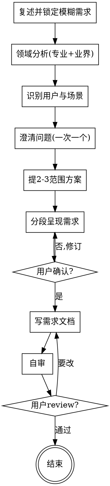

# 明确需求：把模糊想法变成清晰的功能需求

## 目的

把一句模糊的想法，变成一份清晰的**功能需求**。只回答一个问题：**这个东西到底要做什么功能**，不回答"怎么做"（交互布局、UI 视觉、技术架构、数据模型，一律不涉及）。

两个核心特征：

1. **独立** —— 只回答"做什么功能"，不涉及"怎么做"（交互布局、UI 视觉、技术架构一律不碰）。产出需求文档即完成。
2. **专业驱动** —— 不是单纯问用户"想要什么"，而是**先从该领域的专业知识与业界做法出发分析需求**，补盲区、纠偏差，再带着专业判断去澄清。

```
模糊想法 ──► [clarify-requirements] ──► 清晰功能需求文档（独立产出）
```

<HARD-GATE>
在功能需求文档被用户确认前，不进入任何实现、设计或技术方案动作（不写代码、不出原型、不画页面、不定技术栈）。本 skill 是独立的需求澄清环节，不调用任何其他 skill。
</HARD-GATE>

## 反模式：这太简单了，不需要明确需求

每个需求都走这个流程。一个待办列表、一个工具函数、一个配置改动——都要。"简单"需求恰恰是未审视的假设造成最多返工的地方。需求文档可以很短（真正简单的需求几句话即可），但必须呈现并获得确认。

## 边界（最重要）

**产出**（功能层）：
- 一句话目标
- 目标用户与核心场景（谁用、解决什么、何时用）
- 功能清单（分组 + 优先级 P0/P1/P2 + 每功能简述）
- 每个核心功能 1-3 条可验收标准
- 明确不做（Out of scope）
- 非功能约束（仅记录用户主动提及的，如平台/规模）

**不产出**（超出本 skill 范围，记入"未决问题"即可）：
- ❌ 交互细节：页面、按钮、跳转、布局、交互流程
- ❌ 技术方案：架构、数据模型、技术栈、API 设计
- ❌ UI 视觉：配色、字体、组件、动效

**越界拉回**：当对话滑向"页面怎么布局""用什么框架""按钮放哪"时，明确说"这超出需求澄清的范围，先定清楚要哪些功能"，记一笔到"未决问题"，不在本阶段展开。完整话术见 `references/clarifying-questions.md`。

## Checklist

为以下每项创建一个 task，按序完成：

1. **复述并锁定模糊需求** —— 用一句话重述用户想做什么，请用户确认或修正。
2. **领域分析（专业 + 业界做法）** —— 基于该领域的专业知识与业界通行做法，分析这类产品/系统的核心价值要素、标配功能、典型用户旅程、常见陷阱、业界标杆。识别用户原始需求中的**盲区**（漏掉的标配）与**风险**（踩中的陷阱）。把分析发现**呈现给用户**，作为后续澄清的基础。**先在领域知识树中定位最匹配的节点（最具体优先，无内置则回退父类），加载该节点知识作为分析依据**。**节点知识是假设、不是答案**：对其每条标配 / 标杆 / 陷阱，对照用户的具体产品逐条判"适用 / 调整 / 不适用（+原因）"，只呈现过判断的结论；明显不符的标配直说"此产品不需要，因为…"。**禁止整段照搬节点原文**，每条结论都要连回用户提到的具体细节。详见 `references/domain-analysis.md`。
3. **识别目标用户与核心场景** —— 结合领域分析的框架，确认谁用、解决什么问题、什么时候用。一次一问。
4. **澄清问题（一次一个）** —— 带着领域分析的发现，补盲区、纠偏差。多选优先。聚焦：目的、约束、成功标准、范围边界。详见 `references/clarifying-questions.md`。
5. **提出 2-3 个功能范围方案** —— 如 MVP / 标准 / 完整，带权衡与推荐，先说推荐项及理由。
6. **呈现清晰功能需求（分段确认）** —— 按"场景 → 功能分组 → 验收 → out-of-scope"分段，每段问"这部分对吗"。
7. **写功能需求文档** —— 存到 `prd/`（或用户指定目录），文件名 `YYYY-MM-DD-<主题>-requirements.md`，用 `references/requirements-template.md` 模板。
8. **自审** —— 消歧、placeholder 扫描、scope 检查、out-of-scope 是否明确、领域盲区是否都已取舍。发现问题就地修。
9. **用户确认** —— 请用户 review 文档，要改则改后重跑自审。
10. **结束** —— 需求文档确认即完成。本 skill 不调用任何下游 skill；后续如何使用这份需求由用户决定。

## 流程图



**终态是"结束"：需求文档确认即完成。**

## 自审检查项（Checklist 第 8 步展开）

写完文档后用新视角过一遍：

1. **Placeholder 扫描** —— 正文功能不能含 placeholder（如 "TBD/TODO/待定/之后再说/适当处理"）；真实未决问题必须写成"问题 + 影响 + 后续决策阶段"。
2. **消歧** —— 任何功能能否被理解成两种意思？能就选一种写明。
3. **Scope 检查** —— 是否聚焦到单一可实施范围？多个独立子系统需拆分。
4. **Out-of-scope 明确** —— "明确不做"是否列了？是否够狠（YAGNI）？
5. **验收可证** —— 每条验收标准能不能被客观判定通过/不通过？不能就改写。
6. **领域盲区复查** —— 领域分析指出的标配功能，是否都已明确"做"或"不做"？

发现问题就地修，不必重审。

## 产出文档

存到 `prd/`（或用户指定目录），文件名 `YYYY-MM-DD-<主题>-requirements.md`，使用 `references/requirements-template.md` 的结构。日期用当天。

## 关键原则

- **专业驱动** —— 先用领域知识与业界做法审视需求，补盲区、纠偏差，再澄清；不盲目接受用户的初始想法。
- **一次一个问题** —— 不堆叠；一个话题要多探，拆成多问。
- **多选优先** —— 比开放式更易答。
- **YAGNI** —— 狠心砍掉可做可不做的功能；推方案时主动建议精简。
- **只问"做什么"，不问"怎么做"** —— 越界即拉回。
- **分段确认** —— 每段呈现后等确认再继续。
- **可回头** —— 任何时候觉得不对，回去澄清。

## 反模式

| 反模式 | 正确做法 |
|--------|----------|
| 不做领域分析，纯靠问用户"你想要什么" | 先用专业+业界做法分析，再带着判断去问 |
| 越界到页面/按钮/布局 | 拉回，记入未决问题 |
| 越界到架构/技术栈 | 拉回，超出范围 |
| 一次问 3-5 个问题 | 一次一个 |
| 功能含糊："支持课程管理" | 具体到："创建/编辑/删除/归档课程" |
| 没有明确 out-of-scope | 必须列出"明确不做" |
| 跳过场景直接列功能 | 先锁定谁用、何时用 |
| 验收写成"体验要好" | 写成可判定："评分延迟 < 2 秒" |
| 假设并调用某个下游 skill | 本 skill 独立，结束即终止 |

## 参考资源

- **`references/domain-analysis.md`** —— 领域分析怎么做：分析维度、如何呈现、何时需联网，以及**领域知识树（`domains/`）的定位 + 逐层回退**
- **`references/requirements-template.md`** —— 产出文档的完整模板 + 一个端到端示例（口语练习 App）
- **`references/clarifying-questions.md`** —— 澄清问题 6 分类、好/坏问题对照、越界拉回话术、范围方案切分模板
