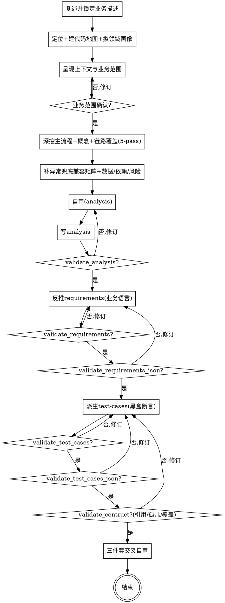

# 分析业务：读懂"代码里这一项业务到底怎么跑的"

## 目的

读代码把一项业务讲清楚，并产出**三件套**（互相回链，`analysis` 是唯一事实源）。**先搞清这个 app 是什么、本业务在领域里的位置，再用业务语言（而非代码术语）讲需求与测试**：

1. **现状分析 `analysis.md`** —— 应用与领域定位 + 由什么触发、经哪些步骤、改了哪些数据、依赖谁、哪里有风险，主流程讲透异常/兜底/兼容，每条结论回链 `file:line`。
2. **反推需求 `requirements.md`** —— PM 视角：为谁解决什么问题、功能清单（优先级 + **业务语言验收标准** + **实现状态** + **实现锚点**）、明确不做、非功能约束、**实现与需求偏差**。
3. **测试用例 `test-cases.md`** —— 覆盖所有需求与边缘 case（Happy / Error / Edge），**Expected Result 用业务可观察断言**，file:line 归实现锚点。

三件套给新人上手 / 重构与技术债评估 / 验收与回归当事实源。

只回答一个问题：**这项业务现在到底是怎么实现的、满足了哪些需求**——不回答"该不该这么设计""要重构成什么样""新产品要做什么功能"。反推的是**已实现的需求**，不是未来需求。

三个核心特征：

1. **读码取证** —— 不照念类名、注释、路由名当结论；每条判断都追到真实调用链或代码行，找不到依据的标 `⚠ 未确认`，绝不混进正文当事实。
2. **单一业务聚焦** —— 只分析用户确认的那一项业务，不蔓延成全系统文档；范围未确认前不产出。
3. **三视角分层回链** —— 现状（analysis）/ 需求（requirements）/ 测试（test-cases）三层各自回链，analysis 是唯一事实源，requirements 与 test-cases 都从它派生并指回它。

```
自然语言业务描述 + 代码库 ──► [code-analyze-business] ──► docs/business-analysis/<日期>-<业务>-{analysis,requirements,test-cases}.md（三件套）
```

<HARD-GATE>
在业务范围（**应用画像 + 领域定位** + 代码地图 + 一句话业务边界）被用户确认前，不进入任何深挖或产出动作（不写分析正文、不画流程图、不定章节、不反推需求）。本 skill 自己产出三件套，不调用任何其他 skill。
</HARD-GATE>

## 反模式：直接照着类名/路由名猜业务

`OrderService` 可能并不处理下单主流程（也许只是订单查询）；`/api/refund` 路由名也不能保证退款逻辑都在它里面。照念类名、路由名、表名当结论，是这类分析最常见的失真。简单业务也要走两段式确认——三件套可以不长，但必须先确认范围、且每条结论都回链代码。

## 边界（最重要）

**产出①（现状层 analysis.md）**：
- 应用与领域定位（应用画像 / 整体架构 / 领域定位 / 行业惯例锚点）、业务概述、触发与入口、核心领域概念、主流程（Mermaid + 回链 + **每步异常/兜底/兼容**）、**异常·兜底·兼容专项矩阵**、**链路覆盖（5-pass：入口/调用链/反向引用/数据副作用/横切）**、数据与存储（**含数据流动图 + 关键字段字典**）、依赖与耦合、风险与技术债、代码地图（详见 `references/analysis-template.md`）

**产出②（反推需求 requirements.md + requirements.json，PM 视角）**：
- 一句话目标、目标用户（主要/次要/**NOT**）、核心场景
- 功能清单 ★（模块表：**REQ id** `REQ-<MODULE>-<n>` + 优先级 P0/P1/P2 + 功能 + 简述 + **验收标准（业务语言，可判定）** + **实现状态** ✅/⚠️/❌ + **实现锚点**）
- 明确不做、非功能约束
- **实现与需求偏差** ★（反推独有：代码做了但需求未必需要的 / 需求该有但代码缺失的）
- 已知缺口（详见 `references/requirements-template.md`）
- **`requirements.json`**：把功能清单结构化为契约源（REQ id 是 test-cases 回链的 join key）

**产出③（测试用例 test-cases.md + test-cases.json）**：
- 按 Module 组织，每个用例 `TC-<MODULE>-<n>` / Type（Happy / Error / Edge）/ Preconditions / Steps / **Expected Result（业务可观察断言）** + **实现锚点（file:line）** / 需求来源（指向**具体功能** REQ id）
- **覆盖规则（`validate_contract.py` 机器校验）**：每个功能 ≥1 用例（孤儿=ERROR）+ Happy/Error/Edge 三类各 ≥1（ERROR）；每功能三类齐全（P0 全三类、P1 Happy+Edge）= WARNING 软提示；analysis 标「有」的完整性项各 ≥1 用例（ERROR，靠 case 的 `covers` 登记）
- **`test-cases.json`**：把用例结构化为契约源（req/type/anchor/covers），让覆盖与引用完整性可精确校验（详见 `references/test-cases-template.md`）

**不产出**（超出本 skill 范围，记入"已知缺口"即可）：
- ❌ 重构方案或新设计：只记现状与风险，不提"应该怎么改"
- ❌ **正向新产品需求**：反推的是**已实现的需求**，不是 clarify-requirements 的"要做什么"
- ❌ 可执行测试代码：只产语言无关的自然语言用例（栈绑定的 Playwright 代码是 web-test-case-man 的事）
- ❌ 渲染排版：多后端渲染是 doc-render 的事
- ❌ 全系统文档：只聚焦确认的那一项业务

**越界拉回**：当对话滑向"这块该不该重构成 XX""加个新功能""这份文档要发 Confluence 什么格式""帮我写 pytest"时，明确说"这超出业务分析的范围，只记录现状与缺口"，记一笔到"已知缺口"，不在本阶段展开。

## Checklist

为以下每项创建一个 task，按序完成：

1. **复述业务描述 + 索取业务文档** —— 用一句话重述要分析哪项业务请用户确认；同时**主动询问用户有无业务/行业文档（PRD / 合规 / 风控 / 行业规范），有则要内容或文件路径**（领域通用知识获取链第 ① 级，见 `references/domain-profiling.md §三`）。
2. **定位 + 建代码地图 + 拟应用/领域画像（只读不深挖）** —— 从自然语言定位业务入口，建代码地图（关键文件 + 入口 `file:line` + 职责，**入口清单即第 4 步 Pass 1「候选入口」雏形**）；读仓库信号拟应用画像 / 整体架构 / 领域定位；**行业惯例锚点按获取链取**（用户文档 > 模型推断明牌待确认），frontmatter 记 `domain_source`。详见 `references/locating-business.md` + `references/domain-profiling.md`。
3. **两段式确认（HARD-GATE）** —— 把应用画像 + 领域定位 + **行业惯例锚点（含来源 `domain_source`）** + 代码地图 + 一句话业务范围（触发词 X / 入口 Y / 边界含 A 不含 B）呈现给用户确认；**模型推断的领域知识逐条待用户确认**。未确认不进下一步。最大风险是"找错业务 / 领域判断偏"，这一步专门拦它。
4. **深挖主流程 + 领域概念 + 链路覆盖** —— 在确认后的边界内，追踪主流程调用链、识别核心领域概念与状态机；**主流程每步讲透决策 + 适用项的异常/兜底/兼容**，不能只写"调了谁"。**同时按 `references/coverage-strategy.md` 硬性做 5 个 pass（入口/调用链/反向引用/数据副作用/横切）：先检测 LSP（有则用 incomingCalls/references/implementations 取证；无则在对话里给安装建议并等用户回复，否则 rg 降级），结果按 纳入/排除/待确认 收进 analysis「链路覆盖」节。** 详见 `references/tracing-flow.md` + `references/coverage-strategy.md`。
5. **补全异常·兜底·兼容矩阵 + 数据/依赖/风险** —— 把散落的异常处理 / 兜底链路 / 兼容逻辑收敛进 §5 矩阵（三类各 ≥1 行）；再逐项过完整性清单（异常分支/触发条件/并发时序/外部依赖/幂等），每项给出"有/无/不适用 + 依据"。详见 `references/quality-rules.md`。
6. **自审（analysis）** —— 回链完整性、完整性清单 5 项、图有依据（0 臆造边）、banned 词、未确认隔离。发现问题就地修。详见 `references/quality-rules.md`。
7. **产出 analysis.md** —— 用 `references/analysis-template.md`，写到 `docs/business-analysis/YYYY-MM-DD-<业务名>-analysis.md`。跑本 skill 的 `scripts/validate_analysis.py`（脚本实际路径见下「产出文档」），通过才进下一步。
8. **反推需求 requirements.md + requirements.json** —— analysis 通过后，按 `references/reverse-prd.md` 把现状翻译成 PM 视角需求（对齐 `references/requirements-template.md`：功能清单每行 **验收标准用业务语言、代码归「实现锚点」列** + 实现状态 ✅/⚠️/❌；写「实现与需求偏差」节；借领域定位 / 行业惯例判断"应有"）。写到 `docs/business-analysis/YYYY-MM-DD-<业务名>-requirements.md`，跑本 skill 的 `scripts/validate_requirements.py`（实际路径见下「产出文档」）。**同步产出 `YYYY-MM-DD-<业务名>-requirements.json`**——把 §4 功能清单结构化为机器校验契约源，**每条功能给稳定 `REQ-<MODULE>-<n>` id**（test-cases 回链的 join key），跑 `scripts/validate_requirements_json.py`。两个都通过才进下一步。
9. **派生测试用例 test-cases.md + test-cases.json** —— 按 `references/test-case-generation.md`，从 requirements + analysis 生成覆盖所有需求与边缘 case 的用例（对齐 `references/test-cases-template.md`：**Expected Result 用业务可观察断言 + 独立「实现锚点」行**，`需求来源` 指向**具体功能** REQ id）。写到 `docs/business-analysis/YYYY-MM-DD-<业务名>-test-cases.md`，跑本 skill 的 `scripts/validate_test_cases.py`。**同步产出 `YYYY-MM-DD-<业务名>-test-cases.json`**（每条用例的 req/type/anchor/covers 结构化），跑 `scripts/validate_test_cases_json.py`。
10. **契约校验 + 三件套交叉自审 + 交付** —— 先跑 `scripts/validate_contract.py <requirements.json> <test-cases.json> <analysis.md>`（机器校验**引用完整性**：用例 req 指向真实功能；**孤儿功能**：每个功能有用例；**全局三类齐全**；**完整性覆盖**：analysis 标「有」的项有用例）。通过后再做人工交叉自审：回链一致性（requirements/test-cases 都指回 analysis、用例指回需求项 REQ-...）、完整性映射、未确认隔离（⚠ 未确认 三文件均有对应缺口登记）。md + json + contract 全部通过即完成。

## 流程图



**终态是"结束"：三件套均通过各自校验、交叉自审一致即完成。**

## 自审检查项

### analysis 自审（Checklist 第 6 步展开）

写完 analysis 后用新视角过一遍：

1. **回链完整性** —— 每条结论能否指到 `file:line`？指不到的必须标 `⚠ 未确认`，不能当事实写。
2. **完整性自检 5 项** —— 异常分支 / 触发条件 / 并发时序 / 外部依赖 / 幂等，每项是否在「完整性自检」节显式标注"有/无/不适用 + 依据"，不留空（脚本硬卡）。
3. **图有依据** —— Mermaid 图里每条边是否对回下方文字的真实调用链？0 臆造边。
4. **Banned 词** —— 全文是否含"体验好/功能完善/适当处理/待定/很重要"等空话？有就改成具体可核的说法。
5. **未确认隔离** —— 推断与代码事实是否分清？推断都标了 `⚠ 未确认` 且在"已知缺口"里有对应条目。
6. **主流程深度 + 矩阵 + 领域 preamble** —— 主流程每步是否讲了决策 + 适用项的异常/兜底/兼容（不只"调了谁"）？§5 异常·兜底·兼容矩阵是否三类各有行、每行回链？应用与领域定位 preamble 是否写了应用画像/架构/领域定位/行业惯例锚点？
7. **链路覆盖 5-pass + 数据流动图** —— analysis 是否有「链路覆盖」节、5 个 pass 逐项声明 候选→纳入/排除/待确认 且每项回链（脚本 R-L4 硬卡）？§6 是否有数据流动图（区别于状态机图）+ 关键字段字典（脚本 R-M2/R-D1 软卡）？LSP/rg 取证手段是否标注？

### 三件套交叉自审（Checklist 第 10 步展开）

1. **回链拓扑** —— requirements/test-cases 的 frontmatter 都声明了 `source_analysis`？test-cases 声明了 `source_requirements`？每个用例标了 `需求来源: REQ-...`？
2. **需求→用例映射** —— requirements §4 每个功能（尤其 P0/P1）在 test-cases 里都有对应用例？analysis 完整性 5 项每项都有对应用例？
3. **实现状态一致** —— requirements 的 ✅/⚠️/❌ 与 analysis 描述吻合？❌ 缺口在 analysis「已知缺口」有对应？
4. **未确认贯通** —— 三文件里的 `⚠ 未确认` 是否都在各自「已知缺口」登记？`gaps` 计数对得上？

发现问题就地修，不必重审。

## 产出文档

三件套 md + 两份 JSON 契约源存到 `docs/business-analysis/`，共享 `<日期>-<业务名>` 前缀（业务名用 kebab-case 英文，日期用当天）：

- `YYYY-MM-DD-<业务名>-analysis.md`（现状，用 `references/analysis-template.md`）
- `YYYY-MM-DD-<业务名>-requirements.md`（反推需求，用 `references/requirements-template.md`）
- `YYYY-MM-DD-<业务名>-requirements.json`（**功能清单契约源**：每条功能带稳定 `REQ-<MODULE>-<n>` id）
- `YYYY-MM-DD-<业务名>-test-cases.md`（测试用例，用 `references/test-cases-template.md`）
- `YYYY-MM-DD-<业务名>-test-cases.json`（**用例契约源**：每条用例的 req / type / anchor / covers）

md 是给人读的渲染，json 是给校验器读的契约源，**两者必须一致**（json validator 会对账）。交付前各自跑校验脚本且合格。校验脚本在本 skill 的 `scripts/` 目录（与 SKILL.md 同级）——**不要假设当前目录是仓库根**：作为 corin 插件加载时路径为 `${CLAUDE_PLUGIN_ROOT}/skills/code-analyze-business/scripts/`，否则按本 SKILL.md 所在目录拼出同级 `scripts/` 的绝对路径再运行。

```bash
V="${CLAUDE_PLUGIN_ROOT}/skills/code-analyze-business/scripts"   # 非插件：用本 SKILL.md 同级 scripts/ 的绝对路径
python3 "$V/validate_analysis.py"            <analysis.md>
python3 "$V/validate_requirements.py"        <requirements.md>
python3 "$V/validate_requirements_json.py"   <requirements.json> <requirements.md>
python3 "$V/validate_test_cases.py"          <test-cases.md>
python3 "$V/validate_test_cases_json.py"     <test-cases.json>   <test-cases.md>
python3 "$V/validate_contract.py"            <requirements.json> <test-cases.json> <analysis.md>
```

## 反模式

| 反模式 | 正确做法 |
|--------|----------|
| 照念类名/路由名/表名当结论 | 追真实调用链，回链 `file:line` |
| 跳过两段式确认直接产出 | 业务范围确认前禁止深挖与产出 |
| 缺应用/领域定位，贴着代码功能列需求 | 先拟应用画像 + 领域定位 + 行业惯例锚点并确认，再反推 |
| 主流程只写"调了 X + file:line" | 每步讲决策 + 适用项的异常/兜底/兼容，收进 §5 矩阵 |
| 画代码里没有的边/节点 | 图每条边对回下方文字的真实调用 |
| 结论无回链 | 回链代码，或标 `⚠ 未确认` |
| 蔓延成全系统文档 | 只聚焦用户确认的那一项业务 |
| 只产 analysis，漏 requirements/test-cases | 三件套是默认完整产出 |
| 反推需求写成"要做的新功能" | 只反推已实现的需求，正向需求归 clarify-requirements |
| requirements 验收标准写空话 / 写满代码术语 | 写业务可观测断言（"仅'已支付'订单可退，金额 ≤ 可退余额"）；代码符号归「实现锚点」列 |
| 不写「实现与需求偏差」节 | 反推 PRD 必有偏差节（过度实现 / 需求缺口） |
| test-cases 的 Expected Result 写表名/状态码/异常类 | Expected Result 用业务可观察断言；file:line 放独立「实现锚点」行 |
| 生成 Playwright/pytest 可执行代码 | 只产语言无关自然语言用例，可执行代码归栈绑定下游 |
| test-cases 写"点击按钮 / 调 DOM"等绑栈 UI 动作 | 用例写业务行为 + 状态/数据，语言无关、不绑 UI 框架 |
| 只追确认的那一条主链路，漏其他入口/触发旁路/数据副作用/横切逻辑 | 按 5-pass 覆盖（入口/调用链/反向引用/数据副作用/横切），逐项 纳入/排除/待确认 + 回链 |
| LSP 不可用就放弃符号覆盖 | 先检测；不可用时在对话里建议安装并等用户回复，否则 rg 文本搜索降级并在节内标注 |
| 假设并调用某个下游 skill | 本 skill 独立，结束即终止 |

## 参考资源

**analysis（现状层）**
- **`references/domain-profiling.md`** —— 怎么读仓库信号拟应用画像 + 整体架构 + 领域定位 + 行业惯例锚点（**含领域通用知识两级获取链 + 前置询问 + 模型兜底明牌待确认**），第 1/2 步用
- **`references/locating-business.md`** —— 怎么从自然语言定位业务入口 + 建代码地图，Checklist 第 2 步用
- **`references/tracing-flow.md`** —— 怎么追踪主流程/数据流、识别领域概念、Mermaid 选型与图文双轨、**主流程每步异常/兜底/兼容**、回链格式，第 4 步用
- **`references/coverage-strategy.md`** —— 5-pass 链路覆盖（入口/调用链/反向引用/数据副作用/横切）+ LSP 检测/使用/降级协议（先检测→有则用足→无则对话建议安装等用户回复→否则 rg 降级），第 4 步用
- **`references/analysis-template.md`** —— 现状文档完整模板（frontmatter 含领域字段 + 领域定位 preamble + 9 章节 + 异常·兜底·兼容矩阵）+ 端到端示例（订单退款）
- **`references/quality-rules.md`** —— 防臆造 3 原则、完整性自检清单 5 项、banned 词、专业规则（含业务语言/代码分层、主流程深度），第 5/6 步用

**requirements（反推需求层）**
- **`references/requirements-template.md`** —— 反推需求文档模板（frontmatter + 8 节，含实现状态列与偏差节，**验收标准业务语言 + 实现锚点列**）+ 端到端示例，第 8 步用
- **`references/reverse-prd.md`** —— 现状→PM 需求的翻译规则、**验收标准用业务语言（代码归实现锚点）**、实现状态判定、偏差分析方法，第 8 步用

**test-cases（测试层）**
- **`references/test-cases-template.md`** —— 测试用例文档模板（frontmatter + 模块化结构，**Expected Result 黑盒 + 实现锚点行**）+ 端到端示例，第 9 步用
- **`references/test-case-generation.md`** —— 覆盖规则、边缘 case 推导清单、完整性 5 项→用例映射、**黑盒断言写法**，第 9 步用

**校验脚本**
- `scripts/validate_analysis.py` —— analysis 现状层交付前必跑
- `scripts/validate_requirements.py` / `validate_requirements_json.py` —— requirements 的 md 渲染 + json 契约源
- `scripts/validate_test_cases.py` / `validate_test_cases_json.py` —— test-cases 的 md 渲染 + json 契约源
- `scripts/validate_contract.py` —— req.json ↔ test-cases.json 跨文件契约（引用完整性 / 孤儿功能 / 覆盖 / 完整性）
