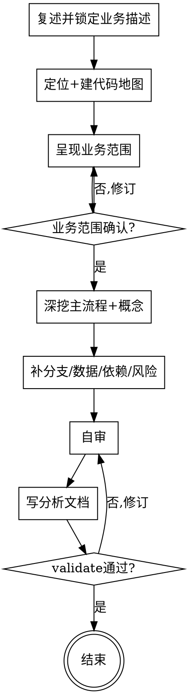

# 分析业务：读懂"代码里这一项业务到底怎么跑的"

## 目的

读代码把一项业务讲清楚：由什么触发、经哪些步骤、改了哪些数据、依赖谁、哪里有风险。产出一份每条结论都能回链到 `file:line` 的分析文档，给新人上手 / 重构与技术债评估 / 测试用例编写当事实源。

只回答一个问题：**这项业务现在到底是怎么实现的**——不回答"该不该这么设计""要重构成什么样""新产品要做什么功能"。

两个核心特征：

1. **读码取证** —— 不照念类名、注释、路由名当结论；每条判断都追到真实调用链或代码行，找不到依据的标 `⚠ 未确认`，绝不混进正文当事实。
2. **单一业务聚焦** —— 只分析用户确认的那一项业务，不蔓延成全系统文档；范围未确认前不产出。

```
自然语言业务描述 + 代码库 ──► [code-analyze-business] ──► docs/business-analysis/<日期>-<业务>-analysis.md（独立产出）
```

<HARD-GATE>
在业务范围（代码地图 + 一句话业务边界）被用户确认前，不进入任何深挖或产出动作（不写分析正文、不画流程图、不定章节）。本 skill 是独立的代码业务分析环节，不调用任何其他 skill。
</HARD-GATE>

## 反模式：直接照着类名/路由名猜业务

`OrderService` 可能并不处理下单主流程（也许只是订单查询）；`/api/refund` 路由名也不能保证退款逻辑都在它里面。照念类名、路由名、表名当结论，是这类分析最常见的失真。简单业务也要走两段式确认——分析文档可以不长，但必须先确认范围、且每条结论都回链代码。

## 边界（最重要）

**产出**（分析层）：
- 业务概述（这项业务是什么、在产品里的位置）
- 触发与入口（路由/事件/定时/手动 + 入口代码位置）
- 核心领域概念（实体、术语表、状态机）
- 主流程（happy path，Mermaid 图 + 逐步骤回链）
- 分支与异常（决策分支、错误路径、边界条件）
- 数据与存储（读写的表/模型、关键字段、数据流转）
- 依赖与耦合（上游调用者、下游依赖、外部服务、紧耦合点）
- 风险与技术债（脆弱点、已知坑、改动影响面、并发/时序隐患）
- 代码地图（关键文件清单 + 职责 + 行号锚点）

**不产出**（超出本 skill 范围，记入"已知缺口"即可）：
- ❌ 重构方案或新设计：只记现状与风险，不提"应该怎么改"
- ❌ 新产品需求：这是对已实现业务的逆向分析，不是 clarify-requirements
- ❌ 渲染排版：多后端渲染是 doc-render 的事
- ❌ 全系统文档：只聚焦确认的那一项业务

**越界拉回**：当对话滑向"这块该不该重构成 XX""加个新功能""这份文档要发 Confluence 什么格式"时，明确说"这超出业务分析的范围，只记录现状与风险"，记一笔到"已知缺口"，不在本阶段展开。

## Checklist

为以下每项创建一个 task，按序完成：

1. **复述并锁定业务描述** —— 用一句话重述要分析哪项业务，请用户确认或修正。
2. **定位 + 建代码地图（只读不深挖）** —— 从自然语言定位业务入口，建一张代码地图（关键文件 + 入口 `file:line` + 职责）。详见 `references/locating-business.md`。
3. **两段式确认（HARD-GATE）** —— 把代码地图 + 一句话业务范围（触发词 X / 入口 Y / 边界含 A 不含 B）呈现给用户确认。未确认不进下一步。最大风险是"找错业务"，这一步专门拦它。
4. **深挖主流程 + 领域概念** —— 在确认后的边界内，追踪主流程调用链、识别核心领域概念与状态机。详见 `references/tracing-flow.md`。
5. **补全分支/异常 + 数据/依赖 + 风险** —— 逐项过完整性清单（异常分支/触发条件/并发时序/外部依赖/幂等），每项给出"有/无/不适用 + 依据"。详见 `references/quality-rules.md`。
6. **自审** —— 回链完整性、完整性清单 5 项、图有依据（0 臆造边）、banned 词、未确认隔离。发现问题就地修。详见 `references/quality-rules.md`。
7. **产出文档** —— 用 `references/analysis-template.md`，写到 `docs/business-analysis/YYYY-MM-DD-<业务名>-analysis.md`（业务名用 kebab-case 英文，日期用当天）。跑 `python skills/code-analyze-business/scripts/validate_analysis.py <文件>`，通过才交付。
8. **结束** —— 文档交付即完成。本 skill 不调用任何下游 skill；这份文档可作 `clarify-doc`/`doc-blueprint` 的事实源输入，但由用户决定后续。

## 流程图



**终态是"结束"：分析文档通过校验即完成。**

## 自审检查项（Checklist 第 6 步展开）

写完文档后用新视角过一遍：

1. **回链完整性** —— 每条结论能否指到 `file:line`？指不到的必须标 `⚠ 未确认`，不能当事实写。
2. **完整性自检 5 项** —— 异常分支 / 触发条件 / 并发时序 / 外部依赖 / 幂等，每项是否在「完整性自检」节显式标注"有/无/不适用 + 依据"，不留空（脚本硬卡）。
3. **图有依据** —— Mermaid 图里每条边是否对回下方文字的真实调用链？0 臆造边。
4. **Banned 词** —— 全文是否含"体验好/功能完善/适当处理/待定/很重要"等空话？有就改成具体可核的说法。
5. **未确认隔离** —— 推断与代码事实是否分清？推断都标了 `⚠ 未确认` 且在"已知缺口"里有对应条目。

发现问题就地修，不必重审。

## 产出文档

存到 `docs/business-analysis/`，文件名 `YYYY-MM-DD-<业务名>-analysis.md`（业务名用 kebab-case 英文，与 `-requirements.md`/`-brief.md` 同系列），使用 `references/analysis-template.md` 的结构。日期用当天。交付前必须跑 `python skills/code-analyze-business/scripts/validate_analysis.py <文件>` 且合格。

## 关键原则

- **两段式确认** —— 先建地图 + 陈述范围请用户确认，再深挖；最大失败模式是找错业务。
- **读码取证** —— 每条结论回链 `file:line`；无依据标 `⚠ 未确认`，不臆造。
- **图文双轨** —— 图给骨架直觉，下方文字逐步骤回链；图里每条边都要有代码佐证。
- **单一业务聚焦** —— 只分析确认的那一项，不蔓延全系统。
- **只说现状不说方案** —— 记录"现在怎么跑的"与风险，不提"该重构成什么"。
- **语言无关** —— 前后端自适应，按实际代码判断"业务"颗粒度。

## 反模式

| 反模式 | 正确做法 |
|--------|----------|
| 照念类名/路由名/表名当结论 | 追真实调用链，回链 `file:line` |
| 跳过两段式确认直接产出 | 业务范围确认前禁止深挖与产出 |
| 画代码里没有的边/节点 | 图每条边对回下方文字的真实调用 |
| 结论无回链 | 回链代码，或标 `⚠ 未确认` |
| 蔓延成全系统文档 | 只聚焦用户确认的那一项业务 |
| 提"这块该重构成 X" | 只记现状与风险，方案留给后续 |
| 用"体验好/很重要/适当处理"等空话 | 改成具体可核的说法 + 回链 |
| 假设并调用某个下游 skill | 本 skill 独立，结束即终止 |

## 参考资源

- **`references/locating-business.md`** —— 怎么从自然语言定位业务入口 + 建代码地图（按入口形态分诊、识别前后端颗粒度），Checklist 第 2 步用
- **`references/tracing-flow.md`** —— 怎么追踪主流程/数据流、识别领域概念、Mermaid 选型与图文双轨规范、回链格式，Checklist 第 4 步用
- **`references/analysis-template.md`** —— 产出文档的完整模板（frontmatter + 9 章节）+ 一个端到端示例（订单退款）
- **`references/quality-rules.md`** —— 防臆造 3 原则、完整性自检清单 5 项、banned 词、专业 6 规则，Checklist 第 5/6 步用
