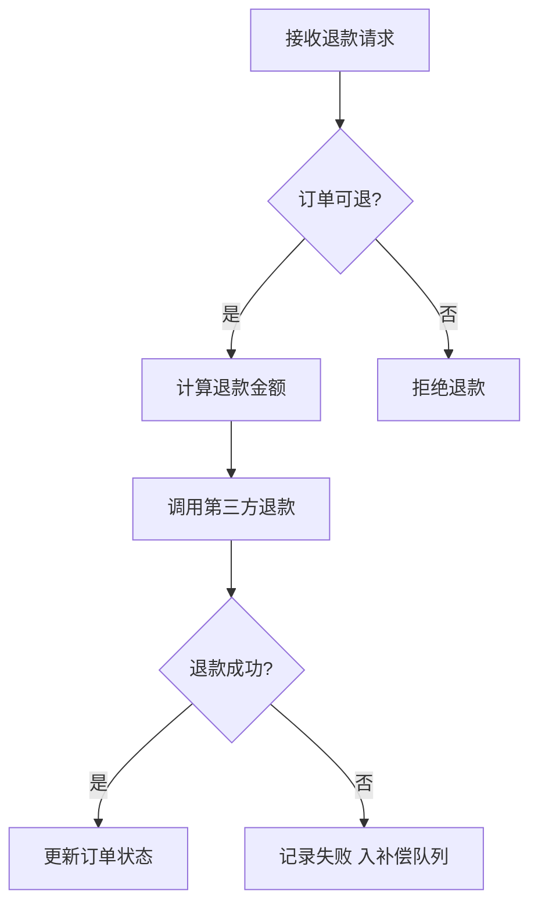
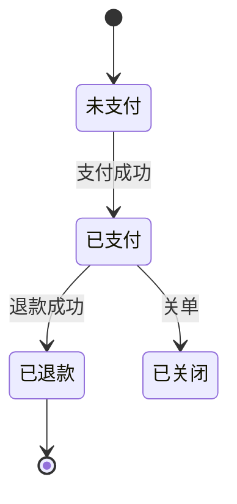

# 订单退款业务分析

> 示例产出（代码路径为虚构），用于演示 `code-analyze-business` skill 的产出形态，也可作 `clarify-doc` / `doc-blueprint` 的事实源输入。

## 应用与领域定位

- **应用画像**：面向 C 端用户的电商订单中台，核心是订单全生命周期管理 —— 线索 `README.md` / `package.json`。
- **整体架构**：Vue 前端调 Python 单体后端，外部依赖支付中心与物流，Redis 做缓存与分布式锁 —— 线索顶层目录 `web/` + `src/{api,service,repo,clients}`。
- **领域定位**：退款是订单生命周期「售后」段的终态能力，前置依赖支付成功（订单置"已支付"），后接触资损结算 —— 入口 `src/api/refund.py:42`。
- **行业惯例锚点**（⚠ 未确认 · 模型推断 · 待用户确认）：资金原路退回、不可超额/重复退款、需留退款单可追溯 —— 依据：模型对电商退款行业的常识，作反推尺子，须与业务方逐条确认。

## 1. 业务概述

承接领域定位：退款是订单生命周期的终态之一。用户对一笔已支付订单发起退款，系统校验可退条件（状态、金额），调用第三方支付执行真实退款，再把订单置为"已退款"。 —— 入口 `src/api/refund.py:42`

## 2. 触发与入口

- 触发方式：HTTP 接口，用户在前端"订单详情 → 申请退款"点击（`submitRefund`）触发 —— `web/views/order/Refund.vue:28`
- 入口：`POST /api/orders/{order_id}/refund` → `refund_handler()` —— `src/api/refund.py:42`

## 3. 核心领域概念

- **退款单（RefundRecord）**：一次退款申请的聚合根，记录退款金额、状态、关联订单 —— `src/model/refund_record.py:12`
- **可退余额**：订单已支付金额扣减已退款部分的余额，决定本次能退多少 —— `src/service/refund_service.py:110`
- **订单状态（OrderStatus）**：枚举 `未支付(0)/已支付(1)/已退款(4)/已关闭(9)` —— `src/model/order.py:8`

## 4. 主流程 ★

<!-- evidence: refund_handler @ src/api/refund.py:42 → RefundService.refund @ src/service/refund_service.py:88 → PaymentClient.call_refund @ src/clients/payment_client.py:55 -->

1. **接收退款请求** —— 校验入参（order_id、金额）非空合法 …… `src/api/refund.py:42`
   - 异常：入参缺失/非法时拦截，不进入业务逻辑 …… `src/api/refund.py:44`
   - 兜底：无；兼容：无
2. **订单可退?** —— 查订单状态，仅"已支付(1)"可退 …… `src/service/refund_service.py:95`
   - 异常：状态非"已支付"抛 `OrderNotRefundableError`，拒绝退款 …… `src/service/refund_service.py:97`
   - 兜底：无；兼容：无
3. **计算退款金额** —— 按业务规则区分全额/部分退款，取本次应退金额（≤ 可退余额）…… `src/service/refund_service.py:110`
   - 异常：金额 > 可退余额时直接拒绝，不进入后续调用 …… `src/service/refund_service.py:112`
   - 兜底：无（拒绝即终止）
   - 兼容：历史订单无退款单记录时按"全额可退"处理（规则未明确，见 §5 矩阵）…… `src/service/refund_service.py:114`
4. **调用第三方退款** —— 把应退金额交给支付中心执行真实退款 …… `src/clients/payment_client.py:55`
   - 异常：第三方返回失败码 → 置退款单"失败"，不向用户抛错 …… `src/service/refund_service.py:138`
   - 兜底：失败入补偿队列，由外部 job 重试（重试上限不在本业务内，见 §5 矩阵）…… `src/service/refund_service.py:138`
   - 兼容：无
5. **更新订单状态** —— 退款成功后置订单为"已退款(4)" …… `src/repo/order_repo.py:120`
   - 异常：无；兜底：无；兼容：无

## 5. 异常 · 兜底 · 兼容（专项矩阵）

| 类型 | 触发条件 | 处理 / 兜底方式 | 用户·系统后果 | 实现锚点 |
|------|----------|----------------|--------------|----------|
| 异常处理 | 入参缺失/非法 | 参数校验拦截，返回 400 | 用户看到"参数错误"，不进入退款 | `src/api/refund.py:44` |
| 异常处理 | 订单状态非"已支付" | 抛 `OrderNotRefundableError`，返回 400 | 用户看到"订单不可退"，订单状态不变 | `src/service/refund_service.py:97` |
| 异常处理 | 退款金额 > 可退余额 | 直接拒绝 | 用户看到"超可退余额"，不调第三方 | `src/service/refund_service.py:112` |
| 兜底逻辑 | 第三方退款失败 | 置退款单"失败"并入补偿队列，外部 job 重试 | 用户不感知失败，订单保持"已支付"；重试上限未在本业务内 ⚠ 未确认 | `src/service/refund_service.py:138` |
| 兼容逻辑 | 历史订单无退款单记录 | 按"全额可退"计算可退余额 | 老订单仍可退款；该兼容规则未在代码明确 ⚠ 未确认 | `src/service/refund_service.py:114` |

## 6. 数据与存储

- 读：从 `orders` 表取订单（状态、金额）…… `src/repo/order_repo.py:60`
- 改：写 `refund_records` 表（退款单状态）、更新 `orders.status` —— `src/repo/order_repo.py:120`

<!-- evidence: OrderStatus 赋值点 @ src/service/refund_service.py:95 (校验) / :135 (退款后) / src/repo/order_repo.py:120 (落库) -->

## 7. 依赖与耦合

- 上游：前端退款页（`web/views/order/Refund.vue`）调本接口 —— 跨边界点 `src/api/refund.py:42`
- 下游 / 外部：依赖支付中心 `PaymentClient`，超时 3s、失败重试 2 次 —— `src/clients/payment_client.py:55`

## 8. 风险与技术债

- **重复退款（并发 / 幂等）** → 同一订单并发退款可能双退；当前用 `refund_lock`（Redis 分布式锁）串行化 + `refund_records` 的 order_id 唯一索引共同保证幂等，key=order_id —— `src/service/refund_service.py:160`
- **部分退款拆单规则** → 是否支持一笔订单分多次部分退，规则未在代码中明确 ⚠ 未确认 —— `src/service/refund_service.py:110`
- **外部依赖补偿** → 支付中心超时后仅入补偿队列，补偿逻辑未在本业务内，依赖外部 job（重试上限见 §5 矩阵 / 已知缺口）—— `src/service/refund_service.py:138`

## 9. 代码地图

| 角色 | 关键位置 | 职责 |
|------|----------|------|
| HTTP 入口 | `src/api/refund.py:42` | 接收退款请求、参数校验 |
| 领域服务 | `src/service/refund_service.py:88` | 退款决策、金额计算、并发控制 |
| 数据访问 | `src/repo/order_repo.py:120` | 改订单状态 |
| 外部依赖 | `src/clients/payment_client.py:55` | 调用第三方支付退款 |
| 模型 | `src/model/refund_record.py:12` | 退款单聚合根 |

## 完整性自检

- 异常分支：有 —— 订单不可退抛 `OrderNotRefundableError` `src/service/refund_service.py:97`；退款失败入补偿队列 `src/service/refund_service.py:138`
- 触发条件：有 —— 仅"已支付(1)"订单可退 `src/service/refund_service.py:95`
- 并发时序：有 —— `refund_lock` 串行化防双退 `src/service/refund_service.py:160`
- 外部依赖：有 —— 支付中心超时 3s、重试 2 次 `src/clients/payment_client.py:55`
- 幂等：有 —— `refund_records` 的 order_id 唯一索引保证幂等 `src/service/refund_service.py:160`

## 已知缺口

- **部分退款拆单规则**：`refund_service.py:110` 处的金额计算未体现是否支持拆单，需找产品 / 历史 PR 确认；当前按"单次全额或单次部分"理解。
- **补偿逻辑归属与重试上限**：`refund_service.py:138` 失败后入补偿队列，但补偿 job 不在本业务代码内，未追踪其重试上限与放弃条件。
- **历史订单兼容规则**：`refund_service.py:114` 对无退款单记录的老订单按全额可退处理，规则未在代码注释明确，需确认是否为有意兼容。
- **行业惯例锚点（模型推断）**：电商退款的行业惯例（原路退回、不可超额/重复、可追溯）来自模型推断而非用户业务文档，须与业务方逐条确认是否适用本项目。
