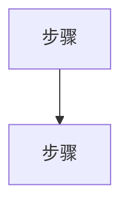
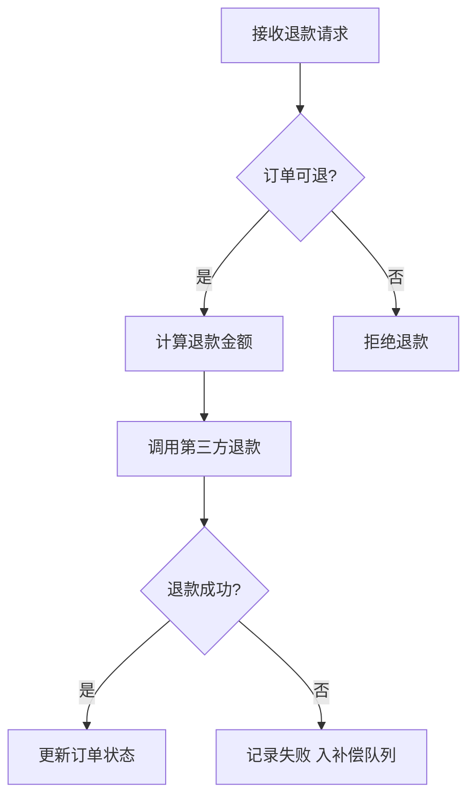
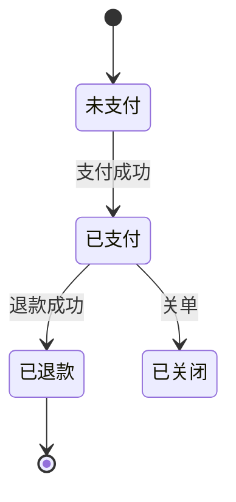

# 业务分析文档模板

> 本 skill 的现状产出物统一用此结构。**只描述"这项业务现在怎么实现的"，每条结论回链 `file:line`；不提重构方案、不写新产品需求。**
> 找不到代码依据的判断标 `⚠ 未确认`，并在末尾"已知缺口"登记。
> 本文件是三件套的**事实源**：`requirements.md`（反推需求）与 `test-cases.md`（测试用例）都从它派生并指回它的章节/`file:line`。

---

## 一、模板

### frontmatter（轻量 YAML）

```yaml
---
business: refund              # 业务名，kebab-case 英文
title: 订单退款业务分析        # 中文标题
summary: 用户对已支付订单发起退款，系统校验后调第三方退款并更新订单状态   # 一句话概述
codebase: order-service        # 代码库 / 仓库或子路径
entry_type: http               # 触发类型：http / mq / scheduled / event / cli / manual
app_domain: 电商               # ★ app 所属领域（推断，见 domain-profiling.md）
app_profile: 面向 C 端用户的电商订单中台   # ★ 一句话：这个 app 是什么、面向谁
architecture: Vue 前端 + Python 单体后端 + 第三方支付/物流   # 整体架构（一句话，技术形态与边界）
domain_anchor: 退款须原路退回、不可超额/重复、需留退款单可追溯 ⚠ 未确认   # 行业惯例锚点（作反推尺子，推断）
analyzed_at: 2026-06-16        # 分析日期
status: confirmed              # draft / confirmed / example（示例产出）
open_questions: 2              # 未确认项数量（对应正文 ⚠ 未确认 处数）
---
```

> `app_domain` / `app_profile` 必填（validator 硬卡）；`architecture` / `domain_anchor` 强烈建议填，推断的标 `⚠ 未确认`。这四项是领域 framing，喂给 requirements/test-cases 用业务语言。
> 不放 datasets/figures。这份文档是给人和下游 skill 读的业务事实源；若要喂 `doc-blueprint` 做渲染投影，由 doc-blueprint 写正文时再声明其单一源。反推需求与测试用例由本 skill 在 analysis 通过后自行产出（见 `requirements-template.md` / `test-cases-template.md`）。

### 正文章节（preamble + 9 节 + 已知缺口）

> 每节给"写什么 / 回链要求"。标 ★ 的是核心章节。Mermaid 图**围栏外上一行**必须带 `<!-- evidence: ... -->` 注释，说明图的依据（HTML 注释在 markdown 层隐藏、不影响 mermaid 渲染，供校验脚本抓取）。

#### 应用与领域定位（正文最前，§1 之前的 preamble）
<!-- 先知道这个 app 是什么、整体架构、本业务在领域里的位置、行业惯例。见 references/domain-profiling.md。推断项标 ⚠ 未确认。 -->
- **应用画像**：<一句话：app 是什么、面向谁> —— <线索：README / manifest / 目录>
- **整体架构**：<技术形态与边界，一句话> —— <线索：目录结构 / 依赖>
- **领域定位**：<本业务在 app/领域里的位置（前置/后继）> —— <回链入口或核心服务 `路径:行号`>
- **行业惯例锚点**：<该领域通行规则 / 合规底线> ⚠ 未确认（仅作反推尺子）

#### 1. 业务概述
<!-- 这项业务是什么、解决什么问题、在产品里的位置。2-4 句。开头一句呼应 preamble 的领域定位。 -->
- <一句话定义这项业务，呼应应用与领域定位> —— <回链入口或核心服务 `路径:行号`>

#### 2. 触发与入口
<!-- 什么动作启动这项业务：HTTP / 事件 / 定时 / 手动。给入口标识 + file:line。"触发方式"与"入口"两条锚点须不同（如前端调用处 + 后端入口；纯后端业务用调度配置 / 事件注册点）。 -->
- 触发方式：<...> —— `路径:行号`
- 入口：<函数 / 路由 / 处理器> —— `路径:行号`

#### 3. 核心领域概念
<!-- 术语表 + 核心实体。用领域专业词，不照搬代码字段名。新人最大门槛是术语，逐条定义。 -->
- **<术语>**：<一句话定义> —— `路径:行号`（定义出处）

#### 4. 主流程 ★
<!-- happy path。必须：Mermaid 图（围栏外上一行带 evidence 注释）+ 图下逐步骤文字，每步回链。图里每条边都要在文字有对应。每步不只写"调了谁"，须讲清决策 + 适用项的异常/兜底/兼容。 -->

<!-- evidence: <图的依据：入口 → ...，含 file:line> -->


1. **<步骤>** —— <做了什么决策/动作> …… `路径:行号`
   - 异常：<这步出错怎么处理> …… `路径:行号`（无则写"无"）
   - 兜底：<失败补救链路> …… `路径:行号`（无则写"无"）
   - 兼容：<老数据/老接口特殊处理> ⚠ 未确认 …… `路径:行号`（无则写"无"）
2. ...

> 仅写适用项的子项；没有的显式标"无/不适用"，但每步都要过一遍这三问。系统化覆盖见 §5 矩阵。

#### 5. 异常 · 兜底 · 兼容（专项矩阵）★
<!-- 把主流程散落的异常处理 / 兜底链路 / 兼容逻辑系统化成矩阵（用户点名的三类）。主流程每步的子项应在此有对应行。三类各 ≥1 行（确实没有的标"无"并说明）；每行回链。 -->
| 类型 | 触发条件 | 处理 / 兜底方式 | 用户·系统后果 | 实现锚点 |
|------|----------|----------------|--------------|----------|
| 异常处理 | <什么条件触发> | <抛错 / 返回错误码 / 降级> | <用户感知 / 系统状态> | `路径:行号` |
| 兜底逻辑 | <失败场景> | <重试 / 补偿队列 / 默认值> | <兜到什么程度> | `路径:行号` |
| 兼容逻辑 | <老数据 / 老接口> | <空值兜默认 / 旧版适配> | <如何兼容> | `路径:行号` |

#### 6. 数据与存储
<!-- 读写的表 / 模型 / 缓存、关键字段、数据流转。有状态机就画 stateDiagram-v2。 -->
- 读：<从哪取> …… `路径:行号`
- 改：<改了什么、写哪> …… `路径:行号`

#### 7. 依赖与耦合
<!-- 上游调用者、下游依赖、外部服务、紧耦合 / 循环点。重构用途重点。 -->
- 上游：<谁触发本业务> …… `路径:行号`
- 下游 / 外部：<依赖谁、失败如何处理> …… `路径:行号`

#### 8. 风险与技术债
<!-- 脆弱点、已知坑、改动影响面、并发 / 时序隐患。每条给依据。 -->
- <风险> → <为什么会出问题 / 后果> …… `路径:行号`

#### 9. 代码地图
<!-- 关键文件清单 + 职责 + 行号锚点。表格形式，关键位置列须为连续 `路径:行号`（校验脚本据此判定每行回链完整）。 -->
| 角色 | 关键位置 | 职责 |
|------|----------|------|
| ... | `路径:行号` | ... |

### 完整性自检
<!-- 5 项逐条显式判定，每项给依据 + 回链；不适用也要写明原因。校验脚本 R-C1 据此硬校验。 -->
- 异常分支：有 / 无 / 不适用 —— <依据 `路径:行号`>
- 触发条件：有 / 无 / 不适用 —— <依据>
- 并发时序：有 / 无 / 不适用 —— <依据>
- 外部依赖：有 / 无 / 不适用 —— <依据>
- 幂等：有 / 无 / 不适用 —— <依据>

### 已知缺口
<!-- 每处 ⚠ 未确认 都要在这里有对应条目：问题 + 为何未确认 + 后续如何补。 -->
- <问题>：<为何未确认 / 后续如何证实>

---

## 二、端到端示例

> 示例：一个订单服务的"退款"业务分析（用于对照填写，**代码路径为虚构示例**）。

```yaml
---
business: order-refund
title: 订单退款业务分析
summary: 用户对已支付订单发起退款，系统校验可退条件后调用第三方支付退款，并更新订单状态为已退款
codebase: order-service
entry_type: http
app_domain: 电商
app_profile: 面向 C 端用户的电商订单中台，负责下单/支付/履约/售后的订单生命周期
architecture: Vue 前端 + Python 单体后端 + 第三方支付/物流，Redis 做缓存与分布式锁
domain_anchor: 电商退款须原路退回、同一笔交易不可超额/重复退款、需留退款单可追溯 ⚠ 未确认
analyzed_at: 2026-06-16
status: example
open_questions: 3
---
```

### 应用与领域定位

- **应用画像**：面向 C 端用户的电商订单中台，核心是订单全生命周期管理 —— 线索 `README.md` / `package.json`。
- **整体架构**：Vue 前端调 Python 单体后端，外部依赖支付中心与物流，Redis 做缓存与分布式锁 —— 线索顶层目录 `web/` + `src/{api,service,repo,clients}`。
- **领域定位**：退款是订单生命周期「售后」段的终态能力，前置依赖支付成功（订单置"已支付"），后接触资损结算 —— 入口 `src/api/refund.py:42`。
- **行业惯例锚点**：资金原路退回、不可超额/重复退款、需留退款单可追溯（行业通行，作反推尺子，待与业务方确认）。

### 1. 业务概述

承接领域定位：退款是订单生命周期的终态之一。用户对一笔已支付订单发起退款，系统校验可退条件（状态、金额），调用第三方支付执行真实退款，再把订单置为"已退款"。 —— 入口 `src/api/refund.py:42`

### 2. 触发与入口

- 触发方式：HTTP 接口，用户在前端"订单详情 → 申请退款"点击（`submitRefund`）触发 —— `web/views/order/Refund.vue:28`
- 入口：`POST /api/orders/{order_id}/refund` → `refund_handler()` —— `src/api/refund.py:42`

### 3. 核心领域概念

- **退款单（RefundRecord）**：一次退款申请的聚合根，记录退款金额、状态、关联订单 —— `src/model/refund_record.py:12`
- **可退余额**：订单已支付金额扣减已退款部分的余额，决定本次能退多少 —— `src/service/refund_service.py:110`
- **订单状态（OrderStatus）**：枚举 `未支付(0)/已支付(1)/已退款(4)/已关闭(9)` —— `src/model/order.py:8`

### 4. 主流程 ★

<!-- evidence: refund_handler @ src/api/refund.py:42 → RefundService.refund @ src/service/refund_service.py:88 → PaymentClient.call_refund @ src/clients/payment_client.py:55 -->


1. **接收退款请求** —— 校验入参（order_id、金额）非空合法 …… `src/api/refund.py:42`
   - 异常：入参缺失/非法时拦截，不进入业务逻辑 …… `src/api/refund.py:44`
   - 兜底：无；兼容：无
2. **订单可退?** —— 查订单状态，仅"已支付(1)"可退 …… `src/service/refund_service.py:95`
   - 异常：状态非"已支付"抛 `OrderNotRefundableError`，拒绝退款 …… `src/service/refund_service.py:97`
   - 兜底：无；兼容：无
3. **计算退款金额** —— 按业务规则区分全额/部分退款，取本次应退金额（≤ 可退余额）…… `src/service/refund_service.py:110`
   - 异常：金额 > 可退余额时直接拒绝，不进入后续调用 …… `src/service/refund_service.py:112`
   - 兜底：无（拒绝即终止）
   - 兼容：历史订单无退款单记录时按"全额可退"处理（规则未明确，见 §5 矩阵）…… `src/service/refund_service.py:114`
4. **调用第三方退款** —— 把应退金额交给支付中心执行真实退款 …… `src/clients/payment_client.py:55`
   - 异常：第三方返回失败码 → 置退款单"失败"，不向用户抛错 …… `src/service/refund_service.py:138`
   - 兜底：失败入补偿队列，由外部 job 重试（重试上限不在本业务内，见 §5 矩阵）…… `src/service/refund_service.py:138`
   - 兼容：无
5. **更新订单状态** —— 退款成功后置订单为"已退款(4)" …… `src/repo/order_repo.py:120`
   - 异常：无；兜底：无；兼容：无

### 5. 异常 · 兜底 · 兼容（专项矩阵）

| 类型 | 触发条件 | 处理 / 兜底方式 | 用户·系统后果 | 实现锚点 |
|------|----------|----------------|--------------|----------|
| 异常处理 | 入参缺失/非法 | 参数校验拦截，返回 400 | 用户看到"参数错误"，不进入退款 | `src/api/refund.py:44` |
| 异常处理 | 订单状态非"已支付" | 抛 `OrderNotRefundableError`，返回 400 | 用户看到"订单不可退"，订单状态不变 | `src/service/refund_service.py:97` |
| 异常处理 | 退款金额 > 可退余额 | 直接拒绝 | 用户看到"超可退余额"，不调第三方 | `src/service/refund_service.py:112` |
| 兜底逻辑 | 第三方退款失败 | 置退款单"失败"并入补偿队列，外部 job 重试 | 用户不感知失败，订单保持"已支付" ⚠ 未确认 | `src/service/refund_service.py:138` |
| 兼容逻辑 | 历史订单无退款单记录 | 按"全额可退"计算可退余额 ⚠ 未确认 | 老订单仍可退款 | `src/service/refund_service.py:114` |

### 6. 数据与存储

- 读：从 `orders` 表取订单（状态、金额）…… `src/repo/order_repo.py:60`
- 改：写 `refund_records` 表（退款单状态）、更新 `orders.status` —— `src/repo/order_repo.py:120`

<!-- evidence: OrderStatus 赋值点 @ src/service/refund_service.py:95 (校验) / :135 (退款后) / src/repo/order_repo.py:120 (落库) -->


### 7. 依赖与耦合

- 上游：前端退款页（`web/views/order/Refund.vue`）调本接口 —— 跨边界点 `src/api/refund.py:42`
- 下游 / 外部：依赖支付中心 `PaymentClient`，超时 3s、失败重试 2 次 —— `src/clients/payment_client.py:55`

### 8. 风险与技术债

- **重复退款（并发 / 幂等）** → 同一订单并发退款可能双退；当前用 `refund_lock`（Redis 分布式锁）串行化 + `refund_records` 的 order_id 唯一索引共同保证幂等，key=order_id —— `src/service/refund_service.py:160`
- **部分退款拆单规则** → 是否支持一笔订单分多次部分退，规则未在代码中明确 ⚠ 未确认 —— `src/service/refund_service.py:110`
- **外部依赖补偿** → 支付中心超时后仅入补偿队列，补偿逻辑未在本业务内，依赖外部 job（重试上限见 §5 矩阵 / 已知缺口）—— `src/service/refund_service.py:138`

### 9. 代码地图

| 角色 | 关键位置 | 职责 |
|------|----------|------|
| HTTP 入口 | `src/api/refund.py:42` | 接收退款请求、参数校验 |
| 领域服务 | `src/service/refund_service.py:88` | 退款决策、金额计算、并发控制 |
| 数据访问 | `src/repo/order_repo.py:120` | 改订单状态 |
| 外部依赖 | `src/clients/payment_client.py:55` | 调用第三方支付退款 |
| 模型 | `src/model/refund_record.py:12` | 退款单聚合根 |

### 完整性自检

- 异常分支：有 —— 订单不可退抛 `OrderNotRefundableError` `src/service/refund_service.py:97`；退款失败入补偿队列 `src/service/refund_service.py:138`
- 触发条件：有 —— 仅"已支付(1)"订单可退 `src/service/refund_service.py:95`
- 并发时序：有 —— `refund_lock` 串行化防双退 `src/service/refund_service.py:160`
- 外部依赖：有 —— 支付中心超时 3s、重试 2 次 `src/clients/payment_client.py:55`
- 幂等：有 —— `refund_records` 的 order_id 唯一索引保证幂等 `src/service/refund_service.py:160`

### 已知缺口

- **部分退款拆单规则**：`refund_service.py:110` 处的金额计算未体现是否支持拆单，需找产品 / 历史 PR 确认；当前按"单次全额或单次部分"理解。
- **补偿逻辑归属**：`refund_service.py:138` 失败后入补偿队列，但补偿 job 不在本业务代码内，未追踪其实现与重试上限。
- **历史订单兼容**：`refund_service.py:114` 对无退款单记录的老订单按全额可退处理，规则未在代码注释明确，需确认是否为有意兼容。
