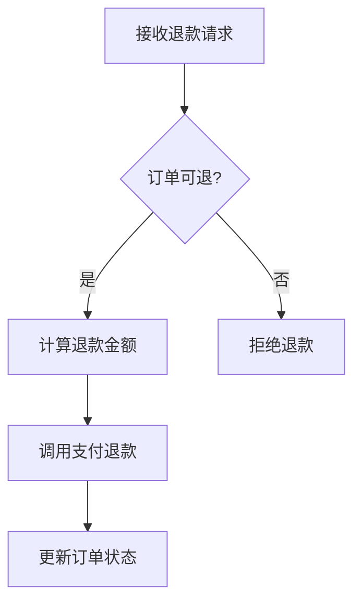

# 追踪主流程 + 图文双轨 + 回链

> 配合 `code-analyze-business` 的 Checklist 第 4 步使用。前提：业务范围已由用户确认（第 3 步通过）。这一步在确认后的边界内深挖主流程、领域概念，并产出 Mermaid 图 + 逐步骤回链。

## 一、追踪调用链（自顶向下）

从已确认的入口出发，顺着调用链往下追，记录每一步**做了什么决策、调了谁**：

- 每个方法调用记一行：`调用方 → 被调用方(文件:行号) —— 做了什么`
- **分支要标**：if / switch / 早返回 / 异常 catch，每个分支标"什么条件走哪条"。
- **异步要标**：线程 / 协程 / 消息发送 / 定时，标出"同步还是异步、是否等结果"。
- **重试要标**：循环重试、退避，标出"重试几次、什么条件放弃"。
- 到达**外部边界**（DB 写入、外部 HTTP、消息发出、返回响应）为止。

> 追到通用工具函数（日志、序列化、纯计算）就停，不展开——工具函数不是业务。

## 二、追踪数据流 + 识别状态机

业务的核心常是"数据怎么变"。对这项业务涉及的关键实体，追：

- **读**：从哪张表 / 缓存 / 外部取数据（文件:行号）。
- **改**：改了哪些字段、写入哪里（文件:行号）。
- **状态机**：实体是否有状态字段？枚举它的取值 + 每次状态迁移的触发条件与赋值点。状态机是新人最容易看不懂、测试最容易漏的地方，识别出来单独成图。

## 三、识别核心领域概念

把这项业务里的**领域术语**和**核心实体**抽出来：

- **术语表**：业务里的专有名词 → 一句话定义（如"退款单：一次退款申请的聚合根"）。新人最大的门槛是术语。
- **实体关系**：哪些实体参与、谁包含谁、谁引用谁。

## 四、Mermaid 选型

按要表达的东西选图，不要为了画图而画图：

| 要表达 | 选 | 何时用 |
|---|---|---|
| 主流程步骤 / 分支 | `flowchart` | 默认主流程图 |
| 多角色 / 多服务交互顺序 | `sequenceDiagram` | 有 2+ 参与方（用户 / 前端 / 后端 / 外部）时 |
| 概念 / 实体关系 | `flowchart` 或 `classDiagram` | 领域概念多、关系复杂时 |
| 实体状态流转 | `stateDiagram-v2` | 识别出状态机时 |

**核心图必画**：主流程图（flowchart 或 sequenceDiagram）。其余按需——没有状态机就别硬画状态图。

## 五、图文双轨规范（核心）

图给**骨架与直觉**，图下方文字给**带定位的细节**。两者配合，缺一不可：

````markdown
<!-- evidence: 入口 refund_handler @ src/api/refund.py:42 → RefundService.refund @ src/service/refund_service.py:88 -->


1. **接收退款请求** —— 校验入参（金额、订单号）…… `src/api/refund.py:42`
2. **订单可退?** —— 查订单状态，仅"已支付"可退 …… `src/service/refund_service.py:95`
3. **计算退款金额** —— 按退款规则算（全额 / 部分）…… `src/service/refund_service.py:110`
4. **调用支付退款** —— 调第三方支付 …… `src/clients/payment_client.py:55`
5. **更新订单状态** —— 置为"已退款" …… `src/repo/order_repo.py:120`
````

**铁律**：图里每条边 / 每个节点，都必须在下方文字里有对应说明并回链。**禁止画代码里没有的边**——图不是"我觉得应该这样"，而是"代码确实这样"。

## 六、回链格式

回链是本 skill 的质量底线。格式统一：

- 单行：`` `src/service/refund_service.py:88` ``
- 跨行：`` `src/service/refund_service.py:88-120` ``
- **紧跟结论**，写在那条结论句末尾，不要全堆到段尾（堆尾就失去"哪条结论对应哪行代码"的对应）。

好坏对照：

| ❌ 无回链 / 含糊 | ✅ 回链具体 |
|---|---|
| 退款时会校验订单状态 | 仅"已支付"订单可退 …… `src/service/refund_service.py:95` |
| 会调用支付系统退款 | 调用 `PaymentClient.call_refund` …… `src/clients/payment_client.py:55` |
| 状态会更新 | 订单状态置为"已退款"（枚举值 4）…… `src/repo/order_repo.py:120` |

## 七、防臆造检查

追踪完自查一遍：

- 每条结论都能指到 `file:line` 吗？指不到的标 `⚠ 未确认`，说明"推断，未在代码中直接证实"。
- 图里的边，每条都在下方文字有对应回链吗？
- 有没有把"注释里写的"当成"代码实际做的"？注释可能过时——以代码为准，注释仅作线索。
- 有没有把"这个框架通常这样做"当成"本项目这样做"？以本项目代码为准。
