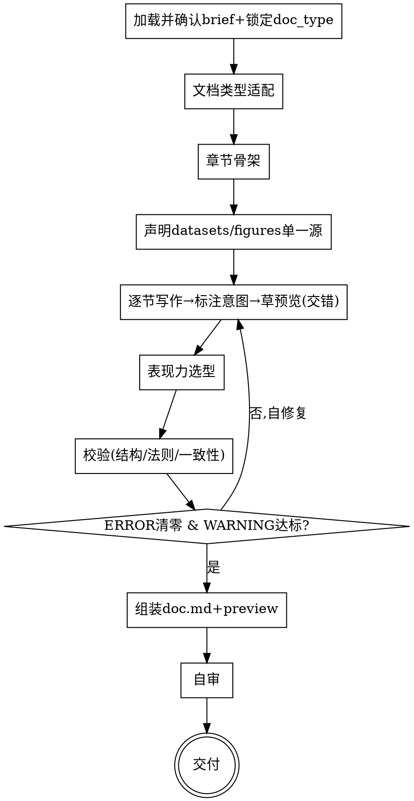

# 文档蓝图：把写作意图写成校验通过、意图清晰的正文

## 目的

把一份**写作需求 brief**（一句话意图，或 `clarify-doc` 产出的 brief），写成一篇**符合专业文档标准、校验通过**的正文——结构按文档类型模板派生，正文按写作法则撰写，图表/表格/状态按表现力法则正确使用，所有数字单一来源。

只回答一个问题：**这篇文档的专业正文是什么**。不回答"要达成什么意图"（那是 `clarify-doc`）、"渲染成 Markdown 还是 Confluence、用什么宏"（那是 `doc-render`）。

两个核心特征：

1. **标准驱动** —— 正文从**文档类型库**派生结构（必备章节、每节必含、常见缺陷），按**带意图标注的 Markdown** 写；产出后用校验规则逐项校验（结构完整、论断有证据、决策有理由、数字一致），不达标自修复直到合格。
2. **规范即事实源（完整契约 + 严格投影）** —— 先产出结构规范（带意图标注的 `doc.md`：front-matter 元数据 + `datasets`/`figures` 单一源 + 正文意图标注）；草预览是规范的**机械投影**——每个图表对回一条 `datasets`/`figures` 声明，每个论断对回一条证据，每个决策对回理由，不脱离规范凭空写。逐节「定稿正文 → 立刻草预览」保持连贯，校验通过后才组装交付。

```
写作需求 brief ──► [doc-blueprint] ──► doc.md 蓝图(校验通过) + Markdown 草预览
```

<HARD-GATE>
在校验通过前，**不组装最终 `doc.md`、不交付**。校验三项必须全过：① 结构（文档类型必备章节齐全）；② 写作法则（论断有证据 / 决策有理由 / 无 placeholder）；③ 一致性（图表/表格/正文数字同源 `datasets`，无矛盾）。
逐节「写正文 → 标注意图 → 草预览」用于保持连贯，属草稿、不计入交付。
</HARD-GATE>

## 反模式：意图还没定就写正文

写作意图不清先回去澄清（用 `clarify-doc`）。正文是把**已经定下来的意图**落成专业文字，不是用来"边写边想写什么"。一句话意图可以写，但必须先复述确认（写给谁、读完做什么），且明确"信息范围与文体以此为准，不擅自增删"。

## 写作输入来源门禁

开始写正文前，必须确认输入与参考资料来源，不要先搜索/读取项目其他文件再决定。**默认以用户提供的 brief / 一句话意图为唯一事实源**。

**默认规则**：
- 用户给了 `clarify-doc` 的 brief → 以 brief 为事实源，把它写入 `doc.sources.brief`。
- 用户只给一句话 → 复述确认核心意图（谁读、读完做什么），写入 `doc.sources.brief: user_prompt`。
- 是否参考项目里的旧文档/代码/数据/规范：**先问一句**"是否需要参考已有资料？如果要，请给路径，并说明是当前事实源还是仅供上下文"。
- 现有资料与 brief 冲突时，以 brief 为准，冲突写入"未决问题"，不要静默沿用旧内容。
- 所有资料来源写入 `doc.sources.items`：路径、类型、角色（事实源/仅上下文/疑似过时）、采用理由。

## 与其他 skill 的关系

- **上游可选**：`clarify-doc` 产出的写作需求 brief 是最理想的输入；本 skill 也接受一句话意图。不强制依赖。
- **下游可选**：产出的 `doc.md` 可喂给 `doc-render` 渲染成 Markdown / Confluence 等后端。**解耦**：本 skill 不 import/不调用 doc-render，只产出后端无关的蓝图规范。
- **schema 契约共享**：双方都以本 skill 的 `references/doc-schema.md` 为单一 schema 源；意图标注约定（`references/markdown-annotated.md`）是双方契约。
- **独立**：本 skill 不调用、不预设其他 skill；产出蓝图即完成。

## 边界（最重要的是）

**产出**（正文层）：
- 完整专业正文（按文档类型模板的章节 + 每节内容）
- 带意图标注的 `doc.md`（front-matter 元数据 + `datasets`/`figures` 单一源 + 正文意图标注）
- 表现力落地：图表/表格/状态/标注按表现力法则正确使用与构造
- 校验报告（结构 / 写作法则 / 一致性）
- Markdown 草预览（`doc.md` 的机械投影，可直接看）

**不产出**（超出范围，记入"未决问题"）：
- ❌ 写作意图变更：不改 brief 里的"写给谁/要他做什么/文体"，只把已定意图落成正文
- ❌ 渲染格式：Markdown 的最终排版、Confluence 的宏与存储格式——属 `doc-render`
- ❌ 真实数据采集：引用的数字由用户提供或来自已声明 `datasets`；本 skill 不联网拉数据

**越界拉回**：当对话滑向"发到 Confluence 要什么宏""Markdown 怎么排版好看"时，明确说"这超出正文范围，蓝图只定内容与意图，渲染由 `doc-render` 接手"，记一笔到"未决问题"。

## 内置标准

本 skill 内置**文档类型库**（`references/doc-type-library/`）：RFC / PRD / ADR / 立项书 / Runbook / 复盘 / 周报 / 变更公告 / 会议决议 / 技术文章 等。每类含：匹配信号、必备章节、每节必含、常见缺陷、专业示例。写作法则（结构/逻辑/表达三类）见 `references/writing-rules.md`；表现力组件库（图表/表格/状态等 block kind + 选用法则 + 反模式）见 `references/expressiveness.md`。

非内置类型时：提示"该类型暂无内置模板，将按通用专业结构（背景→核心→支撑→结论）派生"，与用户确认必备章节后继续。

## Checklist

为以下每项创建一个 task，按序完成：

1. **加载并确认 brief + 锁定 doc_type + 确认参考源** —— 读取 brief 或一句话意图；执行**写作输入来源门禁**，声明 `doc.sources`。用一句话复述核心意图（谁读、读完做什么、什么文体），请用户确认。锁定 `doc.doc_type`（来自 brief 或当场判定），`audience`/`desired_action`/`tone`/`length` 从 brief 继承或确认。意图或文体不明确且用户未确认前，不进入正文。
2. **文档类型适配** —— 加载 `references/doc-type-library/<type>.md` 模板；内置无此类型 → 按通用结构派生并与用户确认必备章节。
3. **章节骨架（先于写正文）** —— 把 brief 的关键信息点映射到模板章节，列出章节清单（`slot` + 标题 + 该章意图）；**与用户确认章节集合**。骨架先定，避免逐节写时跑题或漏必备章。
4. **声明 `datasets` / `figures` 单一源** —— 把所有数字（影响、成本、指标、时间…）声明为 `datasets`（值/单位/口径/来源）；图表声明为 `figures` 并引用 `datasets`。后续正文/图表一律引用，禁止各自硬编码（否则同一数字跨段漂移）。
5. **逐节写作（交错：写一节 → 标注意图 → 草预览）** —— 对每一节：按写作法则写正文（金字塔结论先行、论断带证据、决策带理由、列表 MECE）；每个非纯文字块标注意图（图表/表格/状态/标注 → 对应 block kind）；引用 `datasets`/证据。定稿一节、草预览一节，保持该节在工作记忆里。
6. **表现力选型** —— 按 `references/expressiveness.md` 选用法则为每块内容选 block kind（看数→表，看趋势/对比→图，单状态→状态，强调/警示→标注），按反模式自检构造是否正确（饼图≤5 片、表必有表头、数字同源…）。
7. **校验（规则）** —— 跑 `python skills/doc-blueprint/scripts/validate_doc.py doc.md`：结构（必备章节齐全）+ 写作法则（论断有证据/决策有理由/无 placeholder）+ 一致性（图表↔正文数字同源）。详见 `references/validation-rules.md`。
8. **自修复循环** —— 逐条违规就地修（不绕过），重新校验，直到全部 🔴 清零、🟡 通过率达标。把修复记录写进校验报告。
9. **组装 + 写规范文档** —— 写 `doc.md`（front-matter + 带意图标注正文，见 `references/markdown-annotated.md`、`references/output-format.md`）；草预览拼成可直接阅读的 `preview.md`。
10. **自审** —— placeholder 扫描、论断-证据对账、决策-理由对账、数字一致性、必备章节复查。发现问题就地修，修完回到第 7 步重校验。详见 `references/validation-rules.md` §自审。
11. **交付** —— 呈现蓝图与草预览；说明渲染（Markdown/Confluence）由 `doc-render` 接手。

## 流程图



**终态是"交付"：`doc.md` 蓝图 + 草预览齐备，校验合格。** 本 skill 不预设、不调用任何后续 skill。

## 自审检查项（Checklist 第 10 步展开）

写完 `doc.md` 与预览后用新视角过一遍：

1. **Placeholder 扫描** —— 正文不能含"TBD/待定/之后再说/适当展开"；真实未决问题写成"问题 + 影响 + 后续"。
2. **论断-证据对账** —— 每个论断要么有证据/数据（引用 `datasets` 或 `references`），要么显式标"假设"。
3. **决策-理由对账** —— 每个决策（`[!decision]`）必带理由；技术/方案决策至少列一个备选与权衡。
4. **数字一致性** —— 同一指标在图表/表格/正文的值是否一致、口径是否同源 `datasets`。
5. **必备章节复查** —— 文档类型库指出的必备章节是否齐全；每节"必含"是否写到位。
6. **表现力反模式复查** —— 抽查：饼图是否 ≤5 片、表格是否有表头与单位、状态是否有图例、是否"能用一句话说的对比却画了图"。
7. **意图标注完整** —— 每个非纯文字块（图表/表格意图/状态/标注）是否带 block kind 标注，能被渲染器投影。

发现问题就地修，修完回到第 7 步重校验。

## 产出位置

存到 `docs/YYYY-MM-DD-<主题>/`，含：
- `doc.md` —— 带意图标注的蓝图规范（front-matter + 正文 + 校验报告 + 未决问题）
- `preview.md` —— 草预览（`doc.md` 的机械投影，去除注释/标注的纯净可读 Markdown）
- （可选）`doc.meta.json` —— 仅供脚本稳定读取的 front-matter 抽取

日期用当天。

## 关键原则

- **意图先行** —— 动手前锁定 doc_type 与核心意图；文体决定结构。
- **标准驱动** —— 章节从文档类型库派生，不凭空发明结构。
- **规范即事实源（完整契约 + 严格投影）** —— `doc.md` 是单一事实源；草预览是它的机械投影，不发明规范外的内容、不漏声明的块。
- **数字单一源（`datasets`）** —— 所有数字声明在 `datasets`，正文/图表/表格一律引用；禁止各自硬编码。
- **论断必有证据，决策必有理由** —— 写作法则的主线；无证据的论断显式标"假设"。
- **意图先于承载** —— 每个非纯文字块先定 block kind（它是什么），再定呈现（图/表/状态/标注）。
- **金字塔 + MECE** —— 结论先行；并列项互斥穷尽、平行结构。
- **受众调表达** —— 受众（来自 brief）决定术语深度与表现力偏好（高管偏 KPI/趋势图，工程师偏表/命令）。
- **不增删意图** —— 把已定信息点落成正文，不擅自加内容或砍内容；要改意图回上游。
- **YAGNI** —— 不为"将来可能"写章节；精简版需求出精简版正文。
- **可回头** —— 任何时候可回到任何一步修订，修完重校验。

## 反模式

| 反模式 | 正确做法 |
|--------|----------|
| 跳过校验直接交付 | 校验三项全过前不组装、不交付 |
| 凭感觉写章节，不参照文档类型库 | 每节从模板的必备章节派生 |
| 论断无证据（"效果很好"） | 引用 datasets/证据，或显式标"假设" |
| 决策只给结论不给理由 | 每个决策带理由 + 至少一个备选 |
| 数字各处硬编码（正文 1284 / 图里 1300 漂移） | 声明 datasets，正文与图表统一引用 |
| 能用一句话说的对比却画了图 | 反过度可视化：≤3 个值直接 prose |
| 饼图 7 片 / 表无表头 / 状态无图例 | 按表现力反模式自检，就地修 |
| 擅自改 brief 的意图或文体 | 只落实已定意图，改意图回上游 |
| 越界到渲染格式（Confluence 宏） | 拉回，渲染由 doc-render |
| 偷偷扫描项目旧文档并照抄 | 先问是否参考；旧资料默认 context_only |
| 全部写完才校验 | 逐节交错写+预览，写完即校验、即修 |
| 最终交付只靠人工看一遍 | 必跑 `validate_doc.py`，失败就修 |

## 参考资源

- **`references/doc-schema.md`** —— `doc.md` 蓝图 Schema：front-matter 字段、block kind 枚举、意图标注约定。**写正文时加载。**
- **`references/markdown-annotated.md`** —— 带意图标注 Markdown 的标注语法（章节绑定/图表/表格意图/状态/标注）+ 草预览投影规则。**写正文/组装时加载。**
- **`references/expressiveness.md`** —— 表现力组件库：block kind 全表 + 选用法则 + 反模式（图表/表格/状态怎么正确用）。**表现力选型时加载。**
- **`references/writing-rules.md`** —— 写作法则三类：结构/领域法则、逻辑/论证法则、表达/风格法则。**写正文时加载。**
- **`references/validation-rules.md`** —— 校验规则：结构/写作法则/一致性，严重级别，自修复策略。**校验时加载。**
- **`references/output-format.md`** —— `doc.md` / `preview.md` 固定模板 + front-matter 抽取格式。**写交付物时加载。**
- **`references/doc-type-library/`** —— 文档类型库：每类必备章节/每节必含/常见缺陷/专业示例。**按 doc_type 加载对应文件。**
- **`scripts/validate_doc.py`** —— 校验结构与写作法则与一致性。**交付前必须运行。**
