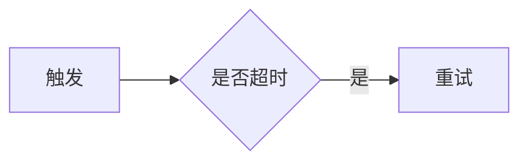

# 文档蓝图 Schema（doc.md：带意图标注的 Markdown）

> 配合 doc-blueprint skill 的 Checklist 第 4–5 步。
> 这是每篇文档产出的**结构契约**，也是 `doc-render` 的**单一 schema 源**。字段名与 `validation-rules.md` 完全一致，两者是**契约关系**：本文件调整，必须同步更新校验规则与渲染投影。
>
> 设计原则：**正文以自然 Markdown 承载（长文可读、可手改），意图用轻量约定标注（章节绑定 / 图表 / 表格意图 / 状态 / 标注），机器可读的部分（元数据、数字、图表声明、来源）放 front-matter。** 即使不渲染，`doc.md` 也是一篇可读的 Markdown。

---

## 〇、文件总览

```text
docs/YYYY-MM-DD-<主题>/
├── doc.md          # 带意图标注的蓝图规范（front-matter + 正文 + 校验报告 + 未决问题）
├── preview.md      # 草预览：doc.md 的机械投影，去除标注的纯净可读 Markdown
└── doc.meta.json   # 可选：front-matter 抽取，供脚本稳定读取
```

`doc.md` 由两部分组成：**front-matter（YAML，机器契约）** + **正文（带意图标注的 Markdown）**。

---

## 一、Front-matter（文档级契约，先于正文）

```yaml
---
doc:                                  # 【必填】文档元数据
  id: <snake_case>                    # 唯一标识，如 pay_timeout_postmortem
  title: <标题>
  doc_type: <枚举见第四节>             # 【必填】文档类型，决定适用校验与必备章节
  intent: <一句话写作意图>             # 来自 brief：让【谁】读完【做什么】
  audience:                            # 【必填】目标读者
    primary: <主要读者>
    secondary: <次要读者 | null>
  desired_action: <读者读完要做什么>    # 【必填】文档的验收标准，可判定
  tone: <formal | internal | external | technical>
  length: <short | standard | long>

sources:                               # 【必填】写作输入来源审计（参考源门禁）
  brief: <brief 路径 | user_prompt>    # 事实源 brief，或 user_prompt（一句话输入）
  confirmed_by_user: <bool>           # 是否已与用户确认参考源
  question: <向用户确认参考源时的问题>
  items:                              # 参考资料（代码/旧文档/数据/规范），无则 []
    - id: <snake_case>
      path: <路径或来源>
      type: <brief | doc | code | data | spec | user_prompt | other>
      role: <source_of_truth | context_only | stale_or_conflicting>
      freshness: <current | unknown | stale>
      decision: <adopted | used_for_context | ignored>
      note: <采用/忽略理由；疑似过时说明风险>

datasets:                              # 【必填】数字单一源（= EPPS 的 sample_state）
  - id: <snake_case>                  # 被正文/图表/表格引用的 id
    value: <number | string>          # 值
    unit: <单位，如 单 / 分钟 / 万元 / %>  # 【必填】无单位写"无"
    caliber: <口径：时点/范围/定义>     # 【必填】数字怎么来的，防止口径漂移
    source: <来源：告警/财务/估算…>     # 【必填】
    confidence: <measured | estimated | assumed>  # measured 实测 / estimated 估算 / assumed 假设

figures:                               # 【有图表时必填】图表单一声明
  - id: <snake_case>                  # 正文 chart 块的 data_ref / id 指向它
    kind: <chart:bar | chart:line | chart:pie | diagram | kpi | timeline>  # block kind
    title: <图表标题>
    data_ref: <dataset_id | [dataset_id...] | inline>  # 引用 datasets；inline 时数据内嵌
    note: <可选：图表说明/口径备注>

references:                            # 【有引用时必填】资料来源（写作法则：论断要有证据）
  - id: <r1>
    label: <来源标签，如"支付中台 SLA 定义">
    url: <链接 | confluence://... | path>
---
```

> **`datasets` 是数字的唯一事实源**（对应 EPPS 的 `sample_state`）。正文里凡出现数字，一律用 `{{d:<dataset_id>}}` 插值引用，禁止各处硬编码。否则同一指标会在正文、表格、图表之间漂移（正文 1284 / 图里 1300 就这么来的）。`caliber` + `source` 强制写明口径，是写作法则"论断有证据、数字带口径"的形式化。

> **`sources` 是写作输入来源审计**。读取项目旧文档/代码/数据前必须先问用户；不参考也要写 `items: []` 与 `confirmed_by_user: true`。未被用户确认的旧内容不得标记为 `source_of_truth`。冲突时标 `stale_or_conflicting` 并写入未决问题。

---

## 二、正文：意图标注约定（Markdown 友好）

正文是标准 Markdown。**只有"非纯文字块"才需要标注意图**——纯段落、列表、原生表格、原生代码块无需额外标注即可投影。标注全部采用"作为合法 Markdown 仍可读"的语法。完整语法见 `markdown-annotated.md`，此处为契约速览。

### 1. 章节绑定（把标题绑定到文档类型模板 slot）—— 推荐
```markdown
## 三、根因分析
<!-- doc:section slot=root_cause intent=论证系统性根因 -->
正文……
```
- 校验用：`slot` 必须出现在 `doc_type` 模板的必备章节里（见 `doc-type-library/`），缺失即 🔴。
- `intent` 一句话说明该章为什么存在（审计用）。

### 2. 图表（statistical chart）—— fenced 块
````markdown
```chart kind=bar id=impact_by_minute data_ref=per_minute title="超时量/分钟"
```
````
- `kind` ∈ `chart:bar | chart:line | chart:pie`；`id` 指向 `figures[]`；`data_ref` 指向 `datasets[]`。
- 预览里渲染为"图表占位（柱状·超时量/分钟）"；`doc-render` 投影为 mermaid / Confluence 图表宏。
- **反过度可视化**：≤3 个值的对比不写 chart，直接 prose。

### 3. 图示/流程（diagram）—— 原生 mermaid
````markdown

````
- 原生 mermaid，MD 与 Confluence 均可渲染；意图=diagram，无需额外标注。

### 4. KPI / 关键指标头图
````markdown
```kpi id=kpi_impact value_ref=affected_orders label="受影响订单" delta_ref=delta_pct
```
````
- `value_ref`/`delta_ref` 指向 `datasets[]`。

### 5. 标注（callout）—— admonition 语法
```markdown
> [!warning] 风险
> 重试风暴曾导致下游 DB 连接池打满，恢复后必须先限流。

> [!decision] 决策
> 采用"熔断 + 限流 + 降级"三件套。
> 理由：读多写少、下游脆弱；备选"仅扩容"治标不治本。
```
- variant ∈ `note | tip | warning | important | decision`（`decision` 是本 skill 自定义，承载"决策+理由"，校验强制带理由）。
- 原生 Markdown 渲染为引用块，可读。

### 6. 状态（status）—— 行内 token
```markdown
当前恢复状态：[badge:healthy 已恢复] ；监控：[badge:degraded 补齐中]
```
- level ∈ `healthy | degraded | down | blocked | done | todo`；`doc-render` 投影为彩色徽章/emoji；表格里的状态列也用此 token。

### 7. 表格意图（可选）—— 多数表格无需标注
```markdown
<!-- doc:intent=decision_matrix -->
| 方案 | 成本 | 收益 | 风险 | 结论 |
```
- 仅当表格是"决策矩阵/状态板/对照表"等有特殊投影意图时标注；普通数据表用原生 Markdown 表格即可。

### 8. 数字插值
```markdown
本次事故影响 {{d:affected_orders}} 单订单，持续 {{d:duration_min}} 分钟。
```
- `{{d:<id>}}` 在预览/渲染时解析为 `datasets[].value` + 单位。

---

## 三、字段语义

| 字段 | 语义 | 约束 |
|------|------|------|
| `doc.doc_type` | 文档类型枚举 | 决定必备章节（校验锚点）；见第四节 |
| `doc.intent` / `desired_action` | 写作意图与读者动作 | 来自 brief；`desired_action` 必须可判定（R-A1） |
| `datasets[]` | 数字单一源 | 凡正文出现的数字须有对应 `datasets`（R-C1）；引用用 `{{d:id}}` |
| `datasets[].caliber` / `source` | 数字口径与来源 | 必填（R-C2），否则数字不可信 |
| `figures[]` | 图表声明 | 每个 `chart`/`kpi` 块的 `id` 须对应一条 `figures`（R-C3） |
| `figures[].data_ref` | 图表数据来源 | 须指向已声明 `datasets`，或 `inline`（R-C4） |
| `<!-- doc:section slot= -->` | 章节绑定 | `slot` 须在 doc_type 模板必备章节内（R-S1） |
| `> [!decision]` | 决策标注 | 必须含"理由"，技术决策须列至少一个备选（R-W3） |
| `[badge:L text]` | 状态行内 | `L` 须在枚举内；图表/表格用到的状态须有图例（R-E4） |

---

## 四、文档类型枚举（doc_type）

> 完整必备章节见 `references/doc-type-library/<type>.md`。此处仅列枚举与一句话。

| doc_type | 含义 | 关键必备章节提示 |
|----------|------|----------------|
| `postmortem` | 事故复盘 | 影响 / 时间线 / 根因 / Action(Owner+DDL) / 经验 |
| `rfc` | 技术方案/设计文档 | 背景 / 现状约束 / 提案 / **备选方案与权衡** / 决策 / 影响 |
| `prd` | 产品需求文档 | 问题与价值 / 目标 / **可度量成功指标** / 范围 / 不做 |
| `adr` | 架构决策记录 | 背景 / **决策** / **理由** / 后果 |
| `business_case` | 立项书/商业论证 | 机会 / 方案 / **成本** / **收益(量化)** / 风险 / 资源诉求 |
| `runbook` | 操作指引/SOP | 触发条件 / 前置 / **分步(可复制命令)** / 预期 / **回滚** / 升级 |
| `weekly` | 周报/进展同步 | 本期完成 / **风险阻塞** / 下期计划 / 需协调 |
| `changelog` | 变更公告 | 变更内容 / **影响范围** / 时间窗口 / 应对 / 联系人 |
| `announcement` | 通知/事故公告 | 发生了什么 / **影响** / **当前状态** / 应对 / 后续 |
| `meeting` | 会议决议 | 议题 / **结论** / **Action(Owner+DDL)** / 遗留 |
| `article` | 技术文章/Wiki | 问题/目标 / 方案 / **可复现步骤** / 踩坑 / 结论 |
| `custom` | 其他（按通用结构派生） | 背景 / 核心 / 支撑 / 结论（与用户确认） |

---

## 五、block kind 闭环枚举（投影契约）

正文里出现的每一个"非纯文字块"，都必须能对回某条 block kind；渲染器只能为已声明的 block kind 投影。新增 kind 必须先在本表登记 + 在 `expressiveness.md` 配选用法则 + 在 `doc-render` 各后端配组件映射，否则校验与投影双双拦截。

| block kind | 标注形态 | 何时用（速览） | 投影（详见 expressiveness.md + doc-render） |
|------------|----------|---------------|---------------------------------------------|
| `prose` | 普通段落 | 叙述/论证/因果 | 段落 |
| `list` | `-` / `1.` | 并列/枚举（MECE） | 列表 |
| `table` | 原生 MD 表格（可带 `doc:intent`） | 多维精确数值/对照查表 | MD 表 / Confluence 表 |
| `chart:bar` | ` ```chart kind=bar ``` ` | 量级对比（离散类目） | mermaid xychart-bar / 图表宏 |
| `chart:line` | ` ```chart kind=line ``` ` | 趋势（时间序列） | mermaid xychart-line / 图表宏 |
| `chart:pie` | ` ```chart kind=pie ``` ` | 占比（≤5 类） | mermaid pie / 图表宏 |
| `diagram` | ` ```mermaid ``` ` | 结构/流程/时序 | mermaid |
| `kpi` | ` ```kpi ``` ` | 关键指标头图 | 大数字块 / 信息面板 |
| `timeline` | ` ```timeline ``` ` 或表 | 时序事件 | 表 / 时间线 |
| `callout` | `> [!note/tip/warning/important/decision]` | 强调/警示/决策 | blockquote / info/warning 宏 |
| `status` | `[badge:L text]` | 单一状态可扫读 | emoji/彩签 / status 宏 |
| `code` | ` ```lang ``` ` | 命令/代码 | fenced / code 宏 |
| `quote` | `>` | 引述 | blockquote / quote |

> 13 种。是**闭环**：正文里每个非纯文字块都要能对回某条 block kind；对不上的即漂移，校验/对账拦截。

---

## 六、与校验规则、渲染投影的契约

- 本 Schema 的每个字段都被 `validation-rules.md` 的某条规则锚定（结构 R-S / 写作法则 R-W / 一致性 R-C / 表现力 R-E）。
- 本 Schema 的每个 block kind 都被 `doc-render` 各后端的 `component-mapping.md` 锚定（kind → 原生组件）。
- **改一处必同步**：`doc-schema.md` 的 block kind 枚举（13 种）、`doc_type` 枚举、意图标注约定，与 `validation-rules.md`、`expressiveness.md`、`markdown-annotated.md`、`doc-type-library/*`、`doc-render/references/<后端>/component-mapping.md` 同进同退。
