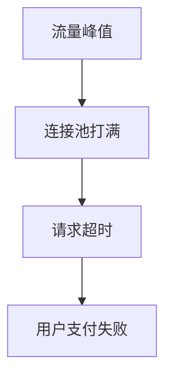

# 带意图标注的 Markdown：标注语法 + 草预览投影

> 配合 doc-blueprint skill 的 Checklist 第 5、9 步。
> 这是 `doc.md` 正文的**标注语法规范**，也是 `preview.md`（草预览）的**投影规则**。
> 与 `doc-schema.md` 的意图标注约定、`doc-render` 各后端的解析器同进同退。
>
> 设计原则：**标注全部是合法 Markdown**——`doc.md` 不经任何渲染也能当普通文档读；`preview.md` 是把标注解析成纯净可读 Markdown 的机械投影；`doc-render` 再投影到各后端。

---

## 一、标注语法总表

| 意图 | 标注形态 | 合法 Markdown 表现 | preview.md 投影 |
|------|----------|-------------------|----------------|
| 章节绑定 | `<!-- doc:section slot=X intent=Y -->`（标题下） | HTML 注释（不显示） | 删除注释，保留标题 |
| 图表 | ` ```chart kind=bar id=X data_ref=Y title="Z" ``` ` | 代码块 | `> 📊 图：Z（柱状·数据见 datasets.Y）` |
| KPI | ` ```kpi id=X value_ref=Y label=Z delta_ref=W ``` ` | 代码块 | `> 📌 Z：{{d:Y}}（环比 {{d:W}}）` |
| 时间线 | ` ```timeline ``` ` 内列事件 | 代码块 | 表格或有序列表 |
| 图示 | ` ```mermaid ``` ` | mermaid（多数 MD 渲染器支持） | 保留 mermaid 块 |
| 标注 | `> [!note/tip/warning/important/decision] 标题` + 内容 | 引用块 | 保留为引用块（GitHub 风格 admonition） |
| 状态 | `[badge:L text]` | 行内文本 | `text`（前加 emoji，见下） |
| 表格意图 | `<!-- doc:intent=X -->`（表前） | HTML 注释 | 删除注释，保留表 |
| 数字插值 | `{{d:id}}` | 行内文本 | 解析为 `value + unit` |
| 证据引用 | `[ref:r1]` 或脚注 | 行内 | 解析为 `[来源标签]` 链接 |

---

## 二、各标注详例

### 1. 章节绑定
```markdown
## 三、根因分析
<!-- doc:section slot=root_cause intent=论证为何连接池打满是系统性根因 -->

连接池配置上限为 50，而 6/14 流量峰值并发达 {{d:peak_concurrency}}……
```
- `slot` 须在 `doc_type` 模板的必备章节内（校验 R-S1）。
- 写作时填、校验时查；preview 删除注释行。

### 2. 图表
````markdown
```chart kind=bar id=impact_by_minute data_ref=per_minute title="6/14 超时量/分钟"
```
````
- 字段：`kind`（chart:bar/line/pie）、`id`（→ `figures[]`）、`data_ref`（→ `datasets[]`）、`title`。
- preview 投影为：`> 📊 图：6/14 超时量/分钟（柱状 · 数据见 datasets.per_minute）`
- doc-render：MD 后端转 mermaid xychart/pie；Confluence 后端转图表宏或 mermaid 宏。

### 3. KPI
````markdown
```kpi id=kpi_impact value_ref=affected_orders label="受影响订单" delta_ref=null
```
````
- preview：`> 📌 受影响订单：{{d:affected_orders}}`
- 多个 KPI 并排 → 多个 ` ```kpi ``` ` 块（doc-render 拼成一行指标条）。

### 4. 图示（原生 mermaid）
````markdown

````
- 无需额外标注，意图=diagram。preview 与 doc-render 均保留 mermaid。

### 5. 时间线
````markdown
```timeline
- 00:00  告警：支付超时率突增（{{d:timeout_rate_peak}}）
- 00:08  值班介入，定位连接池打满
- 01:30  扩容 + 限流，超时率回落
- 02:30  完全恢复
```
````
- preview 投影为表格 `| 时间 | 事件 |`；doc-render 同。

### 6. 标注（admonition）
```markdown
> [!warning] 风险：重试风暴
> 恢复后若不限流，积压请求重试会再次打满连接池。

> [!decision] 决策：熔断 + 限流 + 降级
> 理由：读多写少、下游脆弱；备选"仅扩容"治标不治本，不选。
```
- variant：note/tip/warning/important/decision。
- `decision` 必含"理由"行（校验 R-W3）。
- preview 保留为引用块（GitHub 风格 admonition 原样可读）。

### 7. 状态（行内）
```markdown
当前恢复状态：[badge:healthy 已恢复]　监控补齐：[badge:degraded 进行中]
```
- level → preview emoji：healthy 🟢 / degraded 🟡 / down 🔴 / blocked 🟠 / done ✅ / todo ⚪。
- 全文首次出现某 level 处加图例（自审 R-E4）。

### 8. 表格意图（可选）
```markdown
<!-- doc:intent=decision_matrix -->
| 方案 | 成本 | 收益 | 风险 | 结论 |
|------|------|------|------|------|
| 熔断三件套 | 中 | 高 | 低 | ✅ 采用 |
| 仅扩容 | 低 | 中 | 中 | ❌ 治标 |
```
- 普通表无需标注。仅决策矩阵/状态板/对照表标。

### 9. 数字插值与证据引用
```markdown
本次影响 {{d:affected_orders}} 单（口径见 datasets），P99 延迟峰值 {{d:p99_peak}}[ref:r2]。
```
- `{{d:id}}` → preview 解析为 `1284 单`（value+unit）。
- `[ref:r1]` → preview 解析为 `[SLA 定义](url)`。

---

## 三、`preview.md` 投影规则（机械投影）

`preview.md` = `doc.md` 删/解析标注后的纯净可读 Markdown。**投影是机械的，不发明内容**：

1. 删除所有 `<!-- doc:... -->` HTML 注释（保留其修饰的标题/表格）。
2. ` ```chart/kpi/timeline ``` ` 块 → 替换为引用块占位（见上表）。
3. ` ```mermaid ``` ` → 原样保留。
4. admonition `> [!X]` → 原样保留（合法 MD 引用块）。
5. `[badge:L text]` → `emoji text`。
6. `{{d:id}}` → `value unit`。
7. `[ref:id]` → `[label](url)`。
8. front-matter → 删除（preview 是给人读的正文）。

> 对账：`preview.md` 的每个图表占位/状态/数字必须能对回 `doc.md` 的一条声明（`figures`/`datasets`/block kind）。多一个/少一个即漂移，自审拦截。

---

## 四、为什么用这套标注（而非纯 JSON）

- **长正文以自然 Markdown 承载**：可读、可手改，不把 2000 字塞进 JSON 字段（用户"组织不好语言"的正文也能自然写）。
- **标注是合法 Markdown**：不经渲染器也能读；复制到任何 MD 工具不报错。
- **机器可解析**：fenced 块 + HTML 注释 + admonition + 行内 token 都能用正则/解析器稳定抽取，供校验与 doc-render 投影。
- **意图清晰**：每个非纯文字块都显式声明 block kind，渲染器据此选后端原生组件，实现"意图与渲染分离"。
