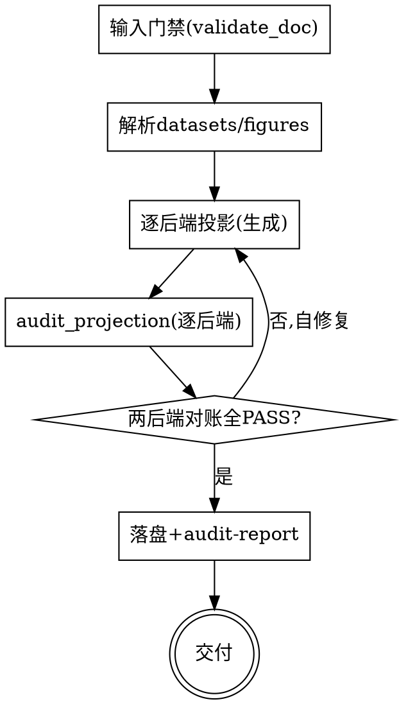

# doc-render：把文档蓝图渲染成多后端成品

## 目的

读取一份**已校验通过的 `doc.md`**（`doc-blueprint` 的产物），把它渲染成**多后端**成品——**Markdown（干净可读）/ Confluence（存储格式 XHTML）**。重点是**把意图块（block kind）投影到各后端原生组件**，且同一份蓝图在两后端结构一致、内容同源。

只回答一个问题：**这份后端无关的蓝图，在各后端长什么样**。不回答"内容怎么写"（那是 `doc-blueprint`）、"意图怎么定"（那是 `clarify-doc`）。

两个核心特征：

1. **prompt-driven（镜像 doc-blueprint）** —— 你（AI）按各后端 `render-template.md` + `component-mapping.md` **生成**成品；脚本只做**投影对账**，不做生成。
2. **规范即事实源（严格投影 + 数据单一源）** —— 两后端成品都是 `doc.md` 的机械投影：每个图表对回一条 `figures[]`，每个数字对回一条 `datasets[]`，每个意图块对回一个 block kind。成品带**投影标记**，`audit_projection.py` 机械化对账。

```
已校验 doc.md ──► [doc-render] ──► Markdown + Confluence（两后端对账通过）
```

<HARD-GATE>
渲染前，输入的 `doc.md` 必须先通过 `doc-blueprint` 的校验：先跑 `python skills/doc-blueprint/scripts/validate_doc.py <doc.md>`，未通过则拒绝渲染、提示用户回上游修蓝图。
两后端成品生成后，必须跑 `python skills/doc-render/scripts/audit_projection.py <doc.md> <render-dir> --backend all`，逐后端 BLOCK 对账全 PASS 前不交付。
</HARD-GATE>

## 反模式：还没有 doc.md 就渲染

没有 `doc.md`（或未校验通过）不要渲染。本 skill 只消费蓝图、不改蓝图。要写/改内容回上游 `doc-blueprint`。

## 边界（最重要）

**产出**（渲染层）：
- Markdown：干净可读 `.md`，意图块解析为最终 Markdown（图表→mermaid、状态→emoji、标注→admonition、数字→插值）。
- Confluence：存储格式 XHTML，意图块映射到原生宏（标注→info/warning/tip 宏、代码→code 宏、状态→status 宏、图表→chart/mermaid 宏、表格→原生表）。
- 对账报告：逐后端投影对账结果。

**不产出**（超出范围，记入"未决问题"）：
- ❌ 内容/意图变更——只消费 `doc.md`，不改它。
- ❌ 真实发布（调 Confluence API 发页面）——产出存储格式文本，发布由用户/后续接手。
- ❌ 新后端（Notion/Word/PDF）的实际实现——架构可扩展，首期两后端。

**越界拉回**：当对话滑向"改一下正文措辞""加一段内容""调数据"时，明确说"这超出渲染范围，本 skill 只投影已有蓝图，改内容回 `doc-blueprint`"，记一笔到未决问题。

## 与其他 skill 的关系

- **上游**：`doc-blueprint` 产出已校验的 `doc.md`；本 skill 的理想输入。**解耦**：本 skill 不 import/不调用 doc-blueprint 的逻辑，只消费其产物 + 复用其 `validate_doc.py` 做输入门禁。
- **schema 契约共享**：双方都以 `skills/doc-blueprint/references/doc-schema.md` 为单一 schema 源（block kind 枚举、意图标注约定）。
- **独立**：本 skill 有自己的渲染逻辑，不依赖 doc-blueprint 自带的 `preview.md`。

## Checklist

为以下每项创建一个 task，按序完成：

1. **输入门禁** —— 跑 `validate_doc.py <doc.md>`，通过才继续；否则拒绝、提示回上游。解析 front-matter（datasets/figures/references）到内存。
2. **逐后端投影（生成交错）** —— 对每个目标后端（markdown / confluence）：加载该后端 `render-template.md` + `component-mapping.md` + `projection.manifest.yaml`；按 `doc.md` 顺序遍历，把每个意图块按 block kind 投影到该后端原生组件；数字用 `datasets` 插值；每个投影块带投影标记。
3. **对账（逐后端）** —— 跑 `audit_projection.py <doc.md> <render-dir> --backend all`；逐后端 BLOCK 对账（声明的 figures/block 都已投影，无多余/缺失）。
4. **自修复循环** —— 对账失败的项就地修（补投影/补标记/修映射），重跑，直到两后端全 PASS。
5. **落盘 + 写 audit-report.md** —— 产物写入 `docs/<日期>-<主题>/render/{markdown,confluence}/`；对账结果写 `render/audit-report.md`。
6. **交付** —— 呈现成品；Markdown 可直接发布/贴用；Confluence 存储格式可粘进 Confluence「插入→存储格式」；说明真实发布由后续接手。

## 流程图



**终态是"交付"：两后端成品 + 对账报告齐备，逐后端对账 PASS。**

## 自审检查项

1. **输入已校验** —— 渲染前 `validate_doc.py` 必须通过。
2. **投影标记齐全** —— 两后端每个意图块都带投影标记（Markdown/Confluence 均用 `<!-- doc:proj id=.. kind=.. -->`），对账能识别。
3. **block 严格投影** —— 两后端投影的 block（id+kind）集合与 `doc.md` 声明（figures + 正文 chart/kpi/timeline 块）完全一致，不多不少。
4. **数字同源** —— `{{d:id}}` 插值无未解析占位，两后端同一值一致。
5. **意图→组件正确** —— callout variant 映射对（warning→警示宏、decision→决策宏）、status level 映射对（颜色一致）、图表 kind 映射对。
6. **后端原生** —— Markdown 用合法 MD 语法；Confluence 用合法存储格式宏（`ac:structured-macro`）。

发现问题就地修，修完回到第 3 步重对账。

## 关键原则

- **输入单一事实源** —— 只以 `doc.md` 为准；`preview.md` 仅作上下文。
- **严格投影** —— 不渲染 spec 未声明的块；不发明内容；不改数字。
- **意图→原生组件** —— 每个 block kind 映射到该后端最地道的原生构造（不是"差不多就行"）。
- **数据单一源** —— 数字一律从 `datasets` 插值，两后端同源。
- **投影标记** —— 每个投影块带标记，对账兜底。
- **manifest 数据驱动** —— 投影标记由各后端 `projection.manifest.yaml` 声明，对账脚本通用；新增后端加数据文件、零 Python。
- **YAGNI** —— 不做真实发布/新后端实现。

## 反模式

| 反模式 | 正确做法 |
|--------|----------|
| 未跑 validate_doc 就渲染 | 先校验输入，不过则拒绝 |
| 凭空加/漏意图块（两后端漂移） | 严格按 doc.md 块投影，对账兜底 |
| 改 doc.md 内容 | 回上游 doc-blueprint |
| Markdown 里 Confluence 宏混用 / Confluence 里裸 mermaid 不用宏 | 按各后端 component-mapping 用地道组件 |
| 数字两后端不一致（1284 vs 1300） | 统一从 datasets 插值 |
| 标注映射错（warning 画成普通引用） | callout variant → 对应宏/样式 |
| 调 Confluence API 真实发布 | 产出存储格式文本即可，发布由后续 |

## 参考资源

- **`references/platforms.md`** —— 后端注册表 + 新增后端步骤。**扩展后端时加载。**
- **`references/<后端>/render-template.md`** —— 各后端如何按 doc.md 写成品 + 投影标记契约。**生成时加载。**
- **`references/<后端>/component-mapping.md`** —— block kind → 该后端原生组件映射。**生成时加载。**
- **`references/<后端>/projection.manifest.yaml`** —— 投影标记 manifest（对账脚本输入）。**对账时加载。**
- **`scripts/audit_projection.py`** —— manifest 驱动投影对账。**交付前必须运行。**
- 上游 **`skills/doc-blueprint/scripts/validate_doc.py`** —— 输入门禁。**渲染前必须运行。**
- 上游 **`skills/doc-blueprint/references/doc-schema.md`** —— 文档 schema 与 block kind 枚举（单一 schema 源）。
