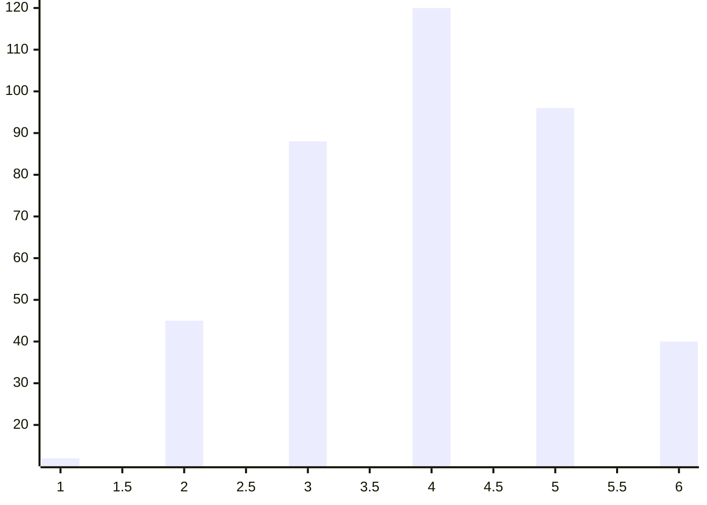
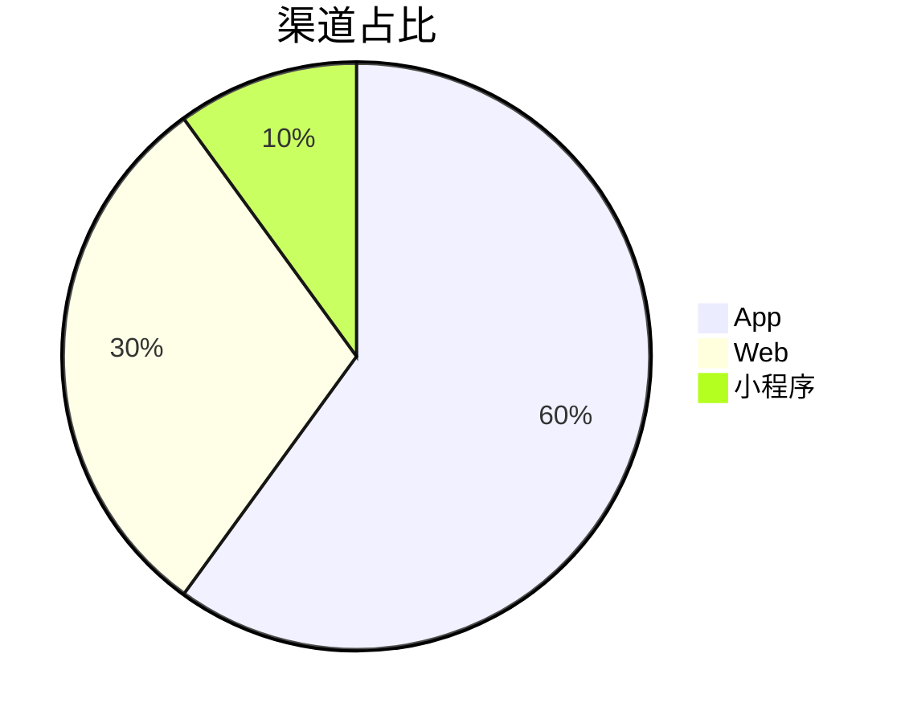
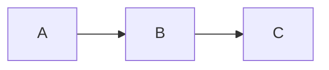

# Markdown 组件映射：block kind → Markdown

> 用途：把 `doc.md` 的每个 block kind 映射到最终 Markdown 结构。与 `render-template.md`、`projection.manifest.yaml`、上游 `doc-schema.md` 的 block kind 枚举同进同退。

---

## 一、block kind → Markdown 结构

### `chart:bar` / `chart:line`（柱/折线）
解析 datasets（或 figures.data_ref 指向的 inline 数据）为 mermaid xychart：
````markdown
<!-- doc:proj id=impact_by_minute kind=chart:bar -->

````
> 数据来源 `datasets`；类目轴/时间轴从 figures 注明。无数据时退化为占位引用 `> 📊 图：<title>（数据见 datasets.<id>）`。

### `chart:pie`（占比，≤5 片）
````markdown
<!-- doc:proj id=share kind=chart:pie -->

````

### `diagram`（原生 mermaid）
````markdown
<!-- doc:proj id=arch kind=diagram -->

````

### `kpi`（关键指标）
```markdown
<!-- doc:proj id=kpi_impact kind=kpi -->
> ### 受影响订单
> **1,284 单** · 环比 +12%（datasets.affected_orders）
```
> 大数字 + label + 对比基准；多个 KPI 各占一块、紧邻成行感。

### `timeline`（时序事件）→ 表格
```markdown
<!-- doc:proj id=tl kind=timeline -->
| 时间 | 事件 | 影响 |
|------|------|------|
| 00:00 | 告警突增 | 超时率↑ |
| 00:08 | 定位连接池打满 | — |
| 02:30 | 完全恢复 | 恢复 |
```

### `callout`（admonition，原样保留）
```markdown
<!-- doc:proj id=warning-1 kind=callout -->
> [!warning] 风险：重试风暴
> 恢复后若不限流，积压重试会再次打满连接池。
```
> variant 不变（note/tip/warning/important/decision）；GitHub 风格 admonition 原生支持。

### `status`（行内徽章 → emoji）
```
当前状态：🟢 已恢复　监控：🟡 补齐中
```
| level | emoji |
|-------|-------|
| healthy | 🟢 |
| degraded | 🟡 |
| down | 🔴 |
| blocked | 🟠 |
| done | ✅ |
| todo | ⚪ |
> 全文首次出现状态处保留图例（来自 doc.md 的图例块）。

### `table`（原生表格）
保留原生 Markdown 表格；补对齐行 `|---|`；表格意图注释替换为 `<!-- doc:proj id=<n> kind=table -->`。

### `code` / `prose` / `list` / `quote`
原生保留，无需特殊投影。

---

## 二、数字插值与引用

- `{{d:affected_orders}}` → `1,284 单`（千分位 + 单位）。
- `[ref:r1]` → `[连接池监控定义](confluence://OBS/pay-pool)`。

> 所有数字来自 `datasets`；两后端同源，禁止在 Markdown 里硬编码另一套值。
