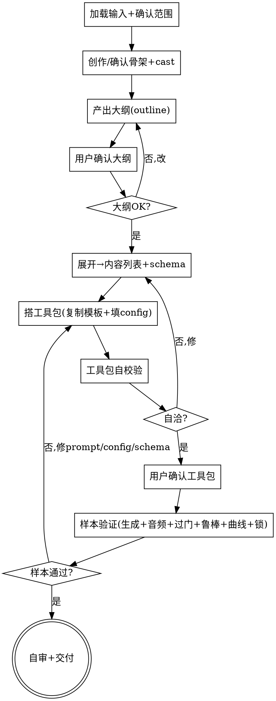

# 多邻国式英语课 · 数据生成 Skill

## 目的

把**人审创作的课程骨架**（Section→Unit→Lesson + 原创角色 cast），变成一套**可运行、可中断恢复重试、单文件原子课、带质量门**的多邻国式英语课数据生成**工具包**，并在样本上跑通。

只回答一个问题：**这门多邻国式英语课要生成哪些教学内容、用什么工具包生成、怎么保证「单课多题难度曲线 + 教学交互契约 + 13 题型 + 分级翻译 + 干扰项质量 + 防漂移 + 教学音频」**。

```
人审骨架(Section/Unit/Lesson+cast) ──► [duolingo-english-data-gen] ──► 数据生成工具包(自校验通过) + 样本验证报告
```

两个核心特征：

1. **交付物是工具包，不是数据** —— skill 产出可复用、可重跑的工具包（内容列表 + schema + 生成/音频/打包脚本 + 校验门），样本验证可用即交付；**全量生产由用户后续跑**。
2. **教学契约内置** —— 单课多题难度曲线 + 13 题型库 + interaction_mode + 图片选项/词块答案/输入归一化/双速听力/结构化对话 + 分级翻译 + 目标句锁定，全部数据化、可机判。

<HARD-GATE>
**骨架（课程 + cast）必须经用户确认后才展开、才建工具包**（Checklist 3a→3b）。
工具包**自校验通过**（`scripts/validate_toolkit.py`：outline↔content_list 展开自洽 + curve_plan 合法 + cast 引用合法 + 脚本可编译 + 无占位）、**样本验证通过**（`scripts/run_sample_validation.py`：单课端到端生成 + 音频 + 过门 + 中断/恢复/重试/幂等/单文件确实工作 + 曲线合规 + 目标句锁定 + 音频覆盖）之前，**不交付工具包**。
skill **不替用户跑全量数据**；交付边界止于「工具包 + 样本验证」。
</HARD-GATE>

## 反模式：直接开始造数据

不要跳过「确认骨架 → 展开 content_list → 建工具包」直接用 LLM 造一批练习交付。skill 的价值是**工具包**（可重跑、可续跑、带曲线门），不是一次性数据。

## 与其他 skill 的关系

- **上游**：`clarify-requirements` 产出的需求文档（如 `prd/2026-07-22-duolingo-english-data-gen-skill-requirements.md`）是理想输入。
- **镜像**：本 skill 结构镜像 `edu-data-gen`（SKILL.md + references + toolkit-template + scripts），但生成单元从「单内容点」改为「单课=多题有序序列」，并新增难度曲线引擎、13 题型库、分级翻译策略、TTS。复用 `ai_bridge` / `tts_providers.py` / 中断恢复重试 / G 门框架。
- **独立**：本 skill 不调用、不预设其他 skill；交付工具包即完成。

## 边界（最重要）

**产出**（工具包层）：
- 内容列表（每课/每 radio 一个内容点，带 curve_plan + locked_targets seed）
- schema（exercise 联合 / lesson / duoradio_episode / cast）
- 生成脚本（一节课一次 LLM 调用，产有序 exercise 数组；中断/恢复/重试/幂等；单文件原子课）
- 音频脚本（每 spoken string 的 TTS mp3，路径内联）
- 打包脚本（按 CEFR 打 lesson 包进 Android assets）
- 校验门（G1/G2/G5-G8 复用 + DL-Type/Content/Curve/Distractors/Translation/Lock/Audio/Cast）
- 使用说明 + 样本验证报告

**不产出**（超出范围，记入「未决问题」）：
- ❌ **全量数据**：全量课的生产由用户后续用工具包执行。
- ❌ **课程骨架本身**：Section/Unit/Lesson 教什么、什么顺序、对标哪个 CEFR，由人审创作；skill 只提供骨架模板。
- ❌ **Stories / Duolingo Max GPT 自由 roleplay**：MVP 不含（roleplay 是运行时能力）。
- ❌ **运行时游戏化数值**（XP/Hearts/Streak/League）：归 app 逻辑；skill 只产内容层（hint、角色音色、needs_speaking 标记）。
- ❌ **App 产品状态与流程**（奖励、连击、生命值、打卡、徽章、用户进度、按钮/动画/页面跳转）：一律不进课程 schema、prompt 或样本数据。
- ❌ **多邻国商标角色**（Duo/Lily/Eddy/Junior 等）：一律用原创 cast（法律风险）；DL-Cast 门硬挡。
- ❌ **ASR/口语评分引擎**：只产 scoring_rubric 字段，运行时 ASR 另做。
- ❌ **记忆钩子**：纯多邻国思路，靠角色/幽默/情景/重复，不生成谐音/画面/联想等钩子。

**越界拉回**：当对话滑向「直接造一批练习给我」「app 怎么消费」「用什么框架存数据」时，明确说超出范围，记一笔到「未决问题」。

## 内置知识（`references/`）

- **难度曲线引擎 + CEFR 翻译策略**（`difficulty-curve.md`）：curve_plan 结构、五 stage、CEFR 默认曲线、结尾简单题铁律、A1A2带中文/B1B2沉浸。**灵魂，写 prompt/curve_defaults/DL-Curve/DL-Translation 时加载**。
- **13 题型与教学交互规格**（`exercise-types.md`）：每类型测什么、interaction_mode、结构化图片选项、answer_tokens、normalization、stage 归属、音频/评分需求。**写 prompt/DL-Type/DL-Content 时加载**。
- **数据实体与 schema**（`data-types-and-schemas.md`）：5 实体 + duoradio + cast，outline→content_list→输出 数据流。
- **质量门定义**（`quality-gates.md`）：G1/G2/G5-G8 复用 + DL-Type/Content/Curve/Distractors/Translation/Lock/Audio/Cast。
- **工具包结构约定**（`toolkit-structure.md`）：目录、单文件原子课、config、curve_defaults、tts 块、cast、resume 状态。
- **LLM 调用约定**（`llm-calling.md`）：ai_bridge `claude_code` provider、模型别名、JSON 输出、重试。
- **TTS 音频约定**（`tts-audio.md`）：generate_audio 用法、字段覆盖、角色音色映射、跨卷 import 逃生口。

## Checklist

为以下每项创建一个 task，按序完成：

1. **加载输入 + 确认范围** —— 读需求文档（+ 页面文档如有）；用一句话重述「这门课生成哪些数据、给谁用、A1→B2 覆盖、MVP 类型、13 题型、原创 cast」，请用户确认。加载 `data-types-and-schemas.md` + `exercise-types.md`。
2. **创作/确认骨架 + cast** —— 产出 `outline/<cefr>.json` 骨架（Section→Unit→Lesson + locked_targets + character_dialogue_hook + duoradio_episodes）与 `cast.json`（原创角色）。若用户无骨架：skill 提保守的 A1 先行树（标 `source=generated`），YAGNI。加载 `outline-generation.md`。
3a. **产出大纲 → 用户确认** —— 每 CEFR：section/unit/lesson 数、每课 curve_plan（或继承 `config.curve_defaults[CEFR]`）、locked_targets、cast。加载 `difficulty-curve.md` + `outline-generation.md`。汇总呈给用户，**用户确认或修订；确认前不展开**。
3b. **展开大纲 → 内容列表 + schema** —— 大纲确认后机械展开：每 lesson + 每 radio → 1 内容点（带 resolved curve_plan + locked_targets + required_exercise_types + required_translation_directions seed）。单文件原子课输出。加载 `data-types-and-schemas.md` + `toolkit-structure.md`。展开不再人审，靠 `validate_toolkit.py` 校验自洽。
4. **搭工具包** —— 从 `assets/toolkit-template/` 复制骨架；填 `config.json`（模型、curve_defaults、tts 块、single_file、DL 门、sample）。加载 `toolkit-structure.md` + `llm-calling.md` + `tts-audio.md`。
5. **工具包自校验 + 确认门** —— 运行 `scripts/validate_toolkit.py <toolkit>`：展开自洽（lesson/radio 数对得上）+ curve_plan 合法（counts 和=total、结尾 end_on_easy、allowed_types ⊂ 13 enum）+ cast 引用合法 + 脚本可编译（含 generate_audio）+ 无占位。不通过就地修。**通过后请用户确认工具包**，确认才进样本验证。
6. **样本验证** —— 运行 `scripts/run_sample_validation.py <toolkit>`：生成样本课（每课一次 LLM 调用）→ 跑 generate_audio.py（证正常/慢速 TTS + 词项/对话音频覆盖）→ 跑 validate.py（G1/G2/G5-G8 + 全 DL-* 门过）→ 证中断/恢复/幂等/单文件原子课/曲线合规/题型与方向覆盖/输入契约/目标句锁定。不通过就地修，重跑直至通过。
7. **自审 + 交付** —— placeholder 扫描、字段对齐（content_list entity ↔ schema ↔ prompt 输出映射）、脚本可 import + `--help`、门配置合法、单文件原子课约定、每课内容点带 curve_plan、cast 引用可解析、README 独立可执行（generate→audio→validate→android 四阶段）。交付工具包目录 + 样本验证报告。提示用户后续跑全量。

## 流程图



**终态是「自审+交付」：工具包自洽、样本验证通过、工具包与报告齐备。** 本 skill 不调用任何下游 skill，不替用户跑全量。

## 自审检查项（Checklist 第 7 步展开）

1. **Placeholder 扫描** —— content_list/config/schema/outline 有无「占位/TBD/待定」？补具体或标合理默认。
2. **字段对齐** —— content_list 每内容点的 entity，在 schema 里有对应实体；schema 每字段在 prompt 输出映射里有归宿；exercise 各类型必填字段在 DL-Type 门里有判定。
3. **脚本可运行** —— `generate.py`/`generate_audio.py`/`validate.py`/`build_android_assets.py` 能 `python -c "import"` + `--help`；config 字段被正确读取。
4. **门配置合法** —— 启用的 DL-* 门在 validate.py 里有实现；curve_defaults 各 CEFR 齐全且 counts 和=total、结尾 end_on_easy。
5. **单文件原子课** —— config `file_split.mode=single_file`；样本验证确实每课产 1 个 lesson.json + _meta.json。
6. **cast 引用** —— outline 的 character_dialogue_hook/duoradio speakers 全在 cast 注册表；无商标名。
7. **使用说明可执行** —— README 写清 generate→audio→validate→android 四阶段全量用法（续跑/重试/CEFR 切片/TTS 逃生口）。

发现问题就地修，修完重跑 `validate_toolkit.py` + `run_sample_validation.py`。

## 产出位置

存到 `data_gen/<课程名>-toolkit/`（或用户指定目录），含：
- `outline/<cefr>.json` —— 人审确认的骨架（按 CEFR：Section/Unit/Lesson + locked_targets + curve_plan + duoradio_episodes）
- `cast.json` —— 原创角色注册表
- `content_list/<cefr>.json` —— 内容点清单（按 CEFR，从 outline 机械展开）
- `schema/` —— exercise/lesson/duoradio_episode/cast schema
- `generate.py` —— 生成脚本（一节课一次调用、中断/恢复/重试/幂等、单文件原子课、按 CEFR `--cefr`）
- `generate_audio.py` —— TTS 音频（每 spoken string、角色音色映射、跨卷 import 逃生口）
- `validate.py` —— 校验门运行器（G + DL 门）
- `build_android_assets.py` —— Android 打包（按 CEFR lesson 包 + manifest + cast + 音频拷贝）
- `config.json` —— 课程配置（curve_defaults / tts / single_file / DL 门）
- `prompts/` —— lesson.md / duoradio.md
- `state/` —— resume 状态
- `output/<cefr>/<id>/lesson.json` —— 生成数据（单文件原子课；样本验证产出子集）
- `README.md` —— 使用说明（含全量四阶段用法）
- `sample_validation_report.md` —— 样本验证报告

## 关键原则

- **单课多题 + 难度曲线是命脉** —— 一节课 = 12-17 道按 curve_plan 有序编排的练习，强制结尾简单题。无此则非多邻国式。
- **曲线是数据不是嘱咐** —— curve_plan 是有序 slot 列表，LLM 按 slot 填，DL-Curve 门机械校验。
- **一节课一次 LLM 调用** —— 保曲线连贯 + resume 粒度=一节课。
- **人审骨架、机判内容列表** —— 骨架（教什么/多少/曲线）用户确认；内容列表机械展开靠 validate_toolkit 校验。
- **目标句锁定** —— locked_targets 经 `_post_process` 重注入 + DL-Lock 双层防漂移。
- **分级翻译策略** —— A1/A2 带中文、B1/B2 no-translation，DL-Translation 门编码。
- **原创角色** —— 不用商标角色；DL-Cast 门挡错字+商标名。
- **只产英语教学内容** —— 词句、题目、答案、干扰项、释义、解释、图片教学规格、音频、口语评分；奖励/连击/生命值/打卡/徽章/用户状态一律归 app。
- **YAGNI** —— MVP 不含 Stories/Max roleplay；不为将来可能造内容类型。
- **不替用户跑全量** —— 交付边界止于工具包 + 样本验证。

## 反模式

| 反模式 | 正确做法 |
|--------|----------|
| 跳过工具包，直接造一批练习交付 | 产出可重跑的工具包 |
| 跳过骨架确认直接展开 | 骨架先确认（3a）再展开（3b） |
| 难度曲线只靠 prompt 嘱咐 | curve_plan 数据化 + DL-Curve 门机械校验 |
| 一道题一次 LLM 调用 | 一节课一次调用，保连贯 + resume=一课 |
| 目标句被 LLM 偷换 | locked_targets + `_post_process` 重注入 + DL-Lock |
| B2 课带完整中文释义 | 分级翻译策略 + DL-Translation 门 |
| 用 Duo/Lily 等商标角色 | 原创 cast + DL-Cast 门 |
| exercise 带 xp/hearts 字段 | 运行时数值归 app，schema 不声明 |
| tts_providers 找不到就静默跳过音频 | import 逃生口 + FAIL FAST（见 tts-audio.md） |

## 参考资源

- **`references/difficulty-curve.md`** —— 曲线引擎 + CEFR 翻译策略。**灵魂**。
- **`references/exercise-types.md`** —— 13 题型规格。
- **`references/data-types-and-schemas.md`** —— 5 实体 + duoradio + cast + 数据流。
- **`references/quality-gates.md`** —— G + DL 门定义。
- **`references/toolkit-structure.md`** —— 目录、单文件原子课、config、curve_defaults、tts、cast。
- **`references/llm-calling.md`** —— ai_bridge 用法。
- **`references/tts-audio.md`** —— generate_audio 用法 + 跨卷 import 逃生口。
- **`assets/toolkit-template/`** —— 工具包骨架（generate/generate_audio/validate/build_android/config/schema/prompts/README）。**搭工具包时复制**。
- **`assets/cast.example.json`** —— 样本原创角色 cast。
- **`scripts/validate_toolkit.py`** —— 工具包自校验。**确认门前必须运行**。
- **`scripts/run_sample_validation.py`** —— 样本验证。**交付前必须运行**。
