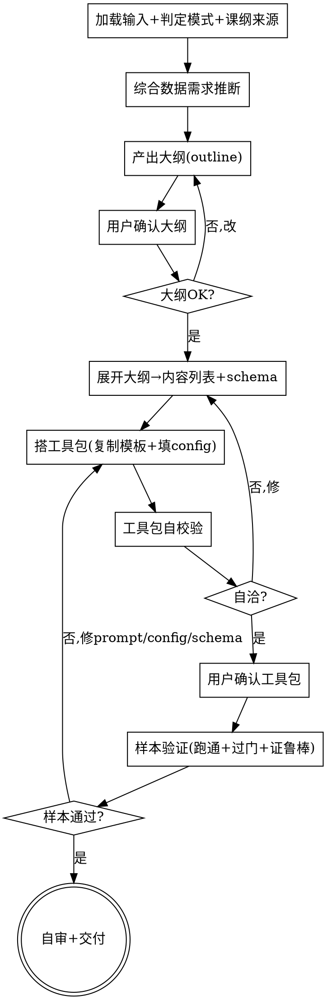

# 教育数据生成：产出可运行的数据生成工具包

## 目的

把一个**教育产品**的【需求文档 + 页面文档】（可选【课纲/种子骨架】、【课纲参考】），变成一套**可运行、可中断恢复重试、每内容点多文件、带质量门**的数据生成**工具包**，并在**样本**上跑通证明可用。

只回答一个问题：**这个产品要生成哪些数据、用什么工具包生成、怎么保证质量**。工具包本身用 `ai_bridge/providers/claude_code_direct.py` 调大模型生成数据。

两个核心特征：

1. **交付物是工具包，不是数据** —— skill 产出的是一套**可复用、可重跑**的工具包（内容列表 + schema + 生成脚本 + 校验门），并在样本上验证可用；**全量数据生产由用户后续用工具包跑**（不在 skill 范围内）。
2. **质量门内置 + 可机判优先** —— 工具包内置 validate.py 风格质量门（准确性/schema/覆盖完整性/题目有效性/难度分布 P0，适龄/多样性/可追溯 P1，课纲对齐可选），既验样本、也随工具包供全量生产复用。

```
需求文档 + 页面文档 ──► [edu-data-gen] ──► 数据生成工具包(自校验通过) + 样本验证报告
```

<HARD-GATE>
**大纲必须经用户确认后才展开、才建工具包**（Checklist 3a→3b）。
工具包**自校验通过**（`scripts/validate_toolkit.py`：大纲↔内容列表展开自洽 + 内容列表/schema/生成脚本/校验门自洽）、**样本验证通过**（`scripts/run_sample_validation.py`：样本端到端跑通、过核心质量门、中断/恢复/重试/幂等/多文件确实工作）之前，**不交付工具包**。
skill **不替用户跑全量数据**；交付边界止于"工具包 + 样本验证"。
</HARD-GATE>

## 反模式：直接开始造数据

不要跳过"分析需求+页面 → **大纲（用户确认）** → 内容列表+schema → 工具包"直接用 LLM 造一批数据交付。skill 的价值是**工具包**（可重跑、可续跑、带门），不是一次性数据。一次性数据交付属于越界（见边界）。

## 与其他 skill 的关系

- **上游可选**：`clarify-requirements` 产出的需求文档、`interaction-prototype` 产出的页面文档（epps.json）是最理想输入。不强制依赖。
- **独立**：本 skill 不调用、不预设其他 skill；交付工具包即完成。
- **不做视觉/不做 App 实现**：配色/页面代码/前后端架构超出范围。

## 边界（最重要）

**产出**（工具包层）：
- 内容列表（要生成的"内容点"清单，标注类型/`年级×Bloom`/来源）
- schema（每类内容的数据结构）
- 生成脚本（调 `claude_code_direct.py`，内置中断/恢复/重试/幂等，每内容点多文件）
- 校验门（validate.py 风格，随附工具包）
- 使用说明 + 样本验证报告

**不产出**（超出范围，记入"未决问题"）：
- ❌ **全量数据**：全量内容点的数据生产由用户后续用工具包执行。
- ❌ **二进制素材**：不产 TTS 音频/配图本身，只产文本结构化数据 + 素材描述字段。
- ❌ 视觉/UI、App 前后端实现、数据存储架构。
- ❌ 跨领域（非教育）适配。

**越界拉回**：当对话滑向"直接造一批数据给我""帮我画页面""用什么框架存数据"时，明确说"这超出 edu-data-gen 范围，本 skill 只产出可运行的数据生成工具包"，记一笔到"未决问题"。

## 内置知识

本 skill 内置（`references/`）：
- **大纲生成规则**（`outline-generation.md`）：大纲（人审确认）的三条杠杆（范围/数量/难度）+ 展开规则。**产出/确认大纲时加载**。
- **四类数据实体与 schema**（`data-types-and-schemas.md`）：学习素材字段、知识点与大纲、教学讲解、测验题(答案/解析/干扰项)。
- **`年级×Bloom` 难度体系**（`difficulty-bloom.md`）：认知层级 + 各年级段分布目标，难度坐标 = (年级, 认知层级)。
- **质量门定义**（`quality-gates.md`）：每道门查什么、严重级别、可机判判定，驱动 validate.py。
- **工具包结构约定**（`toolkit-structure.md`）：目录、内容列表格式、config、多文件切分、resume 状态。
- **LLM 调用约定**（`llm-calling.md`）：`claude_code_direct.py` 用法、模型选型、JSON 输出。
- **内置 语数英科学 课纲+知识点库**（`curriculum/`）：作为课纲参考的可选来源（P1 课纲对齐能力包）。

## Checklist

为以下每项创建一个 task，按序完成：

1. **加载输入 + 判定模式 + 课纲来源** —— 读取需求文档 + 页面文档；判定有无【骨架】→ "骨架补全"或"从零生成"；用一句话重述"该产品要生成哪些数据、给谁用"，请用户确认。若启用课纲对齐：**询问**课纲参考来源——用户提供 / 用内置 语数英科学 库 / 跳过（非语数英科学 只能提供或跳过）。加载 `references/data-types-and-schemas.md`。
2. **综合数据需求推断** —— 综合需求+页面，推断该产品需要哪些数据实体、每实体哪些字段、schema 形态（每字段对回页面文档中页面所需数据）。加载 `references/difficulty-bloom.md` 定难度坐标体系。
3a. **产出大纲 → 用户确认** —— 加载 `references/outline-generation.md`，按**三条杠杆**产出 `outline/<grade>.json`（每个涉及年级一份）：
    - **范围**（KP 来源优先级）：种子骨架 > 内置课纲库（语数英科学）> 从零保守提案（从需求功能清单+页面内容区推断，标 `source=generated`）。
    - **数量**：每个 KP 的 `generation_plan`（`explanation`/`material`/`items_by_bloom`），默认取 `config.outline_defaults`，可逐项改。
    - **难度**：`items_by_bloom` 由该年级段 `difficulty_distribution` × `items_total` 取整算出。
    汇总呈给用户（每年级 KP 数 / `est_units` / 计划难度分布），**用户确认或要求修改**（增删 KP、调数量/难度），改完**重新确认**。**确认前不展开、不建工具包。**
3b. **展开大纲 → 内容列表 + schema** —— 大纲确认后，按 `outline-generation.md` §五 **机械展开**成 `content_list/<grade>.json`（确定性：每 KP → 1 知识点 + N 素材 + M 讲解 + Σ 题目，id 稳定 → 改大纲只动变化部分、resume 状态不丢）+ 实体 schema（每字段对回页面所需数据）。加载 `references/data-types-and-schemas.md` + `references/toolkit-structure.md`。**展开不再人审**，靠 `validate_toolkit.py` 校验"展开自洽 + 计划难度达标"。
4. **搭工具包** —— 从 `assets/toolkit-template/` 复制骨架到产品工具包目录；填入产品 `config.json`（模型、难度分布目标、启用门、重试上限、多文件切分规则、prompt 模板路径）。加载 `references/toolkit-structure.md` + `references/llm-calling.md`。
5. **工具包自校验 + 确认门** —— 运行 `scripts/validate_toolkit.py <toolkit_dir>`：大纲↔内容列表展开自洽（条目数对得上、计划难度达标）+ 内容列表/schema/生成脚本/校验门自洽（字段对齐、脚本可导入、门配置合法、无占位）。不通过就地修。**通过后请用户确认工具包**，确认才进样本验证。
6. **样本验证** —— 运行 `scripts/run_sample_validation.py <toolkit_dir>`：在代表性内容点样本上跑 `generate.py` + `validate.py`，证明端到端可用——样本过核心质量门（准确性/schema/覆盖/题目有效性/难度分布），且**中断/恢复/重试/幂等/多文件确实按设计工作**。不通过就地修工具包（prompt/config/schema），重跑直至通过。
7. **自审 + 交付** —— placeholder 扫描、工具包自洽复查、使用说明可独立执行；交付工具包目录（内容列表+schema+生成脚本+校验门+config+README+使用说明）+ 样本验证报告。提示用户后续用工具包跑全量。

## 流程图



**终态是"自审+交付"：工具包自洽、样本验证通过、工具包与报告齐备。** 本 skill 不调用任何下游 skill，不替用户跑全量。

## 自审检查项（Checklist 第 7 步展开）

1. **Placeholder 扫描** —— 内容列表/config/schema 有无"占位/待定/TBD"？补具体或标为合理默认。
2. **字段对齐** —— 内容列表每个内容点的类型，在 schema 里有对应实体；schema 每个字段在生成脚本的 prompt/输出映射里有归宿。
3. **脚本可运行** —— `generate.py`/`validate.py` 能 `python -c "import"` 导入、`--help` 正常；config 字段被脚本正确读取。
4. **门配置合法** —— 启用的门在 validate.py 里有实现；难度分布目标可判定（有数值）。
5. **多文件约定** —— config 的 `file_split` 规则与 schema 字段分组一致；样本验证确实产出了多个文件。
6. **使用说明可执行** —— README 写清如何跑全量（续跑/重试/多文件用法），用户照做能独立生产。

发现问题就地修，修完重跑 `validate_toolkit.py` + `run_sample_validation.py`。

## 产出位置

存到 `data_gen/<产品名>-toolkit/`（或用户指定目录），含：
- `outline/` —— **人审确认的大纲**（按年级 `<grade>.json`：知识点树 + 每 KP `generation_plan`）
- `content_list/` —— 内容点清单（按年级 `<grade>.json`，从 outline 机械展开）
- `schema/` —— 实体 schema（每类一个文件或一个 schemas.json）
- `generate.py` —— 生成脚本（中断/恢复/重试/幂等/多文件/按年级 `--grade`）
- `validate.py` —— 校验门运行器
- `config.json` —— 产品配置（含 `outline_defaults`）
- `prompts/` —— prompt 模板（每内容类型一个）
- `state/` —— resume 状态目录（运行时生成，按内容点 id 天然分年级）
- `output/` —— 生成数据（`output/<grade>/<id>/`；样本验证时产出样本子集）
- `README.md` —— 使用说明（含全量生产用法）
- `sample_validation_report.md` —— 样本验证报告

## 关键原则

- **交付物是工具包** —— 产出可复用、可重跑、带门的工具包，不是一次性数据。全量生产由用户跑。
- **人审大纲、机判内容列表** —— 大纲（教什么/多少/多难）由用户确认；内容列表由大纲机械展开、靠 `validate_toolkit` 校验，不再逐行人审。大纲错了后面全白做，故大纲门最早、最便宜。
- **中断/恢复/重试/幂等是脚本必备能力** —— 不是 skill 的临时行为；写进 `generate.py`，样本验证里实测。
- **每内容点多文件** —— 一个内容点按 schema 字段分组产出多个文件。
- **质量门可机判优先** —— 能机判的（schema/覆盖/干扰项/分布/去重/可追溯）机判；主观准确性走人审抽样。
- **难度 = 年级 × Bloom** —— 不用笼统易/中/难；每条可定难度数据带 (年级, 认知层级) 坐标，分布受控。
- **schema 由页面文档推导** —— 内容字段对回页面所需数据，下游可直消费。
- **课纲对齐可选** —— 启用时询问来源（用户/内置库/跳过）；非语数英科学 需用户提供或跳过。
- **YAGNI** —— 不为"将来可能"造内容类型；MVP 需求出 MVP 工具包。
- **不替用户跑全量** —— 交付边界止于工具包 + 样本验证。

## 反模式

| 反模式 | 正确做法 |
|--------|----------|
| 跳过工具包，直接用 LLM 造一批数据交付 | 产出可重跑的工具包；一次性数据属越界 |
| 跳过大纲确认，直接展开 + 建工具包 | 大纲先经用户确认（3a）再展开（3b）；大纲错了工具包白做 |
| 让用户逐行确认上千条内容列表 | 只确认大纲；内容列表靠 `validate_toolkit.py` 校验展开自洽 |
| 中断/恢复/重试只靠 skill 临时做 | 写进 generate.py，样本验证里实测 |
| 每内容点只产一个文件 | 按 schema 字段分组产多文件 |
| 质量门只靠人眼看 | validate.py 机判门（schema/覆盖/干扰项/分布/去重/可追溯）必跑 |
| 难度用笼统易/中/难 | 用年级×Bloom 坐标 + 分布控制 |
| 内容字段脱离页面文档凭空设计 | 每字段对回页面所需数据 |
| 启用课纲对齐却不问来源 | 询问用户提供/内置库/跳过 |
| 把全量生产也塞进 skill | 交付边界止于工具包+样本验证 |
| 工具包不自校验就交付 | 必跑 validate_toolkit.py，自洽才确认 |
| 样本验证只看"能跑"不看鲁棒性 | 实测中断/恢复/重试/幂等/多文件确实工作 |

## 参考资源

- **`references/outline-generation.md`** —— 大纲生成规则（三条杠杆：范围/数量/难度）+ 展开规则。**产出/确认大纲时加载**。
- **`references/data-types-and-schemas.md`** —— 四类数据实体定义、字段 schema、示例。**推断数据需求/写 schema 时加载**。
- **`references/difficulty-bloom.md`** —— `年级×Bloom` 难度体系、各年级段分布目标、分布校验。**定难度坐标时加载**。
- **`references/quality-gates.md`** —— 各质量门定义（查什么/严重级别/可机判判定），驱动 validate.py。**写/调校验门时加载**。
- **`references/toolkit-structure.md`** —— 工具包目录、内容列表格式、config 字段、多文件切分、resume 状态约定。**搭工具包时加载**。
- **`references/llm-calling.md`** —— `claude_code_direct.py` 用法、模型选型、JSON 输出。**写 generate.py 时加载**。
- **`references/curriculum/`** —— 内置 语数英科学 课纲+知识点库（README + 语文/数学/英语/科学）。**启用课纲对齐且选内置库时加载**。
- **`assets/toolkit-template/`** —— 工具包骨架（generate.py/validate.py/config/schema/README）。**搭工具包时复制**。
- **`scripts/validate_toolkit.py`** —— 工具包自校验。**确认门前必须运行**。
- **`scripts/run_sample_validation.py`** —— 样本验证（跑通+过门+证鲁棒）。**交付前必须运行**。
