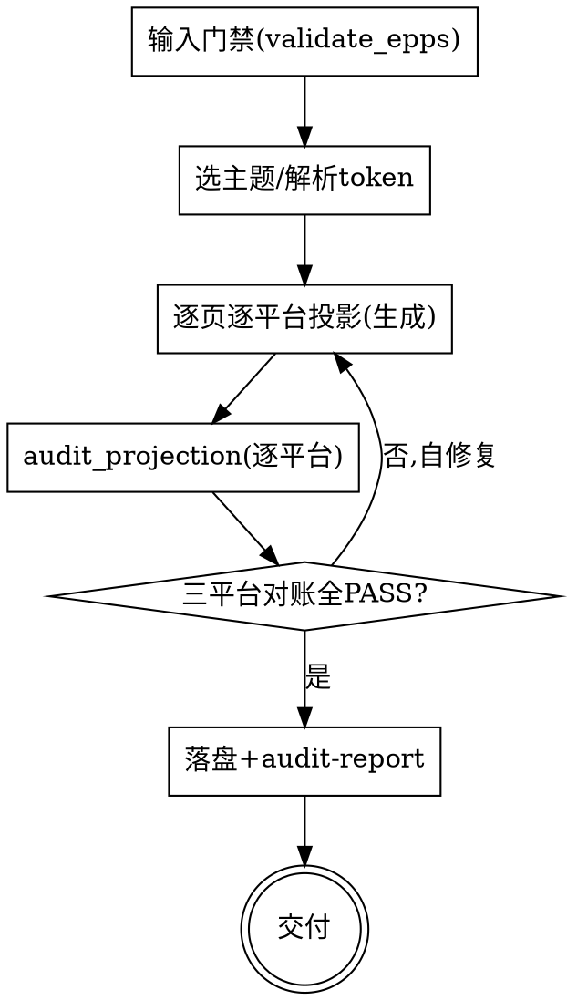

# epps-render：把 EPPS 规范渲染成多平台页面代码

## 目的

读取一份**已校验通过的 `epps.json`**（`interaction-prototype` 的产物），把它渲染成**多平台**的页面代码——**HTML（可点击）/ 安卓 XML（layout.xml）/ 安卓 Compose（@Preview）**。重点是**用合适的原生元素和排版渲染页面、主次分明**，且同一份规范在三平台结构一致、视觉同源。

只回答一个问题：**这份平台无关规范，在各平台长什么样**。不回答"规范怎么设计"（那是 `interaction-prototype`）、"怎么编译运行成工程"（预览级，不产出工程）、"真实业务逻辑怎么接"（行为都是 stub）。

两个核心特征：

1. **prompt-driven（镜像 interaction-prototype）** —— 你（AI）按各平台 `render-template.md` + `component-mapping.md` **生成**产物；脚本只做**投影对账**，不做生成。
2. **规范即事实源（严格投影 + token 单一源）** —— 三平台产物都是 `epps.json` 的机械投影：每个内容区对回一条 `density.zones[]`（`zone.kind` 取 14 种枚举），每个辅助元素对回 `assistive_elements[]`，每个可点元素对回 `jump`/`primary`/`back`。视觉由**主题 token 单一源**驱动，三平台同源。产物带**投影标记**，`audit_projection.py`（manifest 数据驱动）机械化对账。

```
已校验 epps.json ──► [epps-render] ──► HTML + 安卓 XML + 安卓 Compose（三平台对账通过）
```

<HARD-GATE>
渲染前，输入的 `epps.json` 必须先通过 `interaction-prototype` 的校验：先跑 `python skills/interaction-prototype/scripts/validate_epps.py <epps.json>`，未通过则拒绝渲染、提示用户回上游修规范。
三平台产物组装后，必须跑 `python skills/epps-render/scripts/audit_projection.py <epps.json> <render-dir> --platform all`，逐平台 PAGE/ZONE/ASSISTIVE/ACTION 对账全 PASS 前不交付。
</HARD-GATE>

## 反模式：还没有 epps.json 就渲染

没有 `epps.json`（或未校验通过）不要渲染。本 skill 只消费规范、不改规范。要设计/改规范回上游 `interaction-prototype`。

## 边界（最重要）

**产出**（渲染层）：
- HTML：自包含、可点击多屏原型（手机框，按跳转图可点，带视觉主题）。
- 安卓 XML：每页一个 `layout/page_<id>.xml`（Material 组件，预览级），共享 `values/`（colors/dimens/themes token 发射）。
- 安卓 Compose：每页一个 `<Page>Page.kt`（Material3，含 `@Preview`），共享 `theme/EppsTheme.kt`（token 发射）。
- 主题：从内置预设选一套（bright/dark/professional），token 单一源驱动三平台。
- 对账报告：逐平台投影对账结果。

**不产出**（超出范围，记入"未决问题"）：
- ❌ 可编译可运行的完整工程（build.gradle/navigation graph/Activity 接线）——预览级。
- ❌ 真实业务逻辑/数据对接——所有 `legal_behavior`（submit/play_audio…）是 stub/占位。
- ❌ 规范变更——只消费 `epps.json`，不改它。
- ❌ 新平台（iOS/Flutter…）的实际实现——架构可扩展，但首期三平台。

**越界拉回**：当对话滑向"怎么编译运行""怎么接真实接口"时，明确说"这超出渲染范围，本 skill 是预览级"，记一笔到未决问题。

## 与其他 skill 的关系

- **上游**：`interaction-prototype` 产出已校验的 `epps.json`；本 skill 的理想输入。**解耦**：本 skill 不 import/不调用 interaction-prototype 的逻辑，只消费其产物 + 复用其 `validate_epps.py` 做输入门禁。
- **独立**：本 skill 有自己的 HTML 渲染（带 token 视觉主题），不依赖 interaction-prototype 自带的 HTML。
- **schema 契约共享**：双方都以 `skills/interaction-prototype/references/epps-schema.md` 为单一 schema 源。

## Checklist

为以下每项创建一个 task，按序完成：

1. **输入门禁 + 选主题** —— 跑 `validate_epps.py <epps.json>`，通过才继续；否则拒绝、提示回上游。从 `references/theme/presets/` 选一套预设（默认 `education-bright`），或用 `--theme` 指定。解析 token 到内存。
2. **逐页逐平台投影（生成交错）** —— 对每个目标平台（html / android-xml / android-compose）：加载该平台 `render-template.md` + `component-mapping.md` + `projection.manifest.yaml`；逐页按 `zone` 顺序、`element_contract`（intent/surface/priority）、`sample_state` 插值、token 生成；`primary` 最强 / `secondary` 降权；带该平台投影标记。逐页生成交错保持连贯。
3. **对账（逐平台）** —— 跑 `audit_projection.py <epps.json> <render-dir> --platform all`；逐平台 PAGE/ZONE/ASSISTIVE/ACTION/SAMPLE_STATE 对账。
4. **自修复循环** —— 对账失败的项就地修（补 zone/标记/跳转），重跑，直到三平台全 PASS。
5. **落盘 + 写 audit-report.md** —— 产物写入 `prototype/<日期>-<主题>/render/{html,android-xml,android-compose}/`；对账结果写 `render/audit-report.md`。
6. **交付** —— 呈现产物；HTML 双击可演示；XML/Compose 在 Android Studio 预览面板可看；说明真实逻辑/工程由后续接手。

## 流程图



**终态是"交付"：三平台产物 + 对账报告齐备，逐平台对账 PASS。**

## 自审检查项

1. **输入已校验** —— 渲染前 `validate_epps.py` 必须通过。
2. **投影标记齐全** —— 三平台每页都带平台投影标记（HTML `data-*` / XML `epps:*` / Compose `// @epps`），对账能识别。
3. **zone 严格投影** —— 三平台每页 zone 的 `(id, kind)` 序列与 spec 完全一致，不多不少、顺序对、kind 在 14 枚举内。
4. **主次分明** —— 每页 `primary_action` 视觉最强且唯一；`secondary_actions` 降权；同页无第二个等大主按钮。
5. **示例数据同源** —— `sample_state` 插值无未解析占位（`{{...}}`），三平台同一示例值一致。
6. **跳转/行为落地** —— HTML 可点（target 跳屏/behavior 占位反馈/host 提示）；安卓仅视觉（onClick 留空 stub）。
7. **token 单一源** —— 三平台视觉由同一预设 token 驱动；切换主题三平台同步。

发现问题就地修，修完回到第 3 步重对账。

## 关键原则

- **输入单一事实源** —— 只以 `epps.json` 为准；`prototype.md` 仅作上下文。
- **严格投影** —— 不渲染 spec 未声明的 zone/assistive/跳转；不发明内容。
- **元素先声明意图再承载** —— 按 `element_contract.intent/surface/priority` 决定元素形态与权重；`guidance` 不进主内容区。
- **主次分明** —— `primary` 最强唯一，`secondary` 降权。
- **token 单一源** —— 主题预设一份，三平台发射自同源，跨平台一致。
- **预览级** —— 安卓产物可预览不可运行；行为是 stub。
- **manifest 数据驱动** —— 投影标记由各平台 `projection.manifest.yaml` 声明，对账脚本通用；新增平台加数据文件、零 Python。
- **YAGNI** —— 不做工程/真实逻辑/新平台实现。

## 反模式

| 反模式 | 正确做法 |
|--------|----------|
| 未跑 validate_epps 就渲染 | 先校验输入，不过则拒绝 |
| 凭空加/漏 zone（三平台漂移） | 严格按 spec zone 投影，对账兜底 |
| 同页多个等大主按钮 | 单一 primary，secondary 降权 |
| 安卓接真实 onClick 逻辑 | 预览级，onClick 留空 stub |
| 生成不可预览的死代码（资源 id 缺失/import 缺失） | 用 Material/Material3 标准组件，标记齐全 |
| 行为目标在产物里无处安放 | HTML 用 `data-behavior`；XML `epps:action="behavior:X"`；Compose `// @epps action behavior=X` |
| 三平台 token 各写各的（颜色漂移） | 从同一预设 token 发射 |
| 改 epps 规范 | 回上游 interaction-prototype |

## 参考资源

- **`references/theme/token-spec.md`** —— 跨平台 token 契约。**选/解析主题时加载**。
- **`references/theme/presets/*.json`** —— 预设主题（education-bright/education-dark/professional）。
- **`references/<平台>/render-template.md`** —— 各平台如何按 spec 写产物 + 投影标记。**生成时加载**。
- **`references/<平台>/component-mapping.md`** —— 14 zone.kind → 平台原生组件 + 主次层级映射。**生成时加载**。
- **`references/<平台>/projection.manifest.yaml`** —— 投影标记 manifest（对账脚本的输入）。**对账时加载**。
- **`references/platforms.md`** —— 平台注册表 + 新增平台步骤。**扩展平台时加载**。
- **`scripts/audit_projection.py`** —— manifest 驱动投影对账。**交付前必须运行**。
- 上游 **`skills/interaction-prototype/scripts/validate_epps.py`** —— 输入门禁。**渲染前必须运行**。
- 上游 **`skills/interaction-prototype/references/epps-schema.md`** —— EPPS schema 与 14 zone.kind 枚举（单一 schema 源）。
