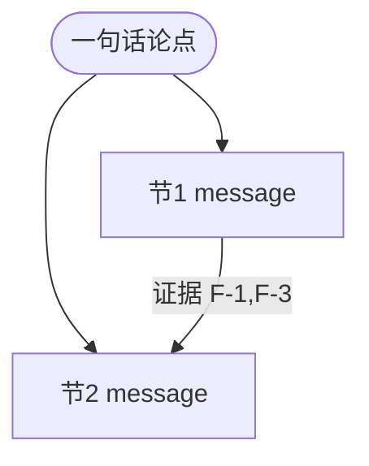

# 阶段 3：故事线（任务卡）

## 目的

排**读者心里的电影**：每节一句话 message，节与节构成论证链。金字塔原理——结论先行，上层是断言、下层是证据。此刻只跑逻辑不谈形式（形式是阶段 4 的事）。白板级中间产物，可丢弃可重排。

## 输入

`01`（论点/读者/决策清单/阅读场景/**硬约束清单**）+ `02`（弹药盘点：哪些论证撑得住、哪些缺弹药已降级）。

**先映射硬约束再排节**：brief 必含要素（如"工作内容/数据成果/反思/计划"）逐条映射到节——允许合并（工作叙述并入各线节），不允许空节与重复节；篇幅约束折算成每节字数预算写进骨架。

## 产出与模板（写入 `03-故事线.md`，论证链图用 **Mermaid**，不用 ASCII）

1. **叙事骨架**：按文种选模板，允许裁剪合并（理由记台账）——
   - **技术方案**：背景与痛点 → 目标与非目标 → 现状 → 方案空间与对比 → 推荐与理由 → 关键设计 → 风险与对策 → 里程碑
   - **汇报文档**：SCQA 开场（情境-冲突-问题）→ 核心结论 → 进展/数据 → 风险与求助 → 决策请求 → 下一步
2. **message 链**（文档主体骨架，一行一节）：

| # | 节名 | message（这节要传达的一句话，结论式） | 用哪些事实 | 回答哪条 D-x | 节奏标注 |
|---|---|---|---|---|---|
| 1 | 例：构建慢的代价 | 主干构建 14min 吃掉每天 2.5h 等待，已到不改不行的点 | F-1,F-3 | D-1 | ★决策核心 |
| 2 | … | … | … | … | 可折叠/附录 |

   节名可以直接就是 message 的短语版（"现状：单点故障每月损失 X"优于"现状分析"）。
3. **论证链图**（Mermaid）：论点 → 各节 message → 证据 F-x 的支撑关系。这是 UI 工作法里"流程草图"的等价物：

4. **节奏标注**：哪节是决策核心（阶段 7 先写先审）、哪节投屏时一屏一图、哪节可折叠进附录。
5. 尾部两节：**故事线教给我们的事**（重排过程中暴露的洞察）+ **新问题 P3-x**（带倾向，待拍板）。

## 完成标志

message 链从头读到尾 = 一段完整电梯陈述；决策清单每条 D-x 被某节覆盖；每条 message 的证据 F-x 在台账中存在（缺的回阶段 2 补 G-x）；投屏场合每节可一屏承载。

## 人工决策点

**拍故事线**（可给 2 版对比：结论先行 vs 问题铺垫式，推荐前者并说明代价）；裁剪掉的模板段确认；拍 P3-x。

## 坑

- 节名=分类名（"现状分析"）而非 message（"现状：单点故障每月损失 X"）——读者扫目录拿不到结论；
- D-x 有问无节（决策清单是覆盖基准，gate 会查）；
- 模板段全保留（没有"非目标"内容就砍，空节比没节更减分）；
- 故事线里就开始想"这里画个什么图"——忍住，那是阶段 4；
- **必含章节零素材**（如述职要求"反思/计划"但 brief 没给）：AI 基于台账起草、置信标推算、用户逐条审改后才入稿——不得默认入稿，不得编造归因。

## 工具化要点

- AI 任务：从 01+02 生成 message 链草稿 ×2 版 + 论证链图。
- 界面：message 卡片拖拽排序 + 覆盖矩阵（D-x × 节）自动高亮空洞。
- gate：`check_plan.py 03`——message 非空；D-x ⊆ 覆盖列；引用 F-x 全部存在于 02；★决策核心至少 1 节。
