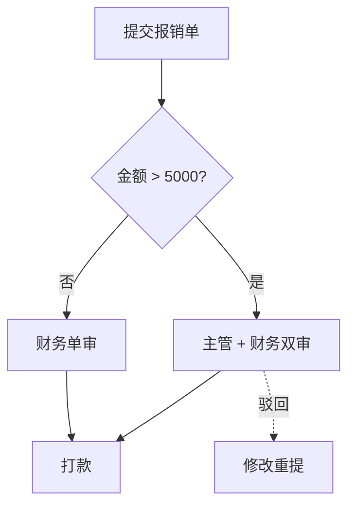

# 表达形式目录（visual-form-catalog）

阶段 4 唯一选型依据。用法：**先判定内容类型（T 编号），再查表选形式**；判定不了的记 P4-x，不硬套。

## 选型三原则

1. **先问论证角色**：这块内容在故事线里是证据（→ 图/表）还是论证（→ 短文字+callout）？
2. **数字 ≥3 或对比 ≥2 组 → 必上图/表**，不许落成段落；
3. **文字是最贵的形式**：只付给 T10 论证和 T11 清单；其他类型用文字 = 选型失败。

## 类型总表

| 类型 | 判定信号（smell） | 形式 | 工具 | 反模式 |
|---|---|---|---|---|
| T1 步骤流转 | 首先/然后/接着/最后；A 提交给 B 处理 | flowchart | Mermaid | 大段文字 |
| T2 系统交互 | 调用/请求/返回/回调/轮询 | sequenceDiagram | Mermaid | 用 flowchart 画时序 |
| T3 架构分层 | 模块/组件/依赖/部署关系 | 分层组件图（subgraph） | Mermaid | 纯文字罗列模块 |
| T4 状态迁移 | 状态/生命周期/流转条件 | stateDiagram-v2 | Mermaid | 状态长表 |
| T5 候选对比 | 方案 A/B/C、优缺点、选型 | 对比矩阵 + 加权行 | HTML | 各方案分段文字 |
| T6 分类数值 | X 比 Y 高/低 N%；各分类取值 | 柱状（按值排序） | ECharts | 表格堆数字；折线画分类 |
| T7 时间趋势 | 增长/下降/环比/随时间变化 | 折线（≤4 线） | ECharts | 柱状画趋势 |
| T8 构成占比 | 其中 X 占 N%；由…构成 | 堆叠柱 / 环形（≤5 类） | ECharts | 饼图 >5 类；3D 饼 |
| T9 分布区间 | 集中在/长尾/离散度 | 直方图 / 箱线 | ECharts | 只报平均数 |
| T10 论证因果 | 因为/所以/导致/权衡 | **短段落 + 结论 callout** | HTML | 硬画成图 |
| T11 清单枚举 | 包括 N 项；注意事项 | 紧凑表 / 卡片列 | HTML | 带点长列表 |
| T12 里程碑排期 | 阶段/周期/依赖/责任人 | 时间线 / 简化甘特 | HTML | 表格排期 |
| T13 指标总览 | 核心指标一览/开局定调/成绩单 | KPI 大数字行（数字+增幅+口径） | HTML | 表格堆数字 |

## 各类型规范与模板

### T1 步骤流转 → Mermaid flowchart

- 节点=动作（动词+宾语），边=流向；分支边**必须带条件标签**；异常分支用虚线；
- **节点可带台账数值标注**（如「社群沉淀 3.2 万人」）——结构图带数仍是结构图，不算"用 Mermaid 画数据图"；但对比/趋势类数值不在此列（那是 T6–T9 的领地）；
- 方向：纵向为主（TD），步骤 ≤4 且为线性时才 LR；
- 步骤 >10 → 先分层（subgraph 按阶段分组），或拆两张图；
- 泳道感需求强（多角色分工）→ 评估改 T2 或 T5。

### T2 系统交互 → Mermaid sequenceDiagram

- 参与方 ≤6；每条消息=一次调用/事件，动词开头；
- 回调用虚线；关键延迟/失败在消息标签上标注；
- alt/opt 区块表达条件分支——不要用注释文字解释分支。

### T3 架构分层 → Mermaid 分层组件图

- 层从上到下=从入口到存储；**跨层箭头要有，同层依赖克制**；
- 组件框内写职责一句话（不是模块名裸奔）；
- 依赖方向违反分层（下层引上层）必须显式画出——这是评审要点，不是要藏的瑕疵。

### T4 状态迁移 → Mermaid stateDiagram-v2

- 状态名=形容词/分词（已支付/待审核），不是动作；
- 每条边标触发事件；非法迁移不画（文档不是测试矩阵）。

### T5 候选对比 → HTML 对比矩阵

- 列=候选方案，行=**决策维度（从 D-x 推导，不是想到哪写到哪）**；
- 维度行首列标权重（高中低或分数）；每格=短语+关键数据，不放长句；
- 末行加权总分 + 推荐行高亮；落选理由一列讲清（"何时它会翻案"给读者台阶）；
- ≤3 候选；第 4 个及以后并入"其他考虑过"脚注。

### T6 分类数值 → ECharts 柱状

- **按值排序**（类目天然有序除外，如版本号）；横向柱当类目名长于 6 字；
- 数值直接标在柱端（不需要 y 轴刻度读数）；
- 只强调重点柱（强调色），其余灰阶。

### T7 时间趋势 → ECharts 折线

- ≤4 条线；线多于 4 → 分图或只画重点+其余聚合；
- 系列名直接标注在线尾（不用图例往返）；关键拐点打点+短标注；
- x 轴等距时间；跨度选择要服务结论（"近 30 天"比"全部历史"更常见）。

### T8 构成占比 → ECharts 堆叠柱 / 环形

- ≤5 类；>5 类取 Top4 + "其他"；
- 首选**堆叠横条**（占比+总量都能读）；环形仅当"单一整体的部分"且类目少；
- 直接标注类目+百分比；不用图例。

### T9 分布区间 → ECharts 直方图 / 箱线

- 分布信息优先于平均值：均值线可加，但直方图/箱线为主；
- 口径（bin 宽度/样本量）进脚注。

### T10 论证因果 → 短段落 + 结论 callout（**文字的领地**）

- 结构：结论 callout 在前（断言），2–3 段短论证在后；
- 每段 ≤180 字；论据引用 F-x；不图化——因果链图（因为A所以B所以C）是表现力反模式；
- callout 三型：结论（accent）/风险（risk）/数据口径（muted）。

### T11 清单枚举 → 紧凑表 / 卡片列

- 有属性可比较 → 表（属性做列）；纯并列 → 卡片列；
- 不用带项目符号的多行长列表（超过 5 行的 bullet 清单基本都该是表）。

### T12 里程碑排期 → HTML 时间线 / 简化甘特

- ≤8 个节点；每节点=阶段名+周期+交付物+依赖；
- 关键路径用强调色；HTML/CSS 实现（不引 ECharts gantt）。

## 数据图 vs 结构图（红线重申）

Mermaid 只画**结构**（T1–T4）；数据（T6–T9）一律 ECharts——Mermaid 的 xy-chart 表现力不达标，禁用。
HTML/CSS 承担**版面组件**（T5/T10/T11/T12）：矩阵、callout、KPI 行、时间线不进图表库。
