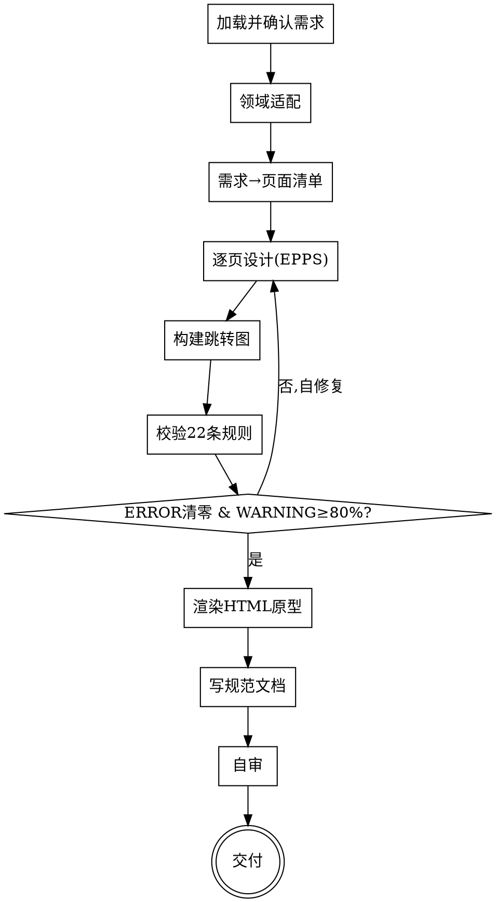

# 交互原型：从需求生成可校验、可点击的交互原型

## 目的

把一份**功能需求**（一句话描述，或 `clarify-requirements` 产出的需求文档），变成一套**符合专业交互标准、可点击演示**的交互原型。

只回答一个问题：**这个东西要拆成哪些页面、每页长什么样（结构）、页面之间怎么跳**。不回答"视觉怎么做"（配色/字体/插画/动效，一律不涉及）。

两个核心特征：

1. **标准驱动** —— 每个页面都从**标准页面库**派生，按 **EPPS Schema** 填全字段；产出后用 **22 条校验规则**逐页 + 全局校验，不达标就自修复，直到合格。
2. **规范即事实源** —— 先产出结构规范（EPPS 页面对象 + 跳转图），校验通过后再据此**渲染**成可点击 HTML 原型。HTML 由规范派生，不脱离规范凭空画。

```
功能需求 ──► [interaction-prototype] ──► EPPS 规范(校验通过) + 可点击 HTML 原型
```

<HARD-GATE>
在 EPPS 规范通过校验（所有 🔴 ERROR 清零、🟡 WARNING 通过率 ≥ 80%）之前，**不进入 HTML 渲染**。校验与自修复是硬环节，不可跳过。
</HARD-GATE>

## 反模式：需求还没定就画原型

需求不清先回去澄清（用 `clarify-requirements`）。原型是把**已经定下来的功能**落成交互，不是用来"边画边想功能"的——边画边想必然返工。一句话需求可以画，但必须先复述确认，且明确"功能范围以此为准，不擅自增删"。

## 与其他 skill 的关系

- **上游可选**：`clarify-requirements` 产出的功能需求文档是最理想的输入；本 skill 也接受一句话需求。不强制依赖。
- **独立**：本 skill 不调用、不预设其他 skill；产出原型即完成。
- **不做视觉设计**：配色/字体/插画/动效属于视觉层，超出范围（越界拉回，可指向视觉设计类 skill）。

## 边界（最重要）

**产出**（交互层）：
- 页面清单（页面 id + 类型 + 在用户旅程中的角色）
- 每个页面的 EPPS 结构（主行动点、次要操作、导航、进度、反馈、密度、跳转）
- 全局跳转图 + Tab 集合
- 校验报告（22 条规则逐项结果 + 质量分）
- 可点击 HTML 原型（手机框，多屏，按跳转图可点）

**不产出**（超出范围，记入"未决问题"即可）：
- ❌ 视觉设计：配色、字体、组件样式、插画、动效
- ❌ 技术实现：框架、状态管理、API、数据模型
- ❌ 需求变更：不增删功能，只把已有需求落成交互

**越界拉回**：当对话滑向"用什么配色/字体""用什么框架实现"时，明确说"这超出交互原型范围，原型只定页面结构与跳转"，记一笔到"未决问题"。

## 内置标准

本 skill 内置**教育类 App** 的标准页面库（`references/standards/education/page-library.md`）。EPPS Schema、7 条交互标准、22 条校验规则是**通用引擎**，适用于多数 App；教育类页面模板用于教育类需求。

非教育类需求时：用通用引擎 + EPPS Schema 派生页面，并明确提示"未内置该领域页面库，按通用标准派生，具体页面结构可能需用户校准"。详见 Checklist 第 2 步。

## Checklist

为以下每项创建一个 task，按序完成：

1. **加载并确认需求** —— 读取需求文档或一句话描述；用一句话重述核心用户旅程（谁、在什么场景、要完成什么、关键路径是什么），请用户确认。
2. **领域适配** —— 判断是否教育类 App（或近似）。是 → 加载 `references/standards/education/page-library.md`；否 → 用通用引擎 + EPPS 派生，提示用户页面结构需校准。
3. **需求 → 页面清单** —— 把功能映射到标准页面类型（`home` / `course_detail` / `learning` / `quiz` / `result` / `profile` / `list` / `misc` / `modal`），列出每页 `id` + 在旅程中的角色 + level。**与用户确认页面集合**后再细化。
4. **逐页设计（EPPS）** —— 每页从对应标准页面派生，填全 EPPS Schema 所有必填字段：`id`/`level`/`type`、`primary_action`、`secondary_actions`、`navigation`、`progress`、`feedback`、`density`、`jumps`。详见 `references/epps-schema.md`。
5. **构建跳转图** —— 连接 `jumps`：每个 `target` 必须指向已定义的 `page.id`（或合法行为标识）；确保 `reversible: true`；建立全局跳转图 + 底部 Tab 集合。
6. **校验（22 条规则）** —— 先**逐页校验**（页内规则），再**全局校验**（跨页规则），算质量分。详见 `references/validation-rules.md`。
7. **自修复循环** —— 逐条违规就地修（不绕过），重新校验，直到所有 🔴 清零且 🟡 通过率 ≥ 80%。把修复记录写进校验报告。
8. **渲染 HTML 原型** —— 据校验通过的规范，生成自包含 `prototype.html`（手机框、多屏、按跳转可点）。详见 `references/html-render-template.md`。
9. **写规范文档** —— `prototype.md`：页面清单 + EPPS 页面 + 跳转图 + 校验报告 + 未决问题。
10. **自审** —— placeholder 扫描、孤立页、死胡同、密度复核、HTML 与规范一致性。发现问题就地修。
11. **交付** —— 呈现原型；提示用户用浏览器打开 `prototype.html` 演示；说明后续视觉/技术由其他环节接手。

## 流程图



**终态是"交付"：规范 + HTML 原型齐备，校验合格。** 本 skill 不预设、不调用任何后续 skill。

## 自审检查项（Checklist 第 10 步展开）

写完文档与 HTML 后用新视角过一遍：

1. **Placeholder 扫描** —— 页面文案有无"占位/待定/TBD/之后再说"？补具体，或保留为合理的示例文案（示例文案要真实可用，不是 lorem）。
2. **孤立页** —— 有无 `page.id` 没被任何 `jump`/`target` 引用（`home` 作为起点除外）？（对应 R8.3）
3. **死胡同** —— 有无页面既无 primary 出口、`jumps` 也为空（`modal`/`result` 例外，且 `result` 必有 primary 出口）？（对应 R4.3）
4. **密度复核** —— 抽查每页 `button_count ≤ 7`、`zones ≤ 4`。（对应 R6.1/R6.2）
5. **跳转闭合** —— 跳转图所有 `target` 落在已定义页；所有 `reversible: true`；`back_target` 落在已定义页。（对应 R4.1/R4.2/R4.5）
6. **HTML ↔ 规范一致** —— HTML 里每个可点元素都能对回规范里的 `jump`/`primary_action`/`navigation.back`/`tab`；HTML 没有规范里不存在的跳转。

发现问题就地修，修完回到第 6 步重校验。

## 产出位置

存到 `prototype/YYYY-MM-DD-<主题>/`，含：
- `prototype.md` —— EPPS 规范 + 跳转图 + 校验报告 + 未决问题
- `prototype.html` —— 可点击多屏原型（手机框）

日期用当天。

## 关键原则

- **标准驱动** —— 页面从标准库派生，不凭空发明页面结构。
- **规范即事实源** —— HTML 渲染自规范，校验先于渲染。
- **死胡同禁令** —— 每页必有正向出口，跳转必可逆。
- **单一主行动点** —— 每页只一个视觉最强的 primary，其余降权。
- **不增删需求** —— 把已有功能落成交互，不擅自加功能或砍功能；要改需求回上游。
- **YAGNI** —— 不为"将来可能"造页面；MVP 需求出 MVP 页面。
- **可回头** —— 任何时候可回到任何一步修订，修完重校验。

## 反模式

| 反模式 | 正确做法 |
|--------|----------|
| 跳过校验直接画 HTML | 先规范、后渲染；校验不过不渲染 |
| 页面凭空设计，不参照标准库 | 每页从标准页面派生 |
| 底部多个等大主按钮 | 单一 primary，次要操作降权为图标 |
| 出现死胡同页（无出口） | 每页必有 primary 出口或 jump |
| 跳转不可逆 / target 悬空 | 每条 jump `reversible: true` 且 target 落在已定义页 |
| 学习/练习页反馈 async | `feedback.type` 必须 `immediate` |
| 单页塞 >7 个可点元素 | `button_count ≤ 7` |
| 擅自加配色/字体/插画/动效 | 越界拉回，交互层不涉及视觉 |
| 擅自增删功能 | 只落实已有需求，改需求回上游 |
| 一句话需求直接画，不复述确认 | 先复述核心旅程并确认 |
| 非教育类需求却硬套教育模板 | 用通用引擎派生，提示需校准 |

## 参考资源

- **`references/epps-schema.md`** —— EPPS 页面 Schema：字段定义、页面类型枚举、每字段对应的交互标准。**设计页面时加载**。
- **`references/validation-rules.md`** —— 22 条校验规则：逐页 + 全局规则、严重级别、质量评分、执行流程、规则汇总表。**校验时加载**。
- **`references/html-render-template.md`** —— EPPS → 可点击 HTML 原型的渲染规范：组件映射表、手机框骨架、可复用 HTML/CSS/JS 模板、各页面类型组件配方。**渲染时加载**。
- **`references/standards/education/page-library.md`** —— 教育类标准页面库：7 条设计准则、6 个核心页面 + 衍生页（含完整 Schema 实例）、标准跳转图。**教育类需求时加载**。
