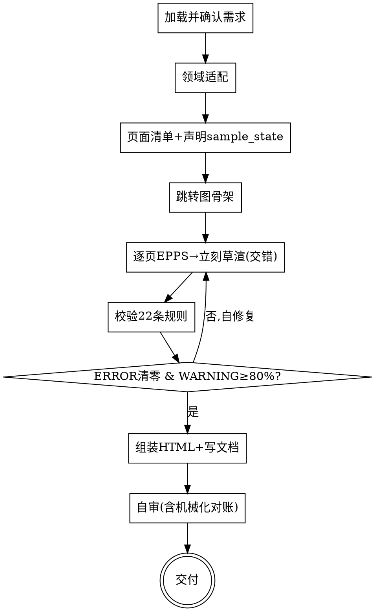

# 交互原型：从需求生成可校验、可点击的交互原型

## 目的

把一份**教育/学习类产品功能需求**（一句话描述，或 `clarify-requirements` 产出的需求文档），变成一套**符合专业交互标准、可点击演示**的移动端交互原型。

只回答一个问题：**这个东西要拆成哪些页面、每页长什么样（结构）、页面之间怎么跳**。不回答"视觉怎么做"（配色/字体/插画/动效，一律不涉及）。

两个核心特征：

1. **标准驱动** —— 每个页面都从**教育类标准页面库**派生，按 **EPPS Schema** 填全字段；产出后用脚本执行 **22 条校验规则**逐页 + 全局校验，不达标就自修复，直到合格。
2. **规范即事实源（完整契约 + 严格投影）** —— 先产出结构规范（EPPS 页面对象 + 跳转图 + `sample_state`）；HTML 是规范的**机械投影**——每个内容区对回一条 `density.zones[]` 声明、每个跳转对回 `jump`，不脱离规范凭空画（连「学习提示」这种善意补充也得先回 spec 声明）。逐页「定稿 EPPS → 立刻草渲」保持连贯，完整 22 条校验通过后才组装交付。

```
功能需求 ──► [interaction-prototype] ──► EPPS 规范(校验通过) + 可点击 HTML 原型
```

<HARD-GATE>
完整 22 条校验通过（所有 🔴 ERROR 清零、🟡 WARNING 通过率 ≥ 80%），且 HTML/spec 对账通过之前，**不组装最终 `prototype.html`、不交付**。
逐页「定稿 EPPS → 立刻草渲该页」用于保持示例数据与 zone 连贯（源头修复 S4，见下 Checklist 第 5 步），属草稿、不计入交付；草渲前对该页做轻量结构自检（primary 存在、`zone.kind` 合法）即可。
</HARD-GATE>

## 反模式：需求还没定就画原型

需求不清先回去澄清（用 `clarify-requirements`）。原型是把**已经定下来的功能**落成交互，不是用来"边画边想功能"的——边画边想必然返工。一句话需求可以画，但必须先复述确认，且明确"功能范围以此为准，不擅自增删"。

## 与其他 skill 的关系

- **上游可选**：`clarify-requirements` 产出的功能需求文档是最理想的输入；本 skill 也接受一句话需求。不强制依赖。
- **独立**：本 skill 不调用、不预设其他 skill；产出原型即完成。
- **不做视觉设计**：配色/字体/插画/动效属于视觉层，超出范围（越界拉回，可指向视觉设计类 skill）。

## 边界（最重要）

**产出**（交互层）：
- 页面清单（页面 id + 类型 + 在用户旅程中的角色）
- 每个页面的 EPPS 结构（主行动点、次要操作、导航、进度、反馈、密度、跳转）
- 全局跳转图；`scope==whole_app` 时含底部 Tab 集合，`scope==feature_flow` 时含 `host_anchors`（入口/出口）
- 校验报告（22 条规则逐项结果 + 质量分）
- 可点击 HTML 原型（手机框，多屏，按跳转图可点）

**不产出**（超出范围，记入"未决问题"即可）：
- ❌ 视觉设计：配色、字体、组件样式、插画、动效
- ❌ 技术实现：框架、状态管理、API、数据模型
- ❌ 需求变更：不增删功能，只把已有需求落成交互

**越界拉回**：当对话滑向"用什么配色/字体""用什么框架实现"时，明确说"这超出交互原型范围，原型只定页面结构与跳转"，记一笔到"未决问题"。

## 内置标准

本 skill 内置**教育/学习类移动 App** 的标准页面库（`references/standards/education/page-library.md`）。EPPS Schema、7 条交互标准、22 条校验规则、HTML 投影规范都围绕学习路径、练习反馈、结果闭环和移动端手机框优化。

非教育类需求时：明确提示"当前 skill 已收窄为教育/学习类移动端原型；若继续使用，将按教育类交互模式派生，可能不适合该领域"。用户确认后才继续，否则建议改用更通用的产品原型/视觉设计流程。

## Checklist

为以下每项创建一个 task，按序完成：

1. **加载并确认需求** —— 读取需求文档或一句话描述；用一句话重述核心用户旅程（谁、在什么场景、要完成什么、关键路径是什么），请用户确认。**同时确认设计范围（`scope`）**：目标是「整个 App 的主结构（含底部 Tab）」(`whole_app`)，还是「App 内某个功能/流程」(`feature_flow`)。后者默认不画底部 Tab（`tab_bar_mode: hidden`）；若该功能本就挂在宿主 App 的某个 Tab 下且需保留 Tab，则改 `tab_bar_mode: inherit`。`feature_flow` 还需确认**入口/出口**：从宿主 App 哪个入口进入、完成后回到宿主哪里（声明为 `host_anchors`）。
2. **领域适配** —— 判断是否教育/学习类移动 App（或近似）。是 → 加载 `references/standards/education/page-library.md`；否 → 提示本 skill 的教育领域边界，用户明确接受教育式模式后才继续。
3. **页面清单 + 声明 `sample_state`** —— 把功能映射到标准页面类型（`home` / `course_detail` / `learning` / `quiz` / `result` / `profile` / `list` / `misc` / `modal`），列出每页 `id` + 在旅程中的角色 + level。**与用户确认页面集合**后，**声明原型级 `sample_state`**（当前年级/单元、今日复习数、新学数、streak、示例学习项……）——这是所有页面示例数据的**唯一来源**（源头修复 S3）：后续 `status`、徽章、HTML 一律引用它，杜绝「四年级 vs 五年级」这类跨页漂移。
4. **跳转图骨架（先于渲染）** —— 先连 `jumps`：每个 `target` 必须指向已定义的 `page.id`、已声明的 `host_anchor.id`（`feature_flow` 的外部入口/出口）或合法行为标识；确保 `reversible: true`。**Tab 集合按 `scope`/`tab_bar_mode` 条件产出**（`whole_app`/`inherit` → 3–5 个；`feature_flow`+`hidden` → 不画 Tab、声明 `host_anchors`）。骨架先定，避免逐页渲染时 target 悬空。
5. **逐页 EPPS → 立刻草渲（交错）** —— **对每一页**：从对应标准页面派生，填全 EPPS 必填字段（`id`/`level`/`type`、`primary_action`、`secondary_actions`[含 `placement`]、`navigation`、`progress`、`feedback`、`density`[含 `zones` 内容契约，`kind` 取枚举]、`jumps`），**`status`/示例值引用 `sample_state`**；定稿后**立刻草渲该页 HTML**（按 `references/html-render-template.md` 严格投影：**只渲染声明的 zone，不发明**）。定稿一页、渲染一页，保持该页 EPPS 在工作记忆里（源头修复 S4，缩短 spec↔render 那道沟）。详见 `references/epps-schema.md`。
6. **校验（22 条规则）** —— 先**逐页校验**（页内规则），再**全局校验**（跨页规则），算质量分；优先运行 `scripts/validate_epps.py prototype.md` 或 `scripts/validate_epps.py epps.json`。详见 `references/validation-rules.md`。
7. **自修复循环** —— 逐条违规就地修（不绕过），重新校验，直到所有 🔴 清零且 🟡 通过率 ≥ 80%。把修复记录写进校验报告。
8. **组装 + 写规范文档** —— 按 `references/output-format.md` 写 `prototype.md`，把 EPPS 放进 fenced `json epps` 或 `yaml epps` 块；把逐页草渲拼成自包含 `prototype.html`（手机框、多屏、按跳转可点），并建议另存同内容 `epps.json`。
9. **自审（含机械化对账）** —— placeholder 扫描、孤立页、死胡同、密度复核；再运行 `scripts/audit_html_projection.py prototype.md prototype.html` 做**机械化对账**（HTML↔spec：zone 数量/顺序/`kind` 一一对应、示例数据同源 `sample_state`、affordance 单点 `placement`、无未声明跳转），硬拦截不一致，就地修。详见 `references/html-render-template.md` §五。
10. **交付** —— 呈现原型；提示用户用浏览器打开 `prototype.html` 演示；说明后续视觉/技术由其他环节接手。

## 流程图



**终态是"交付"：规范 + HTML 原型齐备，校验合格。** 本 skill 不预设、不调用任何后续 skill。

## 自审检查项（Checklist 第 9 步展开）

写完文档与 HTML 后用新视角过一遍：

1. **Placeholder 扫描** —— 页面文案有无"占位/待定/TBD/之后再说"？补具体，或保留为合理的示例文案（示例文案要真实可用，不是 lorem）。
2. **孤立页** —— 有无 `page.id` 没被任何 `jump`/`target` 引用（`home` 作为起点除外）？（对应 R8.3）
3. **死胡同** —— 有无页面既无 primary 出口、`jumps` 也为空（`modal`/`result` 例外，且 `result` 必有 primary 出口）？（对应 R4.3）
4. **密度复核** —— 抽查每页 `button_count ≤ 7`、`zones ≤ 4`。（对应 R6.1/R6.2）
5. **跳转闭合** —— 跳转图所有 `target` 落在已定义页**或已声明的 `host_anchor`**；所有 `reversible: true`；`back_target` 落在已定义页或已声明 `host_anchor`。（对应 R4.1/R4.2/R4.5）
6. **HTML ↔ 规范一致（机械化对账，硬拦截）** —— 把每屏 HTML 反解析回 zone/action 列表，与 spec 逐项 diff：
   - 每个可点元素对回 `jump`/`primary_action`/`navigation.back`/`tab`，无规范里不存在的跳转；
   - **zone 数量/顺序/`kind`** 与 `density.zones[]` 一一对应，不多不少（catch「学习提示」多出一区）；
   - **示例数据**（年级/单元/今日数/streak/示例词/百分比）全部同源 `sample_state`，无跨页矛盾（catch 四年级 vs 五年级）；
   - **affordance 单点**：`target==null` 行为（发音/提示/保存）只在一个 `placement` 渲染，无「卡内 + 操作栏」双份。
   - 详见 `references/html-render-template.md` §五。

发现问题就地修，修完回到第 6 步重校验。

## 产出位置

存到 `prototype/YYYY-MM-DD-<主题>/`，含：
- `prototype.md` —— EPPS 规范 + 跳转图 + 校验报告 + 未决问题
- `prototype.html` —— 可点击多屏原型（手机框）
- `epps.json` —— 推荐保存；与 `prototype.md` 的 EPPS 块一致，供脚本稳定读取

日期用当天。

## 关键原则

- **范围先定** —— 动手前确认 `scope`：整 App 还是 App 内某功能；范围决定要不要底部 Tab（`tab_bar_mode`）、要不要 `host_anchors`（入口/出口）。
- **标准驱动** —— 页面从标准库派生，不凭空发明页面结构。
- **规范即事实源（完整契约 + 严格投影）** —— HTML 是 spec 的**机械投影**：每个内容区对回一条 `density.zones[]` 声明（`zone.kind` 取闭环枚举），每个可点元素对回 `jump`/`primary`/`back`/`tab`。**不渲染 spec 未声明的 zone，也不出现 spec 没有的跳转**——连「学习提示」这种善意补充也不行，要加先回 spec 声明。
- **内容单一源（`sample_state`）** —— 所有示例数据（年级/单元/今日数/streak/示例词）来自原型级 `sample_state`，spec `status` 与 HTML 同源引用；禁止各页各自硬编码，否则同数据跨页漂移。
- **affordance 单点** —— `target==null` 的行为（发音/提示/保存）按 `placement` 只在一处渲染，不卡内+操作栏双份。
- **死胡同禁令** —— 每页必有正向出口，跳转必可逆。
- **单一主行动点** —— 每页只一个视觉最强的 primary，其余降权。
- **不增删需求** —— 把已有功能落成交互，不擅自加功能或砍功能；要改需求回上游。
- **YAGNI** —— 不为"将来可能"造页面；MVP 需求出 MVP 页面。
- **可回头** —— 任何时候可回到任何一步修订，修完重校验。

## 反模式

| 反模式 | 正确做法 |
|--------|----------|
| 跳过校验直接交付 HTML | 逐页草渲可早做（保连贯），但完整 22 条校验通过前不组装、不交付 |
| 页面凭空设计，不参照标准库 | 每页从标准页面派生 |
| 底部多个等大主按钮 | 单一 primary，次要操作降权为图标 |
| 出现死胡同页（无出口） | 每页必有 primary 出口或 jump |
| 跳转不可逆 / target 悬空 | 每条 jump `reversible: true` 且 target 落在已定义页 |
| 学习/练习页反馈 async | `feedback.type` 必须 `immediate` |
| 单页塞 >7 个可点元素 | `button_count ≤ 7` |
| 擅自加配色/字体/插画/动效 | 越界拉回，交互层不涉及视觉 |
| 擅自增删功能 | 只落实已有需求，改需求回上游 |
| 一句话需求直接画，不复述确认 | 先复述核心旅程并确认 |
| 非教育类需求却硬套教育模板 | 说明本 skill 已收窄为教育/学习类移动端；用户接受教育式模式后才继续 |
| 把「App 内某功能」硬画成「整 App」，强加无意义 Tab | Step 1 先确认 `scope`；`feature_flow` 默认 `tab_bar_mode: hidden` |
| 渲染时凭空加 zone（如「学习提示」） | zone 是内容契约：要加先回 spec `density.zones` 声明（kind 取枚举），渲染只投影声明值 |
| 示例数据各页各自硬编码（年级四 vs 五漂移） | 声明原型级 `sample_state`，status/徽章/HTML 统一引用，不重写 |
| 同一 affordance 卡内 + 操作栏双份（两个发音按钮） | 给该行为定 `placement`（content 或 action_bar），只在一处渲染 |
| 全部 spec 写完才一次性渲染（spec↔render 隔沟） | 逐页交错：定稿一页 EPPS → 立刻草渲该页 |
| 最终交付前只靠人工看一遍 | 必跑 `validate_epps.py` 与 `audit_html_projection.py`，失败就修 |

## 参考资源

- **`references/epps-schema.md`** —— EPPS 页面 Schema：字段定义、页面类型枚举、每字段对应的交互标准。**设计页面时加载**。
- **`references/validation-rules.md`** —— 22 条校验规则：逐页 + 全局规则、严重级别、质量评分、执行流程、规则汇总表。**校验时加载**。
- **`references/html-render-template.md`** —— EPPS → 可点击 HTML 原型的渲染规范：组件映射表、手机框骨架、可复用 HTML/CSS/JS 模板、`zone.kind → HTML` 严格投影表 + 机械化对账清单。**草渲/组装时加载**。
- **`references/output-format.md`** —— `prototype.md` 固定模板、EPPS 顶层 JSON/YAML schema、HTML 投影标记要求。**写交付物时加载**。
- **`references/standards/education/page-library.md`** —— 教育类标准页面库：7 条设计准则、6 个核心页面 + 衍生页（含完整 Schema 实例）、标准跳转图。**教育类需求时加载**。
- **`scripts/validate_epps.py`** —— 校验 EPPS schema 与 22 条规则。**最终交付前必须运行**。
- **`scripts/audit_html_projection.py`** —— 校验 HTML 是否严格投影 EPPS。**最终交付前必须运行**。
