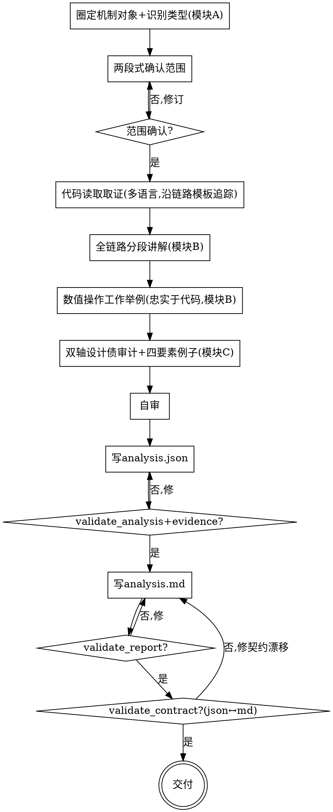

# 技术机制深度分析：读透一个机制的全链路 + 审计它的设计债

## 目的

针对代码库里**一个技术机制 / 技术点**（如视频编辑器的关键帧、图片缓存、音视频同步、并发原语），先把它**全链路运作过程读透**（按机制类型套对应链路模板分段，如数据流型：产生→流转→处理→生效），讲清**技术细节与工作原理**，再从**架构 + 逻辑**两个角度找出**会让未来需求难以实现 / 维护 / 扩展的设计债**（每条带「会变难的需求 + 为什么 + 演进方向 + 代价」的例子），产出双轨报告（`analysis.json` 契约源 + `analysis.md` 人读渲染，过四道门），帮开发者**看懂这个机制怎么跑通 + 提前知道哪里会卡住未来需求**。

只回答两个问题：**这个机制是怎么从起点到最终效果全链路运作的**（理解）+ **它的设计会让哪些未来需求变难**（设计债审计，带例子）。**不回答**「整体架构好不好」（`arch-overview`）、「要不要重构」（`arch-quality-eval`）、「业务需求是什么」（`code-analyze-business`）、「这里会不会崩 / 有没有 bug」。

```
一个技术机制（名称 + 入口提示 + 根路径）──► [tech-mechanism-analysis] ──► 深度分析报告（analysis.json + analysis.md，过四道门）
                                                  │
                                                  ├─ 阶段一·理解：机制类型识别 → 套链路模板分段 → 逐段讲技术细节/工作原理（带证据）+ 跨段衔接 + 数值操作工作举例
                                                  └─ 阶段二·设计债：双轴审计（架构 / 逻辑）→ 每条带「会变难的需求+为什么+演进方向+代价」例子
```

三个核心特征：

1. **全链路分段（按机制类型套模板）** —— 先识别机制属于哪类（数据流 / 生命周期 / 调用链 / 状态机型…），套对应链路模板把机制拆段，逐段讲清做了什么、怎么实现、为什么这么设计；**不读入口就停**，要追到最终效果。段与段怎么衔接（数据格式 / 接口契约 / 时序 / 隐含约定）显式讲清。
2. **数值操作强制工作举例（忠实于原代码）** —— 凡链路中涉及数值计算的环节（平滑 / 插值 / 缓动 / 变换 / 量化 / 滤波等），讲解时**必须**给真实数值的工作举例：适度规模示例数据（不太多、不太简）+ 逐步实际运算，且**运算逻辑必须与原代码一致**；为保证一致，必要时对代码做等价翻译（如转 Python 实际求值）。这条既是讲解要求，也是「确实读懂了代码」的佐证。
3. **双轴设计债审计（不是 bug）** —— 找的是**设计债 / 可演进性风险**（「因设计问题，某些需求难实现 / 维护 / 扩展」），**不是正确性 bug**。分两章：**架构问题**（结构 / 边界 / 依赖 / 耦合）+ **逻辑问题**（算法 / 数据结构 / 状态机 / 数据流）。每条缺陷配四要素例子：**会变难的具体需求 + 为什么当前设计让它难 + 演进 / 松绑方向 + 代价 / 影响评估**。**不打严重度分级**。

<HARD-GATE>
在机制范围（**机制对象 + 机制类型 + 覆盖文件集合 + 多语言技术栈与各语言精度 + 一句话机制职责**）被用户确认前，不进入任何追踪或审计动作（不读调用链、不分段、不写报告）。
`analysis.json` 与 `analysis.md` **过四道门**（`validate_analysis.py` / `validate_evidence.py` / `validate_report.py` / `validate_contract.py`）之前，**不交付**。本 skill 自己产出报告，不调用任何其他 skill。
</HARD-GATE>

## 反模式：照念函数名 / 注释当理解，或把设计债写成 bug

`interpolate()` 不等于你懂了插值——它用什么公式、边界怎么处理、和上下游怎么交接，得追到代码行讲清；`// 平滑滤波` 的注释也不能替代一组真实数值的逐步运算。照念符号 / 注释当结论、泛泛讲流程不给数值、或把「这里可能崩」当缺陷产出，是这类深挖最常见的失真。每段讲解、每个数值举例、每条缺陷都要追到真实代码事实并回链 `file:line`；推断标 `⚠ 未确认`。

## 边界（最重要）

**产出**（深度分析报告，模块 B/C/D）：
- 机制概述（机制对象、机制类型 + 判定依据、套用的链路模板、覆盖文件集合、多语言技术栈 + 各语言精度、一句话机制职责）
- 全链路分段讲解（逐段：做了什么 / 怎么实现 / 为什么这么设计 / 关键数据结构·算法·调用点 + 证据；跨段衔接的隐含约定）
- 数值操作工作举例（每个数值环节：示例数据 + 逐步运算 + 结果 + 是否做了代码翻译 + 与原代码一致的声明 + 证据）
- 双轴设计债清单（架构问题章 + 逻辑问题章；每条：会变难的需求 + 为什么难 + 演进方向 + 代价/影响 + 所属链路段 + 证据；跨段衔接缺陷单列）
- 链路可视化（P2，Mermaid 时序 / 状态 / 流程图，节点回链证据）
- 已知缺口（多语言精度受限、信息不足、未能确认之处）

**不产出**（超出范围，记入「已知缺口」即可）：
- ❌ **正确性 bug / 崩溃复现**：缺陷 = 设计债，**不是**「输入 X → 错误输出 Y」；不预测崩溃、不给 bug 触发路径。
- ❌ **整体架构图 / 总评**：不画整体架构、不做整体设计档位（那是 `arch-overview`）。
- ❌ **架构坏味道 + go/no-go 重构决策**：不输出 critical/major/minor 坏味道清单、不下「要不要重构」（那是 `arch-quality-eval`）。
- ❌ **业务逻辑分析 / 反推产品需求 / 黑盒用例**：只看技术机制怎么实现（那是 `code-analyze-business`）。
- ❌ **严重度分级**：缺陷不给 critical/major/minor（用户明确不要）。
- ❌ **完整重构方案 / 迁移步骤 / 目标设计**：只给「演进 / 松绑方向」，不到方案级。
- ❌ **联网核实**：业界做法（若有引用）为 LLM 内置经验，声明未核对，不主动联网。
- ❌ **模块化度量纯数值 / 独立 SOLID 逐条合规 / 自动解析架构文档 / 全 repo 巡检 / CI PR 卡关 / 主动改代码 / 历史对比趋势**。

**越界拉回**：当对话滑向「帮我找 bug / 这里会不会崩」「画整体架构图」「这个该不该重构」「分析这块业务」「重构成 XX 架构」时，明确说「这超出技术机制深度分析范围，只给全链路理解 + 双轴设计债」，bug 指向别处、整体架构指向 `arch-overview`、重构决策指向 `arch-quality-eval`、业务指向 `code-analyze-business`，记一笔到「已知缺口」。

## Checklist

为以下每项创建一个 task，按序完成：

1. **圈定机制对象 + 识别机制类型（模块 A）** —— 接受用户指定的技术机制（名称 + 入口提示 + 根路径，可跨多目录），枚举覆盖文件集合（`rg --files`/`find`，剔除 build/test 产物除非用户明确含），识别多语言技术栈 + 各语言结构 / 依赖分析精度；**识别机制类型**（数据流型 / 生命周期型 / 调用链型 / 状态机型 / 其他）并记录判定依据，决定套哪套链路模板。加载 `references/scope-and-boundary.md` + `references/mechanism-type-templates.md`。
2. **两段式确认（HARD-GATE）** —— 把 机制对象 + 机制类型（+依据）+ 套用的链路模板 + 覆盖文件集合 + 技术栈与各语言精度 + 一句话机制职责 呈现给用户确认。**未确认不进下一步**。最大风险是「圈错机制 / 拉入无关代码或漏关键调用链」，这一步专门拦它。
3. **代码读取取证（多语言 + 全链路追踪）** —— 在确认后的边界内，按 `references/analysis-protocol.md` 取证：多语言目录 / import 启发 + LSP/rg 双轨（先检测→可用则用足→不可用默认 rg 降级并报告标注），**沿链路模板分段追踪**（产生→流转→处理→生效 或对应模板），热点优先聚焦大机制，**识别其中的数值计算环节**（为第 5 步铺垫），精度按语言标注，防臆造。加载 `references/analysis-protocol.md`。
4. **全链路分段讲解（模块 B · 理解）** —— 按 `references/mechanism-type-templates.md` 逐段讲：做了什么、怎么实现、为什么这么设计、关键数据结构 / 算法 / 调用点，每段挂证据；**跨段衔接**讲清数据格式 / 接口契约 / 时序 / 隐含约定。某段不适用时显式声明原因，不静默省略。
5. **数值操作工作举例（模块 B · 签名能力，强制）** —— 对识别到的**每个数值计算环节**，按 `references/numerical-worked-example.md` 给真实数值工作举例：适度规模示例数据 + 逐步实际运算 + 结果；**运算逻辑必须与原代码一致**，必要时对代码做等价翻译（如转 Python 实际求值），翻译须忠实保留原逻辑并显式声明。非数值环节不强制。
6. **双轴设计债审计（模块 C）** —— 按 `references/design-debt-audit.md`，从**架构轴**（结构 / 边界 / 依赖 / 耦合）与**逻辑轴**（算法 / 数据结构 / 状态机 / 数据流）找「会让某需求难实现 / 维护 / 扩展」的设计债；每条带四要素（会变难的需求 + 为什么难 + 演进方向 + 代价 / 影响）+ 所属链路段 + 证据；**跨段衔接缺陷专项**单列（数据格式假设不一致 / 接口契约脆弱 / 时序耦合）。**不打分级、不下 go/no-go、不找 bug**。
7. **自审** —— 回链完整性 / 数值举例忠实于代码 / 缺陷四要素齐全 / 无 severity 无 bug / 数值段都有举例 / 未确认隔离 / 多语言精度诚实 逐项过（详见自审检查项）。发现问题就地修。
8. **写 `analysis.json` → 跑 `validate_analysis.py` + `validate_evidence.py`** —— 按 `references/analysis-json-schema.md` 把机制类型 + 链路分段 + 数值举例 + 缺陷 findings 结构化为**契约源**（稳定 `DEBT-ARCH-NN` / `DEBT-LOGIC-NN` id、`NUM-NN` 数值举例 id），写到 `docs/mechanism-analysis/YYYY-MM-DD-<机制>-analysis.json`，跑本 skill 的 `scripts/validate_analysis.py` 和 `scripts/validate_evidence.py --root <repo-root>`，通过才进下一步。
9. **写 `analysis.md` → 跑 `validate_report.py`** —— 按 `references/report-template.md` 把 analysis.json 渲染成人读报告（frontmatter + 机制概述 + 全链路分段 + 数值举例 + 架构问题章 + 逻辑问题章 + 已知缺口），写到 `docs/mechanism-analysis/YYYY-MM-DD-<机制>-analysis.md`，跑 `scripts/validate_report.py`。
10. **契约对账 + 交付** —— 跑 `scripts/validate_contract.py <analysis.json> <analysis.md>`（机器校验 json↔md 一致：每个 DEBT/NUM id 出现、计数 / covered_files / mechanism_type / chain 段覆盖对齐、无悬空）。通过即交付；提示用户报告是技术机制深度分析，bug / 整体架构 / 重构决策留对应 skill 或后续。

## 流程图



**终态是「交付」：analysis.json + analysis.md 四道门全过、契约一致即完成。** 本 skill 不预设、不调用任何后续 skill。

## 自审检查项（Checklist 第 7 步展开）

写完后用新视角过一遍：

1. **回链完整性** —— 每段讲解、每个数值举例、每条缺陷是否挂 `file:line` / 类 / 函数 / 调用点？找不到的标 `⚠ 未确认` 并登记「已知缺口」，不混进正文当事实。
2. **数值举例忠实** —— 每个数值环节是否都有工作举例？示例数据是否非平凡（能体现操作行为，非 1+1）？运算步骤是否与代码逐对应？若做了代码翻译，是否显式标注翻译方式并声明忠实保留原逻辑？**运算结果对得上代码逻辑**（这是「读懂了」的硬佐证）。
3. **缺陷四要素齐全** —— 每条缺陷是否有 会变难的需求 + 为什么难 + 演进方向 + 代价/影响 四要素且非空？需求是否具体可描述（非「扩展性差」空话）？
4. **缺陷不是 bug** —— 有没有把「可能崩 / 可能算错 / 输入 X 得错误 Y」当缺陷？有就删或改写成设计债。**json 里不得出现 severity / bug 字段**（脚本硬卡）。
5. **数值段都有举例** —— flagged 为数值段的 chain_stage，是否都有 ≥1 条 numerical_example？（脚本硬卡）
6. **双轴覆盖 + 跨段衔接** —— 架构轴 / 逻辑轴是否都过了（无则显式声明本机制无该轴问题）？跨段衔接缺陷是否单列或标注？
7. **未确认隔离 / 多语言精度诚实** —— 推断与代码事实分清？低精度语言结论保守并登记缺口？

发现问题就地修，修完重跑四道门。

## 产出位置

存到 `docs/mechanism-analysis/`，共享 `<日期>-<机制名>` 前缀（机制名用 kebab-case，日期用当天）：

- `YYYY-MM-DD-<机制名>-analysis.json` —— **机器契约源**（唯一事实源）：机制类型 + 链路分段 + 数值举例 + 缺陷 findings（`DEBT-ARCH-NN` / `DEBT-LOGIC-NN` / `NUM-NN` id）
- `YYYY-MM-DD-<机制名>-analysis.md` —— **人读深度分析报告**：analysis.json 的渲染，frontmatter + 机制概述 + 全链路分段（含数值举例）+ 架构问题 + 逻辑问题 + 已知缺口

json 是给校验器读的契约源，md 是给人读的渲染，**两者必须一致**（`validate_contract.py` 对账）。交付前各自跑校验脚本且合格。校验脚本在本 skill 的 `scripts/` 目录（与 SKILL.md 同级）——**不要假设当前目录是仓库根**：作为 corin 插件加载时路径为 `${CLAUDE_PLUGIN_ROOT}/skills/tech-mechanism-analysis/scripts/`，否则按本 SKILL.md 所在目录拼出同级 `scripts/` 的绝对路径再运行。证据校验需要仓库根路径，默认用当前目录，也可显式传 `--root <repo-root>`。

```bash
V="${CLAUDE_PLUGIN_ROOT}/skills/tech-mechanism-analysis/scripts"   # 非插件：用本 SKILL.md 同级 scripts/ 的绝对路径
python3 "$V/validate_analysis.py"   <analysis.json>
python3 "$V/validate_evidence.py"   <analysis.json> --root <repo-root>
python3 "$V/validate_report.py"     <analysis.md>
python3 "$V/validate_contract.py"   <analysis.json> <analysis.md>
```

## 关键原则

- **范围先定** —— 动手前确认机制对象 / 类型 / 覆盖集合 / 技术栈与精度 / 职责；范围未确认不追踪不审计。
- **全链路追到底** —— 按机制类型套链路模板分段，从起点追到最终效果，不读入口就停；跨段衔接显式讲清。
- **数值举例忠实于代码** —— 数值环节强制真实数值工作举例，运算逻辑与原代码一致，必要时代码翻译；这是「读懂了」的硬佐证，不是装饰。
- **设计债 ≠ bug** —— 找可演进性风险（让需求变难的设计问题），不找正确性 bug、不预测崩溃。
- **双轴 + 四要素** —— 架构轴 + 逻辑轴；每条缺陷带 会变难的需求 + 为什么 + 演进方向 + 代价；不打分级。
- **证据驱动，禁止编造** —— 每段 / 每数值举例 / 每条结论回链 `file:line`；找不到的标 `⚠ 未确认` + 登记缺口，绝不混进正文当事实。
- **机制类型是假设** —— 识别的机制类型与套用的模板要给依据，对照具体机制判适用 / 调整，不照搬模板。
- **多语言精度诚实** —— 精度因语言而异，结论按语言保守，登记缺口。
- **演进只指方向** —— 不写完整重构方案 / 迁移步骤（越界拉回）。
- **可回头** —— 任何时候回到任何一步修订，修完重校验。

## 反模式

| 反模式 | 正确做法 |
|--------|----------|
| 照念函数名 / 注释当理解 | 追真实调用链 + 数据结构，回链 `file:line` |
| 跳过两段式确认直接产出 | 机制范围确认前禁止追踪与产出 |
| 只读入口不追到最终效果 | 按链路模板分段追到底，跨段衔接讲清 |
| 数值环节泛泛讲公式不给真实运算 | 强制真实数值工作举例，运算与代码逐对应 |
| 数值举例与代码逻辑不一致 / 编造结果 | 必要时代码翻译求值，结果对得上代码 |
| 把「可能崩 / 算错」当缺陷 | 缺陷 = 设计债（让需求变难），不找 bug |
| 缺陷只有「扩展性差」空话 | 四要素：会变难的需求 + 为什么 + 演进方向 + 代价 |
| 给缺陷打 critical/major/minor 分级 | 不分级（用户明确不要） |
| 下 go/no-go / 给完整重构方案 | 只给演进方向，决策与方案留 `arch-quality-eval` / 重构阶段 |
| 混入整体架构图 / 总评 | 那是 `arch-overview`；本 skill 只深挖单机制 |
| 分析业务逻辑 / 反推需求 | 那是 `code-analyze-business` |
| 低精度语言照搬高精度下结论 | 按语言精度保守，登记缺口 |
| 无证据 / 编造 file:line | 找不到标 `⚠ 未确认` + 缺口，禁止编造 |
| 假设并调用某个下游 skill | 本 skill 独立，结束即终止 |

## 参考资源

**模块 A（范围 + 类型）**
- **`references/scope-and-boundary.md`** —— 机制对象界定、多语言技术栈识别 + 精度标注、覆盖枚举、两段式确认。**Checklist 第 1/2 步用**
- **`references/mechanism-type-templates.md`** —— 机制类型（数据流 / 生命周期 / 调用链 / 状态机型）的链路模板 + 类型判据 + 分段切法，可扩展。**第 1/4 步用**

**代码读取**
- **`references/analysis-protocol.md`** —— 多语言代码读取取证协议：沿链路模板分段追踪、数值操作识别、目录/import 启发 + LSP/rg 双轨（先检测→用足→不可用对话建议安装等回复→rg 降级）、热点优先、各语言精度差异、防臆造。**第 3 步用**

**模块 B（理解 + 数值举例）**
- **`references/numerical-worked-example.md`** —— 数值操作工作举例方法：示例数据规模、逐步运算写法、**代码翻译忠实性**（何时翻译、如何保证一致）、faithfulness 声明。**第 5 步用（签名能力）**

**模块 C（设计债审计）**
- **`references/design-debt-audit.md`** —— 双轴（架构 / 逻辑）设计债识别 + 四要素例子写法 + 跨段衔接缺陷专项 + 与 bug / 坏味道的划界。**第 6 步用**

**产出**
- **`references/analysis-json-schema.md`** —— analysis.json 完整 schema 字段表 + 示例。**第 8 步用**
- **`references/report-template.md`** —— analysis.md 完整模板（frontmatter + 章节结构）+ 写作纪律。**第 9 步用**

**校验脚本（stdlib-only）**
- `scripts/validate_analysis.py` —— analysis.json 契约源交付前必跑（schema/枚举/链路段/数值举例/缺陷四要素/无 severity/无 bug/无 mermaid）
- `scripts/validate_evidence.py` —— analysis.json 证据位置交付前必跑（文件存在、行号范围、note 关键字命中）
- `scripts/validate_report.py` —— analysis.md 渲染交付前必跑（frontmatter/章节关键词/四要素/banned/未确认）
- `scripts/validate_contract.py` —— json↔md 交叉对账（id/计数/covered_files/mechanism_type/chain 段覆盖一致、无悬空）

**示例**
- `examples/2026-07-23-example-analysis.json` / `examples/2026-07-23-example-analysis.md` + `examples/fixtures/` —— 端到端示例（关键帧缓动机制：存储→插值→渲染，含数值工作举例 + 双轴设计债），四道门全过，照此对齐格式
