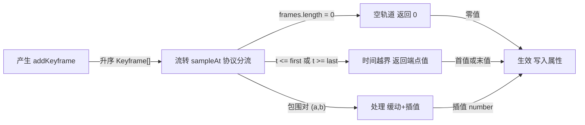
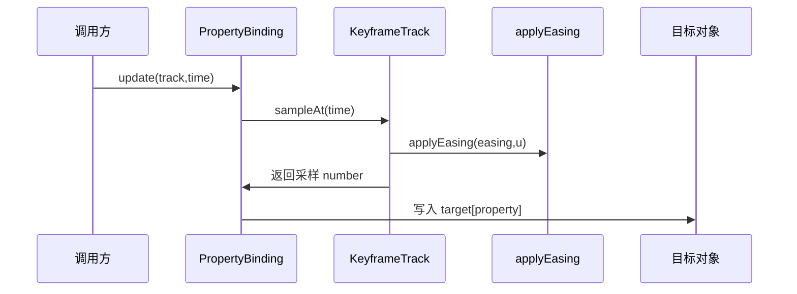
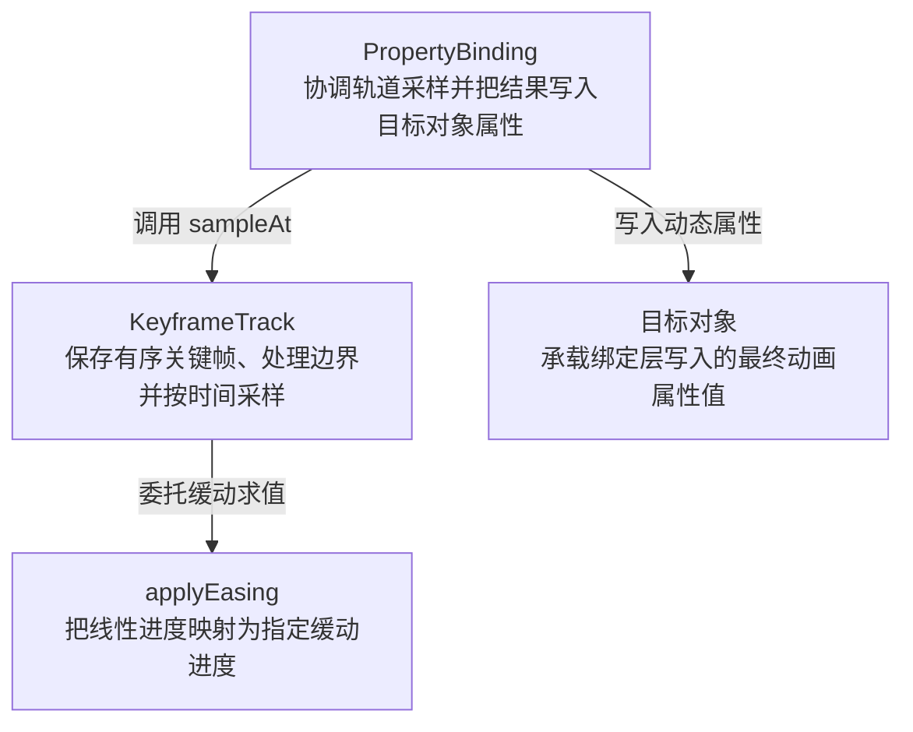

# keyframe-easing 技术机制深度分析

## 机制概述

- **模式**：full。
- **一句话职责**：在时间线上对一个数值属性做带缓动的关键帧采样，以零值和端点值处理空轨道及时间越界，并在每帧把结果写到渲染对象的属性上。
- **主机制类型**：`data-flow`。
- **次机制类型**：无。
- **类型依据**：关键帧被产生并存入时间线 → 播放时按时间查找关键帧对 → 缓动插值求值 → 写入渲染属性，是典型的 产生→流转→处理→生效 数据流。
- **链路模板**：`produce` → `flow` → `process` → `effect`。

### 范围确认

- **SCOPE-01 · initial · 2026-07-23**：示例任务中用户明确确认机制对象、候选文件、主类型和一句话职责；候选文件：`skills/tech-mechanism-analysis/examples/fixtures/keyframe-easing/src/keyframe.ts`、`skills/tech-mechanism-analysis/examples/fixtures/keyframe-easing/src/renderer.ts`。

### 工具与证据置信度

- **TypeScript · medium**：已读取类型、实现和直接调用点，对核心公式做等价求值，并用 Node 原生 TypeScript 执行验证空轨道、左右时间越界和区间内采样；未运行 TypeScript 类型检查；工具：direct code reading、text search、equivalent numerical evaluation、Node TypeScript runtime check。

## 业务流程图

### 业务步骤清单

- **FLOW-01 · 产生 addKeyframe**：`skills/tech-mechanism-analysis/examples/fixtures/keyframe-easing/src/keyframe.ts:18`（addKeyframe push and sort）。
- **FLOW-02 · 流转 sampleAt 协议分流**：`skills/tech-mechanism-analysis/examples/fixtures/keyframe-easing/src/keyframe.ts:26`（扫描前先执行协议守卫）。
- **FLOW-03 · 空轨道 返回 0**：`skills/tech-mechanism-analysis/examples/fixtures/keyframe-easing/src/keyframe.ts:26`（空轨道零值兜底）。
- **FLOW-04 · 时间越界 返回端点值**：`skills/tech-mechanism-analysis/examples/fixtures/keyframe-easing/src/keyframe.ts:27`（左侧端点返回）、`skills/tech-mechanism-analysis/examples/fixtures/keyframe-easing/src/keyframe.ts:29`（右侧端点返回）。
- **FLOW-05 · 处理 缓动+插值**：`skills/tech-mechanism-analysis/examples/fixtures/keyframe-easing/src/keyframe.ts:40`（lerp interpolate value）。
- **FLOW-06 · 生效 写入属性**：`skills/tech-mechanism-analysis/examples/fixtures/keyframe-easing/src/renderer.ts:10`（direct property write）。
- **FLOW-EDGE-01 · produce → flow**：升序 Keyframe[]；`skills/tech-mechanism-analysis/examples/fixtures/keyframe-easing/src/keyframe.ts:20`（sort by time）。
- **FLOW-EDGE-02 · flow → empty_default**：frames.length = 0；`skills/tech-mechanism-analysis/examples/fixtures/keyframe-easing/src/keyframe.ts:26`（空轨道分支）。
- **FLOW-EDGE-03 · flow → boundary_clamp**：t <= first 或 t >= last；`skills/tech-mechanism-analysis/examples/fixtures/keyframe-easing/src/keyframe.ts:27`（左侧边界分支）、`skills/tech-mechanism-analysis/examples/fixtures/keyframe-easing/src/keyframe.ts:29`（右侧边界分支）。
- **FLOW-EDGE-04 · flow → process**：包围对 (a,b)；`skills/tech-mechanism-analysis/examples/fixtures/keyframe-easing/src/keyframe.ts:36`（frames i and i+1 pair）。
- **FLOW-EDGE-05 · empty_default → effect**：零值；`skills/tech-mechanism-analysis/examples/fixtures/keyframe-easing/src/keyframe.ts:26`（零值返回调用方）。
- **FLOW-EDGE-06 · boundary_clamp → effect**：首值或末值；`skills/tech-mechanism-analysis/examples/fixtures/keyframe-easing/src/keyframe.ts:27`（首值返回调用方）、`skills/tech-mechanism-analysis/examples/fixtures/keyframe-easing/src/keyframe.ts:29`（末值返回调用方）。
- **FLOW-EDGE-07 · process → effect**：插值 number；`skills/tech-mechanism-analysis/examples/fixtures/keyframe-easing/src/keyframe.ts:40`（a.value b.value easing expression）。

## 时序图

### 时序消息清单

- **PARTICIPANT-01 · 调用方**：`skills/tech-mechanism-analysis/examples/fixtures/keyframe-easing/src/renderer.ts:8`（update 调用入口）。
- **PARTICIPANT-02 · PropertyBinding**：`skills/tech-mechanism-analysis/examples/fixtures/keyframe-easing/src/renderer.ts:4`（属性绑定类）。
- **PARTICIPANT-03 · KeyframeTrack**：`skills/tech-mechanism-analysis/examples/fixtures/keyframe-easing/src/keyframe.ts:14`（关键帧轨道类）。
- **PARTICIPANT-04 · applyEasing**：`skills/tech-mechanism-analysis/examples/fixtures/keyframe-easing/src/keyframe.ts:46`（缓动函数）。
- **PARTICIPANT-05 · 目标对象**：`skills/tech-mechanism-analysis/examples/fixtures/keyframe-easing/src/renderer.ts:10`（目标属性写入）。
- **MESSAGE-01 · caller → binding**：update(track,time)；`skills/tech-mechanism-analysis/examples/fixtures/keyframe-easing/src/renderer.ts:8`（调用更新入口）。
- **MESSAGE-02 · binding → track**：sampleAt(time)；`skills/tech-mechanism-analysis/examples/fixtures/keyframe-easing/src/renderer.ts:9`（请求轨道采样）。
- **MESSAGE-03 · track → easing**：applyEasing(easing,u)；`skills/tech-mechanism-analysis/examples/fixtures/keyframe-easing/src/keyframe.ts:39`（调用缓动函数）。
- **MESSAGE-04 · track → binding**：返回采样 number；`skills/tech-mechanism-analysis/examples/fixtures/keyframe-easing/src/keyframe.ts:40`（返回插值数值）。
- **MESSAGE-05 · binding → target**：写入 target[property]；`skills/tech-mechanism-analysis/examples/fixtures/keyframe-easing/src/renderer.ts:10`（动态属性写入）。

## 架构角色图

### 角色职责清单

- **ROLE-01 · PropertyBinding**：实体类型 `class`；职责：协调轨道采样并把结果写入目标对象属性；`skills/tech-mechanism-analysis/examples/fixtures/keyframe-easing/src/renderer.ts:4`（属性绑定类）。
- **ROLE-02 · KeyframeTrack**：实体类型 `class`；职责：保存有序关键帧、处理边界并按时间采样；`skills/tech-mechanism-analysis/examples/fixtures/keyframe-easing/src/keyframe.ts:14`（关键帧轨道类）。
- **ROLE-03 · applyEasing**：实体类型 `function`；职责：把线性进度映射为指定缓动进度；`skills/tech-mechanism-analysis/examples/fixtures/keyframe-easing/src/keyframe.ts:46`（缓动函数实现）。
- **ROLE-04 · 目标对象**：实体类型 `external`；职责：承载绑定层写入的最终动画属性值；`skills/tech-mechanism-analysis/examples/fixtures/keyframe-easing/src/renderer.ts:10`（目标属性写入）。
- **ARCH-EDGE-01 · binding → track**：调用 sampleAt；`skills/tech-mechanism-analysis/examples/fixtures/keyframe-easing/src/renderer.ts:9`（绑定依赖轨道采样）。
- **ARCH-EDGE-02 · track → easing**：委托缓动求值；`skills/tech-mechanism-analysis/examples/fixtures/keyframe-easing/src/keyframe.ts:39`（轨道调用缓动函数）。
- **ARCH-EDGE-03 · binding → target**：写入动态属性；`skills/tech-mechanism-analysis/examples/fixtures/keyframe-easing/src/renderer.ts:10`（绑定写入目标对象）。

## 全链路

### stage-produce · 产生：关键帧存入扁平时间线

- **阶段标识**：`produce`。
- **做了什么**：调用方通过 addKeyframe(time,value,easing) 追加一个关键帧；机制把它 push 进数组并按 time 升序排序。
- **怎么实现**：存储是 KeyframeTrack 内一个私有数组 frames: Keyframe[]，每帧 {time,value,easing}；写入后 sort 保证升序。
- **设计依据（inferred）**：排序数组让后续采样可以按时间顺序扫描；这是根据实现结构推断的设计取舍，源码未记录作者意图。
- **关键结构**：`Keyframe interface`、`KeyframeTrack.frames: Keyframe[]`、`addKeyframe`。
- **交接/最终效果**：以升序 Keyframe[] 交给读取段，约定按 time 单调递增；无轨道维度。
- **交接证据**：`skills/tech-mechanism-analysis/examples/fixtures/keyframe-easing/src/keyframe.ts:20`（sort establishes ascending handoff order）。
- **证据**：`skills/tech-mechanism-analysis/examples/fixtures/keyframe-easing/src/keyframe.ts:15`（frames flat list storage）、`skills/tech-mechanism-analysis/examples/fixtures/keyframe-easing/src/keyframe.ts:18`（addKeyframe push and sort）。

### stage-flow · 流转：先按协议兜底，再定位关键帧对

- **阶段标识**：`flow`。
- **做了什么**：sampleAt(t) 先处理空轨道和时间越界：空轨道返回 0，t 不晚于首帧时返回首值，t 不早于末帧时返回末值；只有区间内时间才线性扫描相邻关键帧对。
- **怎么实现**：按 frames.length===0、t<=first.time、t>=last.time 的固定顺序短路；均未命中时从 i=0 扫描到 frames[i+1].time 不再小于 t，取出包围对 (a,b)。
- **设计依据（inferred）**：先短路协议边界可避免空数组取值和区间外插值，区间内再用已排序数组做简单定位；这是由控制流效果推断的设计取舍，源码未记录作者意图。
- **关键结构**：`empty-track zero fallback`、`left/right endpoint clamp`、`sampleAt linear scan`、`surrounding pair (a,b)`。
- **交接/最终效果**：空轨道直接把 0 交给生效段，左右越界直接把首值或末值交给生效段；仅区间内路径把 (a,b) 交给处理段，约定 a.time < t < b.time。
- **交接证据**：`skills/tech-mechanism-analysis/examples/fixtures/keyframe-easing/src/keyframe.ts:26`（空轨道分支直接返回零值）、`skills/tech-mechanism-analysis/examples/fixtures/keyframe-easing/src/keyframe.ts:27`（左侧时间越界直接返回首值）、`skills/tech-mechanism-analysis/examples/fixtures/keyframe-easing/src/keyframe.ts:29`（右侧时间越界直接返回末值）、`skills/tech-mechanism-analysis/examples/fixtures/keyframe-easing/src/keyframe.ts:36`（frames index selects b next to a）。
- **证据**：`skills/tech-mechanism-analysis/examples/fixtures/keyframe-easing/src/keyframe.ts:26`（空轨道守卫与零值兜底）、`skills/tech-mechanism-analysis/examples/fixtures/keyframe-easing/src/keyframe.ts:27`（左侧时间边界守卫）、`skills/tech-mechanism-analysis/examples/fixtures/keyframe-easing/src/keyframe.ts:29`（右侧时间边界守卫）、`skills/tech-mechanism-analysis/examples/fixtures/keyframe-easing/src/keyframe.ts:32`（while scan surrounding pair）。

### stage-process · 处理：归一化 → 缓动 → 线性插值

- **阶段标识**：`process`。
- **做了什么**：仅在时间位于首末关键帧之间时，把 t 在 (a,b) 区间归一化为进度 u，用 easing 曲线把 u 映射为缓动进度 e，再在 a.value/b.value 间线性插值。
- **怎么实现**：协议兜底路径不会进入本段；区间内路径计算 u=(t-a.time)/(b.time-a.time)，再算 e=applyEasing(a.easing,u)，最后 result=a.value+(b.value-a.value)*e。
- **设计依据（inferred）**：归一化把任意区间映射到 [0,1]，缓动函数重映射进度，最后线性插值回属性值；该数学作用可由公式直接观察。
- **关键结构**：`applyEasing`、`normalize progress u`、`lerp a.value+(b.value-a.value)*e`。
- **交接/最终效果**：返回一个 number（插值结果）给生效段，不带类型/元数据。
- **交接证据**：`skills/tech-mechanism-analysis/examples/fixtures/keyframe-easing/src/keyframe.ts:40`（return interpolated value using easing）。
- **证据**：`skills/tech-mechanism-analysis/examples/fixtures/keyframe-easing/src/keyframe.ts:38`（normalize progress u）、`skills/tech-mechanism-analysis/examples/fixtures/keyframe-easing/src/keyframe.ts:39`（applyEasing call）、`skills/tech-mechanism-analysis/examples/fixtures/keyframe-easing/src/keyframe.ts:40`（lerp interpolate value）。

### stage-effect · 生效：写入渲染对象属性

- **阶段标识**：`effect`。
- **做了什么**：PropertyBinding.update 每帧调用 sampleAt 取值，直接赋值到 target[property]；该值可能来自空轨道零值、越界端点值或区间内插值。
- **怎么实现**：const v = track.sampleAt(time); (this.target as any)[this.property] = v;。
- **设计依据（unknown）**：该写入使采样值成为目标对象的可观察属性；源码没有记录选择动态属性写入的历史原因。
- **关键结构**：`PropertyBinding.update`、`target[property] = v`。
- **交接/最终效果**：最终效果是 target[property] 在每次 update 后持有当前采样值，供后续渲染代码读取。
- **交接证据**：`skills/tech-mechanism-analysis/examples/fixtures/keyframe-easing/src/renderer.ts:10`（assignment makes sampled value observable on target）。
- **证据**：`skills/tech-mechanism-analysis/examples/fixtures/keyframe-easing/src/renderer.ts:9`（sampleAt pull value）、`skills/tech-mechanism-analysis/examples/fixtures/keyframe-easing/src/renderer.ts:10`（direct property write）。

## 必检边界覆盖

- **cancellation**：`BOUNDARY-04`：适用性 `not-applicable`，处理能力 `not-applicable`，验证状态 `not-applicable`。
- **exception**：`BOUNDARY-05`：适用性 `uncertain`，处理能力 `unknown`，验证状态 `unverified`。
- **concurrency**：`BOUNDARY-06`：适用性 `not-applicable`，处理能力 `not-applicable`，验证状态 `not-applicable`。
- **backpressure**：`BOUNDARY-07`：适用性 `not-applicable`，处理能力 `not-applicable`，验证状态 `not-applicable`。

## 边界清单

### BOUNDARY-01 · 关键帧轨道为空

- **类别**：`empty-input`。
- **适用性**：`applicable`。
- **条件**：关键帧轨道为空。
- **期望契约**：采样返回零值且不读取端点或执行插值。
- **实际行为**：sampleAt 在 frames.length===0 时直接返回 0。
- **处理能力**：`supported`。
- **验证状态**：`verified`。
- **关联行为用例**：`CASE-01`。
- **源码锚点**：`skills/tech-mechanism-analysis/examples/fixtures/keyframe-easing/src/keyframe.ts:26`（空轨道守卫直接返回 0）。

### BOUNDARY-02 · 查询时间早于或等于首帧时间

- **类别**：`lower-bound`。
- **适用性**：`applicable`。
- **条件**：查询时间早于或等于首帧时间。
- **期望契约**：返回首帧值而不执行区间外插值。
- **实际行为**：sampleAt 的 <= 守卫返回 frames[0].value。
- **处理能力**：`supported`。
- **验证状态**：`verified`。
- **关联行为用例**：`CASE-02`。
- **源码锚点**：`skills/tech-mechanism-analysis/examples/fixtures/keyframe-easing/src/keyframe.ts:27`（左边界守卫返回首帧值）。

### BOUNDARY-03 · 查询时间晚于或等于末帧时间

- **类别**：`upper-bound`。
- **适用性**：`applicable`。
- **条件**：查询时间晚于或等于末帧时间。
- **期望契约**：返回末帧值而不执行区间外插值。
- **实际行为**：sampleAt 的 >= 守卫返回 last.value。
- **处理能力**：`supported`。
- **验证状态**：`verified`。
- **关联行为用例**：`CASE-03`。
- **源码锚点**：`skills/tech-mechanism-analysis/examples/fixtures/keyframe-easing/src/keyframe.ts:29`（右边界守卫返回末帧值）。

### BOUNDARY-04 · 采样或属性写入过程中请求取消

- **类别**：`cancellation`。
- **适用性**：`not-applicable`。
- **条件**：采样或属性写入过程中请求取消。
- **期望契约**：同步单次调用不定义取消协议。
- **实际行为**：已覆盖实现没有异步任务、取消令牌或可中断等待，因此取消边界不适用。
- **处理能力**：`not-applicable`。
- **验证状态**：`not-applicable`。
- **关联行为用例**：无。
- **源码锚点**：不适用。

### BOUNDARY-05 · 动态属性写入被只读属性、代理或目标对象拒绝

- **类别**：`exception`。
- **适用性**：`uncertain`。
- **条件**：动态属性写入被只读属性、代理或目标对象拒绝。
- **期望契约**：需要明确写入异常是向上传播、忽略还是转换为诊断。
- **实际行为**：PropertyBinding 直接执行动态赋值且没有异常处理；具体失败类型与传播结果未运行验证。
- **处理能力**：`unknown`。
- **验证状态**：`unverified`。
- **关联行为用例**：无。
- **源码锚点**：`skills/tech-mechanism-analysis/examples/fixtures/keyframe-easing/src/renderer.ts:10`（动态属性赋值没有异常处理边界）。

### BOUNDARY-06 · 多个执行单元并发修改或采样同一轨道

- **类别**：`concurrency`。
- **适用性**：`not-applicable`。
- **条件**：多个执行单元并发修改或采样同一轨道。
- **期望契约**：当前单线程同步 fixture 不声明跨线程并发保证。
- **实际行为**：覆盖范围内没有任务调度、共享内存或并发入口，因此并发边界不适用。
- **处理能力**：`not-applicable`。
- **验证状态**：`not-applicable`。
- **关联行为用例**：无。
- **源码锚点**：不适用。

### BOUNDARY-07 · 生产速率超过采样或属性写入速率

- **类别**：`flow-control`。
- **适用性**：`not-applicable`。
- **条件**：生产速率超过采样或属性写入速率。
- **期望契约**：同步拉取式采样不定义队列背压协议。
- **实际行为**：机制没有队列、流或生产者消费者缓冲，因此背压边界不适用。
- **处理能力**：`not-applicable`。
- **验证状态**：`not-applicable`。
- **关联行为用例**：无。
- **源码锚点**：不适用。

## 可验证行为用例

### CASE-01 · 空轨道采样返回零值

- **关联边界**：`BOUNDARY-01`。
- **入口**：`KeyframeTrack.sampleAt`。
- **分支路径**：`frames.length === 0`。
- **语义条件键**：`empty-keyframe-track`。
- **前置条件**：轨道未添加任何关键帧。
- **输入**：调用 sampleAt(5)。
- **动作**：从空轨道采样时间 5。
- **期望可观察行为**：返回数值 0 且不发生端点读取。
- **实际观察行为**：Node 最小调用输出 empty=0。
- **验证**：`verified` / `command`；运行 test_mechanism_examples.py 中的 keyframe 协议用例；结果：empty 字段为 0。
- **源码锚点**：`skills/tech-mechanism-analysis/examples/fixtures/keyframe-easing/src/keyframe.ts:26`（空轨道分支直接返回数值 0）。
- **对应验收用例**：`ACCEPT-01`。

### CASE-02 · 左越界采样返回首帧值

- **关联边界**：`BOUNDARY-02`。
- **入口**：`KeyframeTrack.sampleAt`。
- **分支路径**：`t <= frames[0].time`。
- **语义条件键**：`time-before-first-frame`。
- **前置条件**：轨道包含 (1,10) 与 (2,20)。
- **输入**：调用 sampleAt(0)。
- **动作**：在首帧之前采样。
- **期望可观察行为**：返回首帧值 10。
- **实际观察行为**：Node 最小调用输出 before=10。
- **验证**：`verified` / `command`；运行 test_mechanism_examples.py 中的 keyframe 协议用例；结果：before 字段为 10。
- **源码锚点**：`skills/tech-mechanism-analysis/examples/fixtures/keyframe-easing/src/keyframe.ts:27`（左边界包含精确端点并返回首帧值）。
- **对应验收用例**：`ACCEPT-02`。

### CASE-03 · 右越界采样返回末帧值

- **关联边界**：`BOUNDARY-03`。
- **入口**：`KeyframeTrack.sampleAt`。
- **分支路径**：`t >= last.time`。
- **语义条件键**：`time-after-last-frame`。
- **前置条件**：轨道包含 (1,10) 与 (2,20)。
- **输入**：调用 sampleAt(3)。
- **动作**：在末帧之后采样。
- **期望可观察行为**：返回末帧值 20。
- **实际观察行为**：Node 最小调用输出 after=20。
- **验证**：`verified` / `command`；运行 test_mechanism_examples.py 中的 keyframe 协议用例；结果：after 字段为 20。
- **源码锚点**：`skills/tech-mechanism-analysis/examples/fixtures/keyframe-easing/src/keyframe.ts:29`（右边界包含精确端点并返回末帧值）。
- **对应验收用例**：`ACCEPT-03`。

## 验收用例

### ACCEPT-01 · 空轨道使用零值兜底

- **关联行为用例**：`CASE-01`。
- **Given**：一个没有关键帧的 KeyframeTrack。
- **When**：在任意时间调用 sampleAt。
- **Then**：返回 0，且不读取首末帧或执行插值。
- **验证级别**：`automated`。
- **源码锚点**：`skills/tech-mechanism-analysis/examples/fixtures/keyframe-easing/src/keyframe.ts:26`（空集合守卫位于端点读取之前）。

### ACCEPT-02 · 左边界固定为首帧值

- **关联行为用例**：`CASE-02`。
- **Given**：首帧时间为 1 且值为 10。
- **When**：以小于或等于 1 的时间采样。
- **Then**：结果严格等于 10，不执行区间外插值。
- **验证级别**：`automated`。
- **源码锚点**：`skills/tech-mechanism-analysis/examples/fixtures/keyframe-easing/src/keyframe.ts:27`（<= 守卫定义左边界验收结果）。

### ACCEPT-03 · 右边界固定为末帧值

- **关联行为用例**：`CASE-03`。
- **Given**：末帧时间为 2 且值为 20。
- **When**：以大于或等于 2 的时间采样。
- **Then**：结果严格等于 20，不执行区间外插值。
- **验证级别**：`automated`。
- **源码锚点**：`skills/tech-mechanism-analysis/examples/fixtures/keyframe-easing/src/keyframe.ts:29`（>= 守卫定义右边界验收结果）。

## 多入口/分支行为矛盾

在已覆盖入口和分支内，未识别到多入口/分支行为矛盾。

## 数值示例

### NUM-01 · ease-in-out 三次缓动插值（对应 sampleAt 的处理段）

- **所属阶段**：`stage-process`。
- **示例数据**：关键帧 a=(time=0.0, value=0, easing=ease-in-out)、b=(time=1.0, value=100)；查询 t=0.25。
- **计算步骤**：
  1. 归一化进度 u = (0.25-0.0)/(1.0-0.0) = 0.25
  2. applyEasing('ease-in-out', 0.25)：u<0.5 分支 → e = 4×u³ = 4×0.25³ = 4×0.015625 = 0.0625
  3. 线性插值 result = a.value + (b.value-a.value)×e = 0 + (100-0)×0.0625 = 6.25
- **结果**：6.25（在 t=0.25 处；缓动使值远低于线性插值的 25，体现 ease-in-out 前慢后快）。
- **代码翻译**：将 keyframe.ts:52 的 cubic 分支译为 Python 求值：e = 4*u**3 if u<0.5 else 1-(-2*u+2)**3/2；代入 u=0.25 → 0.0625；再按 line 40 做 lerp → 6.25。
- **忠实性**：运算与原代码 sampleAt(line 38-40) + applyEasing(line 52) 逐行对应；已转 Python 实际运行验证结果=6.25；保留了归一化、u<0.5 分支判断与 lerp，未省略任何影响结果的步骤。
- **证据**：`skills/tech-mechanism-analysis/examples/fixtures/keyframe-easing/src/keyframe.ts:38`（normalize progress u）、`skills/tech-mechanism-analysis/examples/fixtures/keyframe-easing/src/keyframe.ts:52`（cubic ease-in-out branch u<0.5）。

### NUM-02 · 空关键帧轨道的零值协议兜底

- **所属阶段**：`stage-flow`。
- **示例数据**：轨道 frames=[]；查询 t=5（时间值不影响空轨道分支）。
- **计算步骤**：
  1. 计算守卫 frames.length===0：0===0，结果为 true
  2. 立即返回 0；跳过首末帧边界判断、区间扫描、缓动和插值
- **结果**：0；PropertyBinding 会把该零值写入目标属性。
- **代码翻译**：用 Node 原生 TypeScript 直接导入 keyframe.ts，执行 new KeyframeTrack().sampleAt(5)，实际结果为 0。
- **忠实性**：直接执行原 TypeScript 实现；保留 sampleAt 的第一条短路守卫，并验证空数组不会继续读取 frames[0]。
- **证据**：`skills/tech-mechanism-analysis/examples/fixtures/keyframe-easing/src/keyframe.ts:26`（空轨道守卫返回零值）。

### NUM-03 · 早于首关键帧的左侧时间越界兜底

- **所属阶段**：`stage-flow`。
- **示例数据**：关键帧 (time=1,value=10)、(time=2,value=20)；查询 t=0。
- **计算步骤**：
  1. 空轨道守卫为 false；比较 t<=frames[0].time：0<=1，结果为 true
  2. 立即返回 frames[0].value=10；跳过区间扫描、缓动和插值
- **结果**：10；越界时间被钳制为首关键帧值。
- **代码翻译**：用 Node 原生 TypeScript 直接执行 track.sampleAt(0)，实际结果为 10。
- **忠实性**：直接执行原 TypeScript 实现；保留 <= 边界语义，覆盖早于首帧的输入且不把它误写成外插值。
- **证据**：`skills/tech-mechanism-analysis/examples/fixtures/keyframe-easing/src/keyframe.ts:27`（左侧边界返回首值）。

### NUM-04 · 晚于末关键帧的右侧时间越界兜底

- **所属阶段**：`stage-flow`。
- **示例数据**：关键帧 (time=1,value=10)、(time=2,value=20)；查询 t=3。
- **计算步骤**：
  1. 空轨道和左边界守卫均为 false；取 last=frames[1]=(time=2,value=20)
  2. 比较 t>=last.time：3>=2，结果为 true，立即返回 last.value=20，跳过区间扫描和插值
- **结果**：20；越界时间被钳制为末关键帧值。
- **代码翻译**：用 Node 原生 TypeScript 直接执行 track.sampleAt(3)，实际结果为 20。
- **忠实性**：直接执行原 TypeScript 实现；保留 >= 边界语义，覆盖晚于末帧的输入且不把它误写成外插值。
- **证据**：`skills/tech-mechanism-analysis/examples/fixtures/keyframe-easing/src/keyframe.ts:29`（右侧边界返回末值）。

## 架构设计债

### DEBT-ARCH-01 · 扁平时间线无轨道维度

- **所属阶段**：`stage-produce`。
- **需求来源**：`hypothetical`。
- **会变难的需求**：支持多轨道关键帧交错 + 冲突仲裁（如多条动画轨道在同一属性上叠加或抢占）。
- **为什么难**：frames 是单条按 time 排序的扁平 Keyframe[]（keyframe.ts:13-15），没有 track 维度；要做多轨道需给 Keyframe 加 track 字段、按 (track,time) 索引、再加一层冲突仲裁，产生段/流转段/处理段都要改。
- **演进方向**：引入 track 维度：Keyframe 增 track 字段或改 Map<track, Keyframe[]>；sampleAt 按 (track,time) 查找；冲突走优先级或混合仲裁层。
- **代价/影响**：涉及 produce/flow/process 三段；存储格式需迁移既有时间线；中等改动面。
- **量化范围**：阶段 3 个（`stage-produce`、`stage-flow`、`stage-process`）；文件 1 个（`skills/tech-mechanism-analysis/examples/fixtures/keyframe-easing/src/keyframe.ts`）；模块 1 个（`KeyframeTrack`）；量级 `medium`；当前单文件中的存储、区间定位和插值三段共同依赖扁平 frames，至少需要同时调整三个阶段。
- **结论置信度**：`medium`；单列表结构是直接代码事实，但多轨道需求是用于评估演进成本的假设场景。
- **证据**：`skills/tech-mechanism-analysis/examples/fixtures/keyframe-easing/src/keyframe.ts:6`（Keyframe fields time value easing）、`skills/tech-mechanism-analysis/examples/fixtures/keyframe-easing/src/keyframe.ts:15`（frames flat list storage）。

### DEBT-ARCH-02 · 生效段直接写属性，处理→生效之间无中间抽象

- **所属阶段**：`stage-effect`；跨阶段。
- **需求来源**：`hypothetical`。
- **会变难的需求**：支持非数值/结构化目标（颜色、变换矩阵）或携带每帧元数据（如不连续标志、触发事件）。
- **为什么难**：PropertyBinding.update 把 sampleAt 返回的 number 直接 target[property]=v（renderer.ts:9-10），处理段与生效段之间没有 binding 中间层；颜色/矩阵需不同写入逻辑，元数据无处承载——这是跨段（process→effect）衔接的设计债。
- **演进方向**：引入 Binding 抽象层：sampleAt 返回带类型/元数据的 SampledValue，Binding 按目标类型写入（数值/颜色/矩阵）并处理元数据。
- **代价/影响**：跨段改动 process→effect 接口；新增 Binding 层及目标类型分发；涉及调用方兼容。
- **量化范围**：阶段 2 个（`stage-process`、`stage-effect`）；文件 2 个（`skills/tech-mechanism-analysis/examples/fixtures/keyframe-easing/src/keyframe.ts`、`skills/tech-mechanism-analysis/examples/fixtures/keyframe-easing/src/renderer.ts`）；模块 2 个（`KeyframeTrack`、`PropertyBinding`）；量级 `large`；返回值契约和写入端横跨两个阶段、两个文件及两个模块，且需要调用方兼容迁移。
- **结论置信度**：`medium`；number 返回值和动态属性写入是直接证据；结构化目标需求是用于分析接口演进成本的假设。
- **证据**：`skills/tech-mechanism-analysis/examples/fixtures/keyframe-easing/src/renderer.ts:10`（direct property write no binding）。

## 逻辑设计债

### DEBT-LOGIC-01 · 缓动是封闭枚举 + switch 硬编码

- **所属阶段**：`stage-process`。
- **需求来源**：`hypothetical`。
- **会变难的需求**：支持用户自定义缓动曲线（三次贝塞尔控制点、弹簧物理、样条曲线）。
- **为什么难**：Easing 是封闭枚举，applyEasing 用 switch 把每条曲线硬编码（keyframe.ts:46-53）；新增曲线要改枚举 + switch + 序列化，调用方无法注入函数或参数化的曲线数据。
- **演进方向**：把 Easing 从封闭枚举改为数据/函数：如 {type:'cubic-bezier',p1x,p1y,p2x,p2y} 或 (u)=>number 函数 + 注册表；applyEasing 改为按数据求值/查表调用。
- **代价/影响**：需改 Easing 类型定义 + applyEasing 实现 + 关键帧序列化；涉及类型与数据兼容。
- **量化范围**：阶段 1 个（`stage-process`）；文件 1 个（`skills/tech-mechanism-analysis/examples/fixtures/keyframe-easing/src/keyframe.ts`）；模块 2 个（`Easing`、`applyEasing`）；量级 `medium`；核心改动集中在一个处理阶段和一个文件，但会改变公开类型及其序列化兼容约定。
- **结论置信度**：`medium`；封闭联合类型和 switch 是直接证据；自定义曲线需求为假设场景，仓库没有路线图证据。
- **证据**：`skills/tech-mechanism-analysis/examples/fixtures/keyframe-easing/src/keyframe.ts:47`（switch easing closed enum）、`skills/tech-mechanism-analysis/examples/fixtures/keyframe-easing/src/keyframe.ts:52`（cubic ease-in-out branch u<0.5）。

## 跨阶段衔接

`DEBT-ARCH-02` 涉及跨阶段约定。

## 已知缺口

- ⚠ 未确认：示例为 TypeScript 单语言，未演示多语言精度差异；调用边为直接读码，未走 LSP
