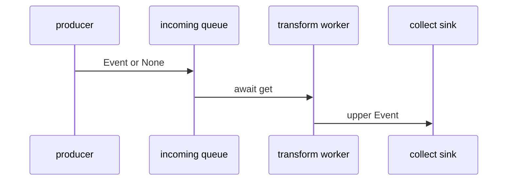
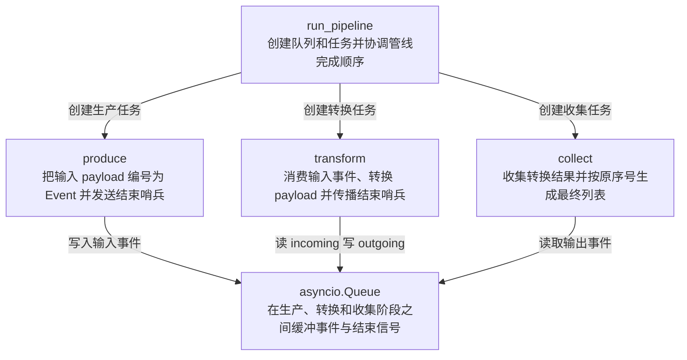

# async-event-pipeline 技术机制深度分析

## 机制概述

- **模式**：full。
- **一句话职责**：并发启动生产、转换和收集协程，通过两个异步队列把输入字符串转换为有序的大写结果。
- **主机制类型**：`data-flow`。
- **次机制类型**：`lifecycle`。
- **类型依据**：事件从生产者进入 incoming 队列，经 worker 异步转换后进入 outgoing 队列，最终由 sink 收集；任务创建、等待和结束哨兵同时构成协程生命周期。
- **链路模板**：`produce` → `schedule` → `process` → `effect`。

### 范围确认

- **SCOPE-01 · initial · 2026-07-24**：验证样例明确以 run_pipeline 到最终结果为分析范围；候选文件：`skills/tech-mechanism-analysis/examples/fixtures/async-event-pipeline/async_pipeline.py`。

### 工具与证据置信度

- **Python · high**：已读取全部协程、队列交接和最终返回路径，并实际运行 fixture 验证输出；工具：direct code reading、Python runtime。

## 业务流程图

### 业务步骤清单

- **FLOW-01 · 接收 payload 列表**：`skills/tech-mechanism-analysis/examples/fixtures/async-event-pipeline/async_pipeline.py:42`（pipeline 输入入口）。
- **FLOW-02 · 生成带序号 Event**：`skills/tech-mechanism-analysis/examples/fixtures/async-event-pipeline/async_pipeline.py:16`（生产事件）。
- **FLOW-03 · 异步转换为大写**：`skills/tech-mechanism-analysis/examples/fixtures/async-event-pipeline/async_pipeline.py:30`（转换事件）。
- **FLOW-04 · 收集并按序输出**：`skills/tech-mechanism-analysis/examples/fixtures/async-event-pipeline/async_pipeline.py:38`（排序输出结果）。
- **FLOW-EDGE-01 · input → produce**：payloads；`skills/tech-mechanism-analysis/examples/fixtures/async-event-pipeline/async_pipeline.py:45`（调度生产任务）。
- **FLOW-EDGE-02 · produce → transform**：incoming Queue；`skills/tech-mechanism-analysis/examples/fixtures/async-event-pipeline/async_pipeline.py:16`（事件进入输入队列）。
- **FLOW-EDGE-03 · transform → collect**：outgoing Queue；`skills/tech-mechanism-analysis/examples/fixtures/async-event-pipeline/async_pipeline.py:30`（转换结果进入输出队列）。

## 时序图

### 时序消息清单

- **PARTICIPANT-01 · producer**：`skills/tech-mechanism-analysis/examples/fixtures/async-event-pipeline/async_pipeline.py:14`（produce coroutine）。
- **PARTICIPANT-02 · incoming queue**：`skills/tech-mechanism-analysis/examples/fixtures/async-event-pipeline/async_pipeline.py:43`（incoming Queue）。
- **PARTICIPANT-03 · transform worker**：`skills/tech-mechanism-analysis/examples/fixtures/async-event-pipeline/async_pipeline.py:20`（transform coroutine）。
- **PARTICIPANT-04 · collect sink**：`skills/tech-mechanism-analysis/examples/fixtures/async-event-pipeline/async_pipeline.py:33`（collect coroutine）。
- **MESSAGE-01 · producer → incoming**：Event or None；`skills/tech-mechanism-analysis/examples/fixtures/async-event-pipeline/async_pipeline.py:16`（queue put Event）。
- **MESSAGE-02 · incoming → worker**：await get；`skills/tech-mechanism-analysis/examples/fixtures/async-event-pipeline/async_pipeline.py:25`（source get event）。
- **MESSAGE-03 · worker → sink**：upper Event；`skills/tech-mechanism-analysis/examples/fixtures/async-event-pipeline/async_pipeline.py:30`（target put upper Event）。

## 架构角色图

### 角色职责清单

- **ROLE-01 · run_pipeline**：实体类型 `function`；职责：创建队列和任务并协调管线完成顺序；`skills/tech-mechanism-analysis/examples/fixtures/async-event-pipeline/async_pipeline.py:42`（管线协调函数）。
- **ROLE-02 · produce**：实体类型 `function`；职责：把输入 payload 编号为 Event 并发送结束哨兵；`skills/tech-mechanism-analysis/examples/fixtures/async-event-pipeline/async_pipeline.py:14`（生产协程）。
- **ROLE-03 · transform**：实体类型 `function`；职责：消费输入事件、转换 payload 并传播结束哨兵；`skills/tech-mechanism-analysis/examples/fixtures/async-event-pipeline/async_pipeline.py:20`（转换协程）。
- **ROLE-04 · collect**：实体类型 `function`；职责：收集转换结果并按原序号生成最终列表；`skills/tech-mechanism-analysis/examples/fixtures/async-event-pipeline/async_pipeline.py:33`（收集协程）。
- **ROLE-05 · asyncio.Queue**：实体类型 `data-store`；职责：在生产、转换和收集阶段之间缓冲事件与结束信号；`skills/tech-mechanism-analysis/examples/fixtures/async-event-pipeline/async_pipeline.py:43`（输入输出队列）。
- **ARCH-EDGE-01 · coordinator → producer_role**：创建生产任务；`skills/tech-mechanism-analysis/examples/fixtures/async-event-pipeline/async_pipeline.py:45`（调度 producer）。
- **ARCH-EDGE-02 · coordinator → worker_role**：创建转换任务；`skills/tech-mechanism-analysis/examples/fixtures/async-event-pipeline/async_pipeline.py:46`（调度 worker）。
- **ARCH-EDGE-03 · coordinator → sink_role**：创建收集任务；`skills/tech-mechanism-analysis/examples/fixtures/async-event-pipeline/async_pipeline.py:47`（调度 sink）。
- **ARCH-EDGE-04 · producer_role → queues**：写入输入事件；`skills/tech-mechanism-analysis/examples/fixtures/async-event-pipeline/async_pipeline.py:16`（输入队列写入）。
- **ARCH-EDGE-05 · worker_role → queues**：读 incoming 写 outgoing；`skills/tech-mechanism-analysis/examples/fixtures/async-event-pipeline/async_pipeline.py:30`（目标队列写入）。
- **ARCH-EDGE-06 · sink_role → queues**：读取输出事件；`skills/tech-mechanism-analysis/examples/fixtures/async-event-pipeline/async_pipeline.py:36`（输出队列读取）。

## 全链路

### stage-produce · 生产事件并写入结束哨兵

- **阶段标识**：`produce`。
- **做了什么**：produce 把每个输入包装为带 sequence 的 Event，依次写入 incoming 队列，最后写入 None。
- **怎么实现**：enumerate 生成稳定序号，await queue.put 形成异步背压点，None 作为流结束协议。
- **设计依据（inferred）**：序号让下游可以恢复输入顺序，None 用作结束信号；这是根据协议效果做出的实现推断。
- **关键结构**：`Event`、`produce`、`asyncio.Queue`、`None sentinel`。
- **交接/最终效果**：向 incoming 队列交付零到多个 Event，随后交付一个 None 表示生产结束。
- **交接证据**：`skills/tech-mechanism-analysis/examples/fixtures/async-event-pipeline/async_pipeline.py:17`（queue put None terminates produced stream）。
- **证据**：`skills/tech-mechanism-analysis/examples/fixtures/async-event-pipeline/async_pipeline.py:14`（produce coroutine accepts payloads and queue）、`skills/tech-mechanism-analysis/examples/fixtures/async-event-pipeline/async_pipeline.py:16`（queue put Event with sequence and payload）。

### stage-schedule · 并发调度三个协程

- **阶段标识**：`schedule`。
- **做了什么**：run_pipeline 为 producer、worker 和 sink 分别创建任务，使三段在事件循环中并发推进。
- **怎么实现**：asyncio.create_task 注册三个协程，gather 等待生产和转换完成，sink 单独作为最终结果任务等待。
- **设计依据（inferred）**：分离任务允许队列两端重叠执行并显式保留 sink 的返回值；这是从调度结构推断的效果。
- **关键结构**：`run_pipeline`、`asyncio.create_task`、`asyncio.gather`。
- **交接/最终效果**：事件循环并发驱动 producer、worker 和 sink；producer 与 worker 完成后继续等待 sink 产出结果。
- **交接证据**：`skills/tech-mechanism-analysis/examples/fixtures/async-event-pipeline/async_pipeline.py:48`（asyncio gather waits for producer and worker）。
- **证据**：`skills/tech-mechanism-analysis/examples/fixtures/async-event-pipeline/async_pipeline.py:45`（create_task schedules produce coroutine）、`skills/tech-mechanism-analysis/examples/fixtures/async-event-pipeline/async_pipeline.py:47`（create_task schedules collect sink）。

### stage-process · 异步消费并转换事件

- **阶段标识**：`process`。
- **做了什么**：transform 循环等待 incoming 事件，把 payload 转为大写后保留原 sequence 写入 outgoing。
- **怎么实现**：await source.get 挂起等待输入，sleep(0) 显式让出调度权，target.put 把转换结果交给下游。
- **设计依据（inferred）**：保留 sequence 让转换阶段与最终排序解耦；显式 yield 用于展示异步切换点，真实业务可替换为 I/O。
- **关键结构**：`transform`、`source.get`、`asyncio.sleep`、`target.put`。
- **交接/最终效果**：每个输入 Event 对应一个大写 Event；收到 None 后把 None 继续传给 outgoing 并退出。
- **交接证据**：`skills/tech-mechanism-analysis/examples/fixtures/async-event-pipeline/async_pipeline.py:27`（target put None forwards termination sentinel）。
- **证据**：`skills/tech-mechanism-analysis/examples/fixtures/async-event-pipeline/async_pipeline.py:25`（source get awaits next event）、`skills/tech-mechanism-analysis/examples/fixtures/async-event-pipeline/async_pipeline.py:30`（target put transformed Event payload upper）。

### stage-effect · 收集并恢复顺序

- **阶段标识**：`effect`。
- **做了什么**：collect 持续读取 outgoing，收到 None 后按 sequence 排序并返回 payload 列表。
- **怎么实现**：结果先积累为 Event 列表，结束时用 sorted 的 sequence key 恢复确定性顺序。
- **设计依据（inferred）**：最终排序使 sink 不依赖上游未来是否并行处理；这是根据数据结构和返回行为推断的演进意图。
- **关键结构**：`collect`、`results`、`sorted`、`sink`。
- **交接/最终效果**：run_pipeline 等待 sink，并把有序字符串列表作为机制最终可观察结果返回。
- **交接证据**：`skills/tech-mechanism-analysis/examples/fixtures/async-event-pipeline/async_pipeline.py:49`（return await sink exposes final result）。
- **证据**：`skills/tech-mechanism-analysis/examples/fixtures/async-event-pipeline/async_pipeline.py:36`（queue get awaits transformed event）、`skills/tech-mechanism-analysis/examples/fixtures/async-event-pipeline/async_pipeline.py:38`（sorted results return payload sequence）。

## 必检边界覆盖

- **cancellation**：`BOUNDARY-03`：适用性 `uncertain`，处理能力 `unknown`，验证状态 `unverified`。
- **exception**：`BOUNDARY-04`：适用性 `uncertain`，处理能力 `unknown`，验证状态 `unverified`。
- **concurrency**：`BOUNDARY-05`：适用性 `applicable`，处理能力 `supported`，验证状态 `unverified`。
- **backpressure**：`BOUNDARY-06`：适用性 `applicable`，处理能力 `unsupported`，验证状态 `unverified`。

## 边界清单

### BOUNDARY-01 · payloads 为空列表

- **类别**：`empty-input`。
- **适用性**：`applicable`。
- **条件**：payloads 为空列表。
- **期望契约**：管线正常结束并返回空结果，不永久等待队列。
- **实际行为**：producer 直接发送结束哨兵，collect 返回空列表。
- **处理能力**：`supported`。
- **验证状态**：`verified`。
- **关联行为用例**：`CASE-01`。
- **源码锚点**：`skills/tech-mechanism-analysis/examples/fixtures/async-event-pipeline/async_pipeline.py:17`（即使无事件也写入结束哨兵）、`skills/tech-mechanism-analysis/examples/fixtures/async-event-pipeline/async_pipeline.py:38`（收到哨兵后返回排序结果）。

### BOUNDARY-02 · transform 从 incoming 队列读到 None

- **类别**：`terminal-sentinel`。
- **适用性**：`applicable`。
- **条件**：transform 从 incoming 队列读到 None。
- **期望契约**：向下游传播一次 None 并终止 worker。
- **实际行为**：transform put(None) 后立即 return。
- **处理能力**：`supported`。
- **验证状态**：`verified`。
- **关联行为用例**：`CASE-02`。
- **源码锚点**：`skills/tech-mechanism-analysis/examples/fixtures/async-event-pipeline/async_pipeline.py:26`（转换阶段识别 None 结束分支）、`skills/tech-mechanism-analysis/examples/fixtures/async-event-pipeline/async_pipeline.py:27`（结束分支把 None 传播到下游队列）。

### BOUNDARY-03 · producer、worker 或 sink 被外部取消

- **类别**：`cancellation`。
- **适用性**：`uncertain`。
- **条件**：producer、worker 或 sink 被外部取消。
- **期望契约**：取消应传播并让其余任务与队列等待者收口。
- **实际行为**：入口只 gather producer 与 worker，未看到显式取消清理；实际取消传播和 sink 收口尚未运行验证。
- **处理能力**：`unknown`。
- **验证状态**：`unverified`。
- **关联行为用例**：无。
- **源码锚点**：`skills/tech-mechanism-analysis/examples/fixtures/async-event-pipeline/async_pipeline.py:48`（入口等待两个上游任务但没有显式取消清理）。

### BOUNDARY-04 · 生产或转换协程抛出异常

- **类别**：`exception`。
- **适用性**：`uncertain`。
- **条件**：生产或转换协程抛出异常。
- **期望契约**：异常传播时其余任务不应永久等待未到达的结束哨兵。
- **实际行为**：gather 会暴露上游异常，但代码没有显式关闭队列或收口 sink；异常路径未运行验证。
- **处理能力**：`unknown`。
- **验证状态**：`unverified`。
- **关联行为用例**：无。
- **源码锚点**：`skills/tech-mechanism-analysis/examples/fixtures/async-event-pipeline/async_pipeline.py:48`（gather 是上游异常传播边界）、`skills/tech-mechanism-analysis/examples/fixtures/async-event-pipeline/async_pipeline.py:49`（sink 在上游完成后被单独等待）。

### BOUNDARY-05 · producer、worker 和 sink 在事件循环中并发推进

- **类别**：`concurrency`。
- **适用性**：`applicable`。
- **条件**：producer、worker 和 sink 在事件循环中并发推进。
- **期望契约**：队列交接保持事件完整，结束哨兵只在全部事件之后传播。
- **实际行为**：三个协程通过 create_task 并发调度；已验证正常输出，但未验证重入、乱序调度和竞争边界。
- **处理能力**：`supported`。
- **验证状态**：`unverified`。
- **关联行为用例**：无。
- **源码锚点**：`skills/tech-mechanism-analysis/examples/fixtures/async-event-pipeline/async_pipeline.py:45`（生产协程通过 create_task 调度）、`skills/tech-mechanism-analysis/examples/fixtures/async-event-pipeline/async_pipeline.py:47`（收集协程独立调度）。

### BOUNDARY-06 · 生产速度持续高于转换或收集速度

- **类别**：`flow-control`。
- **适用性**：`applicable`。
- **条件**：生产速度持续高于转换或收集速度。
- **期望契约**：若需要背压，应定义有限队列容量以及生产者阻塞或丢弃策略。
- **实际行为**：incoming 与 outgoing 使用默认无界 asyncio.Queue；当前机制不提供背压，高负载行为未运行验证。
- **处理能力**：`unsupported`。
- **验证状态**：`unverified`。
- **关联行为用例**：无。
- **源码锚点**：`skills/tech-mechanism-analysis/examples/fixtures/async-event-pipeline/async_pipeline.py:43`（incoming 使用默认容量 asyncio Queue）、`skills/tech-mechanism-analysis/examples/fixtures/async-event-pipeline/async_pipeline.py:44`（outgoing 使用默认容量 asyncio Queue）。

## 可验证行为用例

### CASE-01 · 空事件流正常终止

- **关联边界**：`BOUNDARY-01`。
- **入口**：`run_pipeline`。
- **分支路径**：`produce 空循环后发送 None`。
- **语义条件键**：`empty-payload-stream`。
- **前置条件**：事件列表为空。
- **输入**：payloads=[]。
- **动作**：运行 run_pipeline([])。
- **期望可观察行为**：协程全部收口并返回 []。
- **实际观察行为**：asyncio.run 返回空列表。
- **验证**：`verified` / `test`；执行 test_async_empty_stream_terminates；结果：返回值严格等于 []。
- **源码锚点**：`skills/tech-mechanism-analysis/examples/fixtures/async-event-pipeline/async_pipeline.py:42`（run_pipeline 是空事件流的公开入口）、`skills/tech-mechanism-analysis/examples/fixtures/async-event-pipeline/async_pipeline.py:17`（生产阶段为下游提供终止信号）。
- **对应验收用例**：`ACCEPT-01`。

### CASE-02 · worker 传播结束哨兵

- **关联边界**：`BOUNDARY-02`。
- **入口**：`transform`。
- **分支路径**：`event is None`。
- **语义条件键**：`terminal-sentinel-propagation`。
- **前置条件**：source 队列下一项为 None。
- **输入**：source.get() 返回 None。
- **动作**：运行 transform 直到读取结束哨兵。
- **期望可观察行为**：target 收到 None 且 transform 返回。
- **实际观察行为**：完整管线运行后 sink 正常结束。
- **验证**：`verified` / `test`；执行 fixture 运行用例并等待 asyncio.gather 完成；结果：输出为 [ALPHA, BETA] 且进程正常退出。
- **源码锚点**：`skills/tech-mechanism-analysis/examples/fixtures/async-event-pipeline/async_pipeline.py:27`（转换阶段把结束哨兵写入 target）、`skills/tech-mechanism-analysis/examples/fixtures/async-event-pipeline/async_pipeline.py:28`（传播哨兵后转换协程返回）。
- **对应验收用例**：`ACCEPT-02`。

## 验收用例

### ACCEPT-01 · 空事件流不会挂起

- **关联行为用例**：`CASE-01`。
- **Given**：run_pipeline 接收空 payload 列表。
- **When**：启动 producer、worker 和 sink。
- **Then**：所有任务终止且返回空列表。
- **验证级别**：`automated`。
- **源码锚点**：`skills/tech-mechanism-analysis/examples/fixtures/async-event-pipeline/async_pipeline.py:48`（入口等待 producer 与 worker 完成）、`skills/tech-mechanism-analysis/examples/fixtures/async-event-pipeline/async_pipeline.py:49`（入口最终等待并返回 sink 结果）。

### ACCEPT-02 · 结束哨兵逐段传播

- **关联行为用例**：`CASE-02`。
- **Given**：transform 正在等待 source 队列。
- **When**：source 提供 None。
- **Then**：target 收到一次 None 且 transform 结束。
- **验证级别**：`automated`。
- **源码锚点**：`skills/tech-mechanism-analysis/examples/fixtures/async-event-pipeline/async_pipeline.py:26`（None 分支定义终止条件）、`skills/tech-mechanism-analysis/examples/fixtures/async-event-pipeline/async_pipeline.py:27`（终止信号继续传播给下游）。

## 多入口/分支行为矛盾

在已覆盖入口和分支内，未识别到多入口/分支行为矛盾。

## 数值示例

本机制未识别到需要工作示例的核心数值操作。

## 架构设计债

### DEBT-ARCH-01 · 单个结束哨兵把协议绑定到单 worker

- **所属阶段**：`stage-schedule`；跨阶段。
- **需求来源**：`hypothetical`。
- **会变难的需求**：把转换阶段扩展为多个并发 worker，同时保证所有 worker 都能结束且 sink 只在全部处理完成后收口。
- **为什么难**：produce 只发送一个 None，任意一个 worker 消费后就会转发结束；增加 worker 会留下未退出任务，并可能让 sink 在其他 worker 的结果到达前结束。
- **演进方向**：改为按 worker 数量发送哨兵，或使用 TaskGroup 加显式 close/join 协议，由协调器在全部 worker 完成后关闭 outgoing。
- **代价/影响**：需要同时修改生产结束协议、worker 生命周期和 sink 收口条件，并增加取消与异常传播测试。
- **量化范围**：阶段 3 个（`stage-schedule`、`stage-process`、`stage-effect`）；文件 1 个（`skills/tech-mechanism-analysis/examples/fixtures/async-event-pipeline/async_pipeline.py`）；模块 4 个（`produce`、`transform`、`collect`、`run_pipeline`）；量级 `medium`；一个文件中的三个阶段共享 None 哨兵约定，扩展 worker 数量会同时改变三处终止逻辑。
- **结论置信度**：`high`；单哨兵和单 worker 调度是直接代码事实；多 worker 是明确、可执行的演进场景。
- **证据**：`skills/tech-mechanism-analysis/examples/fixtures/async-event-pipeline/async_pipeline.py:17`（single None sentinel produced）、`skills/tech-mechanism-analysis/examples/fixtures/async-event-pipeline/async_pipeline.py:46`（single transform worker task scheduled）。

## 逻辑设计债

本机制未识别到逻辑设计债。

## 跨阶段衔接

`DEBT-ARCH-01` 涉及跨阶段约定。

## 已知缺口

- 无。
