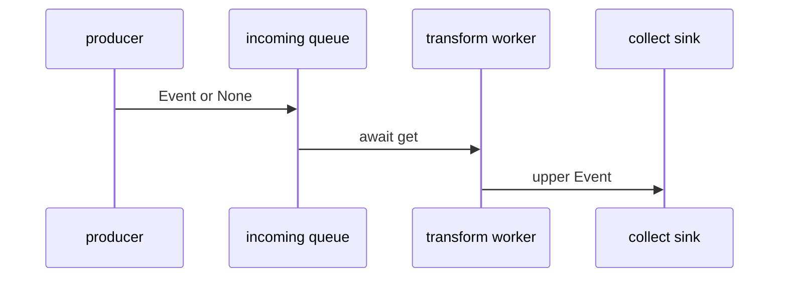

# async-event-pipeline 技术机制深度分析

## 机制概述

- **模式**：full。
- **一句话职责**：并发启动生产、转换和收集协程，通过两个异步队列把输入字符串转换为有序的大写结果。
- **主机制类型**：`data-flow`。
- **次机制类型**：`lifecycle`。
- **类型依据**：事件从生产者进入 incoming 队列，经 worker 异步转换后进入 outgoing 队列，最终由 sink 收集；任务创建、等待和结束哨兵同时构成协程生命周期。
- **链路模板**：`produce` → `schedule` → `process` → `effect`。

### 范围确认

- **SCOPE-01 · initial · 2026-07-24**：验证样例明确以 run_pipeline 到最终结果为分析范围；候选文件：`skills/tech-mechanism-analysis/examples/fixtures/async-event-pipeline/async_pipeline.py`。

### 工具与证据置信度

- **Python · high**：已读取全部协程、队列交接和最终返回路径，并实际运行 fixture 验证输出；工具：direct code reading、Python runtime。

## 全链路

### stage-produce · 生产事件并写入结束哨兵

- **阶段标识**：`produce`。
- **做了什么**：produce 把每个输入包装为带 sequence 的 Event，依次写入 incoming 队列，最后写入 None。
- **怎么实现**：enumerate 生成稳定序号，await queue.put 形成异步背压点，None 作为流结束协议。
- **设计依据（inferred）**：序号让下游可以恢复输入顺序，None 用作结束信号；这是根据协议效果做出的实现推断。
- **关键结构**：`Event`、`produce`、`asyncio.Queue`、`None sentinel`。
- **交接/最终效果**：向 incoming 队列交付零到多个 Event，随后交付一个 None 表示生产结束。
- **交接证据**：`skills/tech-mechanism-analysis/examples/fixtures/async-event-pipeline/async_pipeline.py:17`（queue put None terminates produced stream）。
- **证据**：`skills/tech-mechanism-analysis/examples/fixtures/async-event-pipeline/async_pipeline.py:14`（produce coroutine accepts payloads and queue）、`skills/tech-mechanism-analysis/examples/fixtures/async-event-pipeline/async_pipeline.py:16`（queue put Event with sequence and payload）。

### stage-schedule · 并发调度三个协程

- **阶段标识**：`schedule`。
- **做了什么**：run_pipeline 为 producer、worker 和 sink 分别创建任务，使三段在事件循环中并发推进。
- **怎么实现**：asyncio.create_task 注册三个协程，gather 等待生产和转换完成，sink 单独作为最终结果任务等待。
- **设计依据（inferred）**：分离任务允许队列两端重叠执行并显式保留 sink 的返回值；这是从调度结构推断的效果。
- **关键结构**：`run_pipeline`、`asyncio.create_task`、`asyncio.gather`。
- **交接/最终效果**：事件循环并发驱动 producer、worker 和 sink；producer 与 worker 完成后继续等待 sink 产出结果。
- **交接证据**：`skills/tech-mechanism-analysis/examples/fixtures/async-event-pipeline/async_pipeline.py:48`（asyncio gather waits for producer and worker）。
- **证据**：`skills/tech-mechanism-analysis/examples/fixtures/async-event-pipeline/async_pipeline.py:45`（create_task schedules produce coroutine）、`skills/tech-mechanism-analysis/examples/fixtures/async-event-pipeline/async_pipeline.py:47`（create_task schedules collect sink）。

### stage-process · 异步消费并转换事件

- **阶段标识**：`process`。
- **做了什么**：transform 循环等待 incoming 事件，把 payload 转为大写后保留原 sequence 写入 outgoing。
- **怎么实现**：await source.get 挂起等待输入，sleep(0) 显式让出调度权，target.put 把转换结果交给下游。
- **设计依据（inferred）**：保留 sequence 让转换阶段与最终排序解耦；显式 yield 用于展示异步切换点，真实业务可替换为 I/O。
- **关键结构**：`transform`、`source.get`、`asyncio.sleep`、`target.put`。
- **交接/最终效果**：每个输入 Event 对应一个大写 Event；收到 None 后把 None 继续传给 outgoing 并退出。
- **交接证据**：`skills/tech-mechanism-analysis/examples/fixtures/async-event-pipeline/async_pipeline.py:27`（target put None forwards termination sentinel）。
- **证据**：`skills/tech-mechanism-analysis/examples/fixtures/async-event-pipeline/async_pipeline.py:25`（source get awaits next event）、`skills/tech-mechanism-analysis/examples/fixtures/async-event-pipeline/async_pipeline.py:30`（target put transformed Event payload upper）。

### stage-effect · 收集并恢复顺序

- **阶段标识**：`effect`。
- **做了什么**：collect 持续读取 outgoing，收到 None 后按 sequence 排序并返回 payload 列表。
- **怎么实现**：结果先积累为 Event 列表，结束时用 sorted 的 sequence key 恢复确定性顺序。
- **设计依据（inferred）**：最终排序使 sink 不依赖上游未来是否并行处理；这是根据数据结构和返回行为推断的演进意图。
- **关键结构**：`collect`、`results`、`sorted`、`sink`。
- **交接/最终效果**：run_pipeline 等待 sink，并把有序字符串列表作为机制最终可观察结果返回。
- **交接证据**：`skills/tech-mechanism-analysis/examples/fixtures/async-event-pipeline/async_pipeline.py:49`（return await sink exposes final result）。
- **证据**：`skills/tech-mechanism-analysis/examples/fixtures/async-event-pipeline/async_pipeline.py:36`（queue get awaits transformed event）、`skills/tech-mechanism-analysis/examples/fixtures/async-event-pipeline/async_pipeline.py:38`（sorted results return payload sequence）。

### 链路图

## 数值示例

本机制未识别到需要工作示例的核心数值操作。

## 架构设计债

### DEBT-ARCH-01 · 单个结束哨兵把协议绑定到单 worker

- **所属阶段**：`stage-schedule`；跨阶段。
- **需求来源**：`hypothetical`。
- **会变难的需求**：把转换阶段扩展为多个并发 worker，同时保证所有 worker 都能结束且 sink 只在全部处理完成后收口。
- **为什么难**：produce 只发送一个 None，任意一个 worker 消费后就会转发结束；增加 worker 会留下未退出任务，并可能让 sink 在其他 worker 的结果到达前结束。
- **演进方向**：改为按 worker 数量发送哨兵，或使用 TaskGroup 加显式 close/join 协议，由协调器在全部 worker 完成后关闭 outgoing。
- **代价/影响**：需要同时修改生产结束协议、worker 生命周期和 sink 收口条件，并增加取消与异常传播测试。
- **量化范围**：阶段 3 个（`stage-schedule`、`stage-process`、`stage-effect`）；文件 1 个（`skills/tech-mechanism-analysis/examples/fixtures/async-event-pipeline/async_pipeline.py`）；模块 4 个（`produce`、`transform`、`collect`、`run_pipeline`）；量级 `medium`；一个文件中的三个阶段共享 None 哨兵约定，扩展 worker 数量会同时改变三处终止逻辑。
- **结论置信度**：`high`；单哨兵和单 worker 调度是直接代码事实；多 worker 是明确、可执行的演进场景。
- **证据**：`skills/tech-mechanism-analysis/examples/fixtures/async-event-pipeline/async_pipeline.py:17`（single None sentinel produced）、`skills/tech-mechanism-analysis/examples/fixtures/async-event-pipeline/async_pipeline.py:46`（single transform worker task scheduled）。

## 逻辑设计债

本机制未识别到逻辑设计债。

## 跨阶段衔接

`DEBT-ARCH-01` 涉及跨阶段约定。

## 已知缺口

- ⚠ 未确认：当前验证环境未安装 mmdc；Mermaid 已通过安全子集结构检查，但未执行实际 SVG 渲染
