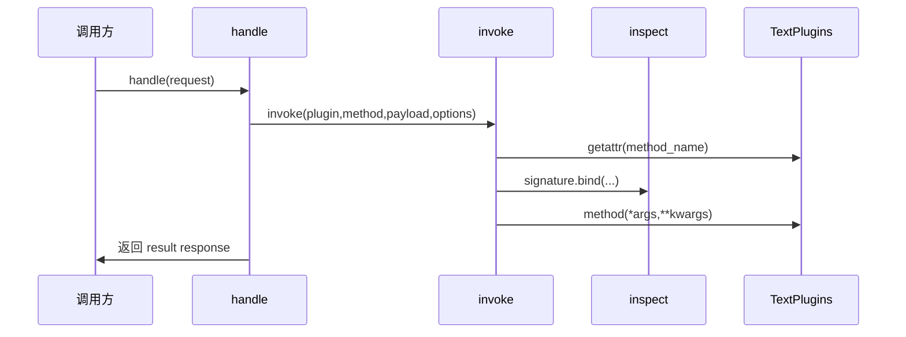
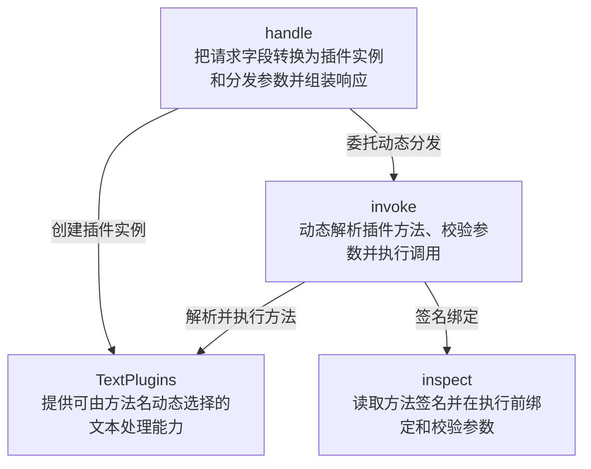

# reflection-dispatch 技术机制深度分析

## 机制概述

- **模式**：full。
- **一句话职责**：把请求中的方法名解析为插件对象上的可调用成员，按反射签名绑定参数并返回动态调用结果。
- **主机制类型**：`call-chain`。
- **次机制类型**：`other`。
- **类型依据**：handle 接收请求并委派 invoke，invoke 通过 getattr 动态解析方法、inspect.signature 绑定参数，再调用解析出的成员并返回结果。
- **链路模板**：`entry` → `resolve` → `bind` → `invoke` → `effect`。

### 范围确认

- **SCOPE-01 · initial · 2026-07-24**：验证样例明确以 handle 到反射调用结果为分析范围；候选文件：`skills/tech-mechanism-analysis/examples/fixtures/reflection-dispatch/plugin_dispatch.py`。

### 工具与证据置信度

- **Python · high**：已读取动态成员解析、可调用检查、签名绑定和最终返回路径，并实际运行 fixture；工具：direct code reading、Python runtime。

## 业务流程图

### 业务步骤清单

- **FLOW-01 · request method**：`skills/tech-mechanism-analysis/examples/fixtures/reflection-dispatch/plugin_dispatch.py:34`（request method key）。
- **FLOW-02 · getattr resolver**：`skills/tech-mechanism-analysis/examples/fixtures/reflection-dispatch/plugin_dispatch.py:22`（getattr resolver）。
- **FLOW-03 · signature binder**：`skills/tech-mechanism-analysis/examples/fixtures/reflection-dispatch/plugin_dispatch.py:26`（signature bind）。
- **FLOW-04 · plugin method**：`skills/tech-mechanism-analysis/examples/fixtures/reflection-dispatch/plugin_dispatch.py:27`（method invocation）。
- **FLOW-05 · result response**：`skills/tech-mechanism-analysis/examples/fixtures/reflection-dispatch/plugin_dispatch.py:38`（result response）。
- **FLOW-EDGE-01 · request → resolver**：method_name；`skills/tech-mechanism-analysis/examples/fixtures/reflection-dispatch/plugin_dispatch.py:22`（getattr method_name）。
- **FLOW-EDGE-02 · resolver → binder**：callable method；`skills/tech-mechanism-analysis/examples/fixtures/reflection-dispatch/plugin_dispatch.py:25`（signature method）。
- **FLOW-EDGE-03 · binder → method**：bound arguments；`skills/tech-mechanism-analysis/examples/fixtures/reflection-dispatch/plugin_dispatch.py:27`（bound args kwargs）。
- **FLOW-EDGE-04 · method → response**：result；`skills/tech-mechanism-analysis/examples/fixtures/reflection-dispatch/plugin_dispatch.py:38`（return result）。

## 时序图

### 时序消息清单

- **PARTICIPANT-01 · 调用方**：`skills/tech-mechanism-analysis/examples/fixtures/reflection-dispatch/plugin_dispatch.py:30`（handle 请求入口）。
- **PARTICIPANT-02 · handle**：`skills/tech-mechanism-analysis/examples/fixtures/reflection-dispatch/plugin_dispatch.py:30`（请求处理函数）。
- **PARTICIPANT-03 · invoke**：`skills/tech-mechanism-analysis/examples/fixtures/reflection-dispatch/plugin_dispatch.py:16`（反射分发函数）。
- **PARTICIPANT-04 · inspect**：`skills/tech-mechanism-analysis/examples/fixtures/reflection-dispatch/plugin_dispatch.py:25`（签名检查模块）。
- **PARTICIPANT-05 · TextPlugins**：`skills/tech-mechanism-analysis/examples/fixtures/reflection-dispatch/plugin_dispatch.py:31`（创建插件实例并作为时序参与者）。
- **MESSAGE-01 · caller → handler**：handle(request)；`skills/tech-mechanism-analysis/examples/fixtures/reflection-dispatch/plugin_dispatch.py:30`（进入请求处理）。
- **MESSAGE-02 · handler → dispatcher**：invoke(plugin,method,payload,options)；`skills/tech-mechanism-analysis/examples/fixtures/reflection-dispatch/plugin_dispatch.py:32`（调用反射分发）。
- **MESSAGE-03 · dispatcher → plugin**：getattr(method_name)；`skills/tech-mechanism-analysis/examples/fixtures/reflection-dispatch/plugin_dispatch.py:22`（动态解析插件方法）。
- **MESSAGE-04 · dispatcher → inspect_api**：signature.bind(...)；`skills/tech-mechanism-analysis/examples/fixtures/reflection-dispatch/plugin_dispatch.py:26`（绑定方法参数）。
- **MESSAGE-05 · dispatcher → plugin**：method(*args,**kwargs)；`skills/tech-mechanism-analysis/examples/fixtures/reflection-dispatch/plugin_dispatch.py:27`（调用插件方法）。
- **MESSAGE-06 · handler → caller**：返回 result response；`skills/tech-mechanism-analysis/examples/fixtures/reflection-dispatch/plugin_dispatch.py:38`（返回响应对象）。

## 架构角色图

### 角色职责清单

- **ROLE-01 · handle**：实体类型 `function`；职责：把请求字段转换为插件实例和分发参数并组装响应；`skills/tech-mechanism-analysis/examples/fixtures/reflection-dispatch/plugin_dispatch.py:30`（请求适配函数）。
- **ROLE-02 · invoke**：实体类型 `function`；职责：动态解析插件方法、校验参数并执行调用；`skills/tech-mechanism-analysis/examples/fixtures/reflection-dispatch/plugin_dispatch.py:16`（反射分发函数）。
- **ROLE-03 · TextPlugins**：实体类型 `class`；职责：提供可由方法名动态选择的文本处理能力；`skills/tech-mechanism-analysis/examples/fixtures/reflection-dispatch/plugin_dispatch.py:8`（插件能力类）。
- **ROLE-04 · inspect**：实体类型 `module`；职责：读取方法签名并在执行前绑定和校验参数；`skills/tech-mechanism-analysis/examples/fixtures/reflection-dispatch/plugin_dispatch.py:25`（签名解析调用）。
- **ARCH-EDGE-01 · handler → dispatcher**：委托动态分发；`skills/tech-mechanism-analysis/examples/fixtures/reflection-dispatch/plugin_dispatch.py:32`（handle 调用 invoke）。
- **ARCH-EDGE-02 · handler → plugins**：创建插件实例；`skills/tech-mechanism-analysis/examples/fixtures/reflection-dispatch/plugin_dispatch.py:31`（实例化 TextPlugins）。
- **ARCH-EDGE-03 · dispatcher → plugins**：解析并执行方法；`skills/tech-mechanism-analysis/examples/fixtures/reflection-dispatch/plugin_dispatch.py:27`（执行绑定方法）。
- **ARCH-EDGE-04 · dispatcher → inspect_api**：签名绑定；`skills/tech-mechanism-analysis/examples/fixtures/reflection-dispatch/plugin_dispatch.py:26`（绑定调用参数）。

## 全链路

### stage-entry · 从请求提取动态调用信息

- **阶段标识**：`entry`。
- **做了什么**：handle 创建 TextPlugins，并从 request 读取 method、payload 和可选 options 后委派 invoke。
- **怎么实现**：字典键提供方法名和参数，request.get 为关键字参数提供空字典默认值。
- **设计依据（inferred）**：统一请求结构把外部字符串路由与插件调用入口连接起来；这是从接口形态推断的效果。
- **关键结构**：`handle`、`request`、`TextPlugins`、`invoke`。
- **交接/最终效果**：向 invoke 交付插件实例、method_name、payload 和 options 四个值。
- **交接证据**：`skills/tech-mechanism-analysis/examples/fixtures/reflection-dispatch/plugin_dispatch.py:32`（invoke call starts dynamic dispatch）。
- **证据**：`skills/tech-mechanism-analysis/examples/fixtures/reflection-dispatch/plugin_dispatch.py:30`（handle request entry）、`skills/tech-mechanism-analysis/examples/fixtures/reflection-dispatch/plugin_dispatch.py:36`（request options default dictionary）。

### stage-resolve · 按名称反射解析成员

- **阶段标识**：`resolve`。
- **做了什么**：invoke 使用 getattr 在插件实例上查找 method_name 对应成员，并拒绝不存在或不可调用的值。
- **怎么实现**：getattr 的默认值是 None，随后 callable 检查把动态对象收窄为可调用成员。
- **设计依据（unknown）**：运行时解析允许请求字符串选择插件行为；代码无法证明选择公开方法反射而非显式注册表的历史原因。
- **关键结构**：`getattr`、`callable`、`LookupError`。
- **交接/最终效果**：成功时向签名绑定阶段交付 bound method；失败时抛出 LookupError 并终止链路。
- **交接证据**：`skills/tech-mechanism-analysis/examples/fixtures/reflection-dispatch/plugin_dispatch.py:22`（getattr resolves method by method_name）。
- **证据**：`skills/tech-mechanism-analysis/examples/fixtures/reflection-dispatch/plugin_dispatch.py:23`（callable method guard）、`skills/tech-mechanism-analysis/examples/fixtures/reflection-dispatch/plugin_dispatch.py:24`（LookupError rejects unknown method）。

### stage-bind · 读取签名并绑定参数

- **阶段标识**：`bind`。
- **做了什么**：inspect.signature 读取运行时方法签名，bind 把 payload 和 options 校验并映射到位置及关键字参数。
- **怎么实现**：signature.bind 在真实调用前复用 Python 调用约束，缺参和多余参数会在此抛出 TypeError。
- **设计依据（inferred）**：预绑定让动态请求仍遵守目标方法声明的参数契约；这是反射 API 的直接行为效果。
- **关键结构**：`inspect.signature`、`Signature.bind`、`BoundArguments`。
- **交接/最终效果**：向调用阶段交付 bound.args 和 bound.kwargs，确保参数形态已与目标方法一致。
- **交接证据**：`skills/tech-mechanism-analysis/examples/fixtures/reflection-dispatch/plugin_dispatch.py:26`（signature bind payload and options）。
- **证据**：`skills/tech-mechanism-analysis/examples/fixtures/reflection-dispatch/plugin_dispatch.py:25`（inspect signature reads method contract）、`skills/tech-mechanism-analysis/examples/fixtures/reflection-dispatch/plugin_dispatch.py:26`（signature bind validates arguments）。

### stage-invoke · 调用动态解析的方法

- **阶段标识**：`invoke`。
- **做了什么**：invoke 展开 BoundArguments，调用此前由 getattr 解析出的 bound method。
- **怎么实现**：method(*bound.args, **bound.kwargs) 保留目标方法的普通 Python 调用语义。
- **设计依据（inferred）**：把解析和绑定结果统一落到一次真实调用；该效果由调用表达式直接体现。
- **关键结构**：`method`、`bound.args`、`bound.kwargs`。
- **交接/最终效果**：目标插件方法的字符串返回值交回 handle。
- **交接证据**：`skills/tech-mechanism-analysis/examples/fixtures/reflection-dispatch/plugin_dispatch.py:27`（method called with bound args kwargs）。
- **证据**：`skills/tech-mechanism-analysis/examples/fixtures/reflection-dispatch/plugin_dispatch.py:9`（upper plugin method）、`skills/tech-mechanism-analysis/examples/fixtures/reflection-dispatch/plugin_dispatch.py:27`（dynamic method invocation）。

### stage-effect · 封装动态调用结果

- **阶段标识**：`effect`。
- **做了什么**：handle 把请求方法名和插件返回字符串封装为包含 plugin 与 result 的字典。
- **怎么实现**：返回对象保留被选择的方法名，使调用结果携带最小路由元数据。
- **设计依据（inferred）**：结果同时暴露路由选择和业务值，便于调用方观察实际分派；这是从返回结构推断的效果。
- **关键结构**：`response dictionary`、`plugin`、`result`。
- **交接/最终效果**：机制最终返回可序列化字典，例如 upper 请求得到 HELLO。
- **交接证据**：`skills/tech-mechanism-analysis/examples/fixtures/reflection-dispatch/plugin_dispatch.py:38`（return plugin and result dictionary）。
- **证据**：`skills/tech-mechanism-analysis/examples/fixtures/reflection-dispatch/plugin_dispatch.py:38`（response contains method and result）、`skills/tech-mechanism-analysis/examples/fixtures/reflection-dispatch/plugin_dispatch.py:42`（handle upper fixture request）。

## 必检边界覆盖

- **cancellation**：`BOUNDARY-03`：适用性 `not-applicable`，处理能力 `not-applicable`，验证状态 `not-applicable`。
- **exception**：`BOUNDARY-04`：适用性 `applicable`，处理能力 `supported`，验证状态 `verified`。
- **concurrency**：`BOUNDARY-05`：适用性 `not-applicable`，处理能力 `not-applicable`，验证状态 `not-applicable`。
- **backpressure**：`BOUNDARY-06`：适用性 `not-applicable`，处理能力 `not-applicable`，验证状态 `not-applicable`。

## 边界清单

### BOUNDARY-01 · 请求的方法名无法解析为可调用成员

- **类别**：`dynamic-resolution`。
- **适用性**：`applicable`。
- **条件**：请求的方法名无法解析为可调用成员。
- **期望契约**：拒绝动态调用并抛出 LookupError。
- **实际行为**：getattr 返回 None 或非 callable 时抛出 LookupError。
- **处理能力**：`supported`。
- **验证状态**：`verified`。
- **关联行为用例**：`CASE-01`。
- **源码锚点**：`skills/tech-mechanism-analysis/examples/fixtures/reflection-dispatch/plugin_dispatch.py:22`（动态成员解析提供 None 兜底）、`skills/tech-mechanism-analysis/examples/fixtures/reflection-dispatch/plugin_dispatch.py:24`（不可调用成员统一抛出 LookupError）。

### BOUNDARY-02 · options 含目标方法签名不接受的参数

- **类别**：`invalid-input`。
- **适用性**：`applicable`。
- **条件**：options 含目标方法签名不接受的参数。
- **期望契约**：在调用插件前拒绝参数并抛出 TypeError。
- **实际行为**：signature.bind 在 method 调用前抛出 TypeError。
- **处理能力**：`supported`。
- **验证状态**：`verified`。
- **关联行为用例**：`CASE-02`。
- **源码锚点**：`skills/tech-mechanism-analysis/examples/fixtures/reflection-dispatch/plugin_dispatch.py:26`（签名绑定验证 payload 和 options）、`skills/tech-mechanism-analysis/examples/fixtures/reflection-dispatch/plugin_dispatch.py:27`（真实调用位于签名绑定之后）。

### BOUNDARY-03 · 动态解析或插件调用过程中请求取消

- **类别**：`cancellation`。
- **适用性**：`not-applicable`。
- **条件**：动态解析或插件调用过程中请求取消。
- **期望契约**：同步直接调用不定义取消协议。
- **实际行为**：覆盖实现没有异步等待、取消令牌或可中断调用，因此取消边界不适用。
- **处理能力**：`not-applicable`。
- **验证状态**：`not-applicable`。
- **关联行为用例**：无。
- **源码锚点**：不适用。

### BOUNDARY-04 · 方法解析失败或参数绑定失败

- **类别**：`exception`。
- **适用性**：`applicable`。
- **条件**：方法解析失败或参数绑定失败。
- **期望契约**：分别抛出 LookupError 或 TypeError，且不执行插件方法。
- **实际行为**：两个失败分支均已由运行测试验证。
- **处理能力**：`supported`。
- **验证状态**：`verified`。
- **关联行为用例**：`CASE-01`、`CASE-02`。
- **源码锚点**：`skills/tech-mechanism-analysis/examples/fixtures/reflection-dispatch/plugin_dispatch.py:24`（动态解析失败抛出 LookupError）、`skills/tech-mechanism-analysis/examples/fixtures/reflection-dispatch/plugin_dispatch.py:26`（signature bind 在真实调用前校验参数）。

### BOUNDARY-05 · 多个请求同时执行反射分派

- **类别**：`concurrency`。
- **适用性**：`not-applicable`。
- **条件**：多个请求同时执行反射分派。
- **期望契约**：当前 fixture 不声明共享可变插件状态的并发保证。
- **实际行为**：handle 每次创建局部 TextPlugins，插件方法不修改共享状态，因此本覆盖范围内并发边界不适用。
- **处理能力**：`not-applicable`。
- **验证状态**：`not-applicable`。
- **关联行为用例**：无。
- **源码锚点**：不适用。

### BOUNDARY-06 · 请求产生速度超过插件调用速度

- **类别**：`flow-control`。
- **适用性**：`not-applicable`。
- **条件**：请求产生速度超过插件调用速度。
- **期望契约**：同步单次分派不定义队列背压协议。
- **实际行为**：机制没有队列、流或生产者消费者缓冲，因此背压边界不适用。
- **处理能力**：`not-applicable`。
- **验证状态**：`not-applicable`。
- **关联行为用例**：无。
- **源码锚点**：不适用。

## 可验证行为用例

### CASE-01 · 未知插件方法被拒绝

- **关联边界**：`BOUNDARY-01`、`BOUNDARY-04`。
- **入口**：`handle`。
- **分支路径**：`invoke 中 not callable(method)`。
- **语义条件键**：`unknown-plugin-method`。
- **前置条件**：TextPlugins 不存在 missing 可调用方法。
- **输入**：method=missing, payload=hello。
- **动作**：调用 handle 处理未知方法请求。
- **期望可观察行为**：抛出 LookupError 且不调用任何插件。
- **实际观察行为**：测试捕获 LookupError。
- **验证**：`verified` / `test`；执行 test_reflection_binding_and_failure_paths 的 unknown method 分支；结果：handle 抛出 LookupError。
- **源码锚点**：`skills/tech-mechanism-analysis/examples/fixtures/reflection-dispatch/plugin_dispatch.py:24`（未知或不可调用方法抛出 LookupError）。
- **对应验收用例**：`ACCEPT-01`。

### CASE-02 · 额外参数在调用前被拒绝

- **关联边界**：`BOUNDARY-02`、`BOUNDARY-04`。
- **入口**：`handle`。
- **分支路径**：`signature.bind 参数不匹配`。
- **语义条件键**：`invalid-plugin-options`。
- **前置条件**：upper 方法只接受 payload。
- **输入**：method=upper, options={unexpected:true}。
- **动作**：调用 handle 处理含额外参数的请求。
- **期望可观察行为**：抛出 TypeError 且 upper 不被执行。
- **实际观察行为**：测试捕获 TypeError。
- **验证**：`verified` / `test`；执行 test_reflection_binding_and_failure_paths 的 unexpected option 分支；结果：handle 抛出 TypeError。
- **源码锚点**：`skills/tech-mechanism-analysis/examples/fixtures/reflection-dispatch/plugin_dispatch.py:26`（inspect.signature.bind 在方法调用前校验参数）、`skills/tech-mechanism-analysis/examples/fixtures/reflection-dispatch/plugin_dispatch.py:27`（插件调用只在绑定成功后执行）。
- **对应验收用例**：`ACCEPT-02`。

## 验收用例

### ACCEPT-01 · 动态解析失败使用 LookupError

- **关联行为用例**：`CASE-01`。
- **Given**：请求的方法名不存在或对应成员不可调用。
- **When**：通过 handle 发起插件调用。
- **Then**：抛出 LookupError，且不进入签名绑定和真实调用。
- **验证级别**：`automated`。
- **源码锚点**：`skills/tech-mechanism-analysis/examples/fixtures/reflection-dispatch/plugin_dispatch.py:23`（callable 守卫阻断后续绑定和调用）、`skills/tech-mechanism-analysis/examples/fixtures/reflection-dispatch/plugin_dispatch.py:24`（失败契约为 LookupError）。

### ACCEPT-02 · 参数不匹配不执行插件

- **关联行为用例**：`CASE-02`。
- **Given**：已解析到 upper 方法但 options 含 unexpected 参数。
- **When**：invoke 绑定 payload 与 options。
- **Then**：抛出 TypeError，且不调用 upper。
- **验证级别**：`automated`。
- **源码锚点**：`skills/tech-mechanism-analysis/examples/fixtures/reflection-dispatch/plugin_dispatch.py:26`（参数绑定发生在真实调用前）、`skills/tech-mechanism-analysis/examples/fixtures/reflection-dispatch/plugin_dispatch.py:27`（只有 bind 成功才执行 method）。

## 多入口/分支行为矛盾

在已覆盖入口和分支内，未识别到多入口/分支行为矛盾。

## 数值示例

本机制未识别到需要工作示例的核心数值操作。

## 架构设计债

### DEBT-ARCH-01 · 插件实例化与反射入口硬绑定

- **所属阶段**：`stage-entry`；跨阶段。
- **需求来源**：`hypothetical`。
- **会变难的需求**：按配置加载多个插件类、隔离允许暴露的方法，并为不同插件使用独立生命周期或依赖。
- **为什么难**：handle 直接实例化 TextPlugins，invoke 又对对象全部公开可调用成员开放 getattr，没有插件注册表、允许列表或生命周期边界。
- **演进方向**：引入 plugin id 到实例工厂和显式 method descriptor 的注册表，反射只作为受控适配层而不是公开成员发现机制。
- **代价/影响**：需要改请求协议、实例创建、方法解析和错误模型，并补充未授权成员与插件加载失败测试。
- **量化范围**：阶段 2 个（`stage-entry`、`stage-resolve`）；文件 1 个（`skills/tech-mechanism-analysis/examples/fixtures/reflection-dispatch/plugin_dispatch.py`）；模块 3 个（`handle`、`invoke`、`TextPlugins`）；量级 `medium`；一个文件中的入口和解析两个阶段共同依赖硬编码实例及 getattr 约定。
- **结论置信度**：`high`；硬编码 TextPlugins 和开放 getattr 是直接事实；多插件受控发现是具体演进场景。
- **证据**：`skills/tech-mechanism-analysis/examples/fixtures/reflection-dispatch/plugin_dispatch.py:22`（getattr opens method_name lookup）、`skills/tech-mechanism-analysis/examples/fixtures/reflection-dispatch/plugin_dispatch.py:31`（TextPlugins instantiated directly）。

## 逻辑设计债

本机制未识别到逻辑设计债。

## 跨阶段衔接

`DEBT-ARCH-01` 涉及跨阶段约定。

## 已知缺口

- 无。
