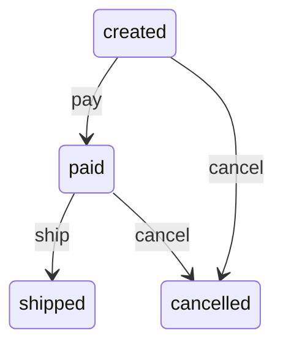

# order-state-machine 技术机制深度分析

## 机制概述

- **模式**：full。
- **一句话职责**：用显式订单状态、允许转移表和 transition 方法约束状态演进，并记录最终可观察历史。
- **主机制类型**：`state-machine`。
- **次机制类型**：无。
- **类型依据**：OrderState 明确定义状态集合，ALLOWED_TRANSITIONS 定义转移图，transition 执行守卫与状态动作，history 暴露转移结果。
- **链路模板**：`state` → `transition` → `action` → `effect`。

### 范围确认

- **SCOPE-01 · initial · 2026-07-24**：验证样例明确以 OrderMachine 的合法状态转移为分析范围；候选文件：`skills/tech-mechanism-analysis/examples/fixtures/order-state-machine/state_machine.py`。

### 工具与证据置信度

- **Python · high**：已读取状态枚举、完整转移表、守卫和结果路径，并实际运行合法转移序列；工具：direct code reading、Python runtime。

## 全链路

### stage-state · 定义状态集合和初态

- **阶段标识**：`state`。
- **做了什么**：OrderState 定义 created、paid、shipped、cancelled 四个状态，OrderMachine 初始化为 created。
- **怎么实现**：字符串 Enum 提供稳定状态值，构造函数同时写入 state 和 history。
- **设计依据（inferred）**：显式枚举限制状态空间并使历史可序列化；这是根据类型和存储结构推断的效果。
- **关键结构**：`OrderState`、`OrderMachine.state`、`OrderMachine.history`。
- **交接/最终效果**：transition 始终从当前 state 出发，history 初始包含 created。
- **交接证据**：`skills/tech-mechanism-analysis/examples/fixtures/order-state-machine/state_machine.py:25`（history initialized with current state）。
- **证据**：`skills/tech-mechanism-analysis/examples/fixtures/order-state-machine/state_machine.py:7`（OrderState Enum declaration）、`skills/tech-mechanism-analysis/examples/fixtures/order-state-machine/state_machine.py:24`（state initialized to CREATED）。

### stage-transition · 按转移表校验目标状态

- **阶段标识**：`transition`。
- **做了什么**：transition 检查目标状态是否存在于当前状态对应的允许集合，不合法时抛出 ValueError。
- **怎么实现**：ALLOWED_TRANSITIONS 是 state 到目标集合的邻接表，成员检查充当唯一守卫。
- **设计依据（inferred）**：集中转移表使合法边可枚举并阻止未声明跳转；该作用可由表和守卫直接推断。
- **关键结构**：`ALLOWED_TRANSITIONS`、`transition`、`ValueError`。
- **交接/最终效果**：只有通过成员检查的 target 才交给状态动作；非法目标立即终止调用。
- **交接证据**：`skills/tech-mechanism-analysis/examples/fixtures/order-state-machine/state_machine.py:28`（target membership guard checks transition）。
- **证据**：`skills/tech-mechanism-analysis/examples/fixtures/order-state-machine/state_machine.py:14`（ALLOWED_TRANSITIONS adjacency table）、`skills/tech-mechanism-analysis/examples/fixtures/order-state-machine/state_machine.py:29`（ValueError rejects invalid transition）。

### stage-action · 提交状态并追加历史

- **阶段标识**：`action`。
- **做了什么**：合法转移把 state 替换为 target，并把同一 target 追加到 history。
- **怎么实现**：两个连续赋值构成转移动作，没有额外副作用回调或事务边界。
- **设计依据（unknown）**：同步更新当前值和历史使状态查询与审计轨迹保持一致；源码没有记录选择内存列表的历史原因。
- **关键结构**：`state assignment`、`history.append`。
- **交接/最终效果**：动作完成后当前状态与 history 尾元素一致，供下一次 transition 和最终输出读取。
- **交接证据**：`skills/tech-mechanism-analysis/examples/fixtures/order-state-machine/state_machine.py:31`（history append target after state update）。
- **证据**：`skills/tech-mechanism-analysis/examples/fixtures/order-state-machine/state_machine.py:30`（state assigned target）、`skills/tech-mechanism-analysis/examples/fixtures/order-state-machine/state_machine.py:31`（history append target）。

### stage-effect · 输出订单状态历史

- **阶段标识**：`effect`。
- **做了什么**：run_order 依次执行 paid 和 shipped 转移，并把 history 映射为字符串列表。
- **怎么实现**：顺序调用 transition 后用列表推导读取 Enum.value，形成可序列化输出。
- **设计依据（inferred）**：返回完整历史让调用方观察整个合法路径，而不只看到终态；这是从返回值结构推断的效果。
- **关键结构**：`run_order`、`machine.transition`、`state.value`。
- **交接/最终效果**：机制最终输出 created、paid、shipped 的有序历史列表。
- **交接证据**：`skills/tech-mechanism-analysis/examples/fixtures/order-state-machine/state_machine.py:38`（return state value history）。
- **证据**：`skills/tech-mechanism-analysis/examples/fixtures/order-state-machine/state_machine.py:36`（transition to PAID）、`skills/tech-mechanism-analysis/examples/fixtures/order-state-machine/state_machine.py:37`（transition to SHIPPED）。

### 链路图

## 数值示例

本机制未识别到需要工作示例的核心数值操作。

## 架构设计债

本机制未识别到架构设计债。

## 逻辑设计债

### DEBT-LOGIC-01 · 转移守卫只能表达状态对

- **所属阶段**：`stage-transition`。
- **需求来源**：`hypothetical`。
- **会变难的需求**：支持只有在支付已结算、库存已锁定或操作人具备权限时才能进入目标状态的上下文守卫。
- **为什么难**：ALLOWED_TRANSITIONS 只保存 source 到 target 的集合，transition 只做成员检查，没有事件、上下文或 guard 函数的承载位置。
- **演进方向**：把转移边改为包含 event、guard 和 action 的规则对象，由 transition 接收上下文并返回结构化拒绝原因。
- **代价/影响**：修改转移表形态和 transition 签名，并补充每条守卫的上下文组合测试。
- **量化范围**：阶段 1 个（`stage-transition`）；文件 1 个（`skills/tech-mechanism-analysis/examples/fixtures/order-state-machine/state_machine.py`）；模块 2 个（`ALLOWED_TRANSITIONS`、`OrderMachine.transition`）；量级 `medium`；改动集中在一个阶段和一个文件，但会改变所有调用方传参及拒绝语义。
- **结论置信度**：`high`；集合成员守卫是直接代码事实；上下文守卫是具体可执行的状态机演进需求。
- **证据**：`skills/tech-mechanism-analysis/examples/fixtures/order-state-machine/state_machine.py:14`（ALLOWED_TRANSITIONS stores target sets）、`skills/tech-mechanism-analysis/examples/fixtures/order-state-machine/state_machine.py:28`（transition only checks target membership）。

## 跨阶段衔接

本机制未识别到独立的跨阶段衔接设计债。

## 已知缺口

- ⚠ 未确认：当前验证环境未安装 mmdc；Mermaid 已通过安全子集结构检查，但未执行实际 SVG 渲染
